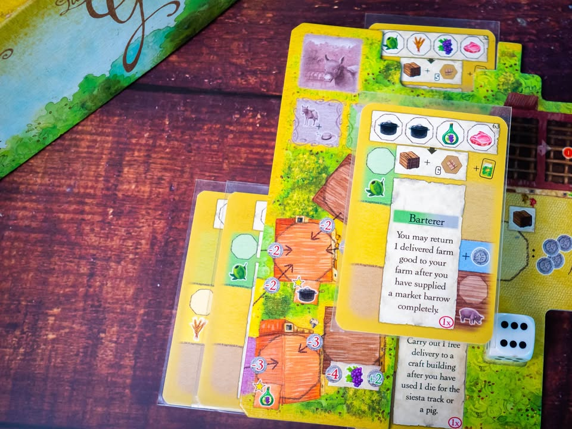
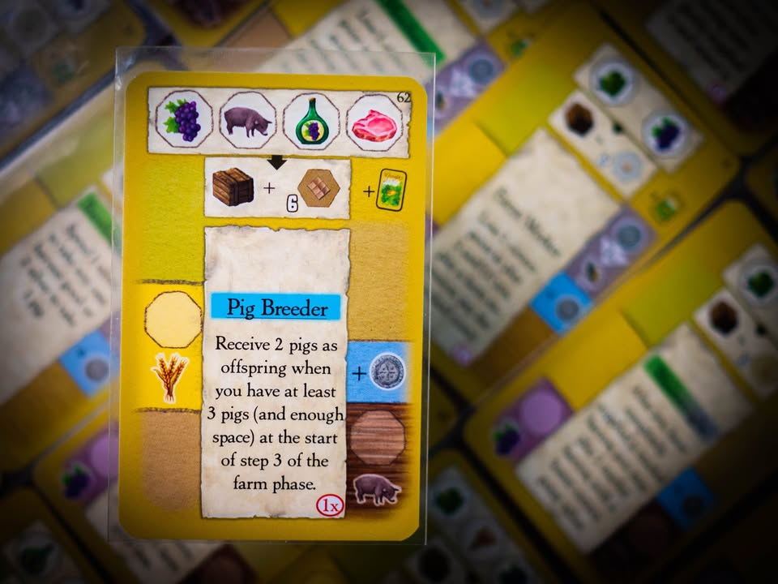
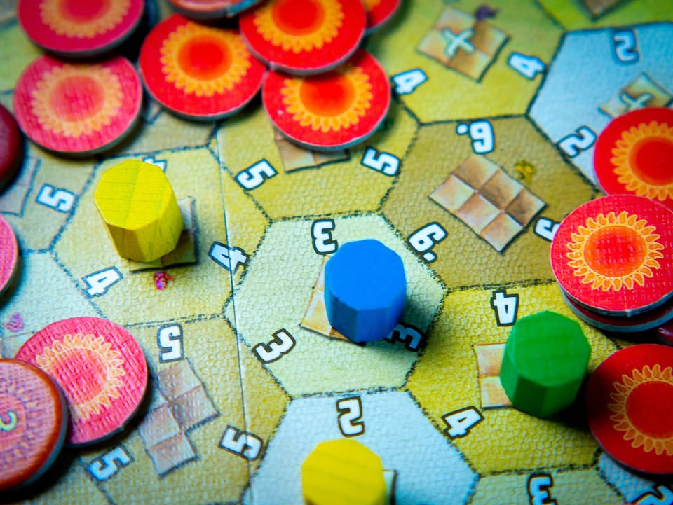
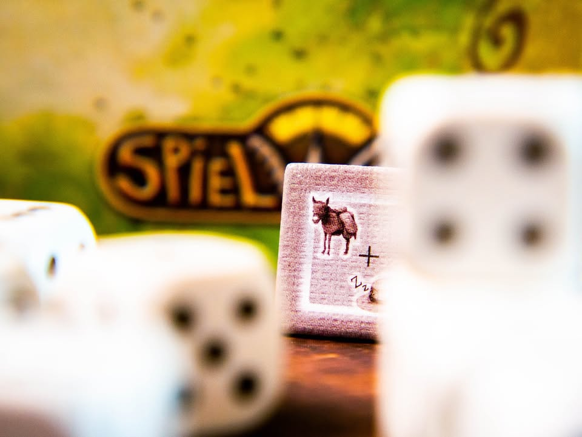
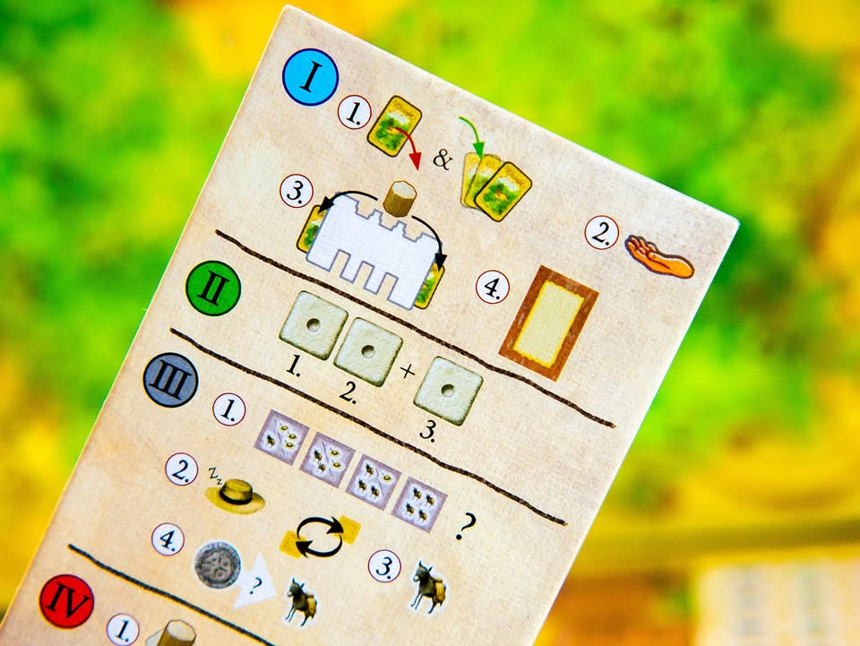

La Granja #thought
blog link: https_://wp.me/p7TSgy-2QZ

▪️เกมยูโรระดับกลางหนักที่จะให้เราเจ้าของไร่นาสวนผสมชายขอบชนบทที่จะต้องผลิตของไปขายในตลาดของหมู่บ้าน จุดเด่นในตอนเปิดตัวนั้นมาจากการประกาศกร้าวไว้ท้ายเล่มคู่มือว่า 'ยืม' โมดูลการเล่นมาจากเกมดังหลากหลายเกม  ผลงานตีพิมพ์แรกของนักออกแบบ Andreas "ode." Odendahl และ Michael Keller (II) (Solarius Mission, Agra, Cooper Island)
 
 
▪️แกนเกมดำเนินด้วยระบบ Dice Drafting ที่เราจะผลัดกันหยิบเต๋าที่สุ่มมาเพื่อเอาทรัพยากรไปใช้ต่อ กิมมิคคือหยิบเต๋าได้แค่คนล่ะสองลูกแต่จะเหลือเศษไว้ลูกนึงเป็นเต๋ามหาชนที่ทุกคนได้ทำเหมือนกันฟรีๆ 
  
  
▪️แต่หัวใจหลักของเกมนี้คือการ 'บริหารการ์ดในมือ' เพราะว่าการ์ดในเกมนี้สามารถใช้งานได้ถึงสี่รูปแบบขึ้นอยู่กับว่าเอาการ์ดไปเสียบตรงไหนของบอร์ด (ระบบ Multi-use card จาก Glory To Rome ซึ่งมาสมัยนี้บางคนอาจจะรู้สึกว่าแอบเห็นบ่อยๆ)
 
 
▪️เกมนี้การ์ดจะมีความสามารถคือถ้าเลือกใช้ด้านบนจะกลายเป็นออเดอร์เอาไว้ส่งของ ใช้ทางซ้ายจะกลายเป็นขายไร่เอาไว้เสกทรัพยากรมาฟรีๆ ไว้ทางขวาจะกลายเป็นเล้าเก็บหมู และถ้าเลือกใช้ด้านล่างก็จะกลายเป็นความสามารถแหกกติกาเกมซึ่งมีไม่ซ้ำใบ ซึ่งถ้าพูดในอีกแง่ด้านไหนก็ดีหมดล่ะ แต่เราต้องเลือกว่าจะใช้ใบไหนแบบไหนดี 
 
 
▪️ไอเดียเกมนี้คือเราอยากจะผลิตทรัพยากรสี่แบบได้แก่ มะกอก, องุ่น, ข้าวบาเลย์ และหมู ซึ่งแต่ล่ะอย่างจะสามารถ 'อัพเกรด' ไปเป็นของระดับสองได้ เราก็เอาไอ้ของพวกนี้ไปส่งออร์เดอร์เพื่อทำแต้มอีกต่อ ก็จะมีสองส่วนคือส่งเข้าตลาดกลางเอาไว้ปล๊ดล๊อกความสามารถ กับส่งเอาการ์ดตัวเองเอาไว้ไปตั้งแผงลอยขายของในตลาด ซึ่งระบบตั้งแผงลอยในตลาดนี้ยกเอาระบบเข้าวัดอ่านหนังสือจาก Luna มาเลย ก็มีความเป็นมินิเกมในอีกโมดูลหนึ่ง ซึ่งมีความสนุกจากการเลือกผลิดของถูกแพงไปยืนทำแต้มในตำแหน่งที่แตกต่างกัน
 
 
▪️ไอเดียการส่งของในเกมนี้จะเพิ่มเลเยอร์มีอีกหนึ่งขยักคือเราต้องเตรียม 'ลา' ไว้แบกของไปส่งด้วย ซึ่งก็ต้องไปตระเตรียมไว้ให้พอดีเพราะมีของเยอะแต่ไม่มีลาแบกของไปส่งก็เท่านั้นแหละ
 
 
▪️กิมมิคน่ารักๆที่แทรกไว้ในเกมแล้วรู้สึกว่าสวยดีคือการแย่ง Turn Order ในเกมจะต้องเดินแทรค 'งีบกลางวัน' ใครนอนเยอะกว่าก็เล่นก่อนในรอบต่อไป คือมันเป็นเรื่องเล็กๆก็จริงแต่ให้อารมณ์บ้านไร่สโลวไลฟ์มาก 
 
 
▪️ เกมนี้ผลิตครั้งแรกโดย Spielworxx ออกมา 1000 กล่อง แต่หลังจากนั้นไม่นาน Stronghold ก็ซื้อไป reprint กลายเป็นเกมแมสไป ทุกอย่างเหมือนเดิมแค่คุณภาพกระดาษดีขี้น 
 
----------------------------------------------------------
[🐸 Hang out friend, บ้านไร่ชายทุ่ง]
 
 
🔹 เป็นเกมยูโรแล้วผมคิดว่าเพลินดีนะ สนุกทุกครั้งที่หยิบมาเล่น มีจังหวะสุ่มและอารมณ์ประเภทไอ้นั้นก็อยากทำ ไอ้นี้ก็อยากมีเวลาเลือกใช้การ์ดตลอดเวลา แค่พอถอยมามองในภาพรวมอาจจะเหมือนโดนเงาเกมอื่นบังไปนิดเลยไม่โดดเด่นเป็นตัวเลือกต้นๆของหลายคน
 
 
🔹เพราะในฐานะเกม Dice Drafting ที่สำหรับผมมักจะโดน Troyes แย่งความสนใจไปถ้านึกไม่ออกว่าจะเล่นอะไรดี  พอจะหยิบกลับมาเล่นอ่ะคู่มือดันเขียนไม่ชวนให้อยากอ่านซ้ำเท่าไร (ไม่ได้แย่แต่ก็ขี้เกียจอ่านอ่ะ) พอจะเลือกเกมเบาๆก็โดน Coimbra (บางคนอาจจะ Macopolo) แย่ง พอเป็นแบบหนักๆก็โดน Madaira ตัดอีก เลยกลายเป็นเกมที่โดนแอบหยิบมาเล่นยากกว่าที่ควรจะเป็น ทั้งๆที่ก็สนุกดี 
 
 
🔹 ข้อดีโดยทั่วไปก็ตามขนบเกมยูโรคือเฟสคลีนชัดเจน มีการรับส่งทรัพยากรระหว่างโมดูลที่เราต้องคิด (meaningful decision) มีสัดส่วนความขัดใจเรื่องดวงในแบบที่ต้องใช้หัวจัดการเรื่องตรงหน้าไปพร้อมกับความสนุกในการหาคอมโบ ตัว Player Aid ทำมาค่อนข้างดี มีโค้ดสีประกอบ ซึ่งจะไป match กับความสามารถการ์ดว่าใช้งานได้ในเฟสไหน 
 
 
👁‍🗨 จุดกลางๆในเชิงการเล่นที่ผมรู้สึกคือหลายๆครั้งหน้าเต๋าที่ออกมามันก็ออกแนวบังคับทำนิดๆ เพราะเต๋าในเกมนี้มันออกแนวหยิบทรัพยากรมากกว่าจะเป็นตัวเดินเกมจริงๆ หลายแอคชั่นเวลาหยิบก็เหมือนจะแทนกันได้ในระดับหนึ่ง เราเลยไม่รู้สึกเครียดมากเวลาโดนแย่ง อย่างที่บอกตอนต้นว่ามิติความเป็น Dice Drafting จะไม่โดดเด่นมากนัก
 
 
🔸 ข้อเสียในแง่อื่นคือ คู่มือไม่ค่อยดีตามประสาค่าย Spielworxx แต่ที่ไม่เข้าใจคือพอค่ายอื่นเอาไปทำคู่มือก็ยกมาทั้งแบบนั้นล่ะ คือเกมมันไม่ยากแต่คู่มือทำให้ขี้เกียจอ่าน กับส่วนตัวไม่ชอบเกมที่ต้องหยิบไทล์แต้มแบบไม่เห็นเลขอีกด้านเท่าไร ก็เข้าใจนะว่าอยากให้ซ่อนแต้ม แต่เราขี้เกียจพลิกหาของไปมาอ่ะ
 
  
🔸 ข้อเสียเล็กๆอีกอันคือการ์ดมันแอบอ่านแล้วเอียงคอบ่อยว่ามันแปลว่าอะไรกันฟระ ตีความไม่จบง่ายๆ ส่วนหนึ่งเพราะเกมมันใช้โทเคนแบบเดียวกันแทนทุกสิ่งอย่างเวลาเรียกชื่อเราจะแอบงงๆว่าอันนี้อันไหนหว่า ซึ่งมานึกๆแล้วอีกเหตุที่ทำให้กางได้บ่อยน้อยลงคือเกมมันต้องอ่านการ์ดทำคอมโบ ถ้าในวงไม่ถนัดภาษาก็จะอดกางไปซะง่ายๆ
  
  
💭 โดยรวมก็ใครมาสาย Dice Drafting ที่ชอบแนวเลือกการ์ดมาทำ Engine Building เกมนี้ก็น่าแวะเวียนไปลองเล่นดูครับ สนุกครบถ้วนดี 

----------------------------------------------------------
Compatible Level - เกมนี้เข้ากับคนเขียนได้ระดับไหนนะ!!

🐸 Family, อาจจะมีช่วงเวลาที่ไม่เข้าใจกันบ้างแต่ครอบครัวคือสิ่งที่จะอยู่กับเราตลอดไป นี้คือเกมที่จะมีพื้นที่ถาวรในชั้นวางแน่นอน!! แม้บางเกมจะเปรียบดั่งคุณปู่ใจดีที่ได้เจอกันแค่ปีล่ะครั้ง แต่อันดับในใจนั้นคือความสนุกในช่วงเวลาที่เล่น หาใช่การได้เล่นซ้ำไม่รู้เบื่อเพียงอย่างเดียว [ex. กบโปรด, กบชอบ]

🐸 Hang out friend, เพื่อนกินเที่ยว ถ้าไม่ติดธุระอันใดก็พร้อมจะออกไปพบเจอ สนุกยามได้พบปะ แต่จะให้เจอกันบ่อยๆคงใช่ที - เกมสนุกที่อยากเล่นในระดับที่อยากจะหยิบกางเป็นบางครั้ง สลับสับเปลี่ยนไปเรื่อยตามจังหวะและโอกาส แต่เราก็ไม่ได้อยากซ้ำต่อเนื่องรัวๆ [ex. กบโอเค]

🐸 Someone I know, หากบังเอิญพบเจอ ก็คงได้ทักทายไต่ถาม หากแต่ในยามปกติมิอาจนึกชื่อออก ยืนคุยก็ได้ แต่คงไม่ได้เอื่อนเอ่ยนัดกินข้าว - บางเกมเราก็ไม่ได้อยากชวนเล่น แต่ถ้าไม่มีอะไรทำแล้วมีคนชวนก็เล่นก็ได้ [ex. กบเฉย]

🐸 I Turn left, You Turn Right - เธอชอบกินเผ็ด เราชอบกินอาหารญี่ปุ่น เธอชอบคนคารมดีพาไปกินที่หรู แต่เราชอบเล่นเกมอยู่กับบ้าน แม้จะได้คุยเป็นบางคราแต่คงไม่อาจพัฒนาความสัมพันธ์ - บางเกมแม้ว่าจะดีแค่ไหน แต่ถ้ารสนิยมมันไปด้วยกันไม่ได้ก็ไม่รู้จะเล่นไปทำไม [ex. กบไม่เล่น]
 
 
อนึ่ง : เป็นความรู้สึกในความ "อยากจะหยิบมาเล่นไหม?" ของผมเอง ไม่ได้เกี่ยวอะไรกับคุณภาพของเกม ไม่อิงมาตราฐานอื่นใดนอกจากตัวเองเท่านั้น ดูให้เป็นแค่ "อีกความคิดเห็นหนึ่ง" เท่านั้นก็พอนะครับ :)

