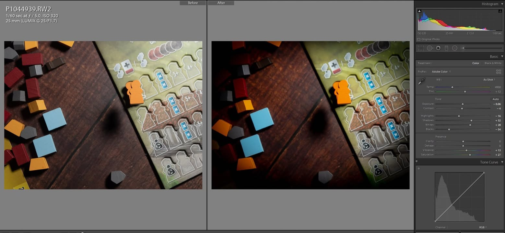
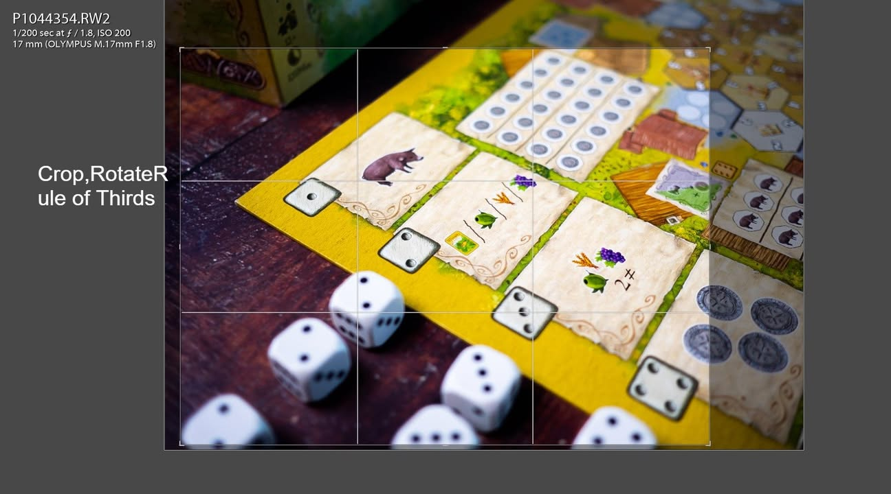
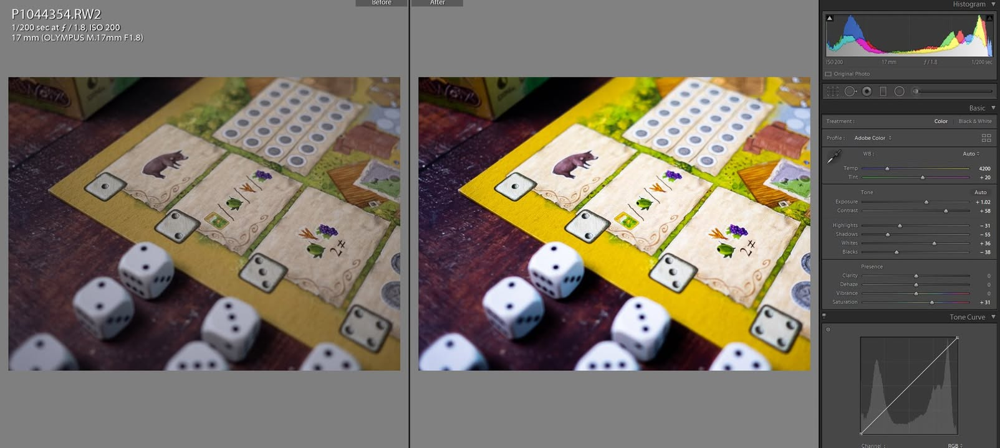

🔹ช่วงนี้มีคนมาถามผมเกี่ยวกับเรื่องถ่ายรูปบอร์ดเกมพอควร เลยคิดว่าอยากจะเอาเทคนิคที่ตัวเองพอรู้และใช้อยู่มาแบ่งปันกันครับ ยินดีรับทุกคำแนะนำฮะ 
 
 
▪️ ซึ่งต้องออกตัวอย่างจริงจังว่าผมไม่ได้รู้อะไรเยอะนัก ยังมี room of improvement อีกมาก แต่ในอีกความหมายคือ 'ผมทำได้ คุณก็ทำได้' อยากให้มองโพสนี้ว่าเป็นมือใหม่อยากมาแชร์ข้อมูลกันเองมากกว่านะ
 
 
▪️ คือพื้นฐานผมเป็นโปรแกรมเมอร์ที่เรื่องศิลป์ไม่ใช่เรื่องใหญ่ในหัว พวกการถ่ายภาพนี้ก็พึ่งเริ่มมาไม่นาน เน้นเรียนรู้ด้วยการดูงานของคนอื่นแล้วลองหัดทำตามเป็นหลัก เจ้าที่โดดเด่นคือ BoardGameShot ที่นับได้ว่าเป็นแรงบรรดาลใจหลักของผมเลย (อีกเจ้าที่ชอบดูคือ GameNite Magazine)
 
 
▪️ ไอเดียที่ผมเรียนรู้จากประสบการณ์และไปดูของคนอื่นเนี่ยคือ การถ่ายรูปให้เห็นอุปกรณ์มันครบๆเนี่ยส่วนใหญ่มันจะดูน่าเบื่อ แถมคนดูซึ่งเล่นไม่เป็นอยู่แล้วมองไปก็ไม่เข้าใจอยู่ดี การถ่ายโดยเลือกการวางแบบให้น่าสนใจและมีเรื่องราวทำให้คนอยากอ่านต่อดูจะเป็นทางเลือกที่ผมสนใจมากขึ้น (อีกอย่างคือถ่ายแบบรวมๆทีไรแล้วทำสวยเองไม่เป็น :P)
 
 
🔹 เทคนิค:
ผมใช้อยู่แค่สามอย่างครับ (เพราะเข้าใจในระดับที่เอาไปใช้งานได้แค่นี้.... ฮา) ซึ่งเป็นเรื่องง่ายๆที่ทุกคนทำได้

▪️  มีจุดสนใจเพียงจุดเดียว / จุดตัด 9 ช่อง / Crop / Rotation
.
เกือบทุกรูป (น่าจะเกิน 70%) ผมจะทำการย่อลงมาเพื่อให้รูปอยู่ใน rule of thirds เสมอซึ่งจุดตัด 9 ช่องเนี่ยคือที่มันเปิดมาเป็นตาราง tic-tac-toe นั้นแหละ อยากให้อะไรเด่นๆก็วางไว้จุดตัดนั้น ซึ่งปกติผมจะถ่ายเผื่อๆไว้ตัดอยู่แล้ว และพยายามวาง subject ให้เด่นแค่อย่างเดียว ที่เหลือก็จะวางหลบให้ไม่เด่น เพื่อป้องกันการดึงความสนใจของคนดู
.
.
ส่วนการ rotate ก็เพื่อหมุนให้มันภาพได้ระนาบตรง เพราะส่วนมากมือคนเนี่ยไม่ตรงหรอก ก็เอามาบิดๆเพื่อให้จัดลง rule of thirds ด้วย และเพื่อป้องกันความรู้สึกตะหงิดเล็กๆว่าทำไมรูปเอียง
 
 
▪️ ถ่าย Raw / แสง / Post-Process
. 
ไฟล์ Raw เพื่อให้ง่ายต่อการนำมา edit ต่อ ซึ่งมือถือเดี๋ยวนี้ก็ทำได้ กับเรื่องแสงเนี่ยเวลาเราถ่ายเกมภาพมันมักจะดูแย่เพราะ ถ้าถ่ายด้านหน้ามันจะไม่มีแสง เพราะปกติแสงจะมาจากด้านบนอย่างเดียวทำให้ถ่ายโทเคนแนวตั้งแล้วมืด ปกติผมจะใช้ soft box แต่ถ้าถ่ายที่ร้านที่มีแสงเยอะๆก็จะเลือกจัดวางให้หันออกหาแสงครับ
.
.
 ส่วนการ post หลักๆที่ผมใช้ก็คือเพิ่ม expose เพราะถ่ายทีไรมักจะมืดเกิน ที่เหลือก็ทดลองลากตรงนั้นตรงนี้จนได้แบบที่พอใจ (มันก็มีให้ปรับไม่กี่อย่างอ่ะนะ) หลายครั้งผมจะใส่ Vignette หรือขอบดำรอบๆเพิ่มช่วยเน้นจุดสนใจ พวกโปรแกรมจัดสีเนี่ยมันจะมีตัวเลือกให้ copy setting ใส่รูปทีเหลืออยู่แล้วส่วนมากก็จะทำหลักๆแค่รูปเดียว ทีเหลือไปปรับเพิ่มนิดๆหน่อยๆ
.
.
และผมไม่เคยใช้ Flash นะครับเพราะเงามันแข็งมากถ้าไม่มีอุปกรณ์ช่วย และมันรบกวนคนอื่นสุดๆถ้าถ่ายในร้าน
 
 
▪️ เส้นนำสายตา
.
อันนี้จริงๆผมก็พึ่งเริ่มมาลองๆหัดใช้ นั้นคือการหัดมองหา (ซึ่งมักจะคิดหลังถ่ายเสร็จแล้ว.... ฮา) เส้นสายที่จะนำเราไปสู่ subject ของเรา ซึ่งข้อดีของบอร์ดเกมคือเรามักจะมีขอบกระดานและขอบการ์ดมาช่วยตรงส่วนนี้อยู่แล้ว
 
 
🔹 อุปกรณ์:
สิ่งที่ผมกำลังจะพูดถึงในแง่อุปกรณ์อาจจะไม่จำเป็นนัก เนื่องจากกล้องมือถือก็ทำได้  แต่ขอลงไว้เป็นข้อมูลเผื่อคนมาถามว่าใช้อุปกรณ์แบบไหน (พวกกล้องนี้จริงๆซื้อมาเพราะความเสื้ยนด้าน Video :P )
 
 
- กล้องผมใช้ Panasonic G7 / Panasonic GH5 แล้วแต่สถานะการณ์ เป็นกล้อง mirrorless ที่ใช้ censor ที่เรียกได้ว่าขนาดเล็ก (เรียกว่า Micro Four Third, MFT, M4/3) และไม่ใช่กล้องที่เด่นด้านการถ่ายภาพ
  
 
- เลนส์ผมใช้ประจำอยู่สามตัวคือ 

..Olympus 17mm f1.8 - ถือเป็นเลนส์หลักติดกล้องเพราะมุมมองกว้างแบบมือถือ ถ่ายอะไรก็ได้ไม่ต้องคิดเยอะ ข้อเสียน่าจะเป็นแค่ตอนถ่ายมันจะต้องตัดออกเยอะหน่อย
.
.
..Panasonic 25mm f1.7 - ไม่ใกล้ไป ไม่ไกลไป เป็นตัวที่ใช้บ่อยเหมือนกันสำหรับถ่ายเกม ข้อเสียคือใช้ถ่ายทั่วไปมันต้องเดินถอยหลังเยอะกว่าที่ชอบ
.
.
..Yi 42.5mm f1.7 - ปกติเป็นเลนส์ไว้ถ่ายคน แต่ตัวนี้มีโหมด Macro ด้วยเอาไว้ถ่ายแบบจ่อใกล้ๆ ปกติจะใช้ตอนที่จัดฉากแล้วของมันเล็กๆแล้วเราอยาก zoom เข้าไปใกล้ๆหน่อย
.
.
.. ถ้ามีงบก็อยากลองเลนส์ Macro แบบเฉพาะทางหน่อยเหมือนกันนะ อย่าง 7Artisans Lens 60 mm. F2.8 Macro หรือ Olympus 30mm f/3.5 งี้ แต่ของ Yi ก็ไม่ได้แย่อะไรราคาถูกมากด้วยเหมาะกับมือใหม่แบบเรา 
.
.
(เทียบเป็นระยะกล้อง full frame จะเป็น 34mm, 50mm, 85mm ซึ่งตรงนี้ถ้าไม่เข้าใจก็อย่าพึ่งไปสนใจ) ข้อดีของเลนส์พวกนี้เทียบกับของที่ติดมากับกล้องถ้าพูดแบบง่ายๆคือ มันถ่ายหน้าชัด หลังเบลอได้ดีกว่าครับ แต่ไม่ได้แปลว่าเลนส์แถมจะใช้ไม่ได้แต่อย่างใด
 
 
- จอผมใช้จอธรรมดาฮะ ไม่ได้จริงจังเรื่องสีเพี้ยนอะไรขนาดนั้น (แยกไม่เป็นด้วยจ้า)
  
  
- โปรแกรมผมใช้ Lightroom CC 6 เพราะมันสะดวกเวลาไปเปิดดูพวก Tutorial การปรับสีซึ่งเราที่เป็นมือใหม่เวลาใช้ข้ามโปรแกรมมันจะแอบงงๆว่านี้มันค่าอะไรฟระ แต่เอาเข้าจริงๆก่อนหน้านี้ผมใช้โปรแกรมฟรีอย่าง RawTherapee ก็ไม่มีปัญหาอะไรนะ

ไฟ : LED ติดหัวกล้องจากจีนอันล่ะ 300 บาทที่ปกติไม่ได้ใช้ เพราะเงามันคมมาก แต่พอดีตอนนี้อยากได้เงาแบบนั้น

เส้นนำสายตา: ใช้ตัวบอร์ดกับลายเส้นโต๊ะไม้

ไฟ: Godox SL-60W + Softbox ราคาประมาณ 3xxx แต่เอาจริงๆใช้ชุด softbox ที่ขายๆกัน 5xx บาทก็ใช้ได้ล่ะ

เส้นนำสายตา: ใช้ลูกเต๋าวางนำไป

ไฟ: เป็นไฟที่ร้าน แสงแย่มากๆ ไม่มีไฟด้านหน้าเลย

เส้นนำสายตา: เอาจรวดให้นำไปหารถ

รูปนี้แสดงให้เห็น 'ปัญหา' หรือลักษณะพิเศษของเลนส์มุมกว้าง (พอดีถ่ายระหว่างเล่น) ที่มันมักจะติดของที่ไม่ต้องการมาเยอะต้อง crop ออก ซึ่งจะมีผลต่อคุณภาพของภาพด้วย แต่ดูจากมือถือไม่ค่อยต่างเลยไม่ซีเรียสมาก

แสงไม่ดีจึงใช้วิธีเพิ่มความสว่าง แล้วทำ Split Tone ให้ดูเป็นแสงอมส้ม อมแดงแบบดาวอังคาร (ปรับมั่วๆจนคิดว่าเป็นแบบที่ต้องการไม่ได้มีหลักการอะไรนะ)

