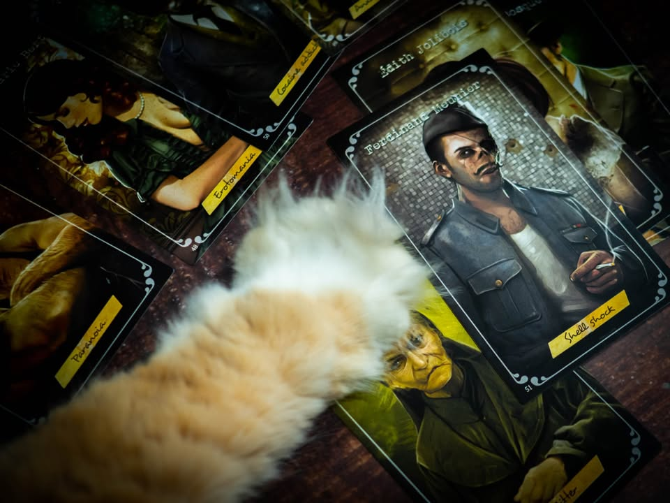
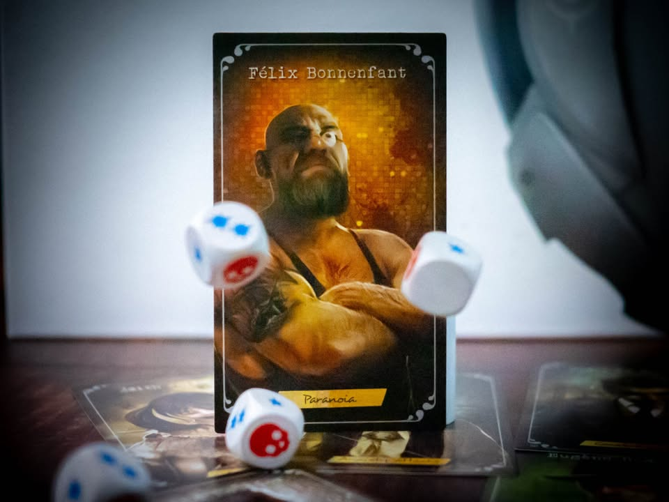
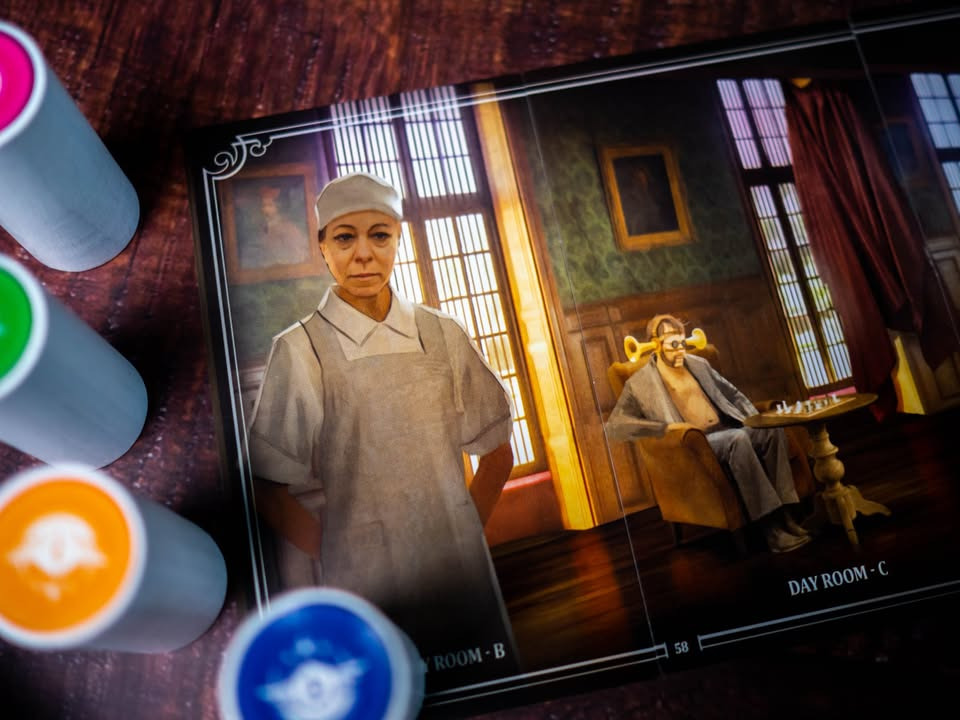
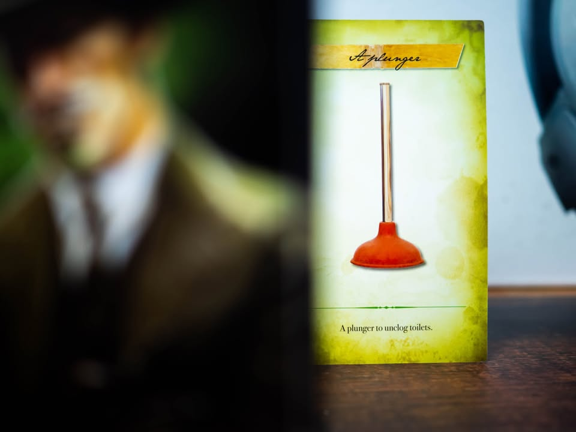
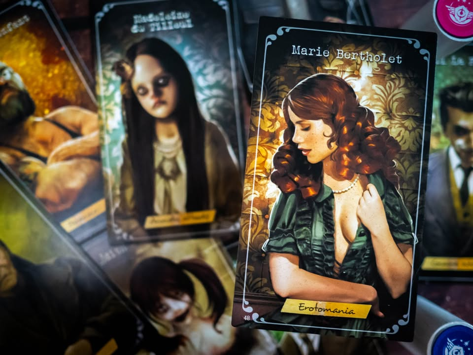
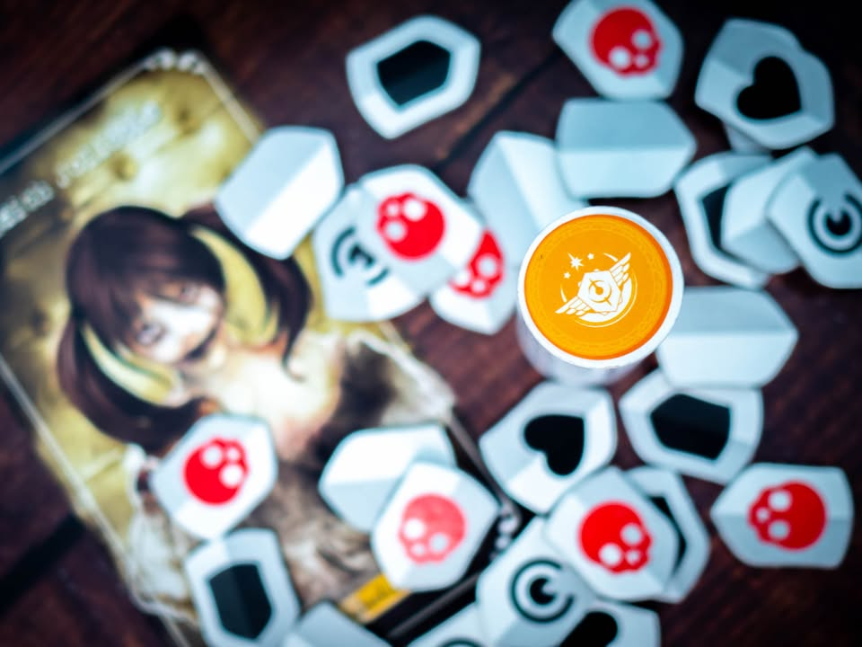

T.I.M.E Stories: ย้อนเวลาไขคดี #thought
blog link: https://wp.me/p7TSgy-2RV
 
 
▪️ ในโลกอนาคตอันแสนไกล มนุษย์ได้ค้นพบเทคโนโลยีในการยุ่งเกี่ยวกับกระแสเวลา และค้นพบว่าบางครั้งในบางช่วงเวลาในอดีตการกระทำบางอย่างนั้นจะส่งผลกระทบต่อเนื่องจนทำให้กาลเวลาพินาศได้ และเราก็คือเจ้าหน้าที่ในองค์กรพิทักเวลาที่จะมาคอยแก้ปัญหาเหล่านี้นั้นเอง

▪️ ไอเดียโดยรวมก็คือเกมสไตล์เดินเนื้อเรื่องแก้ปริศนาเหมือนในเกมอย่าง Unlock!, Exit, Chronicles of Crime, Tragedy Looper ฯลฯ เนี่ยแหละ แต่ลูกเล่นที่จะเป็นแกนหลักของซี่รี่ย์นี้คือการที่เราจะต้องย้อนเวลากลับมาในช่วงเวลาเดิมซ้ำๆเพื่อเก็บข้อมูลที่ขาดหายไปเอาไปเดินเรื่องต่อ

▪️ การออกแบบเนื้อเรื่องก็จะคล้ายกับในเกมประเภทเดียวกัน ที่ตอนหนึ่งจะมาในรูปแบบการ์ดหนึ่งสำรับเท่านั้น  ซื้อกล่องแรกก็จะมีพวกโทเคนที่จำเป็นมาจำนวนหนึ่ง ตอนต่อๆไปก็ไปซื้อกล่องเสริมมาได้เลย การ์ดจะแบ่งออกเป็นหลายหมวด หลักๆคือแผนที่กลางที่จะให้เราเดินไปมา พอย้ายที่ทีนึงเราก็จะไปเปิดการ์ดชุดซึ่งจะวางเรียงเป็นภาพพาโนรามาของที่นั้นๆ เวลาเราส่งตัวไปคุยหรือสำรวจบนการ์ดก็จะพลิกมาอ่านบลาๆไปตามเรื่อง
 
▪️ การย้อนเวลาแต่ละคร้งเกมจะเรียก หนึ่ง RUN ก็จะมีจำนวนแต้มเวลาจำนวนหนึ่ง เราก็ต้องบริหารเวลาตรงนี้เอา เพราะย้ายที่ก็เสียเวลาทำแอคชั่นซ้ำๆก็เสียเวลา เพราะพอเวลาหมดเราก็ต้องไปเริ่มต้นใหม่ พร้อมกับทุกสิ่งที่เราเคยทำในรอบก่อนจะหายไปหมด (เพราะย้อนเวลามาอีกรอบไง) ยกเว้นของบางอย่างที่จะอนุญาตให้เราเก็บเอาไว้ถาวร ซึ่งก็มีไม่ค่อยเยอะเท่าไร  

▪️ กิมมิคอีกอย่างคือตัวเราเนี่ยไม่ได้ย้อนเวลาไปที่ตรงนั้นจริงๆ แต่ต้องเลือกว่าจะเข้าไปสิงตัวละครตัวไหน ซึ่งตัวละครก็คือบุคคลที่อาศัยอยู่ในพื้นที่เกิดเหตุนั้นเอง ระบบส่วนใหญ่ของเกมนี้จะใช้การทอยลูกเต๋าแก้ปัญหาซึ่งแต่ละตัวละครก็สามารถทอยในบางเงื่อนไขได้ไม่เท่ากัน (อย่างบางตัวอย่างล้ำบู๊เก่ง บางตัวเป็นสาวสวยเน้นคุยหยอด) ทำให้การกลับมาสำรวจในแต่ล่ะ RUN เราอาจจะต้องมีการปรับปาร์ตี้ของเราให้เหมาะกับสิ่งที่เราเจอ

▪️ สำหรับตอนแรกเราจะอยู่ในโรงพยาบาลจิตเวชที่มีคนไข้หายตัวไปอย่างลึกลับ.....พวกเราจะถูกส่งมายังห้องนั่งเล่นรวม ทางซ้ายคือนางพยาบาลประจำห้อง... ตรงกลางมีชายนั่งเล่นหมากรุกอยู่ .... ตรงมุมห้องนั้น............

------------------------------------------------------------
[🐸 Hang out friend]

🔹 ผมเองเล่นเกมสไตล์นี้มาอย่างละครั้งสองครั้ง สำหรับเกมนี้พอเล่นจบแล้วผมคิดว่าเป็นประสบการณ์เล่นครั้งเดียวที่คุ้มค่ามากครับ ปริศนาทำออกมาสร้างอารมณ์ก่นด่าว่าอยู่ตรงไหน (ว่ะ)? มีลูกล่อลูกชนหลงให้เราไปเสียเวลาเล่นๆได้น่าสนใจ ตอนผมเล่นนี้วิ่งพล่านไปทั่วเลยเสียเวลา(ในเกม)มั่วซั่วไปหมด

🔸 อนึ่ง ที่ดูเรตกบๆมันดูต่ำเพราะส่วนตัวแล้วผมไม่ได้อินกับเกมแนวนี้ขนาดนั้น ไม่ใช่เพราะเกมมันไม่สนุกแต่อย่างใด คงจะไม่ซื้อหรือขวนขวายหามาเล่นเอง ถ้ามีคนชวนเล่นก็พร้อมจะไปลุยกันนะ (แต่ปกติไม่ค่อยมีเพราะเกมนี้มักจะมีการจับกลุ่มเล่นกันวงเดิมๆอยู่แล้ว)

🔹 ข้อดีคือกติกาโดยรวมไม่ซับซ้อน เดินเปิดแผนที่สำรวจแล้วเก็บมาคิดๆๆๆ มีจังหวะย้อนไปมาแล้วต้องตัดสินใจว่าจะทำอะไรดี เพราะจำนวนแต้มมีจำกัด พื้นที่ให้ลองเดินสำรวจก็ทำให้เกิดอารมณ์แบบ 'จะไปทางไหนดีนะ' ทางเดินในเกมไม่ใช่แบบเส้นตรงและไม่มีมีวิธีเดินเรื่องแบบเดียว และที่ดีมากคือไม่ต้องใช้ app ซึ่งผมคิดว่ามันทำให้เกมแอบน่ารำคาญนิดๆ

🔸 ข้อเสียที่รู้สึกคือพอเริ่มย้อนเวลากลับมาใหม่แล้วต้องมาคิดว่า 'อ่ะ ไอ้ของนั้นอยู่ตรงไหนฟระ?' หรืออารมณ์แบบเราคิดไว้ล่ะว่าเดี๋ยวต้องวิ่งมา step A B C D แต่ต้องเสียเวลาเปิดปิดกองการ์ดซ้ำไปมามันก็แอบรำคาญนิดๆ แต่เอาจริงๆก็ไม่ใช่เรื่องใหญ่อะไรนะ

👁‍🗨 จุดกลางๆคือเกมมันจะมีมู๊ด roleplay นิดๆถ้าทำตัวอินเรื่องหน่อยๆก็จะสนุกดี แต่ถ้ามาโหมดแห้งๆกด next next ก็อาจจะไม่ถูกใจกับเกมนี้ได้

💭 เกมนี้ผมเล่นช้ากว่าตอนที่มันออกไปตั้งห้าปี จนเกมออกภาคเสริมมาไม่รู้กี่ภาค คนที่ชอบก็ชอบกันจริงจัง คนที่ไม่ชอบนี้ก็ไม่ค่อยเห็นนะ คิดว่าถ้าใครชอบเกมแนวแก้ปริศนาก็คงเล่นกันไปหมดแล้วล่ะ (ฮา) แต่ถ้ายังไม่เคย แบบอาจจะเคยเล่นแค่ Unlock! หรือ Exit กล่องเล็กๆ แล้วสงสัยว่าไอ้กล่องใหญ่นี้มันจะสนุกไหมหว่า ก็เลยต้องขอบอกว่าส่วนตัวผมคิดว่าสนุกครับ :)

อนึ่งเกมมีการภาษาในระดับหนึ่งแม้จะมีเพื่อนแปลให้ก็ได้แต่ว่าถ้าอ่านออกเองก็จะช่วยให้เรามีส่วนร่วมกับเกมเยอะขึ้นมากครับ
----------------------------------------------------------
Compatible Level - เกมนี้เข้ากับคนเขียนได้ระดับไหนนะ!!

🐸 Family, อาจจะมีช่วงเวลาที่ไม่เข้าใจกันบ้างแต่ครอบครัวคือสิ่งที่จะอยู่กับเราตลอดไป นี้คือเกมที่จะมีพื้นที่ถาวรในชั้นวางแน่นอน!! แม้บางเกมจะเปรียบดั่งคุณปู่ใจดีที่ได้เจอกันแค่ปีล่ะครั้ง แต่อันดับในใจนั้นคือความสนุกในช่วงเวลาที่เล่น หาใช่การได้เล่นซ้ำไม่รู้เบื่อเพียงอย่างเดียว [ex. กบโปรด, กบชอบ]

🐸 Hang out friend, เพื่อนกินเที่ยว ถ้าไม่ติดธุระอันใดก็พร้อมจะออกไปพบเจอ สนุกยามได้พบปะ แต่จะให้เจอกันบ่อยๆคงใช่ที - เกมสนุกที่อยากเล่นในระดับที่อยากจะหยิบกางเป็นบางครั้ง สลับสับเปลี่ยนไปเรื่อยตามจังหวะและโอกาส แต่เราก็ไม่ได้อยากซ้ำต่อเนื่องรัวๆ [ex. กบโอเค]

🐸 Someone I know, หากบังเอิญพบเจอ ก็คงได้ทักทายไต่ถาม หากแต่ในยามปกติมิอาจนึกชื่อออก ยืนคุยก็ได้ แต่คงไม่ได้เอื่อนเอ่ยนัดกินข้าว - บางเกมเราก็ไม่ได้อยากชวนเล่น แต่ถ้าไม่มีอะไรทำแล้วมีคนชวนก็เล่นก็ได้ [ex. กบเฉย]

🐸 I Turn left, You Turn Right - เธอชอบกินเผ็ด เราชอบกินอาหารญี่ปุ่น เธอชอบคนคารมดีพาไปกินที่หรู แต่เราชอบเล่นเกมอยู่กับบ้าน แม้จะได้คุยเป็นบางคราแต่คงไม่อาจพัฒนาความสัมพันธ์ - บางเกมแม้ว่าจะดีแค่ไหน แต่ถ้ารสนิยมมันไปด้วยกันไม่ได้ก็ไม่รู้จะเล่นไปทำไม [ex. กบไม่เล่น]
 
 
อนึ่ง : เป็นความรู้สึกในความ "อยากจะหยิบมาเล่นไหม?" ของผมเอง ไม่ได้เกี่ยวอะไรกับคุณภาพของเกม ไม่อิงมาตราฐานอื่นใดนอกจากตัวเองเท่านั้น ดูให้เป็นแค่ "อีกความคิดเห็นหนึ่ง" เท่านั้นก็พอนะครับ :)

