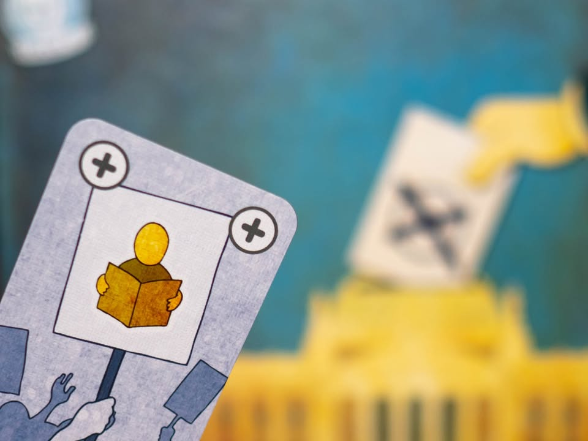

Die Macher: Limited Edition ครั้งใหม่กับเกมกลคนเลือกตั้ง #thought
blog link: https://wp.me/p7TSgy-2Sk
.
▪️ เกมหน้าตาจืด แถมตารางเต็มพรึดเหมือนตารางสเปรดชีตที่ว่าด้วยหัวข้อชวนง่วงอย่างเล่นเป็นพรรคการเมืองมาออกนโยบายหาเสียงในประเทศสุดเคร่งขรึมอย่างเยอรมัน แต่จะขอสปอลย์ล่วงหน้าว่าอย่าดูถูกบรรยากาศที่เกมนี้สร้างมาเชียว เพราะมันเป็นเกมที่ผมชอบมากเกมหนึ่งเลยล่ะ
.
.
▪️ กล่องที่จะพูดถึงนี้เป็นฉบับปรับปรุงใหม่ผลิตมาในปี 2020 โดยเกมต้นฉบับนั้นออกแบบครั้งแรก (first print) มาตั้งแต่ปี 1986 เลยทีเดียว โดยผมเคยเขียนถึงเก่า (second/third print)เอาไว้ใน blog แล้ว ซึ่งจริงถ้าเคยอ่านอันโน้นผมก็สรุปให้เลยว่าโครงสร้างหลักเหมือนกันเลย ไม่ต้องอ่านอันนี้ซ้ำก็ได้ เอ้าจบ!! ลิงค์: https://wp.me/p7TSgy-2m8
.
.
▪️ แม้จะพูดได้ไม่เต็มปากแต่ขอจำกัดความให้เข้าใจง่ายว่ามันเป็นเกม Majority Control ล่ะกัน ซึ่งในประเทศเยอรมันเนี่ยเค้าจะเลือกตั้งกันทีล่ะรัฐ และแต่ละรัฐก็จะเลือกตั้งไม่พร้อมกัน เราในฐานะพรรคการเมืองก็จะคอยออกนโยบายให้กินใจประชาชนไปเรื่อยจนกว่าการเลือกตั้งในแต่ล่ะรัฐจะจบลง โดยที่เกมจะมีการเลือกตั้งทั้งหมด 7 รัฐ (4 รัฐในเกมสั้น แต่ส่วนตัวแนะนำให้ข้ามไปเถอะ เล่นเกมเต็มเลยดีกว่าเพิ่มมีอีกนิดเดียว)
.
.
▪️ โดยในแต่ล่ะรัฐเนี่ยก็จะมีความเห็นของประชาชนในรัฐว่าเค้าสนใจหรือไม่สนใจนโยบายแบบไหน ซึ่งเกมจะมีการ์ดนโยบายอยู่ 7 ชนิด แต่ว่ามันมีทั้งแบบสนับสนุนและไม่สนับสนุนทำให้รวมแล้วมีนโยบายอยู่ 14 แบบ เราก็จะเห็นข้อมูลรัฐกำลังเลือกตั้งเยอะหน่อย ส่วนรัฐที่ยังมาไม่ถึงก็เห็นแค่กระแสความสนใจน้อยลง
.
.
▪️ เราเป็นพรรคการเมืองก็จะมีการ์ดหาเสียงเพื่อแสดงวิสัยทัศน์เหมือนกันว่าพรรคเราเนี่ยมีนโยบายแบบไหน ซึ่งก็คือไอ้นโยบาย 14 แบบนั้นแหละ แต่ว่าพรรคห้ามโลเลมีได้มากสุดแค่ 4 แบบ แต่ด้วยความที่แต่ล่ะรัฐมันก็ชอบไม่ชอบไม่เหมือนกันเราก็ต้องเลือกหน่อยว่าจะทุ่มทรัพยากรไปลงรัฐไหนดี เพราะแต่ล่ะรัฐมันก็มีแต้มไม่เท่ากัน
.
.
▪️ คีย์ของเกมซึ่งไม่ตรงกับโลกของความจริงคือเกมนี้เราจะต้องส่งหัวคะแนนลงไปตามพื้นที่ก่อน จากนั้นหาจังหวะเปลี่ยนหัวคะแนนเป็นเสียงโหวต ที่เสียงโหวตจะเป็นตัวชี้วัดว่าเราจะได้กี่แต้มในรัฐนั้น สาระสำคัญเลยเป็น 'จังหวะ' ที่เราจะเลือกเปลี่ยนหัวคะแนนให้กลายเป็นเสียงโหวตนั้นเอง
.
.
▪️ เพราะสัดส่วนของหัวคะแนนที่จะกลายเป็นแต้มโหวตก็อิงจากว่านโยบายตอนนั้นของเราตรงใจประชาชนแค่ไหน ถ้าเห็นด้วยก็ดี แต่ถ้าเห็นต่างก็ติดลบ รวมไปถึงยังมี 'กระแส' การเมืองที่มีผลต่อความนิยมด้วยเช่นกัน ซึ่งกระแสมันจะเปลี่ยนด้วยการแข่งกันอัดเงินไปให้บริษัทที่จัดทำ 'โพล' 
.
.
▪️ ตัวโพลนี้นอกจากจะเพิ่มกระแสพรรคการเมืองแล้วยังลดด้วย (ซึ่งมีผลมากตอนเปลี่ยนหัวคะแนนเป็นคะแนนเสียง) ผลโพลเกมนี้ต้องอัดเงินประมูลแบบปิดโดยมีข้อมูลนิดหน่อยว่าโพลนี้ 'อวย' ใครเป็นพิเศษ ถ้าดูแล้วไม่เป็นผลดีกับเราก็ต้องซื้อมา 'ปิดปาก' ไม่ให้ตีพิมพ์เสียหน่อย แต่ถ้าพรรคไหนคุมสื่อในรัฐนั้นนอกจากจะไม่สามารถโดนโจมตีจากข่าวลือได้แล้ว ยังสามารถเปลี่ยนความคิดเห็นของประชาชนให้คล้อยตามไปตามที่เราต้องการได้ด้วยนะ
.
.
▪️ และสุดท้ายคือพรรคการเมืองย่อมไม่พ้นเรื่องสกปรก (ในเกม น่ะในเกม) เราสามารถส่งลูกน้องไป 'ป่วน' ผู้เล่นอื่น แต่อย่าลืมว่าเงินในเกมมีจำกัดและต้องเอาไปโปรยหลายที่มาก กระนั้นเกมก็ยังมีลูกเล่นให้เราสามารถ 'รับเงินบริจาค' เข้าพรรคได้ด้วย แต่แลกกับการที่สมาชิกพรรคอาจจะหล่นหายไปบ้าง
.
.
----------------------------------------------------------
🐸 Family
----------------------------------------------------------
.
.
🔹 สำหรับผู้เล่นที่จับมาแต่เกมยุคใหม่ (พวกเกมที่ออกแบบมาในช่วงสิบห้าปีที่ผ่านมา)  ก็อาจจะรู้สึกว่าเกมนี้ค่อนข้างจะแสดงความ 'Aged' (ล้าสมัย) หรือแปลกในหลายแง่มุม แต่ผมไม่คิดว่ามันเป็นข้อเสียนะ แค่ระบบกลไกหลายอย่างเกมสมัยใหม่เอามาพัฒนาเพิ่มไปแล้วเท่านั้นเอง ไม่ได้รู้สึกเก๊าเก่า old school อะไรขนาดนั้น
.
.
🔹 ข้อดีคือแม้จะมีหลายส่วนให้เราต้องสนใจแต่เกมกลับไม่ซับซ้อนอะไร กติกาคลีน มีการแบ่งเป็นเฟสการเล่นชัดเจน ระยะเวลาในการรอแต่ล่ะแอคชั่นต่ำ คือเล่นแล้วยากอ่ะที่จะมีคนเชื่อว่านี้เกม weight 4.34 (ส่วนหนึ่งเพราะใช้ค่าเฉลี่ยร่วมกับภาคเก่า) แล้วมันง่ายแบบตีว่าถ้าหาคนที่มีเวลาว่างสามชั่วโมงมาได้ซักคน ต่อให้เคยเล่นแค่เกมระดับครอบครัวมาผมก็เชื่อว่าสามารถสอนให้เล่นจนจบเข้าใจเกมได้นะ
.
.
🔹 ส่วนที่ทำให้ผมชอบอีกอย่างคือมันเล่นแล้วค่อนข้างอินกับเรื่องที่เกมพยายามนำเสนอ (แม้ระบบคะแนนเสียงถ้ามาคิดๆแล้วจะเห็นว่าไม่ค่อย make sense เท่าไร) ทั้งเรื่องจากพยายามเปลี่ยนนโยบาย การชี้นำประชาชน ในรูปแบบต่างๆ คือเล่นแล้วเรารู้สึกได้ว่าตัวเรานี้แหละพรรคการเมืองที่เป้าหมายคือคะแนนเสียงและที่นั่งในสภาและมีนโยบายเป็นฉากหน้า แบบดูมันโลกจริงดี ในขณะที่เกมการเมืองอื่น (ซึ่งมีไม่มาก) ภาพตรงนี้มันมักค่อนข้างเน้นหนักไปทางคอรัปชั่นจ้า ไม่ก็พยายามทำให้เราเป็นตัวแทนพรรคโลกจริงที่มีบทบาทแน่นอน
.
.
👁‍🗨 จุดกลางๆคือ คู่มือนี้ควรจะต้องอ่านได้ง่ายกว่านี้เยอะเลย ตามประสาค่าย Spielworxx ที่ยังแบ่งเลย์เอ้าท์คู่มือไม่ค่อยเป็นมิตรนัก รวมไปถึงราคาที่ถือว่าสูงเทียบกับอุปกรณ์ที่ไม่มีอะไรแฟนซี ซึ่งก็ถือเป็นข้อด้อยอีกอย่างของค่ายนี้เช่นกัน
.
.
🔸 จุดที่ไม่ชอบในเกมนี้ถ้ามองจากแค่ตัวมันเองผมก็ไม่มีอะไรพิเศษ หลักๆน่าจะเป็นจำนวนการ์ดโพลที่น้อยจนง่ายต่อการจำ (ซึ่งมีผลต่อการประมูล) รวมไปถึงระบบคิดแต้มที่ค่อนข้างเรียบเกินไป กลายเป็นผู้เล่นแต่ล่ะคนก็แค่มุ่งออกนโยบายให้มันคล้ายๆกันทุกรอบไปมากกว่าจะหาทางจับมือระยะสั้นแล้วช่วยกันดึงคนที่กำลังนำ
.
.
💭 เอาจริงๆผมชอบฉบับเก่ามากกว่าประมาณหนึ่ง (ตีเลขมั่วๆอาจจะซัก 30%) ฉบับใหม่มันตัดนิดทอนหน่อยให้เกมและบรรยากาศเหมาะกับสมัยใหม่มากขึ้นแต่กลายเป็นไอ้ที่ตัดๆไปมันก็ทำให้เสน่ห์ของเกมต้นฉบับหายไปหลายอย่าง (ระบบจับมือพรรคร่วม กับวาระแห่งชาติ) หลายไอเดียที่ฉบับใหม่นำเสนอก็ดีนะ ทำเอาอยากผสมวาเรี้ยนใหม่แบบเอาตัวเก่าเป็นแกนแล้วแทรกของบางอย่างในรุ่นใหม่ลงไปเหมือนกัน แต่เอาจริงๆถ้าไม่เคยเล่นตัวเก่ามาก่อนก็คงไม่รู้สึกว่าอะไรหายไปมั้ง แต่ผมก็ไม่คิดว่าฉบับนี้มันด้อยอะไรนะ 
.
.
Main differences with 1997/2006 Edition
▫️ นโยบายเป็นแบบจั่วจากกองกลาง ไม่ต้องมือใครมือมันซึ่งทำให้หลายครั้งเปลี่ยนนโยบายยาก
▫️ ไม่มีลูกเต๋าทอยเพิ่มสมาชิกพรรค แต่ fixed เลขเลย
▫️ ผลโพลมีการ์ดน้อยลงเยอะ แต่ว่าก่อนประมูลจะเห็นว่าการ์ดใบนี้จะเพิ่มกระแสให้พรรคไหนทำให้มีข้อมูลก่อนประมูล (แต่ข้อเสียคือการ์ดมันน้อยวนๆเดี๋ยวก็จำได้ล่ะ)
▫️ ไม่มีการวัดใจทิ้งเงินบริจาคเพื่อเอาโบนัสเหมือนในภาคเก่า แต่เป็นเลือกรับหรือไม่รับเงินธรรมดา
▫️ ระบบจับมือถูกรื้อและลดทอนให้เหลือเป็นแค่ tire break ตอนเอาแต้มคุมสื่อ 
▫️ ระบบหาพรรคที่ชนะการเลือกตั้งถูกทำให้ง่ายขึ้น มีคะแนนเสียงถึง 50 ก็พอ ไม่ต้องหาพันธมิตรทางการเมืองชั่วคราวเลือดตาแทบกระเด็นแบบเก่า
▫️ ตัดระบบวาระแห่งชาติออกไป ตรงนี้ค่อนข้างเมเจอร์ เพราะว่าเป็นแต้มลับที่ค่อนข้างทรงพลังทีเดียวในเกมแบบเก่า ตรงนี้ค่อนข้างเสียดายมาก เพราะความสนุกที่ต้องเล่นการเมืองท้องถิ่นพร้อมกับล๊อบบี้ผลักดันให้เรื่องที่เราต้องการกลายเป็นวาระแห่งชาติเพื่อทำแต้มนี้ลุ้นมาก
▫️ จบไวขึ้นประมาณชั่วโมงนึง
.
.
----------------------------------------------------------
Compatible Level - เกมนี้เข้ากับคนเขียนได้ระดับไหนนะ!!

🐸 Family, อาจจะมีช่วงเวลาที่ไม่เข้าใจกันบ้างแต่ครอบครัวคือสิ่งที่จะอยู่กับเราตลอดไป นี้คือเกมที่จะมีพื้นที่ถาวรในชั้นวางแน่นอน!! แม้บางเกมจะเปรียบดั่งคุณปู่ใจดีที่ได้เจอกันแค่ปีล่ะครั้ง แต่อันดับในใจนั้นคือความสนุกในช่วงเวลาที่เล่น หาใช่การได้เล่นซ้ำไม่รู้เบื่อเพียงอย่างเดียว [ex. กบโปรด, กบชอบ]

🐸 Hang out friend, เพื่อนกินเที่ยว ถ้าไม่ติดธุระอันใดก็พร้อมจะออกไปพบเจอ สนุกยามได้พบปะ แต่จะให้เจอกันบ่อยๆคงใช่ที - เกมสนุกที่อยากเล่นในระดับที่อยากจะหยิบกางเป็นบางครั้ง สลับสับเปลี่ยนไปเรื่อยตามจังหวะและโอกาส แต่เราก็ไม่ได้อยากซ้ำต่อเนื่องรัวๆ [ex. กบโอเค]

🐸 Someone I know, หากบังเอิญพบเจอ ก็คงได้ทักทายไต่ถาม หากแต่ในยามปกติมิอาจนึกชื่อออก ยืนคุยก็ได้ แต่คงไม่ได้เอื่อนเอ่ยนัดกินข้าว - บางเกมเราก็ไม่ได้อยากชวนเล่น แต่ถ้าไม่มีอะไรทำแล้วมีคนชวนก็เล่นก็ได้ [ex. กบเฉย]

🐸 I Turn left, You Turn Right - เธอชอบกินเผ็ด เราชอบกินอาหารญี่ปุ่น เธอชอบคนคารมดีพาไปกินที่หรู แต่เราชอบเล่นเกมอยู่กับบ้าน แม้จะได้คุยเป็นบางคราแต่คงไม่อาจพัฒนาความสัมพันธ์ - บางเกมแม้ว่าจะดีแค่ไหน แต่ถ้ารสนิยมมันไปด้วยกันไม่ได้ก็ไม่รู้จะเล่นไปทำไม [ex. กบไม่เล่น]
 
 
อนึ่ง : เป็นความรู้สึกในความ "อยากจะหยิบมาเล่นไหม?" ของผมเอง ไม่ได้เกี่ยวอะไรกับคุณภาพของเกม ไม่อิงมาตราฐานอื่นใดนอกจากตัวเองเท่านั้น ดูให้เป็นแค่ "อีกความคิดเห็นหนึ่ง" เท่านั้นก็พอนะครับ :)

