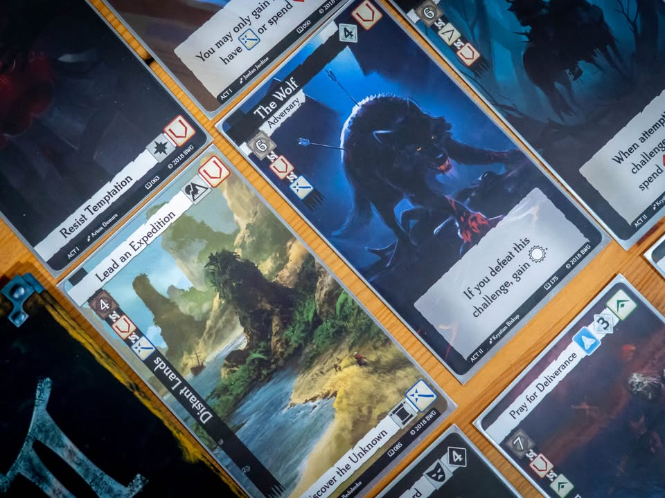
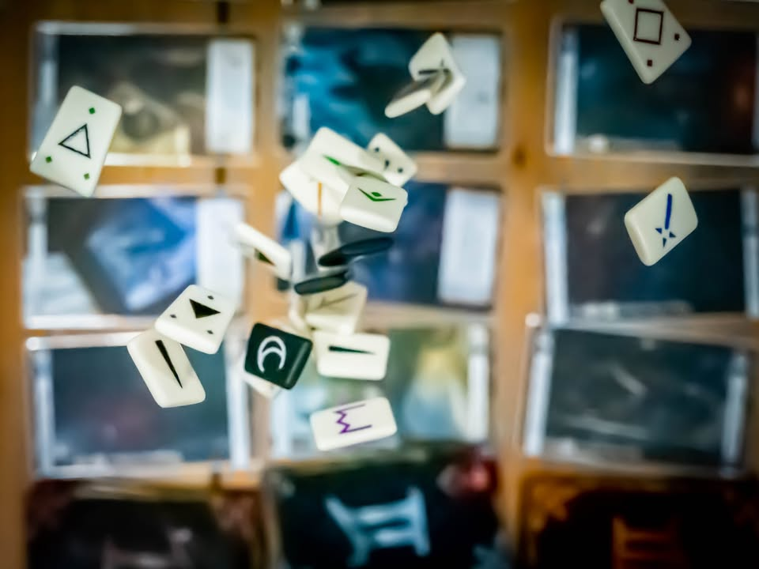

Call to Adventure #bite_size #first_impression
blog link:  https_://wp.me/p7TSgy-2SZ

▪️ เกมที่ให้เราได้สร้างและดำเนินเรื่องให้กับ 'ตัวเอก' ของเรื่องราวแฟนตาซี ชาติกำเนิด เส้นทางชีวิต และจุดมุ่งหมายของชีวิต ตัวเอกของเราจะจบพร้อมกับเรื่องราวเล่าขานแบบใดกัน?
.
.
▪️เราจะเปิดเกมด้วยการเลือกการ์ดสามองก์ของตัวเอง ชาติกำเนิดเป็นอย่างไร เด็กล้วงกระเป๋า หรือ ขุนนางชั้นสูง? การเดินทางนั้นเล่าจะเป็นนักผจญภัยหรือฝึกวิชาเวทย์? แล้วจุดมุ่งหมายที่เป็นความลับเราจะเล่นตลกเป็นวายร้ายผู้โฉดชั่วหรือผู้พิชิตอันยิ่งใหญ่? จำนวนการ์ดมีเยอะจนคุณไม่ต้องกังวลว่าเรื่องราวของคุณจะซ้ำซากเร็วนัก (มีตัวเสริมด้วยนะ)
.
.
▪️ระหว่างเล่นเกมก็จะให้ผู้เล่นผลัดกันเลือกการ์ดในองก์นั้นๆเพื่อเติมเต็มเรื่องราวของตัวเอก อย่างช่วงแรกของชีวิตอาจจะเป็นเด็กกำพร้าหรือกล้าหาญ แต่ล่ะใบเราก็จะได้รับ stat สไตล์ rpg มาเก็บไว้ บางใบจะต้องเลือกด้วยว่าจะเลือกตัวเลือกไหนจากเหตุการณ์นั้นอย่างถ้าเจอศิลาแห่งความมืด เราจะเก็บไว้กับตัวหรือต่อต้านมันก็จะได้ของต่างกัน  
.
.
▪️หลายใบเราจะต้องทดสอบหรือต่อสู้เกมจะให้เราทอย 'รูน' ซึ่งเป็นป้ายมีสองหน้า โดยจำนวนที่ทอยได้ก็จะขึ้นอยู่กับชนิดของการ์ดและค่าพลังที่เราสะสมประสบการณ์มาก็ทำตามการ์ดไป หยิบการ์ดกันคนล่ะเก้าใบก็จบเกม
.
.
▪️เกมนี้เล่นได้เป็นทั้งคนดีและคนเลวก็จะได้จั่วการ์ดจากกองที่แตกต่างกัน ก็มีหลายท่าดี บทคนดีก็ช่วยบูสแต้มบลาๆ พอการ์ดคนเหี้ยนี้ก็ชั่วได้ใจสั่งเพื่อนทอยเต๋าใหม่บ้าง ให้ไปเลือกใบอื่นบ้าง โดนติดๆกันแล้วกำหมดแน่นเหลือเกิน โอ้วดาบศักดิ์สิทธิ์ของข้าาาาาาาาาาา แกล้งกูจัง วืดสามตาติดแล้วแม่งเลือกทิ้งการ์ดกูไป!! 
.
.
▪️ในแง่กลไกผมพูดแห้งๆดักไว้ก่อนว่าจริงๆแล้วเกมไม่มีเหี้ยไรเลยก็แค่หยิบการ์ดสะสมสัญลักษณ์แล้วทอยเต๋านิดหน่อย อ้าวครบ 9 ใบมานับแต้มกัน แต่ถ้าคุณใช้ mindset ที่เหมาะกับเกมแล้วล่ะก็ถือเป็นช่วงเวลาเล่าเรื่องตลกๆ สนุกๆ ในหมู่เพื่อนที่สนุกเกมนึงเลย นั้นคือตอนเล่นต้องทำตัวอินๆ หยิบการ์ดเล่าเรื่องประกอบซักหน่อย ถ้ามาเล่นแบบหยิบการ์ดแล้วจบตาผ่านนี้ แนะนำว่าผ่านเกมนี้ไปดีกว่า
.
.
▪️รู้สึกว่าเป็นเกมแบบนานๆหยิบมาเล่นสับเปลี่ยน mindset บ้างก็สนุกดี
--------------------------------
หมวด Bite Size (พอดีคำ) นี้กะว่าจะเขียนอะไรสั้นๆประมาณนี้ล่ะกัน ใหม่บ้าง ซ้ำบ้าง เกมที่ขี้เกียจเขียนบ้าง เขียนๆไว้ก่อนเผื่อมีอารมณ์อาจจะขยายไปลง Thought บ้าง จริงๆอยากเขียนสั้นกว่านี้ แต่ยังอดไม่ได้ที่จะต้องอธิบายอะไรเพิ่มตามนิสัย เดี๋ยวค่อยๆปรับไปล่ะกัน

