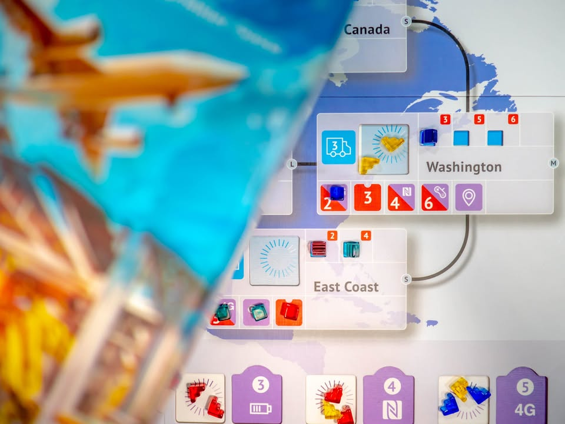

Smartphone Inc. #thought
blog link: https_://wp.me/p7TSgy-2T6
.
▪️ เกม Economic สไตล์ยูโรระดับกลางเบาที่จะให้เรามาบริหารจัดการผลิตและส่งมือถือไปขายทั่วโลก ผลงานเปิดตัวของ Ivan Lashin ที่ sold out อย่างไวในงาน Essen 2018 จนต้องกลับมาเปิด Kickstarter ใหม่อีกรอบในเวลาอันรวดเร็ว
.
.
▪️ ไอเดียของเกมก็ระบบ Economic ทั่วไปนั้นคือ ขยายสาขา -> ผลิต -> ขาย แต่กิมมิคที่เกมนี้นำเสนอคือระบบเลือกแอคชั่นที่เราจะต้องเอาไทล์คำสั่งที่มีคนล่ะสองไทล์มาเล่น puzzle วางไทล์ให้ทับซ้อนกัน โดยไอคอนที่เปิดอยู่ก็คือสิ่งที่บริษัทของเราต้องการจะทำในรอบนั้น 
.
.
▪️ ความสำคัญของระบบการเล่นที่เหมือนจะเป็นส่วนลีลานี้ถือเป็นแกนหลักของเกม เพราะเกมนี้เล่นกันแค่ห้ารอบ และการวางคำสั่งนี้จะมีผลต่อเนื่องไปในทุกเฟสการเล่นของรอบนั้น  ระบบที่เสริมขึ้นมาขึ้น ถ้าวางไอคอนทับกันเยอะก็ผลิตสินค้าได้เยอะ แต่ก็จะทำแอคชั่นได้น้อย ในขณะที่ถ้าทับซ้อนกันน้อยก็จะสามารถทำแอคชั่นตามเฟสได้มากขึ้นแต่ว่าสินค้าที่จะเอาไปขายได้ก็มีน้อยลง
.
.
▪️ วิธีการขายของในเกมนี้มีเงื่อนไขคืออย่างแรกเราต้องมีสาขาตั้งอยู่ อย่างที่สองคือต้องมีราคาไม่แพงไปกว่าที่ลูกค้าในพื้นที่นั้นอยากได้ หรือไม่สินเค้าเราก็ต้องมีฟีเจอร์บางอย่างที่เค้าต้องการ ซึ่งในรอบหนึ่งลูกค้าแต่ล่ะกลุ่มจะซื้อสินค้าเพียงครั้งเดียวเท่านั้น และผู้เล่นที่ตั้งราคาต่ำสุดจะได้ขายก่อน ตรงนี้เลยต้องทำให้เราวางแผนจัด balance เรื่องเงินที่จะได้ และพื้นที่การขายที่เราต้องการ
.
.
▪️ ระบบการขยายสาขาไม่ซับซ้อน เราเปิดไอคอนขยายสาขาไว้กี่อันก็เอามาร์เกอร์เราไปวางประเทศข้างๆ วางครบก็ได้สาขามา ส่วนการวิจัยก็ไอเดียแบบเดียวกันใครวางครบจำนวนก็ถือว่าจะได้เทคโนโลยีนั้นมา คนแรกที่ทำสำเร็จจะได้แต้มเพิ่มแต่คนที่ทำทีหลังจะใช้แอคชั่นน้อยกว่าในการวิจัย (ประมาณว่าในตลาดมีคนเอาของมาขายแล้ว ลอกเอาเร็วกว่า)  ซึ่งนอกจากเทคโนโลยีจะทำให้เราขายของได้แล้วยังมีความสามารถพิเศษซึ่งสุ่มมาในแต่ล่ะเกมด้วย
.
.
▪️ ก็ผลิตขายวนๆกันแค่ห้ารอบก็จบเกม
.
----------------------------------------------------------
🐸 Hang out friend,
----------------------------------------------------------
.
🔹 แน่นอนว่าข้อดีคือสอนง่ายมาก flow สั้นกระชับ ปกติผมจะไม่ค่อยชอบเกมเบาเท่าไร แต่ก็จัดเป็น introduction สำหรับคนเล่นกลุ่มที่เล่นเกมหนักไม่ไหว หรือเป็นมื้อย่อยของคนเล่นเกมหนักก็ได้ แต่พอเล่น Hardcore (ชื่อเว่อร์ไปหน่อย บวกเลขเพิ่มอีกนิดเดียวเอง) พร้อมใส่โมดูล Achievement เข้าไปแล้วก็พบว่ามี Depth เพิ่มขึ้นโดยที่กติกาเกมไม่ได้ซับซ้อนขึ้นเลย เล่นแล้วสนุกขึ้น ได้อารมณ์ Food Chain Magnet ฉบับย่นย่อที่ที่คัดมาแต่แก่นแล้วยังเก็บอารมณ์การแข่งขันเอาไว้โดยที่ไม่แห้งน่าเบื่อ
.
.
🔸 จุดที่ผมคิดว่าเป็นข้อด้อยคือ ถ้าเล่นโหมดธรรมดาเนี่ยแป๊บๆ (น่าจะซัก...สองรอบ...) เกมตันแล้ว เหมาะแค่เอาไว้ intro แล้วแป๊บๆ จอด........  ซึ่งส่วนตัวจะแนะนำให้ใช้ตัวเสริมที่มีโหมด Hardcore ซึ่งเวลาทำแอคชั่นต้องเสียเงิน(แต้ม) ด้วย ซึ่งทำให้เกม 'สมเหตุสมผล' มากขึ้นเพราะเราจะมีต้นทุนในการดำเนินกิจการ แล้วก็มี Mission กลางเยอะพอดูให้เรามาแย่งกันเก็บแต้ม ซึ่งทำการตัดสินใจของเกมน่าสนใจขึ้นเยอะมากเทียบกับการมีแค่ตัวหลักอย่างเดียว
.
.
👁‍🗨 จุดกลางอีกอย่างคือระบบ  action programming ของเกม ซึ่งไอเดียมันก็ดีนะ แต่มันไม่แนบสนิทไปกับระบบอื่นๆในเกม คือกลายเป็นว่าการวางแผนทั้งรอบของคุณจะดีไม่ดีขึ้นอยู่กับทักษะการหมุนไทล์ไปมาพร้อมกับเล็งว่าตอนหยิบไทล์ชนิดใหม่มาจะเอามาหมุนยังไงให้เป็นท่าที่เราต้องการ  ซึ่งมันก็สนุกดีแหละ แค่บางคนอาจจะไม่ชอบตรงนี้
.
.
👁‍🗨 ต่อจากเรื่องการวางแอคชั่นไทล์สิ่งที่เป็นได้ทั้งข้อดีและข้อเสียคือ "เราไม่อาจจะแน่ใจได้ว่าอีกฝ่ายมีศักยภาพในการทำแอคชั่นไหนในระดับใด" ถ้าพูดให้ง่ายอีกหน่อยคือเราไม่รู้ว่าไอ้คนนี้จะดันราคาสินค้าได้แค่ไหน จะวิจัยแข่งกับเราได้เยอะไหม บลาๆ (ถ้าเป็นเกมแห้งๆอย่าง Food Chain Magnet เราจะคาดเดาได้จากการหยิบการ์ดว่าไอ้คนนี้มาแนวไหน) ก็ไปวัดกันตอนยกฉากกั้นมานั้นแหละว่าเค้าจะทำอะไร ก็ถ้ามองว่ามันเป็นเกม double guessing ต้องเดาทางกันหน่อยๆก็ถือว่าได้ลุ้นดีว่าอีกฝ่ายจะออกท่าอะไรบ้าง
.
.
🔸 ข้อติเล็กๆน้อยก็มีพวก component ที่ขนาดคล้ายๆใกล้เคียงกันเกินไปทำให้หยิบผิดบ่อย กับ QC แผนที่กับการตัดไทล์ยังไม่ดีนัก (ของผมตัดเคลื่อน และแผนที่สองชั้นด้านล่างไม่ค่อยตรงกรอบ แต่ไม่มีอะไรเมเจอร์) แผนที่สองชั้นทำมาหนามากสวยดี แต่ over kill เกินไป อยากให้เอางบไปทำแผนที่เสริมหลายๆแบบมากกว่า เพราะลองเล่นแผนที่แบบ 2-3 คนแล้วมันสมมาตรเกินไป ตัวมินิ CEO เองนี้ทำมาสวยซะเปล่าดันใช้งานได้นิดเดียว แต่ก็คิด แต่โดยรวมคิดว่าเกมนี้จะได้รับประโยชน์จากตัวเสริมเล็กๆจำพวกความสามารถเยอะอยู่นะ
.
.
💬 โดยภาพรวมแล้วเป็นเกม 'แห้ง' เล่นง่ายที่ใส่ลูกเล่นความสุ่มและสีสันมาได้น่าสนใจ แม้จะทดแทนความเข้มข้นของเกมใหญ่ไม่ได้ แต่ผมก็คิดว่ามันอาจจะเป็นเกมที่ได้กางบ่อยด้วยความง่ายของมันเนี่ยล่ะ เพราะข้อดีคือมือใหม่เล่นได้ มือเก่าเล่นด้วยแล้วไม่ง่วง ฝั่งครอบครัวหรือกลุ่มเกมเบานี้อยากแนะนำให้ลองเล่นเกมนี้ปูทางก่อนไปเจอความขมเข้มของเกมที่ใหญ่กว่านี้เหมือนกันนะ
.
.
----------------------------------------------------------
Compatible Level - เกมนี้เข้ากับคนเขียนได้ระดับไหนนะ!!

🐸 Family, อาจจะมีช่วงเวลาที่ไม่เข้าใจกันบ้างแต่ครอบครัวคือสิ่งที่จะอยู่กับเราตลอดไป นี้คือเกมที่จะมีพื้นที่ถาวรในชั้นวางแน่นอน!! แม้บางเกมจะเปรียบดั่งคุณปู่ใจดีที่ได้เจอกันแค่ปีล่ะครั้ง แต่อันดับในใจนั้นคือความสนุกในช่วงเวลาที่เล่น หาใช่การได้เล่นซ้ำไม่รู้เบื่อเพียงอย่างเดียว [ex. กบโปรด, กบชอบ]

🐸 Hang out friend, เพื่อนกินเที่ยว ถ้าไม่ติดธุระอันใดก็พร้อมจะออกไปพบเจอ สนุกยามได้พบปะ แต่จะให้เจอกันบ่อยๆคงใช่ที - เกมสนุกที่อยากเล่นในระดับที่อยากจะหยิบกางเป็นบางครั้ง สลับสับเปลี่ยนไปเรื่อยตามจังหวะและโอกาส แต่เราก็ไม่ได้อยากซ้ำต่อเนื่องรัวๆ [ex. กบโอเค]

🐸 Someone I know, หากบังเอิญพบเจอ ก็คงได้ทักทายไต่ถาม หากแต่ในยามปกติมิอาจนึกชื่อออก ยืนคุยก็ได้ แต่คงไม่ได้เอื่อนเอ่ยนัดกินข้าว - บางเกมเราก็ไม่ได้อยากชวนเล่น แต่ถ้าไม่มีอะไรทำแล้วมีคนชวนก็เล่นก็ได้ [ex. กบเฉย]

🐸 I Turn left, You Turn Right - เธอชอบกินเผ็ด เราชอบกินอาหารญี่ปุ่น เธอชอบคนคารมดีพาไปกินที่หรู แต่เราชอบเล่นเกมอยู่กับบ้าน แม้จะได้คุยเป็นบางคราแต่คงไม่อาจพัฒนาความสัมพันธ์ - บางเกมแม้ว่าจะดีแค่ไหน แต่ถ้ารสนิยมมันไปด้วยกันไม่ได้ก็ไม่รู้จะเล่นไปทำไม [ex. กบไม่เล่น]
 
 
อนึ่ง : เป็นความรู้สึกในความ "อยากจะหยิบมาเล่นไหม?" ของผมเอง ไม่ได้เกี่ยวอะไรกับคุณภาพของเกม ไม่อิงมาตราฐานอื่นใดนอกจากตัวเองเท่านั้น ดูให้เป็นแค่ "อีกความคิดเห็นหนึ่ง" เท่านั้นก็พอนะครับ :)

