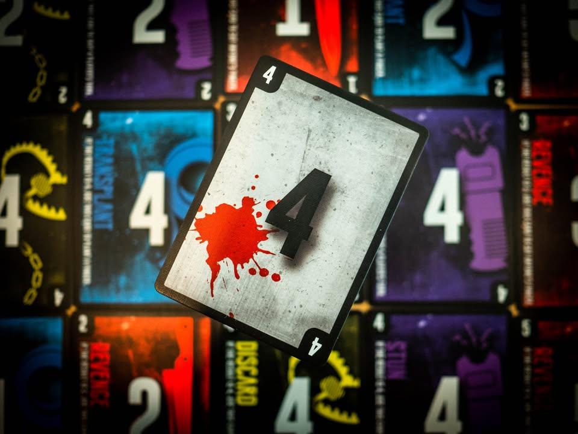
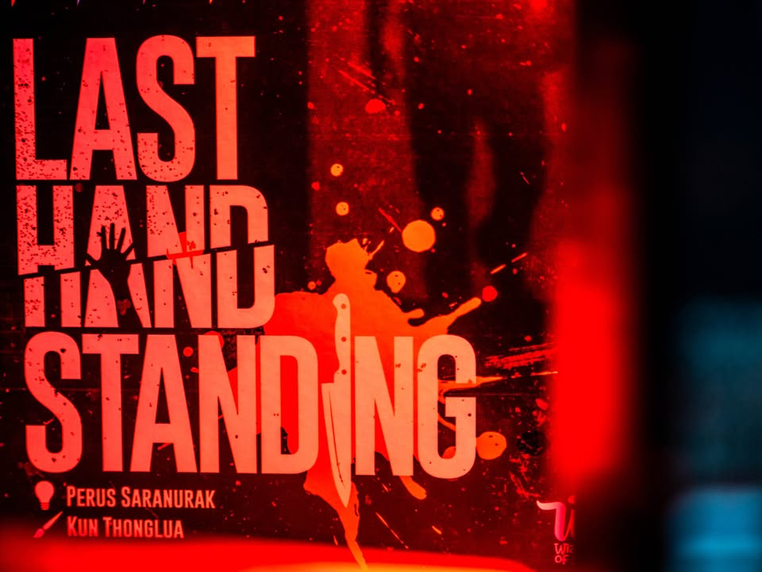
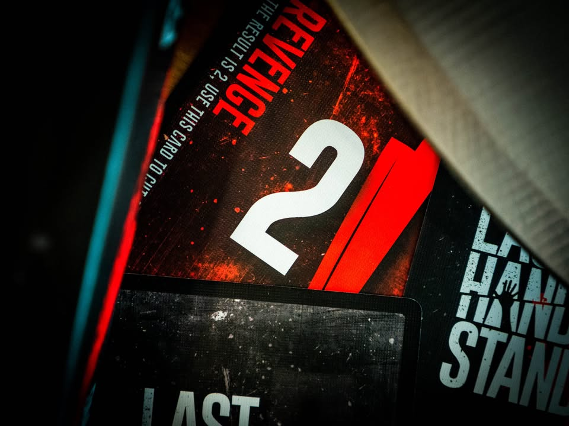
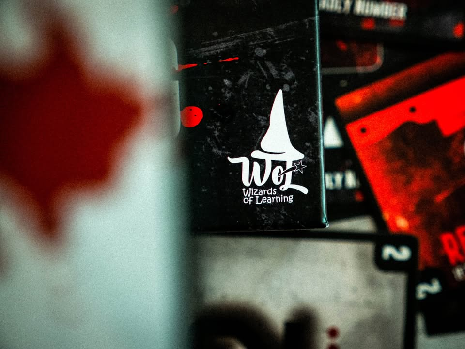
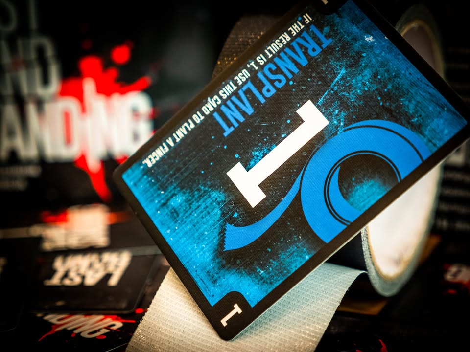
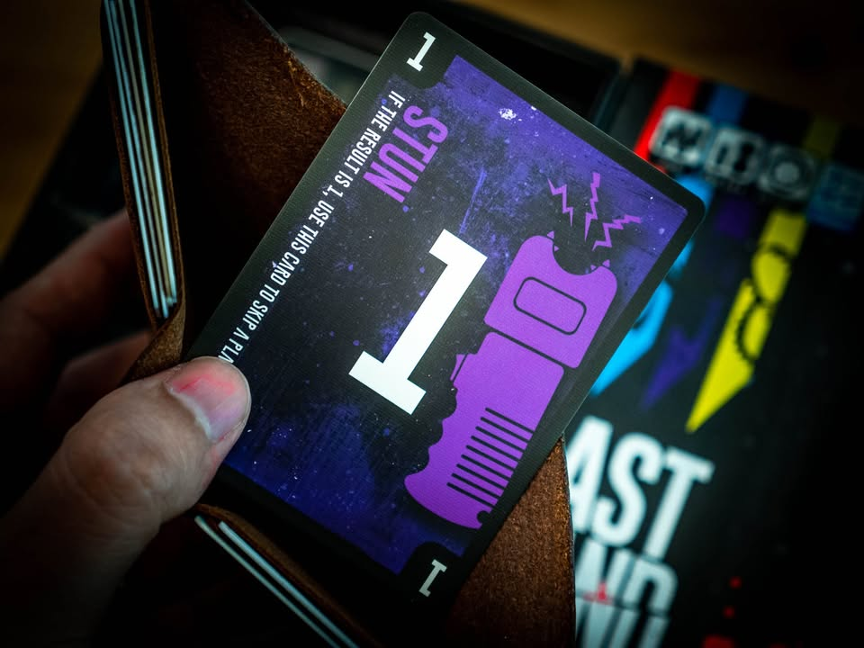

Last Hand Standing #bite_size
blog link: https_://wp.me/p7TSgy-2Tv
.
▪️ เกมปาร์ตี้เบาๆใช้เวลาไม่นานที่เป้าหมายคุณคือการ 'ตัดนิ้ว' เพื่อนในวงให้เหี้ยนและให้เราอยู่รอดเป็นคนสุดท้าย ผลงานของนักออกแบบ Perus Saranurak จากทีม Wizards of Learning ผู้สร้าง Pizza Master และเกมสไตล์การศึกษาและสื่อการสอนให้กับหลายองค์กร
.
.
▪️ กฎเกมถ้าพูดให้ง่ายคือทอยเต๋า จากนั้นก็เล่นการ์ดในมือเพื่อปรับเลขเต๋านิดหน่อย ออกเลขไหนคนที่เหลือในวงก็กุดนิ้วเลขนั้นไป ใครหมดก็เอ้าท์ไป อยากจะกำจัดนิ้วไหนเพื่อนก็ต้องบิดเลขกันนิดนึง แต่กิมมิคคือเวลาเรายิงเลขอะไรไปถ้าใครมีการ์ดเลขตรงกันในมือก็จะเล่นความสามารถได้ด้วย มีตั้งแต่งอกนิ้วกลับมาใหม่ด้วยเทปกาว (พวกเราเล่นเป็นตัวเหี้ยอะไรว่ะ) เอามีดไปหั่นนิ้วเพื่อนคนอื่น เอาปืนไฟฟ้าสั่งข้ามตา รวมไปถึงการ์ดกับดักที่สั่งทิ้งการ์ดในมือ
.
ซึ่งการเอานิ้วมือเรานี้มาเป็น life point นับคะแนนนั้นเป็นไอเดียที่เหมือนจะไม่มีอะไรแต่ทำให้บรรยากาศเกมเปลี่ยนไปอย่างเหลือเชื่อ
.
.
▪️ กิมมิคการเปลี่ยนเลขใช้ไอเดียว่าพอเราทอยเต๋าเลข 1-6 แล้วก็ต้องทิ้งการ์ด 1-2 ใบ (ตรงนี้ตัวอย่างในคู่มือทำมาไม่ดี เพราะไม่อธิบายเรื่องการใช้การ์ดสองใบ) เพื่อเอาเลขมา บวก/ลบ/คูณ/หาร เปลี่ยนเลขสุ่มนี้อีกทีเพื่อให้ออกนิ้วที่เราที่หมายตาไว้
.
.
▪️ รวมๆก็เป็นเกมปาร์ตี้คั่นเวลาสิบนาทีจบ แต่เรียกเสียงเฮฮาได้ดี ข้อดีคือสอนง่าย เอ้า! มาๆ วางมือมาแจกการ์ดเล่นเลย ธีมแปลก กิมมิคนิ้วกุดนี้ทำให้เกิดบรรยากาศการเล่นได้ดีมาก เล่นจบไว จุดติดใจแค่รู้สึกว่าไอ้การทอยเต๋าคิดเลขนี้มันแอบขาดๆเกินๆไม่สนิทไปกับเกมเท่าไร คือรู้สึกแบบทิ้งการ์ดเบอร์ตรงแล้วทิ้งใบอื่นตามเพื่อบวกลบไรงี้ก็ได้นินาไรงี้ แต่บรรยากาศเกรียนๆแบบกูจะนิ้วเมิงให้ด้ายยยยยย ก็สนุกเฮฮาดี
.
.
▪️ อันนี้ยังไม่ได้ถามนักออกแบบแต่เดาเอาว่าใส่ระบบเลข (มีโลโก้ว่า Mathematics ติดหราอยู่หน้ากล่อง) เพื่อเอาไว้บุกห้องเรียนกับบรรเทาโรคตื่นกลัวเกมของเหล่าคุณครูตามขนบกับช่วยดึงดูดผู้ปกครองรุ่นใหม่ล่ะมั้ง? ซึ่งในแง่เบียดเอาการคิดเลขมาลงในเกมก็ถือว่าเป็น mini game ที่โอเคอยู่ แค่ส่วนตัวคิดว่ามันทำอารมณ์ความฮาสะดุดไปนิดนึง
.
.
🔸 disclaimer ข้อเขียนนี้ไม่ใช่การโฆษณา ผู้ผลิตได้ส่งกล่องเดโมมาให้ผู้เขียนได้ทดลอง แต่ผู้เขียนไม่มีภาระผูกพันที่จะต้องพูดแต่เรื่องดี ความเห็นทุกอย่างล้วนเป็นข้อคิดเห็นอย่างจริงใจจากมุมมองของผู้เขียนเท่านั้น
.
--------------------------------
หมวด Bite Size (พอดีคำ) นี้กะว่าจะเขียนอะไรสั้นๆประมาณนี้ล่ะกัน ใหม่บ้าง ซ้ำบ้าง เกมที่ขี้เกียจเขียนบ้าง เขียนๆไว้ก่อนเผื่อมีอารมณ์อาจจะขยายไปลง Thought บ้าง จริงๆอยากเขียนสั้นกว่านี้ แต่ยังอดไม่ได้ที่จะต้องอธิบายอะไรเพิ่มตามนิสัย เดี๋ยวค่อยๆปรับไปล่ะกัน

เปิดกระเป๋ามาผมนี้สตันเลย

เงินหมด!

