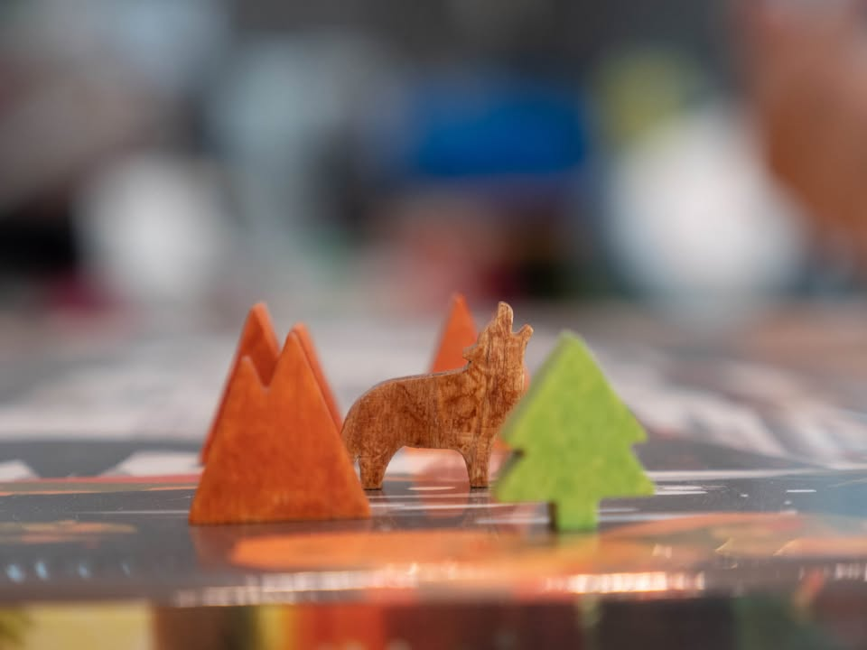
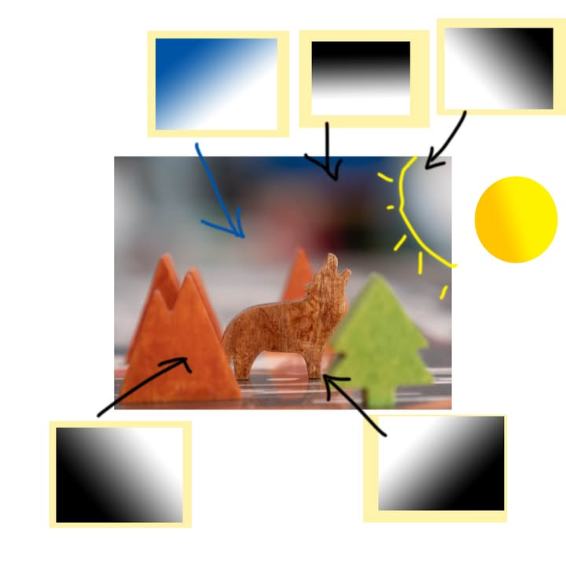

#ไม่เกี่ยวกับบอร์ดเกมซักเท่าไร เมื่อวานพึ่งเคยได้เล่น Parks ครั้งแรกเกมสวยดี ฟีลกู๊ด แบบไม่มีเหี้ยอะไรเลยแต่ว่ามีเรื่องราวให้หยิบจับท่องเท่ียวไปเพลินใจดี เอา Tokaido ไปเผาทิ้งได้เลย ว่าจะยืมกลับมาจัดฉากแต่ดันลืม 
.
.
แต่โพสนี้ที่เอามาลงก็เพราะหยิบรูปที่วางๆถ่ายเล่นๆมาตบแต่งทีหลังใน lightroom แล้วออกมาโอเคกว่ากว่าคิดไว้เยอะเลยอยากเอามาลองแบ่งปัน นั้นคือการทำให้รูปดูกลางคืน (จะเรียกอวดก็ได้แหละ แต่ผมสายลองทำไปเรื่อยเพราะงั้นมีอะไรก็แนะนำมาได้ฮะ :D)
.
.
▪️ภาพแรกคือต้นฉบับจากกล้อง (Pananonic GH5 at 35mm f2.8) ถ้าจัดเองที่บ้านของเล็กแค่นี้จะใช้เลนส์ที่ระยะไกลกว่านี้ ตัวประจำคือ 42.5mm แต่กำลังคิดว่าจะไปหาซื้อ 60mm Macro ดีไหมนะ? แต่เอาจริงๆแล้วใช้มือถือก็ได้นะ ผมแค่ซื้อกล้องแล้วหาเรื่องใช้เฉยๆ.......
.
.
▪️เนื่องจากภาพแม่งที่โล่งเยอะมากจากการที่เลนส์มันเอาเข้าใกล้มากกว่านี้ไม่ได้ เลยต้อง Crop แล้วจัดองค์ประกอบภาพใหม่ (Crop แล้ว Rotate นี้ทำประจำเพราะตอนถ่ายไม่ค่อยคิด...ฮา)
.
.
▪️หลังจากปรับสี/contrast บลาๆ แล้ว อันสุดท้ายคือใส่ gradient filter ใน lightroom เพื่อย้อมให้ฉากดูเป็นกลางคืน หลักๆก็สีดำตามมุมที่เราไม่อยากให้มอง แล้วก็เติมสีน้ำเงินเข้มไปด้านหลัง ส่วนดวงจันทร์นั้นก็เอา radial filter ใส่สีเหลืองเข้าไป
.
.
▪️ภาพไม่มีการจัดแสงใช้ไฟตอนเที่ยงๆส่องจากหน้าร้านตึกแถวนั้นแหละ (แต่ในร้านไฟสว่างดี) tools ใช้แค่ของเบสิคใน lightroom ไม่ได้ใช้ LUT/Present เอาจริงๆใช้ rawtherapee + gimp หรือ gimp เดี่ยวๆก็ได้

ต้นฉบับมาแบบนี้ องค์ประกอบไม่ดี ไม่มีจุดเด่น ไม่มีเรื่องราว

อันนี้แหกกฎ 9 ช่องนิดหน่อย แต่อีกล่ะตอนจัดฉากเราไม่ได้คิดไว้ก่อน..... 

อยากให้คนมองหมาป่าแล้วมีพื้นที่ว่างมองดวงจันทร์ทางขวา เพราะมีหมาป่ามองนำทางไปแล้ว (เค้าเรียก white space) ไอเดียคือบังเอิญเห็นเสื้อขาวด้านหลังตำแหน่งมันได้

อันนี้เป็นตัวอย่างที่ผมทำบ่อยคือบางทีก็ลอง crop ดูมุมดูตำแหน่งไปเรื่อยอยู่ๆไอเดียก็โผล่มา

เติมๆไปประมาณนี้แหละ

