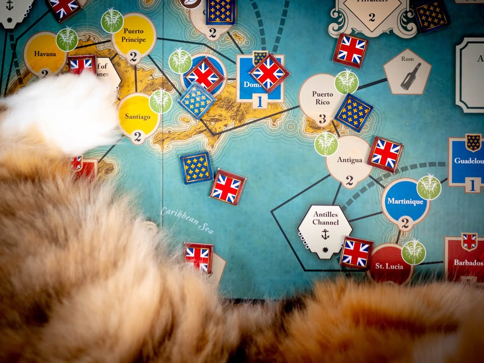
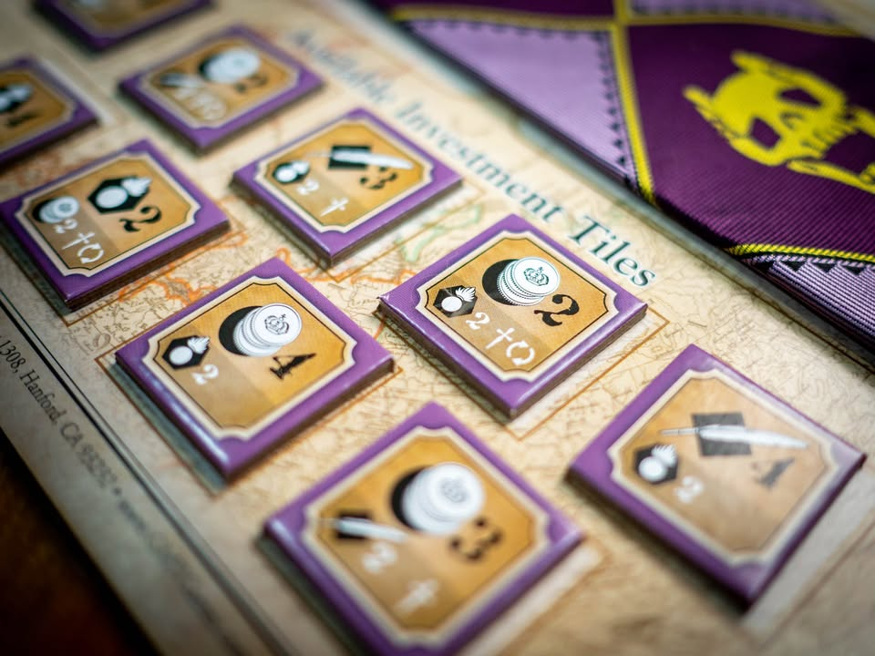
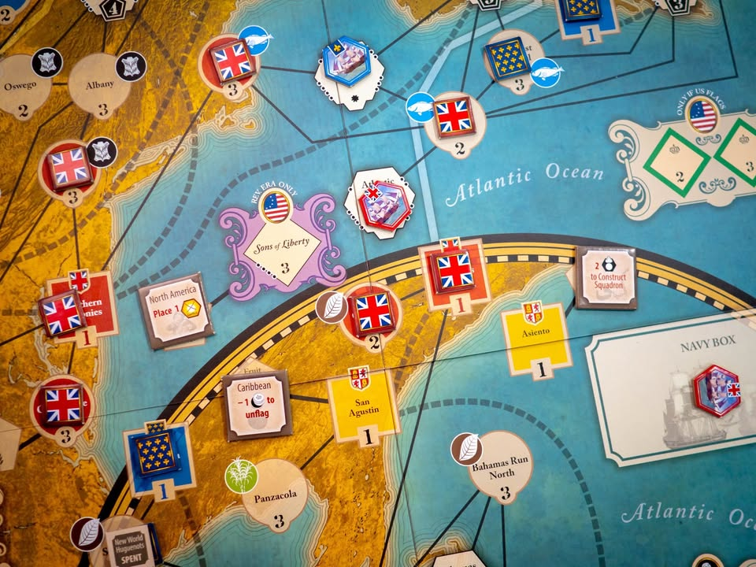
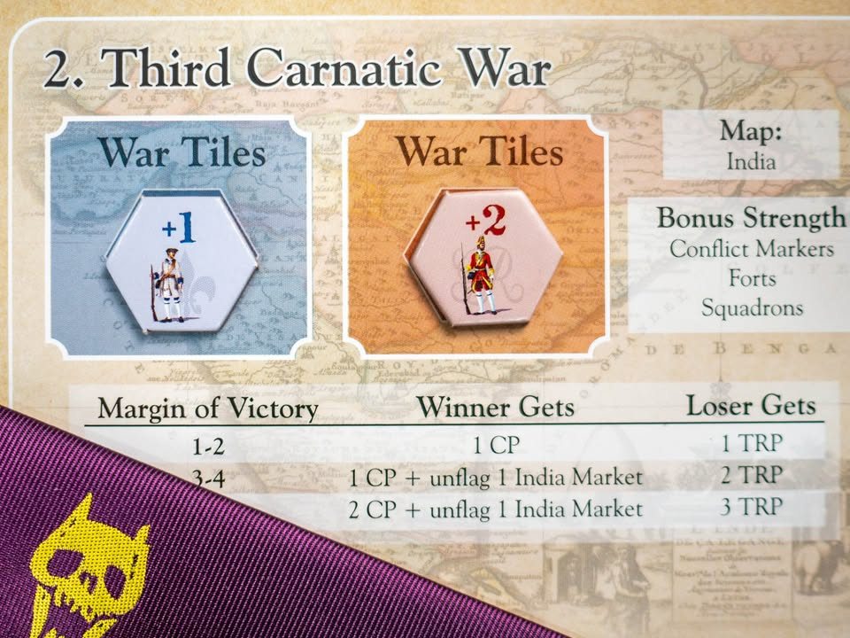
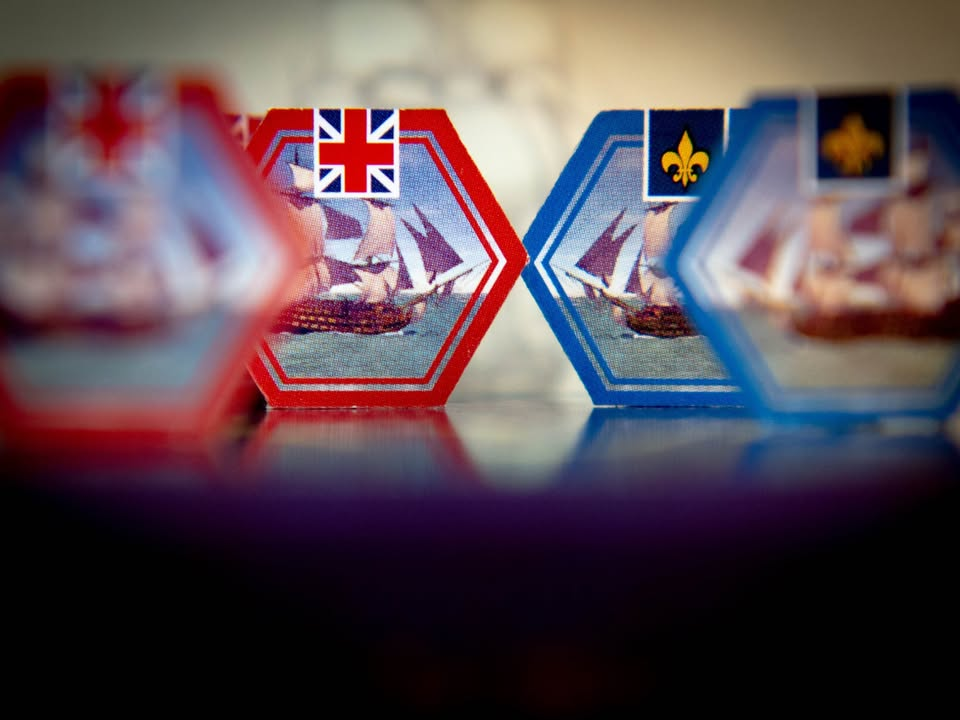
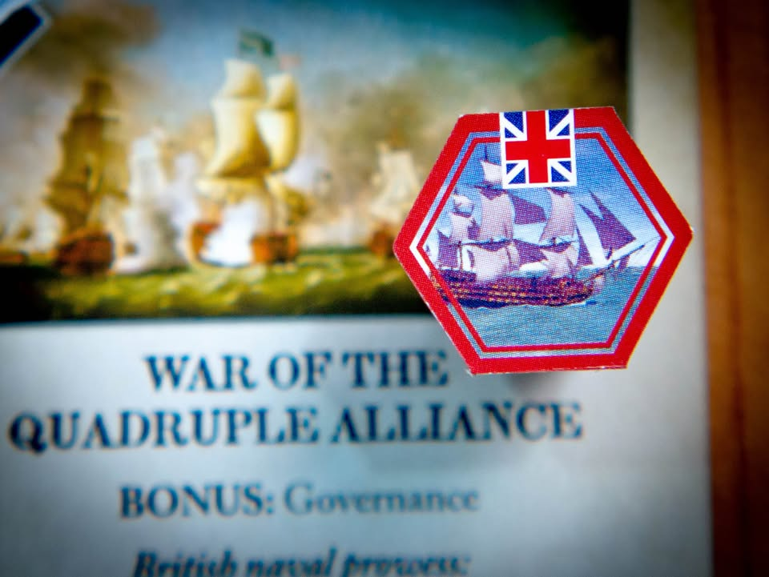
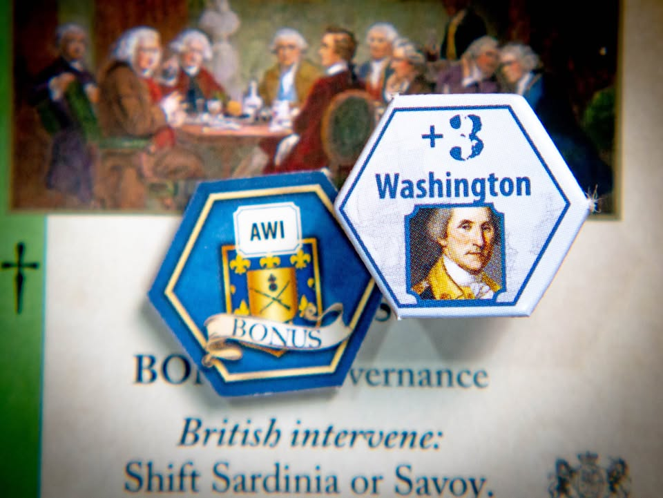
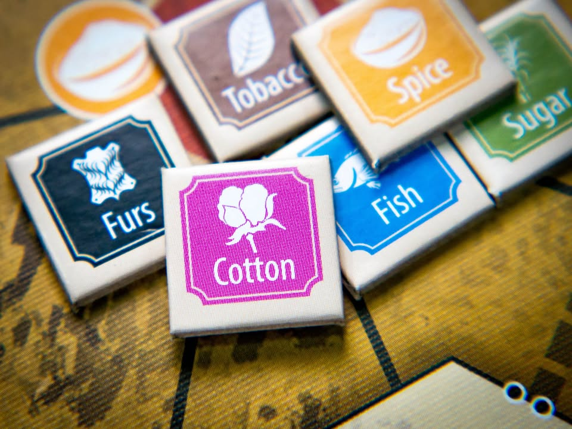
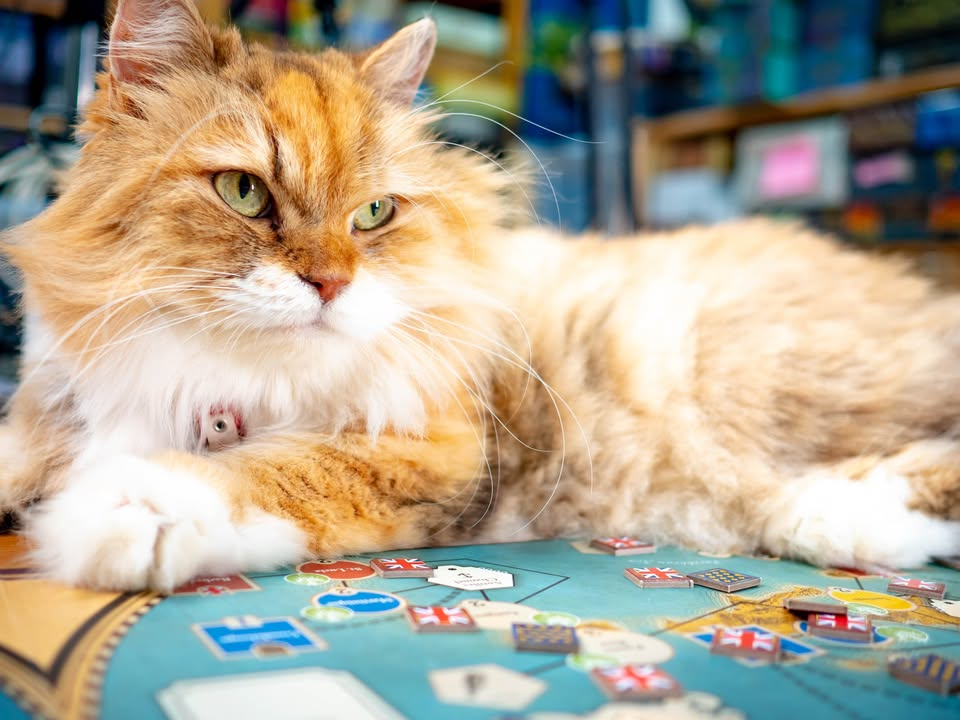

Imperial Struggle #thought #first_impression
blog: https_://wp.me/p7TSgy-2TR

▪️ ศตวรรษที่ 18; 'โลก' ได้ค้นพบการดำรงอยู่ของแผ่นดินใหม่ ยุคสมัยที่สองผู้เล่นรายใหญ่อย่างฝรั่งเศสและอังกฤษกำลังขับเคี่ยวอย่างดุเดือดทั้งในภาคพื้นทวีปยุโรปและสมรภูมิที่ขยายไปถึง 'โลกใหม่' ชัยชนะนั้นไม่อาจใช้เพียงกำลัง แต่ยังต้องมาจากเสียงเงินเหรียญกระทบและน้ำหมึกแห่งสนธิสัญญา ผลงานของ Ananda Gupta ผู้สร้าง Twilight Struggle เกมที่ยืนหนึ่งใน BGG ถึง 5 ปีติดต่อกัน และ Jason Matthews ล็อบบี้ยิสต์ผู้นำระบบเกม TS ไปต่อยอดเป็นเกมเลือกตั้งอย่าง 1960: The Making of The President, Campaign Manager 2008 และการก่อร่างสร้างรัฐธรรมนูญของอเมริกาใน Founding Fathers
.
.
▪️ ถึงเกมนี้จะมีภาพของ War Game (ตามขนบเดิม) ฝั่งอยู่ แต่ใน 'ภาพรวม' แล้วเกมนี้คือ Area Control สำหรับผู้เล่นสองคน และแม้เกมนี้ทางค่ายจะถูกเรียกว่าผู้สืบทอด Twilight Struggle ที่เล่นง่ายขึ้น แต่ผมคิดว่าเป็นคำทางการตลาดเสียมากกว่าเพราะอารมณ์ในการเล่นแตกต่างกันมาก แนะนำว่าลืมประโยคนี้ไปแล้วสนุกไปกับมันในฐานะเกมชิงพื้นที่จะดีกว่า เพราะแม้แต่ระบบลายเซ็นของเกมสงครามยุคใหม่อย่าง Card Driven (CDG) เกมนี้ยังเอาออกไปเลย กลายเป็น draft tile เพื่อเอา action point ไปทำแอคชั่นแทน
.
.
▪️ เกมนี้เล่นกัน 7 รอบใหญ่ ( scale ของเกมกินเวลาร่วม 100 ปี ในแต่ล่ะรอบจะเป็นเวลาจริงราว 15 ปี) ผู้เล่นจะผลัดกันหยิบ investment tile ที่บ่งบอกว่าประเทศจะให้ความสนใจกับอะไร แต่ล่ะไทล์จะให้ 'แต้ม' สามชนิดในจำนวนที่แตกต่างกัน ซึ่งแต้มจะมีสามชนิดคือ การทหาร, เศรษฐกิจ, การเมือง ผลัดกันหยิบเอาไทล์แต้มนี้ไปใช้คนล่ะสี่ครั้งก็จบหนึ่งรอบ
.
.
▪️ ซึ่งแต้มทั้งสามแบบนั้นถ้าพูดโดยรวมก็ใช้อยู่แค่แบบเดียว นั้นคือเอาไป 'ชักเย่อ' ยึดพื้นที่สามชนิดในเกม อยากจะยึดพื้นที่การเมืองก็ต้องเลือกไทล์การเมือง พื้นที่ทางการทหารก็แต้มการทหาร พื้นที่เศรษฐกิจก็ต้องแต้มเศรษฐกิจ ซึ่งในหนึ่งพื้นที่ก็จะมีสถานะได้สามแบบคือ ธงอังกฤษ <-> ไม่มีคนควบคุม <-> ธงฝรั่งเศส
.
.
▪️ แผนที่ของเกมแบ่งออกเป็น 4 โซนใหญ่ได้แก่ยุโรป, อินเดีย/แอฟริกา, อเมริกาเหนือ ,อเมริกาใต้ ไอเดียของเกมคือการวางธงของเราพื้นยึดพื้นที่สามชนิดที่แตกต่างกัน โดยที่แต้มในแต่ล่ะรอบจะให้กับประเทศที่มีจำนวนธงที่มากที่สุดในพื้นที่, ประเทศที่ยึดครองพื้นที่เศรษฐกิจสำคัญในยุคนั้น และประเทศที่ชนะสงคราม
.
.
▪️ ความน่าสนใจคือจำนวนแต้มที่จะได้ในแต่ล่ะทวีปจะเป็นแบบกึ่งสุ่มใหม่ทุกต้นรอบ และสินค้าเศรษฐกิจจะมีหกชนิด แต่ว่าจะสุ่มออกมาให้นับแต้มแค่สามชนิด ความสำคัญของเรื่องนี้คือผู้เล่นจะถูกบังคับให้เปลี่ยนลำดับความสำคัญระยะกลางทุกรอบการเล่น เพราะพื้นที่ที่เรายึดครองอยู่อาจจะไม่สร้างคะแนนให้กับเรา
.
.
▪️ การชนะมีหลายวิธีแต่อันที่เข้าใจง่ายสุดคือประเทศที่ 'ชักเย่อ' ในแต้มมาจบทางฝั่งตัวเองได้จะเป็นผู้ชนะ แปลว่าทุกครั้งที่มีฝ่ายใดฝ่ายหนึ่งได้แต้ม หลักชัยชนะที่มีอยู่อันเดียวก็จะถูกดึงเอนเอียงไปยังผู้เล่นคนนั้น ก็ดึงกันไปมาเพื่อให้ตอนจบเกมนั้นคะแนนมาทางฝั่งเราให้มากที่สุด แต่ถ้าดึงมาสุดทางได้ก่อนระหว่างเกมก็ชนะไปเลยไม่ต้องเล่นต่อ
.
.
▪️ ในเกมมีช่วงสงครามสี่ครั้ง ในแต่ล่ะครั้งจะมีการรบเกิดขึ้นสี่สมรภูมิ ที่น่าสนใจคือในแต่ล่ะสมรภูมิค่าพลังที่ใช้ในการวัดว่าใครแข็งแกร่งกว่านั้นจะแตกต่างกันไป อย่างเช่นศึกนี้นับพลังจากสเปนและกองเรือ แต่อีกศึกนับแค่ธงจากไอร์แลน, ฮังการี เท่านั้น ตรงนี้ทำให้เราต้องวางแผนอีกเลเยอร์หนึ่งเพิ่มว่าจะยึดพื้นที่ตรงไหนถึงจะให้ผลที่ดีกับศึกที่เราจะไปสู้ จะปล่อยทิ้งก็ต้องคิด เพราะในแต่ล่ะศึกยิ่งผู้ชนะได้คะแนนนำมากเท่าไรก็จะยิ่งได้รางวัลสูงขึ้นเท่านั้น ซึ่งหลายครั้งผลการทำชนะศึกที่เด็ดขาดจะทำให้สามารถยึดดินแดนของอีกฝ่ายได้
.
.
▪️ ตอนรบจะมีกิมมิคอีกนิดว่ามีการสุ่มไทล์ที่จะแปลงตัวเลขเอาไว้นิดนิด ซึ่งเป็นทั้งได้บวกและลบ (นึกซะว่าเป็นการทอยเต๋า แต่คุณรู้ผลล่วงหน้าคนเดียว) แต่เกมก็จะมีจังหวะให้เราแปลงแต้มนี้หรือจั่วไทล์เพื่อเพิ่มพลังได้อีก (มีธีมนิดๆว่ามีพวกคนสำคัญยุคนั้นมาช่วยบวก) ถ้ารบชนะแบบเด็ดขาดทุกสมรภูมิก็ชนะไปเลย หรือถ้ามีธงของเรานำขาดในทุกพื้นที่ทั้งทางการเมืองและเศรษฐกิจเราก็จะชนะเช่นกัน

------------- side note -------------
▫️ ในระหว่างเจ็ดรอบการเล่นก็จะมีสี่สงครามใหญ่ที่เกิดตามประวัติศาสตร์จริง ได้แก่สงครามผู้สืบทอดในสเปน (War of Spanish Succession 1701–1714 ) ในไทยก็อยุธยาช่วงหลังละครออเจ้าไปนิดนึง อยู่ในสมัยสมเด็จพระเพทราชาที่มีการขับไล่ชาวฝรั่งเศสออกไปจากสยาม ซึ่งกว่าสยามจะเริ่มติดต่อกับต่างชาติอีกทีก็ตอนทำสนธิสัญญาเบอร์นีกับอังกฤษตอนรัชกาลที่สามในปี 1826 (พ.ศ. 2369)
.
.
▫️ สงครามผู้สืบทอดในออสเตรีย (War of the Austrian Succession 1740–1748) ซึ่งสองสงครามนี้ต้องเข้าใจกันก่อนราชวงศ์ในยุโรปนั้นแต่งงานโยงกันไปมาจนแทบจะเป็นญาติกันไปหมด พอกษัตริย์องค์หนึ่งสิ้นไปแล้วดันไม่มีทายาทสายตรง ประเทศอื่นก็จะพยายามดันลูกหลานที่เกี่ยวดองกับสายตัวเองขึ้นมากัน ส่วนเจ้าอื่นที่ไม่เกี่ยวโดยตรงก็จะพยายามถ่วงไม่ให้ราชวงศ์ไหนมีอำนาจมากเกินไป ซึ่งสองสงครามนี้มีเอี่ยวกันทั้งยุโรป ส่วนในไทยจะเป็นอยุธยาในรัชกาลของสมเด็จพระเจ้าอยู่หัวบรมโกศ ที่ตอนนั้นลังกา (ศรีลังกาในปัจจุบัน) อยากจะรื้อฟื้นศาสนาพุทธขึ้นใหม่ก็เลยส่งพระสงฆ์ไปช่วยเค้าจนตั้งสยามนิกายขึ้น
.
.
▫️ เรื่องสนุกอีกอย่างที่โผล่มาในเกมด้วยเช่นกันคือพวก จาโคไบต์ (Jacobitism) คือช่วงหนึ่งราชวงศ์อังกฤษโดนขับไล่ลี้ภัยหนีไปแต่งกับราชวงศ์สก๊อตแลนด์ พอกลับมาปกครองอังกฤษใหม่ก็มีจังหวะหนึ่งที่ต้องหาคนมาสืบทอดบัลลังก์สายใหม่เพราะรุ่นเดิมไม่มีทายาทสายตรง ทางฝั่งสก๊อตก็พยายามอ้างสิทธิ์ว่าตัวเองเป็นสายตรงกว่า ซึ่งพวกนี้จะมาป่วนฝั่งอังกฤษอยู่เป็นระยะในเกม ซึ่งเป็นเรื่องจริงนะ และมีเรื่องอารมณ์พล๊อตทวิสหน่อยๆคือเจ้าหญิงไดอาน่าที่เป็นแม่ของเจ้าชายวิลเลี่ยมเนี่ยถ้านับลำดับญาติแล้วก็มีต้นสายมาจากลูกนอกสมรสของราชวงศ์สก๊อตแลนด์ที่พยายามอ้างสิทธิ์นั้นเอง.....
.
.
▫️ ตามด้วย สงครามเจ็ดปี (Seven Year War 1756-1763) ที่นับได้ว่าเป็น 'สงครามระดับโลก' ครั้งแรก เนื่องจากแนวรบไม่ได้อยู่แค่ในยุโรป แต่ว่าลามไปถึงอาณานิคมในทวีปอเมริกาด้วย และสุดท้ายคือ สงครามปฏิวัติอเมริกา (U.S. War of Independence 1775 - 1783) ที่อาณานิคมทั้งสิบสามแห่งของอังกฤษในทวีปอเมริกาเหนือได้ทำการต่อสู้เพื่อแยกตัวเองออกจากอังกฤษผ่านการสนับสนุนของฝรั่งเศสและสเปน ส่วนในไทยตอนนั้นอยุธยาก็เสียกรุงครั้งที่สองในปี 1767 (7 เมษายน พ.ศ. 2310) ก่อนที่พระเจ้าตากจะสถาปนากรุงธนบุรี (1767 - 1782 รวม 15 ปี ) ในวันที่ 28 ธันวาคม พ.ศ. 2310 ปีเดียวกัน

----------------------------------------------------------
🐸 Family
----------------------------------------------------------
.
🔹 ผมเล่นเกมสองคนโดยเฉพาะมาไม่เยอะนัก แต่สำหรับเกมนี้ในฐานะเกมสองคนขนาดยาว (ราว 3 ชั่วโมงถ้าเล่นเป็นทั้งคู่) เกมนี้ค่อนข้างอิ่มเอิ่ม ไม่มีความรู้สึกว่าเนื่อยเมื่อไรจะจบ หรือว่าเครียดฉิบกูปวดหัว คือน้ำหนักความคิดมันค่อนข้างสวย ได้นวดสมองไปเรื่อยๆจนจบเกม
.
.
🔹 เกมสไตล์ Area Control เองเป็นสไตล์หนึ่งที่ผมชอบแต่ว่าเล่นสองคนน่าจะเรียกได้ว่าแทบไม่มีเกมไหนสนุก (ถ้าพูดถึงแนว tug-of-war ผมไม่ชอบ Twilight Struggle / 1960: Making of the President ลีลามากเกินไป แต่ชอบ Watergate เพราะสั้นกระชับสนุกแม้ไม่ยังไม่เก็ทเซ็ทติ้งเกม) แต่ว่าข้อดีมากสำหรับผมในเกมสไตล์ชักเย่อคือมันมีบรรยากาศการแข่งกันตลอดเกมโดยที่ไม่รู้สึกว่าเรากำลังห่ำหั่นให้อีกฝ่ายดับไปเหมือนเกมสไตล์ที่เอาผู้เล่นสองคนมาแข่งกันตรงๆทั่วไป ซึ่งผมคิดว่าแม้ผู้เล่นสองคนที่ไม่ได้ชอบเกม direct conflict จ๋าๆ ก็ยังน่าจะชอบเกมนี้ได้ไม่ยาก 
.
.
🔹  flow การเล่นหลักถ้าไม่นับกติกายกเว้นต่างๆแล้วนั้นเกมตรงไปตรงมามาก มีไทล์แต้มกลางสุ่มมาเท่านี้ คุณจะ draft action แบบไหนเพื่อทำประโยชน์ให้เยอะและกั๊กไม่ได้อีกฝ่ายมาขวางทางคุณ พื้นที่ยึดไม่ไหว สงครามล่ะได้ไหม? พื้นที่ตรงนี้คุ้มแค่ไหนที่จะเอาคืนมา คือมันมีอะไรให้เราเลือก trade off เยอะดี ต้องคิดกลับไปกลับมาตลอดว่าทำแล้วจะชนะไหม
.
.
🔹จุดน่าสนใจอีกอย่างคือการ์ดรัฐบาลและเหตุการณ์ การ์ดรัฐบาลก็คือพลัง passive ที่เอาไว้หงายในจังหวะที่เราต้องการเป็นของประเทศใครประเทศมัน ส่วนการ์ดเหตุการณ์จะสุ่มมา มีกิมมิคเล็กๆว่าถ้ามันตรงกับชนิดของรัฐบาลจะได้โบนัสเพิ่ม ตรงนี้น่าสนใจตรงที่ผู้เล่นจะรู้คร่าวๆว่าอีกฝ่ายมี passive ability อะไร แต่ไม่แน่ใจว่าเค้าจะใช้อันไหน และด้วยความที่เหตุการณ์มันสุ่มการออกท่าในแต่ล่ะเกมก็จะมีผลแตกต่างกันเยอะดี แต่ตรงนี้อาจจะติดนิดๆตรงการ์ดรัฐบาลของทั้งสองฝ่ายมีจำนวนไม่เยอะนัก (ในแง่ดีคือไม่ต้องจำเยอะ เน้นลีลาจากการ์ดเหตุการณ์ดีกว่า) และการเล่นการ์ดจะต้องเลือกไทล์แอคชั่นที่มีสัญลักษณ์ให้เล่นการ์ดด้วย
.
.
🔹จุดที่ชอบถ้ามองจากมุมของ War Game (ในแง่พื้นเพของเกม) คือเป็นเกมที่พยายามซ่อนเต๋าได้ฉลาดดี ปกติเกมแบบนี้จะทอยวัดกันโง่ๆเลย แต่เกมนี้จะใช้วิธีสุ่มไทล์ ทำให้เราเห็นผลล่วงหน้าแต่อีกฝ่ายไม่รู้ แล้วให้ผู้เล่นไปหาทางแก้ปัญหาหน้างานกันเอาเอง ซึ่งจังหวะการบลั๊ฟกับลุ้นผมคิดว่าอยู่ในระดับควบคุมได้และตื้นเต้นแบบไม่รู้สึกว่าดวงเกินไป
.
.
🔸จุดที่น่ารำคาญนิดๆคือมันแอบนับยากนิดนึงว่าพื้นที่ไหนเราชนะอยู่ ต้องมาคอยไล่นับธงอยู่เรื่อยๆ เพราะโซนหนึ่งมันกว้างมองตัวตาอาจจะนับพลาดได้ ซึ่งตรงนี้ทำให้เวลาในการเล่นอาจจะสะดุดนิดนึง ซึ่งแก้ด้วยการโหลด player aid ที่เอาไว้ช่วยนับมาจะประหยัดเวลาขึ้น
.
.
🔸กติกาและข้อยกเว้นมีประปราย แม้ไม่มากแต่ดันหายากไม่รู้อยู่ตรงไหนแล้ว player aid ที่ให้มาดันไม่บอก เช่นเคยว่ามีคนทำ Player aid ที่ช่วยอุดเรื่องพวกนี้เอาไว้แล้ว แต่ก็ต้องยอมรับอยู่ดีว่าแอบรำคาญตรงนี้นิดหน่อยน่าจะ streamline ให้เยอะได้มากกว่านี้
.
.
🔸 จุดที่ไม่ชอบจริงๆน่าจะเป็นระบบ war นั้นแหละ ตรงที่มันมีความเป็น 'เกม' ของตัวเองสูง แม้จะแยกออกมาจากส่วน area control ในแผนที่แต่ก็ต้องโยงกันอยู่ดี ซึ่ง UI/UX ตรงนี้ห่วยแตกมาก คือเราต้องคอยมองเช็คไปมาตลอดว่าสมรภูมินี้มันนับพื้นที่ตรงไหน อย่างรอบแรกสู้กันสี่สมรภูมิแม่งอยู่ในยุโรปสามที่ เราก็ต้องมานั่งไล่อีกอยากชนะตรงนี้ต้องไปประเทศไหน แล้วแต้มกูจะพอไหมบลาๆ ซึ่งทำให้ตอนเล่นเสียเวลาพอดู 
.
.
🔸 ต่อในส่วนของ war ถ้าเล่นตามกติกาหลักมันจะมีจังหวะที่รู้สึกว่าดวงจริงหยิบยังไงก็เสียเปรียบ แนะนำให้เล่น offcial varient ท้ายเล่มที่ต่อให้จั่วไม่ดีก็ยังพอจะให้เราสับเปลี่ยนไทล์ได้ง่ายขึ้นนิดนึง ซึ่งตรงส่วนนี้จะมีความลีลาที่ผมคิดว่าทำมาเกินจำเป็นคือมันมีไทล์เสริมพลังอยู่สี่ชุด ใช้กันคนล่ะสงครามตามช่วงเวลา แต่ว่ามันเหมือนกันหมดเลยทั้งสี่ชุด..... ที่ต่างกันมีแค่ชื่อบุคคลสำคัญในยุคนั้นๆ โดยในคู่มือก็บอกเหมือนกันว่าถ้าขี้เกียจจะไม่เปลี่ยนก็ได้ ถามว่าดูตามธีมไหมมันก็โอเคแหละ แต่รู้สึกว่าเปลืองกระดาษ
.
.
👁‍🗨 จุดกลางๆอันหนึ่งคือเรื่องดวงเปิดไทล์ อย่างไทล์เศรษฐกิจซึ่งการคิดแต้มจะสุ่มออกมาแค่ครึ่งเดียว บางครั้งออกมาดวงดีตรงกับพื้นที่ที่ใครคุมอยู่เราก็อาจจะรู้สึกว่าสบายจริงอยู่หลายทีเหมือนกัน หรือกระทั้งไทล์แต้มประจำรอบเวลามีธงเยอะสุดในพื้นที่บางครั้งมันก็จะไปออกในที่ๆฝ่ายใดฝ่ายหนึ่งครองเบ็ดเสร็จไว้อยู่แล้วเจอแบบนี้บางทีก็เซงเพราะการไปยึดพื้นที่ไหนคืนมาจากเจ้าถิ่นนี้มันต้องใช้แอคชั่นพลังเยอะจริงๆ
.
.
💬 ใน BGG มีคน comment ไว้ว่าเกมนี้เป็น Pax Renaissance + Twilight Struggle ซึ่งผมก็เห็นด้วยในบางแง่มุม (แต่ถ้ามองว่ามันเป็น TS ภาค 2 คุณน่าจะผิดหวังเพราะไม่เหมือน) แต่ผมอยากจะขยายความว่ามันเป็น Pax Renaissance สำหรับผู้เล่น 2 คนที่เล่นและสอนง่ายกว่าและให้อารมณ์ชักเย่อที่ทุกแต้มที่ได้มาต้อง 'ตัดใจ' เลือกอยู่ตลอด หลายครั้งจบรอบคิดแต้มดึงไปดึงมาอ้าวกลับมาอยู่ทีเดิม ปากก็พูดว่าเซงแต่ใจก็บอกรอบหน้ามาทางกูแน่ 

----------------------------------------------------------
Compatible Level - เกมนี้เข้ากับคนเขียนได้ระดับไหนนะ!!

🐸 Family, อาจจะมีช่วงเวลาที่ไม่เข้าใจกันบ้างแต่ครอบครัวคือสิ่งที่จะอยู่กับเราตลอดไป นี้คือเกมที่จะมีพื้นที่ถาวรในชั้นวางแน่นอน!! แม้บางเกมจะเปรียบดั่งคุณปู่ใจดีที่ได้เจอกันแค่ปีล่ะครั้ง แต่อันดับในใจนั้นคือความสนุกในช่วงเวลาที่เล่น หาใช่การได้เล่นซ้ำไม่รู้เบื่อเพียงอย่างเดียว [ex. กบโปรด, กบชอบ]

🐸 Hang out friend, เพื่อนกินเที่ยว ถ้าไม่ติดธุระอันใดก็พร้อมจะออกไปพบเจอ สนุกยามได้พบปะ แต่จะให้เจอกันบ่อยๆคงใช่ที - เกมสนุกที่อยากเล่นในระดับที่อยากจะหยิบกางเป็นบางครั้ง สลับสับเปลี่ยนไปเรื่อยตามจังหวะและโอกาส แต่เราก็ไม่ได้อยากซ้ำต่อเนื่องรัวๆ [ex. กบโอเค]

🐸 Someone I know, หากบังเอิญพบเจอ ก็คงได้ทักทายไต่ถาม หากแต่ในยามปกติมิอาจนึกชื่อออก ยืนคุยก็ได้ แต่คงไม่ได้เอื่อนเอ่ยนัดกินข้าว - บางเกมเราก็ไม่ได้อยากชวนเล่น แต่ถ้าไม่มีอะไรทำแล้วมีคนชวนก็เล่นก็ได้ [ex. กบเฉย]

🐸 I Turn left, You Turn Right - เธอชอบกินเผ็ด เราชอบกินอาหารญี่ปุ่น เธอชอบคนคารมดีพาไปกินที่หรู แต่เราชอบเล่นเกมอยู่กับบ้าน แม้จะได้คุยเป็นบางคราแต่คงไม่อาจพัฒนาความสัมพันธ์ - บางเกมแม้ว่าจะดีแค่ไหน แต่ถ้ารสนิยมมันไปด้วยกันไม่ได้ก็ไม่รู้จะเล่นไปทำไม [ex. กบไม่เล่น]
 
 
อนึ่ง : เป็นความรู้สึกในความ "อยากจะหยิบมาเล่นไหม?" ของผมเอง ไม่ได้เกี่ยวอะไรกับคุณภาพของเกม ไม่อิงมาตราฐานอื่นใดนอกจากตัวเองเท่านั้น ดูให้เป็นแค่ "อีกความคิดเห็นหนึ่ง" เท่านั้นก็พอนะครับ :)

