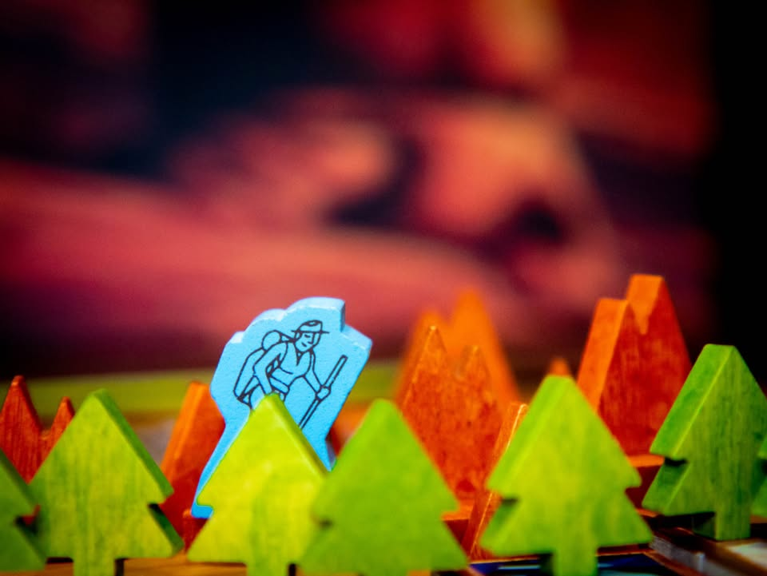
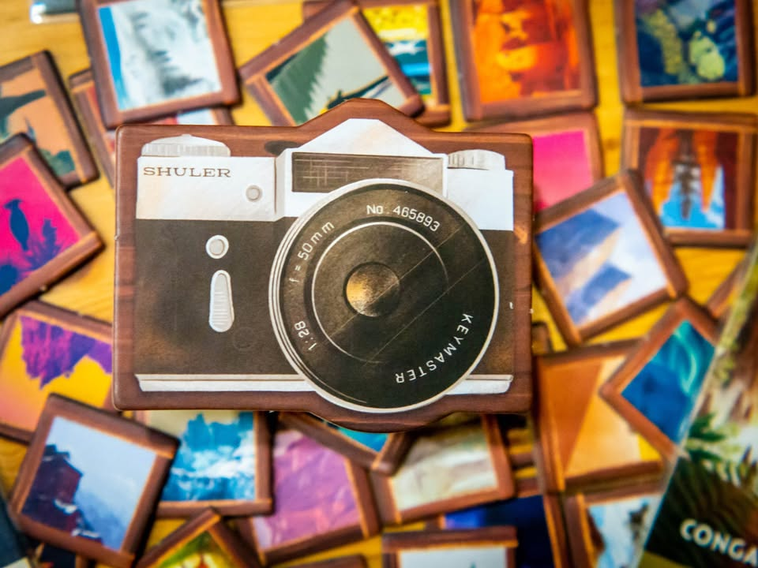
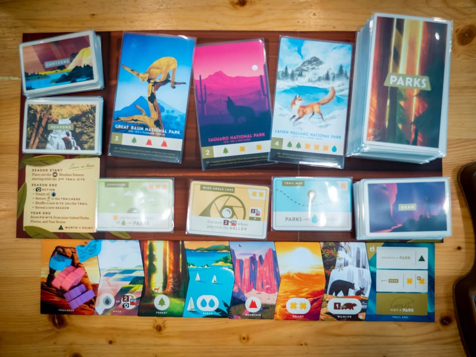
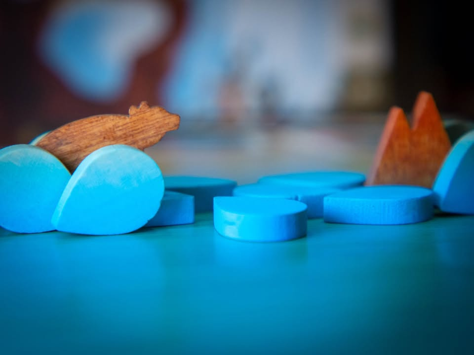
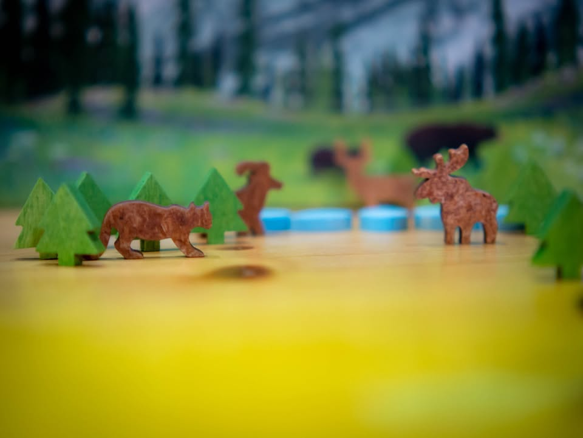
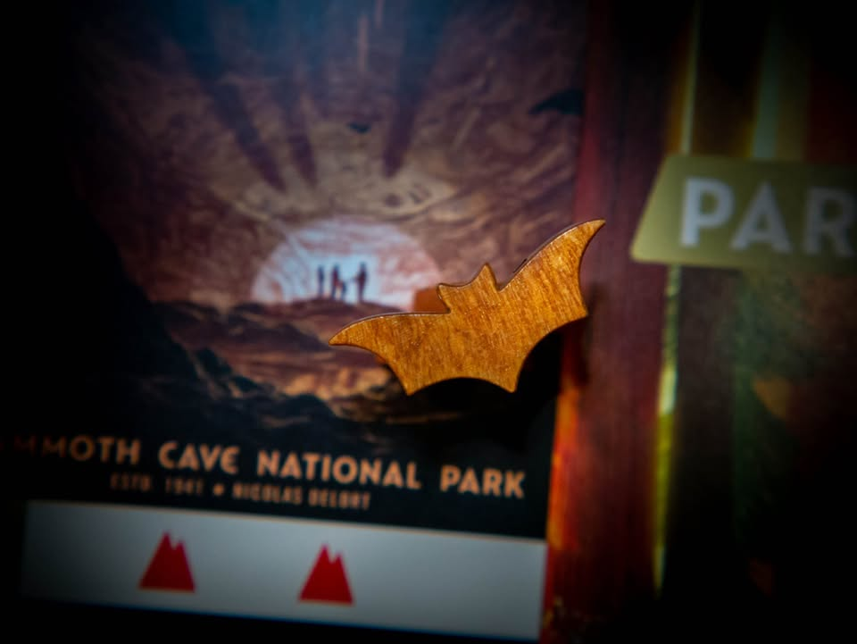
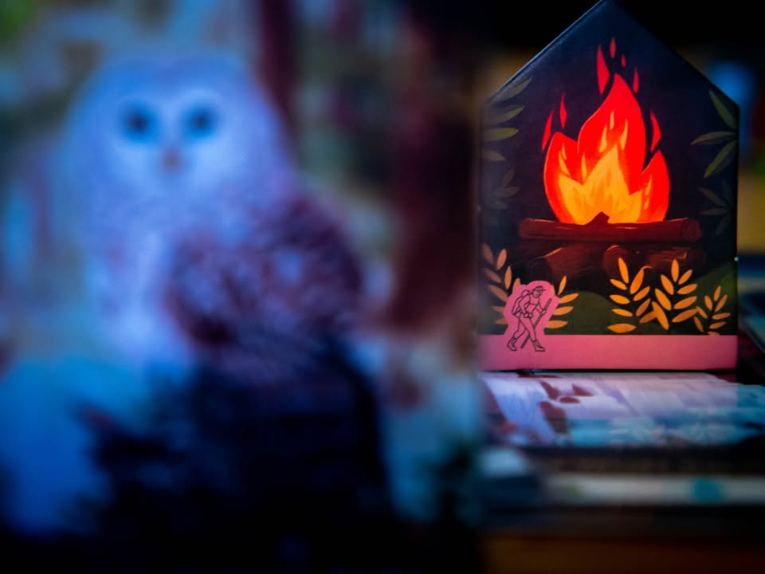

Parks #bite_size
blog link:  https_://wp.me/p7TSgy-2Ug
.
▪️ เกมสวยใสเบาสบายที่ให้เราเล่นเป็นนักท่องเที่ยวที่จะเดินแวะชมอุทยานแห่งชาติของอเมริกา ผลงานของ Henry Audubon (Space Park)
.
.
▪️ ข้อดีมากของเกมนี้คือสวย สวยแม่งทุกอย่าง กล่องสวย ภาพสวย โทเคนสวย ธีมสวย ระบบการเล่นก็ง่ายและสวย (จากรสนิยมผมแล้ว ใน slot ใกล้เคียงกันผมน่าจะกางเกมนี้แทน Wingspans 'ทุกครั้ง') ตานึงๆเราก็ควบคุมนักท่องเที่ยวสองคนเดินเป็นเส้นตรงแวะจอดชมธรรมชาติแล้วเก็บโทเคนทรัพยากร ซึ่งโทเคนก็สะสมเอาไว้เคลมการ์ดทิวทัศน์ตอนจบการเดินทาง เดินวนๆสี่รอบก็จบเกม
.
.
▪️ ระหว่างทางเกมจะมีกิมมิคการ์ดเล็กๆน้อยๆช่วยการแปลงของ หรืออุปกรณ์ที่ช่วยเพิ่มความสามารถให้กับเรา แต่โดยรวมมันก็คือเกมเดินหยิบของไปแลกธรรมดาๆเนี่ยล่ะ ที่ไม่ธรรมดาคือความสวยงามในการเล่าเรื่อง เล่นแล้วมีกลิ่นว่าได้เดินทางท่องเที่ยวแวะถ่ายรูปดี (มีแอคชั่นให้กดถ่ายรูปแล้วเราได้หยิบไทล์ภาพด้วย เป็นเรื่องเล็กๆแต่ช่วยเล่าเรื่องดีมาก) เป็นเกมที่ใช้ประโยชน์จากงานศิลป์, ธีม และอุปกรณ์เอามารวมกับกลไกเกมได้เต็มประสิทธิภาพมากเกมหนึ่ง
.
.
▪️ ถ้ามาสไตล์ครอบครัวสองถึงสามคนแล้วอยากเล่นอะไรสวยใสกระชับความสัมพันธ์เกมนี้แนะนำมาก แต่อย่าเล่น 5 คนเพราะมันจะกลายเป็นเกมอึดอัดที่ไปเล่นเกมอื่นสนุกกว่าเยอะ ก็แน่นอนว่าเป็นเกมเบากว่ารสนิยมปกติของผมไปหลายขั้นน่าจะแทบไม่ได้หยิบมาเล่น แต่ถ้าให้เลือกเกมเบาไว้ติดบ้านรับแขกเกมนี้อยู่ในอันดับต้นๆของผมแน่นอน
.
.
▪️ ข้อน่ารำคาญสำหรับตลาดบ้านเราน่าจะมีแค่ ใส่ซองแล้วใส่กลับลงกล่องไม่ได้...... ซึ่งก็ถือว่าน่าหงุดหงิดเหมือนกันนะ
.
.
▪️ อนึ่ง set นี้จัดฉากถ่ายในร้านตอนกลางคืน เพราะว่างมากไปนิดมาถึงไม่มีคนเล่นด้วยเลยไม่มีรูปตอนเล่นเกม  ยังดีมีกล้องติดไปเลยหยิบเกมเค้ามารื้อถ่ายรูปแม่ม โชคดีที่ร้านไฟค่อนข้างสว่าง (Panasonic G7 + Yi 42.5mm)
.
--------------------------------
หมวด Bite Size (พอดีคำ) นี้กะว่าจะเขียนอะไรสั้นๆประมาณนี้ล่ะกัน ใหม่บ้าง ซ้ำบ้าง เกมที่ขี้เกียจเขียนบ้าง เขียนๆไว้ก่อนเผื่อมีอารมณ์อาจจะขยายไปลง Thought บ้าง จริงๆอยากเขียนสั้นกว่านี้ แต่ยังอดไม่ได้ที่จะต้องอธิบายอะไรเพิ่มตามนิสัย เดี๋ยวค่อยๆปรับไปล่ะกัน

