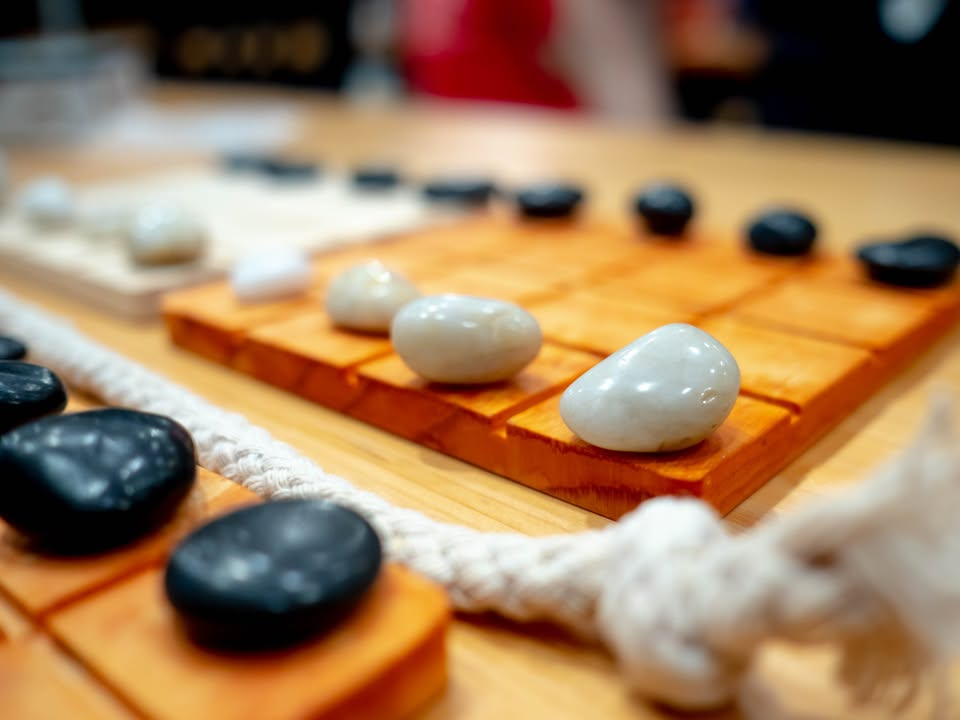

SHOBU #bite_size
.
▪️เกม abstract สำหรับสองคนที่มีเป้าหมายคือเราต้องผลักหินของอีกฝ่ายให้ตกลงไปให้หมดจากกระดานใดกระดานหนึ่งในสี่กระดาน กติกาตอนขยับคือเราต้องขยับบอร์ดหนึ่งก่อนแต่บอร์ดแรกห้ามผลักใคร จากนั้นค่อยไปขยับอีกบอร์ดในทิศทางแบบเดียวกันแต่รอบนี้ผลักได้ ตอนแรกเหมือนเกมจะง่ายแต่ตอนหลังๆคุณจะพบว่าถ้าไม่คิดไว้ล่วงหน้าเยอะหน่อยคุณจะขยับกระดานแรกดีๆเพื่อใช้กระดานสองไปในทางที่ต้องการไม่ได้
.
.
▪️ตรงนี้เรียกว่าออกแนวคุยกันเล่นๆล่ะกัน ผมคิดว่า mindset สำคัญคือคุณไม่ได้จ่ายเงินซื้อเกมครับ แต่คุณจ่ายซื้องานศิลป์ มู๊ดเดียวกับฝรั่งซื้อของเล่นไม้ตามตลาดกลางคืนน่ะ แต่ดูมีคลาสกว่า เกมนี้ถ้าเอาไปวางโชว์ในห้องพักแล้วก็ขายตามเรียวกัง (โรงแรมสไตล์ญี่ปุ่น) หรือร้านไฮโซในนิวยอร์คนี้รับรองเด็ด การจัดวางตารางให้ห่างกัน เส้นเชือกที่แสดงถึงวัฒนธรรมการแบ่งเขตแดนแบบญี่ปุ่น คุณไปซื้อถาดไม้อีกอันแล้วโรยทรายสีเทารองพื้นต่อนี้คืองาม
.
.
▪️แต่ถ้าจะซื้อในฐานะคนเล่นเกมไปซื้อเกมนี้ ผมแนะนำให้ DIY น่าจะดีกว่า เหมือนปกติแล้วคุณไม่ซื้อชุดหมากฮอสมาเล่นแต่หยิบเอาอะไรแถวนั้นมาเล่นบนโต๊ะม้าหินน่ะ แต่ถ้าอยากได้อะไรที่ดูศิลป์หน่อยอันนี้ก็โอเคเช่นกัน คือหินเกมนี้มันหินแม่น้ำ แบบที่คุณไปเดินซื้อตามร้านต้นไม้กิโลล่ะไม่ถึงร้อยนั้นแหละ แต่เกมนี้เค้าขัดทำความสะอาดขึ้นเงามาให้แล้ว (ซึ่งก็ไม่ได้ช่วยให้การเปรียบเทียบเชิงวัสดุดีขึ้นเท่าไร)
.
.
▪️ สรุปก็เป็นเกม กติกาเข้าใจง่าย เกมใช้ความคิด ของสวยดี แต่ราคาอาจจะรู้สึกแปลกๆนิดนึงตามสไตล์ของเซนๆ
.
--------------------------------
หมวด Bite Size (พอดีคำ) นี้กะว่าจะเขียนอะไรสั้นๆประมาณนี้ล่ะกัน ใหม่บ้าง ซ้ำบ้าง เกมที่ขี้เกียจเขียนบ้าง เขียนๆไว้ก่อนเผื่อมีอารมณ์อาจจะขยายไปลง Thought บ้าง จริงๆอยากเขียนสั้นกว่านี้ แต่ยังอดไม่ได้ที่จะต้องอธิบายอะไรเพิ่มตามนิสัย เดี๋ยวค่อยๆปรับไปล่ะกัน

