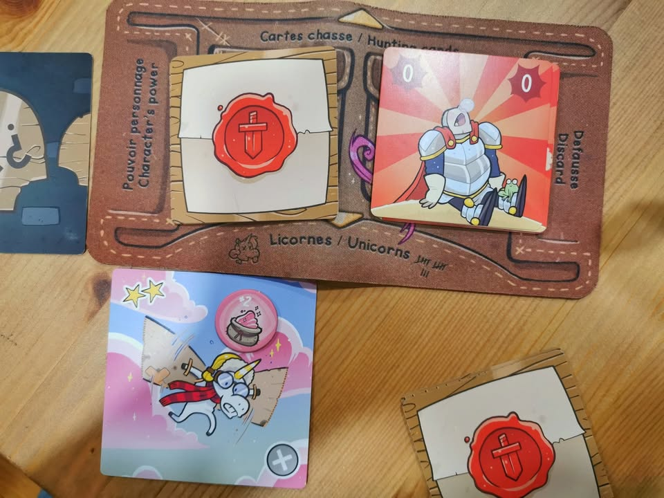

🔥My Hall of Flame, Be BURNED (2020-07) #bite_size
.
.
▪️ คืองี้ หนึ่งในความไม่ชอบเป็นการส่วนตัวของผมคือเกมที่ complexity นำหน้า depth ไปไกล แต่ดันไม่มีอะไรกลับมา  (พูดอีกอย่างว่าจะซับซ้อนไปทำไมถ้าเกมมันจะมีแค่นี้)  มีข้อยกเว้นไม่กี่เกมที่ชอบด้วยเหตุผลบางอย่าง ซึ่งมักจะเป็นเกมของ Phil Eklund อย่าง Bios:Genesis งี้ เกมโคตรแห่งความไม่มีเหี้ยไรเลย ทอยเต๋าโง่ๆ ดวงโคตรๆ กติกาเขียนอย่างกาก แต่เล่นแล้วชอบเฉย ซึ่งน่าจะเป็นเพราะการยัดความรู้แบบที่เราไม่ได้สนใจซักกะนิดใส่มาแบบไม่ยั้ง เรียกได้ว่ามีเกมน้อยมากที่เอาเรื่องนอกเกมมายัดไปกับเกมแล้วอินได้ (อาร์นี้สินะพลังของความเป็นติ่ง.....)
.
.
▪️ ก็เป็นการเล่าสู่ความรู้สึกตัวผมเองให้ฟังเฉยๆนะครับ อย่าไปจริงจังกับคำผมมาก เพราะคุณอ่านแล้วอาจจะ อ่ะ! น่าเล่นจริง! ก็ได้ YMMV ครับ :)
.
.
🐙  Oceans - เกมให้เราทำการสร้างและวิวัฒนาการสิ่งมีชีวิตใต้ทะเลสมัยโบราณ เป้าหมายคือการดำรงเผ่าพันธ์ให้นานที่สุดก่อนที่จะมานับคะแนนกัน ไอเดียมีแค่ตานึงเล่นการ์ดเพื่อให้มันเป็นสปีชีส์ใหม่ หรือจะเอาแค่ความสามารถไปเสริมพลังสปีชีส์ที่เรามีอยู่แล้วก็ได้ .... 
.
.
▪️ ระหว่างนั้นเราก็จะสั่งให้สปีชีส์เราไปกินปลาในทะเลหรือจะไปกินคนอื่นเพื่อเพิ่มประชากร จบรอบก็กลายร่างตัวเองเป็นฟอลซิลจะได้แต้มวนไปเรื่อยๆ ก็จบเกม
.
.
▪️ ข้อดี flow เกมเข้าใจง่าย รูปสวยมาก การ์ดเบสิคมีประมาณนึงแต่การ์ดท่ายาก (เกมเรียก deep card) ที่มีไม่ซ้ำกันเลยนี้ก็โคตรเยอะ แต่ละเกมมีความหลายหลายเยอะก็จาก deep card เนี่ยล่ะออกสัตว์พิลึกๆออกมาได้ตลอด จั่ว-แปลงร่าง-กิน-กลายร่างเป็นแต้ม ในแง่ engine building ก็ถือว่าดี
.
.
🔥 ส่วนที่ผมไม่ชอบในเกมนี้ ได้แก่ นาน...... นานเหี้ยๆ พอคนอื่นเล่นก็จะมีการ์ดแบบ โอ๊ะ! โจ๊ต-โตะ-มัต-เตะะะะะะะะะะ นายเป็นปลาฉลามกินแล้วฉันได้ทำ xxx อีกคนก็จะบอกเห้ยๆฉันก็มีๆ แล้วก็ต้องมาสะดุด สะดุด flow การเล่น การ์ด deep ก็ด้วยความที่มันไม่ซ้ำเลยต้องอ่าน อ่าน อ่าน อ่าน ดึงเวลาและจังหวะเกมไปอีก คือมันควรจะเอาเวลามามองเกมสร้างสัตว์น้ำอ่ะ ไม่ใช่อะไรแบบนี้ อารมณ์เกมประมาณนี้โดนกระตุกแบบนี้ มันไม่สมูท ไม่งดงาม ไม่ชอบเลย
.
.
🔥 รวมๆคือทำเกมง่ายให้เป็นเกมยากแต่ยากแล้วก็งงว่าจะทำให้ยากไปทำไม ทำไอคอนง่ายๆตีความไวๆ หรือเป็น tech tree ก็ได้ถ้าการ์ดเบสิคมันจะซ้ำซ้อนซ้ำซากขนาดนี้ 
.
.
.
.
.
🦄  Kill The Unicorns - เกมปาร์ตี้เน้นเอาฮา (ต้องขอย้ำก่อนว่าเพื่อนผมชอบและสนุกกับมันหลายคน การไม่ชอบนี้ความรู้สึกของผมเฉยๆ) ไอเดียคือเราเป็นผู้กล้าแฟนตาซีจะไปล่ายูนิคอร์นหลากสี ก็เป็นเกม set collection เก็บสีจัดชุดนั้นแหละ
.
.
▪️ เปิดรอบมาจะมียูนิคอร์นในตลาดสี่ตัว รอบจะเริ่มโดยให้แต่ล่ะคนวางการ์ดแผนการลับไปตรงยูนิคอร์นในตลาดได้ด้วย คือคนที่ชนะได้ยูนิคอร์นไปก็จะต้องหยิบการ์ดแผนการเราไปด้วย ซึ่งก็มีทั้งใบที่เป็นกับดักทำให้เสียแต้ม หรือใบดีๆที่ทำให้มูลค่าเพิ่มมากขึ้นก็ได้
.
.
▪️ ผู้เล่นแต่ล่ะคนจะมีการ์ดตัวเลขในมือและร่วมประมูลยูนิคอร์นทีละตัว มีกิมมิคนิดหน่อยตรงคนเปิดจะประกาศว่าจะต้องเล่นกี่ใบ คนที่เหลือถ้าการ์ดไม่พอก็อดล่า รวมเลขมาเปิดพร้อมกันใครเยอะสุดได้ม้าไป แต่ถ้าเปิดแล้วเลขชนกัน (ซึ่งการันตีว่าบ่อยเพราะเลขมีแค่ 0-1-2-3) ก็ให้ถือว่าไม่สำเร็จต้องให้คนต่อไปจัดการ กับแต่ละตัวก็มีสกิลติดตัว แล้วก็มีการสุ่มร้านค้าในเกมที่เราต้องเอาการ์ดไปแลก ซึ่งก็จะช่วยให้เราทำแต้มได้มากขึ้น
.
.
▪️ คือฟังแล้วมันก็น่าสนุกแหละ ข้อดีคือมันก็คือลุ้นๆดี ลุ้นตั้งแต่ลงการ์ดยันลุ้นว่าเพื่อนมันจะหยิบการ์ดที่เราวางยาไว้ไหมนะ ก็หัวเราะคิกคักกันไป
.
.
🔥 ที่ไม่ชอบหลักๆน่าจะเพราะไม่ชอบเกม double guessing อยู่แล้วด้วย (ไอ้แนวๆเปิดพร้อมกันเนี่ยล่ะ) ไม่ชอบระบบที่ reward คนหลบเลี่ยงคนอื่นสำเร็จแบบนี้เท่าไร ฟังอธิบายยาวเหยียด แต่เล่นจริงๆแล้ว 'ไม่คลิก' อย่างรุนแรง อยากจะฮาไปด้วยกันก็ฮาไม่ออก มัน take that ในแบบที่อิหยั่งว่ะ ไม่ชอบเกมแบบที่หลอกให้เหมือนได้คิดแต่จริงๆแล้วควบคุมอะไรไม่ได้เลย เกมเล่นสามรอบซึ่งนานเกินไปเยอะมากๆสำหรับเกมปาร์ตี้ที่ผมรู้สึกโอเคที่จะเล่นด้วย 
.
.
🔥 แต่ถ้าเอาไปเล่นกับวงพร้อมเกรียนแล้วไม่งอแงเรื่องภาษาก็น่าจะโอเคนะ กับมีความ master mind หน่อยๆ ถ้ามาสายปาร์ตี้ล้วนก็อาจะจะกร่อยเหมือนกัน

--------------------------------
หมวด Bite Size (พอดีคำ) นี้กะว่าจะเขียนอะไรสั้นๆประมาณนี้ล่ะกัน ใหม่บ้าง ซ้ำบ้าง เกมที่ขี้เกียจเขียนบ้าง เขียนๆไว้ก่อนเผื่อมีอารมณ์อาจจะขยายไปลง Thought บ้าง จริงๆอยากเขียนสั้นกว่านี้ แต่ยังอดไม่ได้ที่จะต้องอธิบายอะไรเพิ่มตามนิสัย เดี๋ยวค่อยๆปรับไปล่ะกัน

