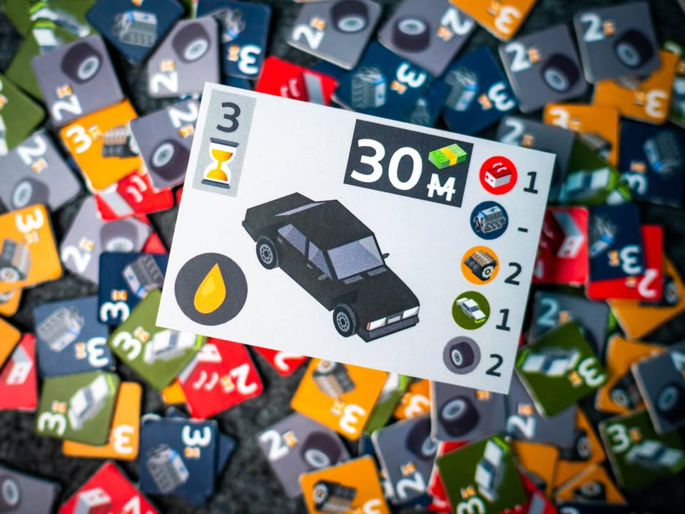
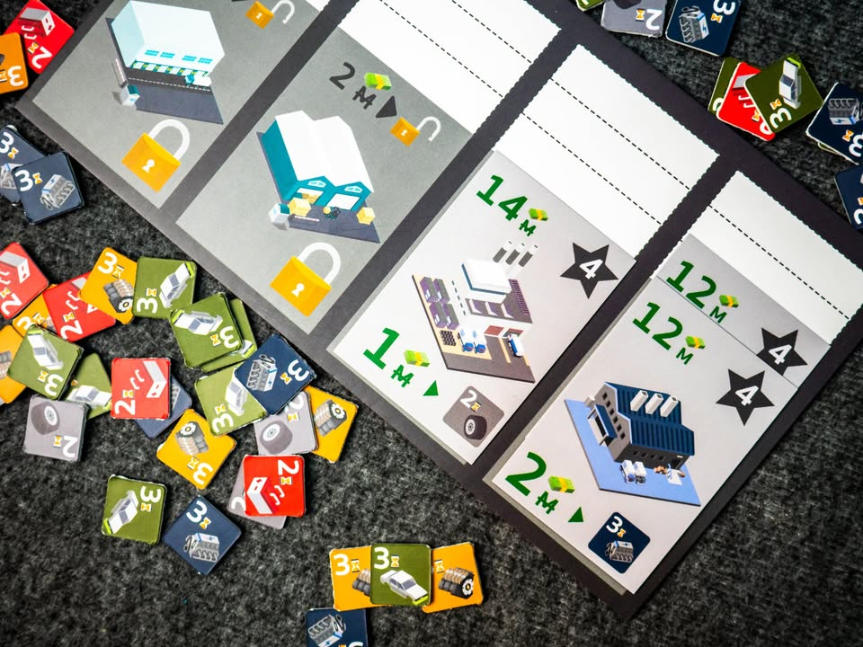
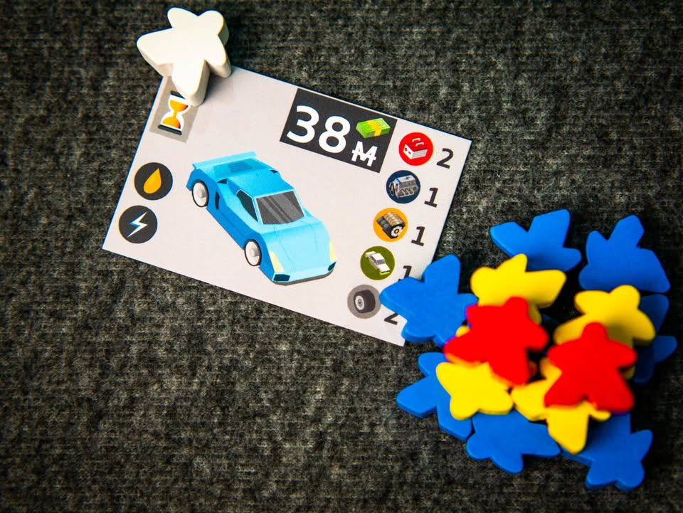
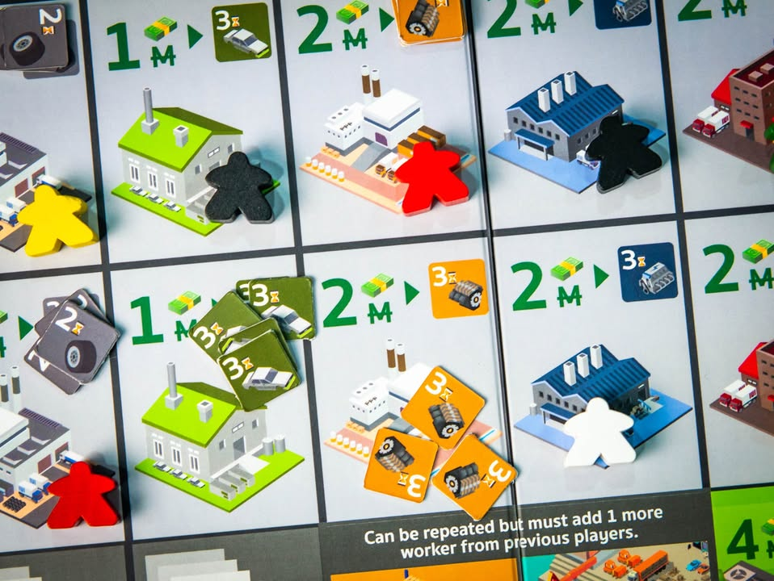
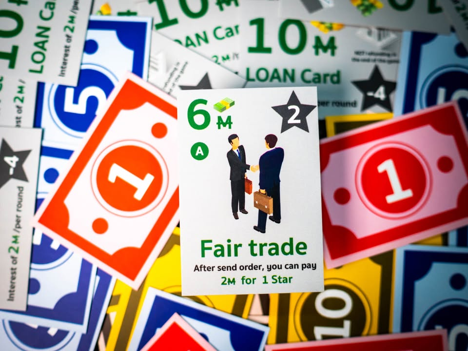
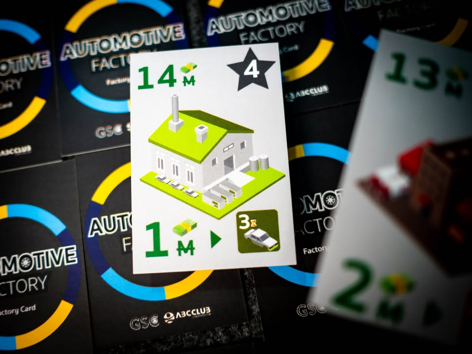
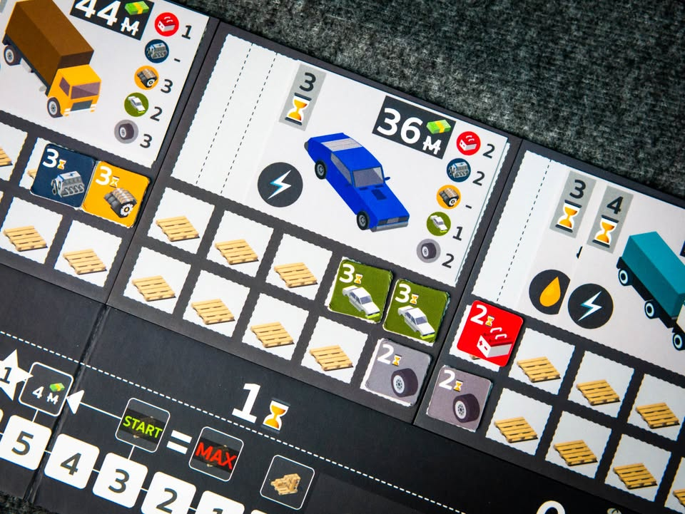
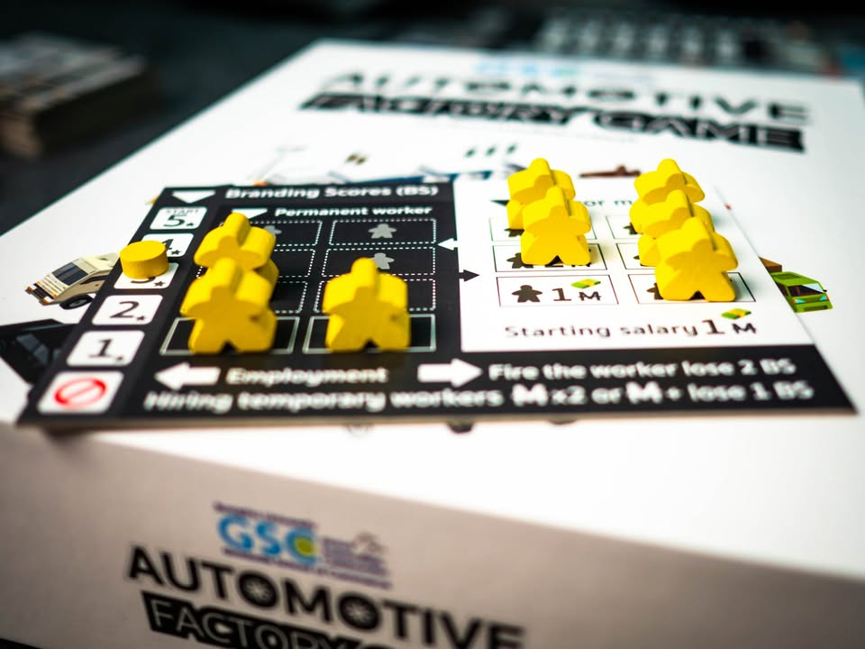

Automotive Factory Game #thought
blog link: https_://wp.me/p7TSgy-2UE
.
▪️ ผมเคยเล่นเกมนี้หนึ่งครั้งราวหนึ่งปีก่อน ตอนที่ยังเป็นตัวทดสอบ แต่รอบนี้กลายเป็นฉบับปรับปรุงที่ส่งขายแล้ว ตัวเกมเป็นสไตล์ยูโรระดับกลางเบาที่จะให้เรามาบริหารจัดการซัพพลายสินค้าเพื่อป้อนแก่ความต้องการของตลาดยานยนต์ พัฒนาโดยทีม Game Lab Thailand
.
.
▪️ ไอเดียหลักของเกมจะใช้ระบบ Worker Placement แบบผลัดกันนำคนงานไปหยิบชิ้นส่วนยานยนต์มีทั้งแบบไปสั่งผลิตโดยการส่งคนงานไปบอร์ดกลางและทั้งผลิตในโรงงานตัวเองที่เราลงทุนไปสร้างมา จากนั้นก็ทำการส่งมอบงานตามใบออเดอร์ที่เรารับเอาไว้
.
.
▪️ กุญแจหลักของเกมนี้ระบบการบริหารเวลาที่ตัวสินค้าและคำสั่งซื้อจะมีกำหนดรอบว่าหากเลยรอบที่กำหนดไว้นอกจากของจะหายไปแล้วเรายังจะต้องเสียค่าปรับเป็นเงินและแต้มด้วย ทำให้เลเยอร์การตัดสินนอกจากความคุ้มค่าแล้วยังต้องดูด้วยว่าสามารถทำสำเร็จได้จริงไหมเพราะไม่สามารถผลิตมาทิ้งขว้างได้ กิมมิคที่เกมนี้นำเสนอคือการที่บอร์ดถูกแบ่งออกเป็นหลายส่วนและสามารถเลื่อนเพื่อเปลี่ยนเวลาได้ทันที ทำให้ไม่ต้องเสียเวลาเลื่อนทีล่ะชิ้นให้ยุ่งยาก
.
.
▪️ ตัวบอร์ดจะเหมือนกันไปตลอดทั้งเกม ดังนั้นกลไกที่นำเสนอความไม่แน่นอนในแต่ละรอบนอกจากการสุ่มออเดอร์ก็คือการสุ่มปิดช่องแอคชั่น ด้วยความที่เราไม่รู้แน่นอนว่าช่องไหนจะมีจำนวนลดลง เนื่องจากช่องแอคชั่นมีจำนวนน้อยผู้เล่นอาจจะต้องระวังเหตุการณ์ไม่คาดฝันอย่างโรงงานปิดหมดปิดออเดอร์ไม่ได้บ้าง แต่ตัวเกมมีช่องสั่งของแพงกับสามารถลงช่องตลาดกลางเพื่อแลกเปลี่ยนสินค้าด้วย 
.
.
▪️ ทั้งเกมเราก็จะวนอยู่กับการรับออเดอร์, ผลิตสินค้า, จ่ายค่าจ้างคนงาน ไปเรื่อยๆจนจบเกม
.
.
-----------------------------------------
📌 เนื่องจากเกมนี้ผมรู้สึกว่ามันยังคงทำมาเพื่อตอบสนองโจทย์ที่มีกรอบเข้มงวดและแตกต่างออกไปจากความบันเทิงสไตล์เกมตามปกติ ขอไม่ลงเรทความเข้ากันได้กับตัวเองนะครับ ซึ่งจริงๆก็แอบเขียนยากเหมือนกัน เพราะจากกรอบของความเป็นเกมแล้วมีหลายจุดที่คิดว่าน่าคุย แต่ก็ไม่อยากเขียนแบบไหลยาวนัก
-----------------------------------------
.
.
👁‍🗨 จุดกลางๆในเชิงเกมคือเกมมันค่อนข้างแห้งเล่นแล้วไม่รู้สึกถึงธีม (คาดว่าเป็นผลจากที่รากการออกแบบเป็นงานเพื่อเอาไปใช้ประกอบการเรียนการสอน) ผลิตของส่งตามออเดอร์แล้วไม่รู้สึกว่าได้ผลิตยานยนต์สำเร็จ การ์ดความสามารถไม่ทรงพลัง การโชว์ความเจ๋งของโรงงานเราไม่มี อารมณ์ก็เลยจะแนวหุ่นยนต์หยิบของตามหน้างาน และด้วยความที่เกมไม่มี objective หรือ mission ให้เคลม แผนการเล่นในเกมนี้จึงอยู่ที่การจัดการแผนระยะสั้นจากการโดนสุ่มปิดช่องแอคชั่น พร้อมๆกับหาทางปิดออเดอร์ที่รับมาให้ได้ในระยะกลาง
.
.
🔸 จุดที่ผมไม่ชอบนักน่าจะเป็นความรู้สึกทั้งเกมที่ไม่มี sense of progress หรือระหว่างเล่นเราไม่ได้เก่งขึ้นเลย การ์ดแหกกฎที่มีนั้นเบาเกินไป กลายเป็นเกมวนเก็บของทีละชิ้น หยิบออเดอร์ทีล่ะใบไปเรื่อยๆ การ์ดโรงงานที่มีให้ซื้อเพิ่มดันมีราคาและหน้าตาเหมือนกับบอร์ดกลาง (แต่มีแต้มให้) สามารถซื้อมาซ้ำเพื่อทำให้ผลิตได้มากขึ้น แต่ว่าการจะอัพเกรดได้ไหมมันอยู่ที่ดวงว่าจะจั่วได้ใบซ้ำไหม ตรงนี้ส่วนตัวคิดว่าถ้าทำออกมาเป็น tech tree แล้วอัพเกรดขีดความสามารถเองได้ หรือว่าการ์ดโรงงานมันมีความอื้อหือ อ้าหา โกงมากน่าซื้อจริงๆ อะไรแบบนั้นผมน่าจะชอบมากกว่า
.
.
🔸 จุดที่มีปัญหาคือคู่มือในกล่องเรียบเรียงค่อนข้างตกหล่นพิมพ์ผิดหลายจุด การจัดหน้าฝืนใช้ paragraph alignment แบบให้ย่อหน้าเท่ากันนั้นกลายเป็นว่าเกิดการเว้นคำที่ชวนให้ตีความผิดหลายที่ การอธิบายหลายส่วนที่ค่อนข้างคลุมเครือและไม่ได้บอกส่วนที่จำเป็น ตรงไหนลงคนงานซ้ำได้  ตรงไหนไม่ได้นั้นอธิบายไม่ครบทุกจุด (ตลาดไม่ได้บอกว่าต้องลงช่องไหน ลงซ้ำได้หรือปล่าว ต้องเพิ่มคนงานไหม) ทำให้ต้องใช้ทักษะ 'บอร์ดเกมเมอร์' ในการเติมเต็มส่วนที่ขาดเอาเอง จุดที่มีปัญหามากน่าจะเป็นการอธิบายคีย์ของเกมอย่างอายุสินค้าและออเดอร์นั้นอธิบายน้อยมาก การ์ดปิดช่องแอคชั่นก็ขาดการอธิบายที่จำเป็นอย่าง 'ให้นำไปปิดตรงตามรูป' ก็ไม่มี 
.
.
🔸 ตรงนี้คิดว่าถ้าผมไม่เคย playtest มาก่อนน่าจะงงกว่านี้ เพราะอ่านแล้วการใช้คำเรียกอุปกรณ์ไม่ตรงกันหลายครั้ง (โดยเฉพาะแผ่นเวลา) 'คนงานชั่วคราว' เองก็ไม่ทราบว่าโผล่มาจากไหน ทำให้เกิดความสับสนพอควร หวังเป็นอย่างยิ่งว่าจะมีฉบับปรับปรุงให้ download โดยไว
.
.
🔹 แต่ตอนติดต่อสอบถามทีมงานก็ได้รับคำตอบรวดเร็วดี ต้องขอบคุณที่ช่วยเคลียร์ในหลายๆจุดที่สงสัยครับ
.
.
👁‍🗨 ในแง่ความคุ้มค่านั้นค่อนข้าง subjective ขอข้ามไป (เพราะมีตัวแปรด้านจำนวนพิมพ์ที่น้อย ถือว่าเป็นเกมบูติก) แต่ในแง่คุณภาพวัสดุถ้าอิงว่าทำโรงงานไทยผมคิดว่าทำออกมาจับแล้วรู้สึกว่าดีนะ กระดาษแข็งแบบจั่วปังหนาที่คนเล่นบอร์ดเกมจะชวนให้นึกถึง PnP แบบงานเนียบหน่อยๆ (อารมณ์โดยรวมน่าจะประมาณสั่ง thegamecrafter.com ทำ on demand print) ซึ่งไม่ใช่ข้อเสีย แค่วัสดุไม่คุ้นเคยเฉยๆ 
.
.
🔸 แต่ที่ไม่ถูกใจเลยคือ token สินค้า ในแง่การตัดขอบไม่สวยหลายอันแต่อยู่ในระดับยอมรับได้ถ้านึกถึงวิธีที่ใช้ผลิตแล้ว แต่ที่หงุดหงิดมาก (มากๆ) คือทำมาด้านเดียว! อีกด้านเป็นสีเรียบมาเลย แล้วกูจะต้องมาพลิกกลับหน้าหลังหาของที่จะใช้เพื่อ?! คือมันมี unspoken-rule อย่างหนึ่งของเกมกระดานคือของที่มีด้านเดียวคือเอาไว้ซ่อนนะฮะ เป็นข้อติเล็กๆแต่ก็มีผลให้หงุดหงิดเล็กๆตลอดเกม เพราะต้องหยิบใช้บ่อย 
.
.
🔸 พอพูดถึงหยิบใช้บ่อย ปัญหาที่รู้สึกเกี่ยวกับเกมนี้คือ เราแทบไม่ได้ใช้ศักยภาพในการเก็บของเลย เนื่องจากสินค้ามีอายุที่หมดไว การหยิบการ์ดออเดอร์ทำได้อย่างยากเย็น และต่อเนื่องจากที่ไม่ค่อยคลิกด้านบนคือ โรงงานของผู้เล่นนั้นไม่สามารถผลิตของได้อย่างมีประสิทธิภาพ (ของจะเหลือไปขายในตลาดยังไม่มีเลย) 
.
.
💬 โดยรวมผมคิดว่ามันเป็นเกมเบาที่ก็ตรงไปตรงมา มีส่วนลูกเล่นเรื่องเวลาของชิ้นส่วนและออเดอร์ เพียงแต่มันระมัดระวังตัวที่จะไม่ข้ามเส้นบางอย่างเกินไปจนขาดสีสัน เชื่อว่าถ้าออกตัวเสริมที่ถอนหมุดยึดความจริงจังจนเกินไปแบบที่เป็นอยู่น่าจะต่อยอดให้กลายเป็นเกมที่สนุกได้มากกว่านี้ เพราะโครงสร้างพื้นฐานมันพร้อมอยู่แล้ว 
.
.
📌 disclaimer : ทางผู้ผลิตได้ส่งตัวเกมมาให้ผมทดสอบ ผมไม่ได้รับสิ่งตอบแทนในรูปตัวเงินและมีข้อตกลงเพียงอย่างเดียวคือผมจะเขียนความเห็นจากมุมมองและประสบการณ์จริงของตัวเอง

