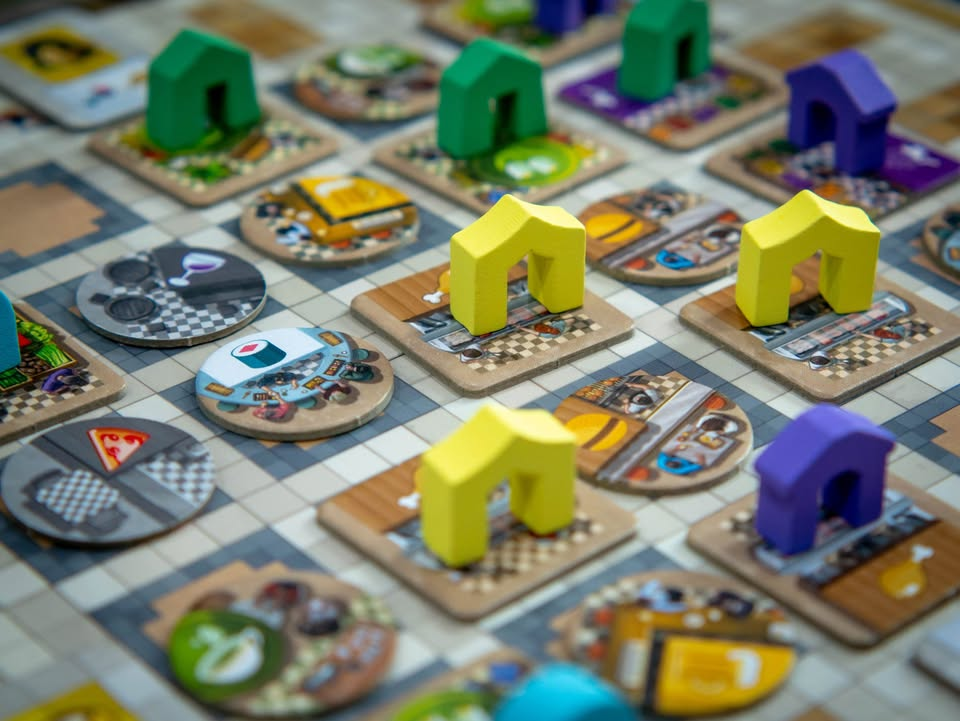
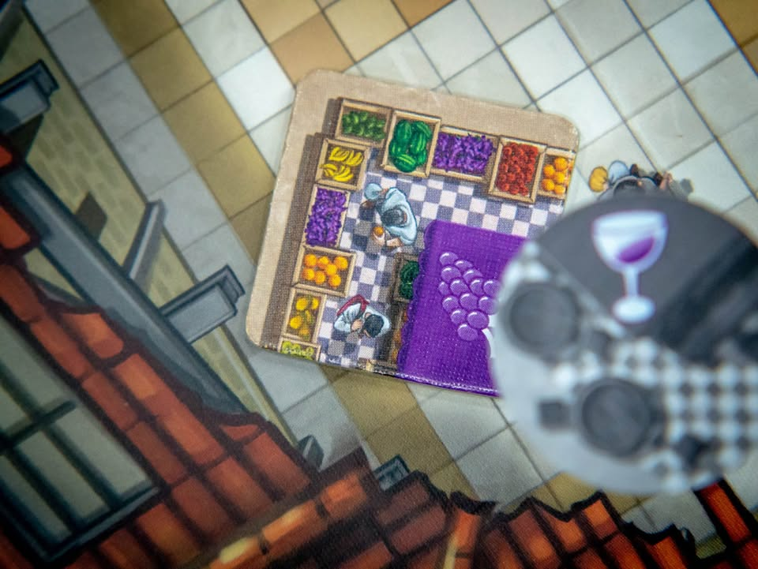
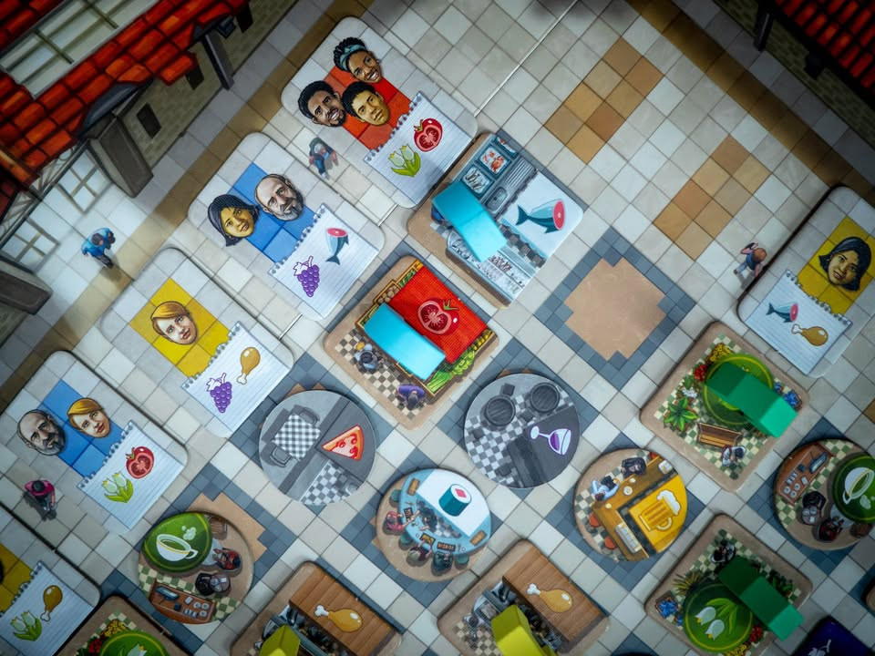
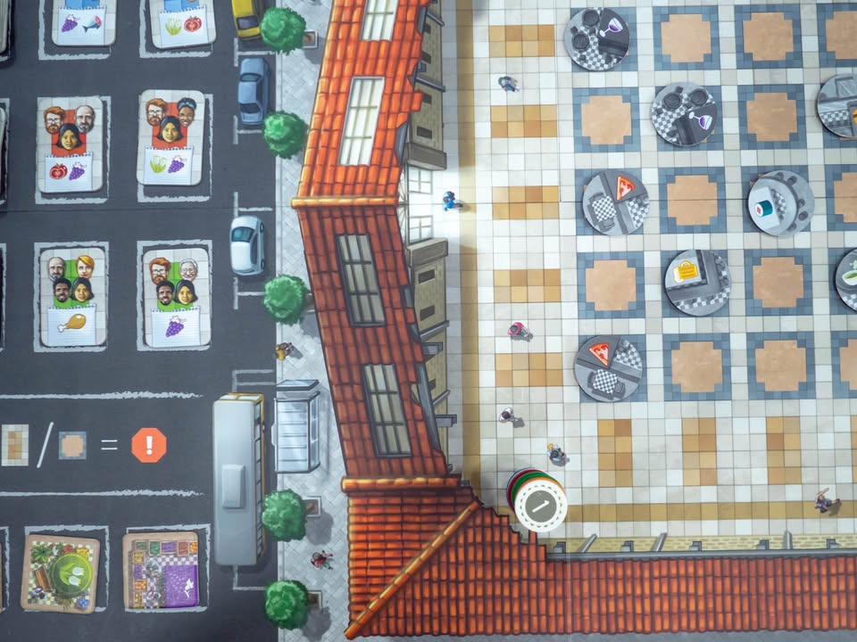
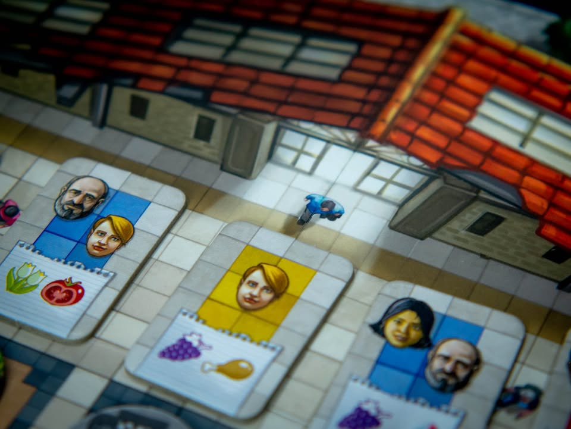

Mercado de Lisboa #first_impression #bite_size
.
--------------------------------
📌 ตัวในรูปนี้เป็น demo production copy (น่าจะแตกต่างจากของที่ขายไม่มาก) ที่ publisher เจ้าหนึ่งเอามาให้ลองเล่น (ขออนุญาตในการนำรูปมาลงแล้ว แต่ขอสงวนชื่อ publisher ) และตัวเกมกำลังจะมีการ KS ในวันที่ 3 เดือน 9 นี้ และข้อเขียนนี้ไม่ใช่การโฆษณา แต่เป็นการเขียนแสดงความรู้สึกที่ได้เล่นตามปกติ
--------------------------------
.
▪️ เกมสไตล์ Thinky-filler (เกมใช้เวลาในการเล่นไม่นาน แต่ต้องใช้ความคิดในการเล่นที่อาจจะมากกว่าระดับปกติ - ในอีกแง่ก็คือเกมขนมเล่นเพลินสำหรับคนเล่นเกมหนัก) จากนักออกแบบที่ขึ้นชื่อในสไตล์การออกแบบที่ค่อนข้างซับซ้อนอย่าง Vital Lacarda (Vinhos, Kanban, Lisoba) และ Julián Pombo ครั้งนี้เค้ากลับมาใน Lisboa เมืองหลวงของโปรตุเกสอีกครั้ง แต่มากับเกมเบาที่จะให้เรามาตั้งตลาดร้านค้าในเมืองแทน
.
.
▪️ ถ้าใครเคยเล่น Lisboa มาแล้วก็สรุปให้สั้นๆว่ามันยกระบบสร้างผังเมืองใน Lisboa นั้นแหละเอามาทำใหม่เป็น Standalone ตัดส่วนที่เกี่ยวโยงกันออกไปหมด
.
.
▪️ ไอเดียคือเกมจะมีตารางตลาดเปิดโล่งรอให้ผู้เล่นเลือกเอาระหว่างหยิบเอาไทล์ร้านค้าที่ตัวเองมีไปตั้งร้านในตลาด หรือเลือกหยิบไทล์ลูกค้ามาวางเดินตลาดเพื่อซื้อของ ด้วยธีมของร้านค้าที่แบ่งเป็นล๊อก ไทล์ลูกค้าที่จะมาเดินก็ต้องดูด้วยว่าในแถวนั้นมีร้านค้าตรงชนิดไหม และแถวที่มีร้านค้าเปิดเยอะก็จะดึงดูดลูกค้าได้กลุ่มใหญ่ขึ้น ซึ่งจะหมายถึงทำเงินได้มากขึ้นนั้นเอง ตามธีมก็แผงไหนมีร้านคนก็อยากมาเดิน
.
.
▪️ รูปแบบเกมก็มีแค่วางไทล์นั้นแหละ แต่ด้วยความที่เราอยากจะดึงลูกค้ากลุ่มใหญ่แล้วด้วยเงินและแอคชั่นเราไม่พอ เราก็ต้องเล็งดูว่าเพื่อนเค้าเปิดร้านตรงไหนก็ต้องไปเปิดร้านตาม (แต่แถวที่คนเปิดร้านเยอะค่าตั้งร้านก็แพงตาม) ตัวเกมไม่ถึงกับ semi-co-op แต่จะออกไปทางฉกฉวยโอกาสทำแต้มแบบขอเกาะกลุ่มมากกว่า ผลัดกันวางไทล์สองแบบนี้ไปมาจนตลาดเต็มก็จบเกม
.
.
▪️ ส่วนตัวใน first impression ผมค่อนข้างโอเคกับเกมนี้นะ โดยปกติผมจะชอบมองหาเกมพวก thinky filler แบบกฎน้อย แต่คิดแบบหัวหมุนเล็กๆมาเล่นเรื่อยๆประมาณหนึ่ง เอาไว้เล่นตอนคั่นเกมใหญ่ ( ตัวท๊อปในลิสต์นี้คือ red7 ) ในกรอบนี้เกมนี้ก็ถือว่าสอบผ่าน (แต่กล่องใหญ่ไปนิด) ผมชอบตรงที่มันเอาส่วนที่ผมคิดว่าทำได้ดีของ Lisboa อย่างการทำแต้มเวลาสร้างเมือง เอามาประยุกต์ใหม่แล้วให้ผู้เล่นโฟกัสอยู่กับแค่เรื่องเดียว
.
.
▪️ คือถ้าติดตามข้อเขียนผมมาก็จะทราบว่าผมเป็นคนไม่ชอบงานออกแบบหลายชิ้นของ Vital Lacarda เท่าไร เพราะมันมักจะเป็นเกมแบบ interlock สูงแล้วเอา mini game หลายอันมาผูกโยงด้วยกันอย่างแน่นหนา ซึ่งไม่ตรงจริตความคิดผมนัก (แต่ก็มีคนชอบสไตล์นั้นเยอะนะ) แต่เกม Mercado de Lisboa นี้คือเจาะเอา mini game เดียวแล้วมาขยายแต่งเติมให้สมบูรณ์อยู่ในตัว เลยค่อนข้างโอเค
.
.
▪️ จุดกลางๆก็จะด้วยความที่มันเป็น thinky filler เพราะฉะนั้นมันจะไม่ใช่เกมสไตล์มีท่าอะไรให้ลองหรือมีแผนระยะยาวต้องแก้ กับความที่เป็นเกมเบาคั่นเวลาก็เลยมีพลังในการดึงดูดในกางไม่เยอะนัก แต่จะเป็นแนวค่อยๆแก้ปัญหาหน้างานไปเรื่อยๆ ผมคิดว่าถ้าเป็นคนชอบเล่นเกม Vital ก็น่าจะชอบแหละ กลิ่นติดมาตรงนั้นตรงนี้หลายอย่าง แต่ที่เปลี่ยนไปคือโฟกัสอยู่แค่เรื่องเดียว ตัวเกมเองไม่ได้ยาก แต่ก็ไม่หลวมโพรก สามารถเอาไปกางเล่นกับกลุ่มยูโรระดับกลางเบาได้สบายๆ แต่ด้วยความที่มันมีลีลาการคิดแต้มที่แอบเหมือนจะง่ายแต่จริงๆยึกยักนิดนึงกลุ่ม family ก็อาจจะต้องเลือกวงซักนิด (แต่ผมก็ไม่คิดว่ามันยากไปนะ) 

--------------------------------
หมวด Bite Size (พอดีคำ) นี้กะว่าจะเขียนอะไรสั้นๆประมาณนี้ล่ะกัน ใหม่บ้าง ซ้ำบ้าง เกมที่ขี้เกียจเขียนบ้าง เขียนๆไว้ก่อนเผื่อมีอารมณ์อาจจะขยายไปลง Thought บ้าง จริงๆอยากเขียนสั้นกว่านี้ แต่ยังอดไม่ได้ที่จะต้องอธิบายอะไรเพิ่มตามนิสัย เดี๋ยวค่อยๆปรับไปล่ะกัน

