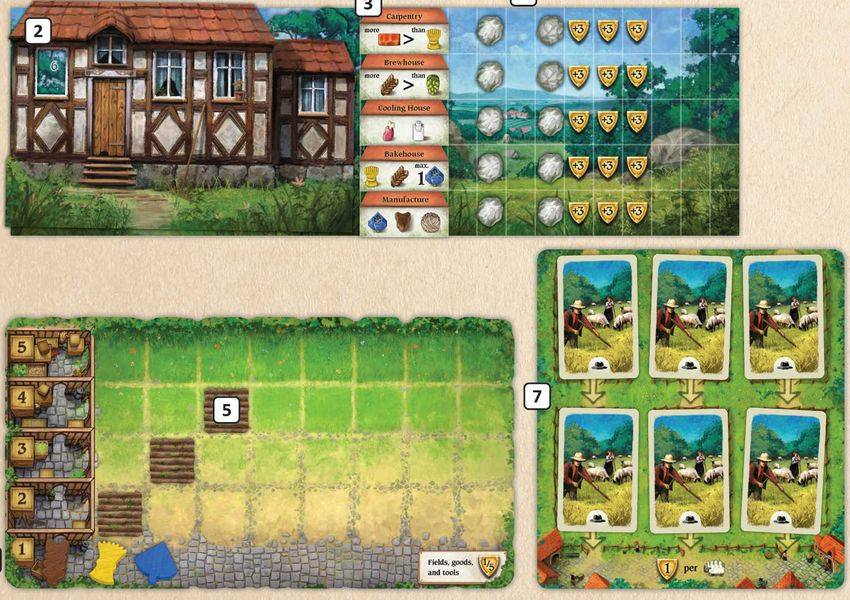
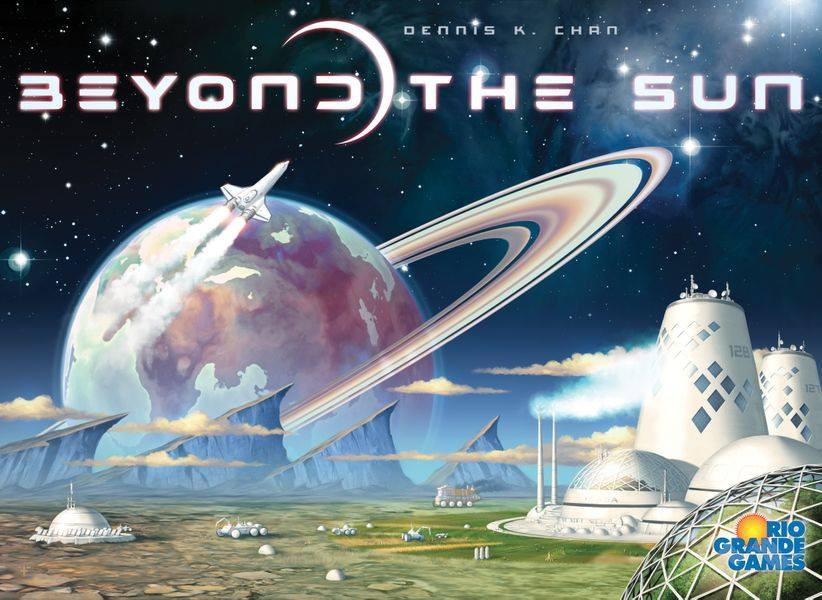
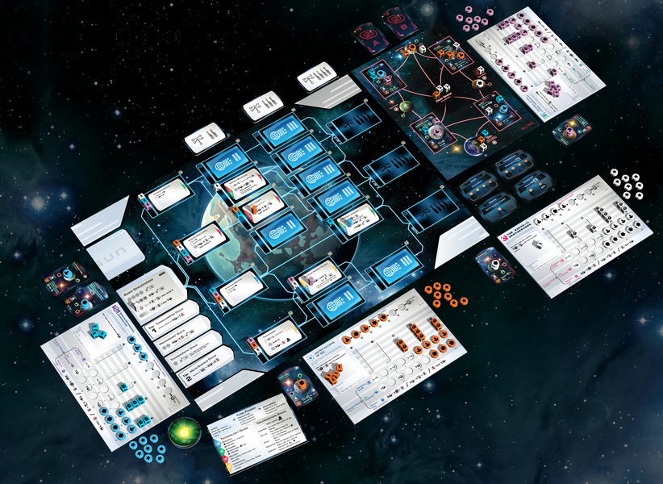

🔹 ในกลุ่มสายหาเกมใหม่เล่นเนี่ยต้องยอมรับตัวเองอย่างนึงว่าผมเป็นคนไม่หาข้อมูลอะไรเท่าไร แถมไม่ค่อย 'อิน' อะไรเป็นพิเศษเวลาใครออกเกมใหม่ พวกเกมใหม่ๆส่วนมากจะออกแนวบังเอิญเจอตามฟีดเพื่อน หรือเพราะมีคนเอามาแนะนำแบบงงๆเสียมากกว่า
.
.
🔹 เมื่อวานเจอเกมที่คิดว่าน่าสนใจแบบงงๆสามเกมพร้อมกันก็เลยว่าจะเอามาพูดให้ฟังเผื่ออยากไปหาข้อมูลต่อกัน คือปกติผมซื้อเกมด้วยเซ้นส์ส่วนตัว อ่านข้อมูลน้อยมาก เห็นเล่น 120 min 180 min weight 3.5+ ไรงี้ก็ไม่ค่อยคิดอะไรเท่าไรล่ะ อีกเหตุผลหนึ่งคือเป็นพวกอ่านรูลอ่านวิธีเล่นแล้วคิดเองไม่ได้ด้วยว่าสนุกปล่าว สุดท้ายก็ต้องซื้อมาลองเอง เลยมองว่าการซื้อเกมมันก็เหมือนเดินเข้าโรงละครมั่วๆมากกว่า ก็ได้เกมสนุกมั้ง เกมแป๊กมั้งปนๆกันไป 
.
.
🔹Hallertau - เกมใหม่ของ Uew Rosenberg ที่กลับมาออกเกมกลางหนักขนาดใหญ่อีกแล้ว (ซึ่งเรียนตามตรงว่านอกจาก Agricola นักออกแบบคนนี้ไม่ได้ทำเกม big hit กับผมซักเท่าไร) แน่นอนว่าต้องเป็นเกมทำฟาร์ม รายละเอียดเท่าที่อ่านก็ classic worker placement พัฒนาฟาร์มแต่ก็ดูมีของเล่นตรงนั้นตรงนี้มาผสมกันตามสไตล์ ถ้าออกก็น่าจะซื้อแหละ
.
.
🔹 Praga Caput Regni - เกมใหม่ของ Vladimír Suchý คนทำ Underwater Cities ธีมสร้างเมืองที่พบเห็นได้ทั่วไป จุดขายคือ rotating action system ที่อ่านแล้วก็ไม่แน่ใจว่าทำงานยังไง แต่ยังไงก็คงซื้อมาลองอยู่ดี เลยไม่อ่านต่อ
.
.
🔹 Beyond the Sun - เกมจากนักออกแบบหน้าใหม่ พอดีเค้ามาโพสในกลุ่ม fb เลยกดไปดู ก็เออดูน่าสนใจดี ของค่าย Rio Grande Games ก็ไม่โนเนมอะไร จุดขายเค้าบอกว่าเป็น Worker Placement ที่มีระบบ Tech Tree น่าสนใจ (น่าสนใจยังไงก็ไม่รู้เหมือนกันแต่คำว่า Tech Tree นี้ขายผมได้) อาจจะรอให้ออกมาก่อนค่อนตัดสินใจว่าจะซื้อไหม อยากรู้ weight ก่อน
.
.
🔹 จริงๆมีอีกสองเกมที่มีคน hype กันแต่ผมไม่ได้สนใจนักออกแนวรอลองเล่นคือ CloudAge ของ Alexander Pfister ที่ไม่ได้อินเพราะเล่นมาหลายเกมไม่โดนซักอัน (ยกเว้น Mombasa ชอบมาก) ยิ่งเกมนี้ใส่คำว่า Deck Building ก็กลัวจะเหมือนเกมวัวที่เล่นแล้วไม่คลิกจัดๆ กับอีกเกมคือ Tekhenu ที่จริงๆก็อยากได้แหละ เพราะเป็นคนชอบเกม dice drafting อยู่แล้ว แต่คิดว่าอยากรอซื้อตอนเข้าไทยมากกว่า ออกแนวไม่รีบ 
.
.
🔹 เอาจริงๆผมมีนิสัยเสียอย่างหนึ่งคือไม่ชอบคน hype เกม เกมไหนใครแม่งโพสตื่นเต้นๆให้เห็นบ่อยๆ ผมจะไม่ค่อยเปิดดู เพราะเกมแบบนี้ถ้าเกิดไม่ชอบขึ้นมาผมมักจะติแรงกว่าปกติ ข้อหา hype เลยต้องยั้งๆตัวเองไว้หน่อย

