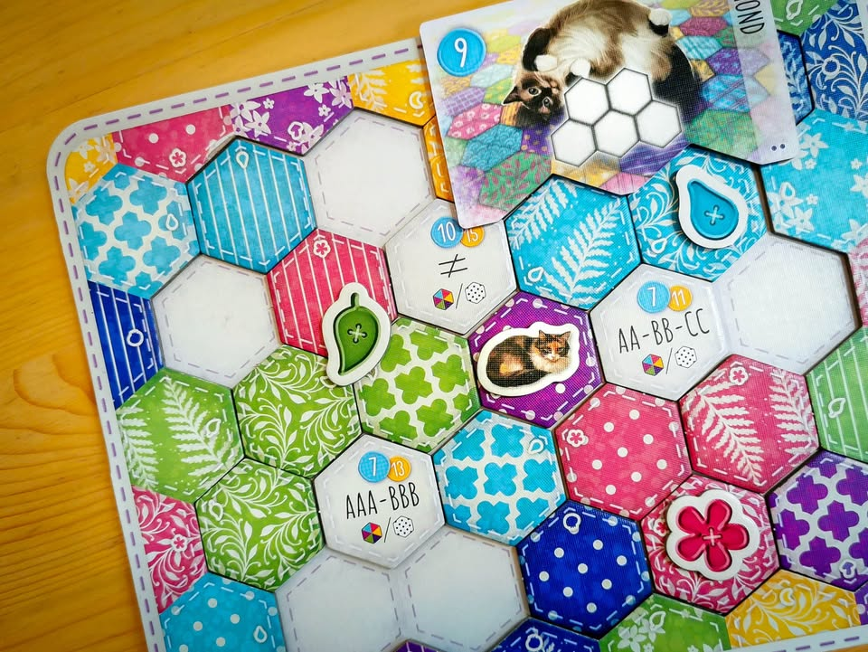
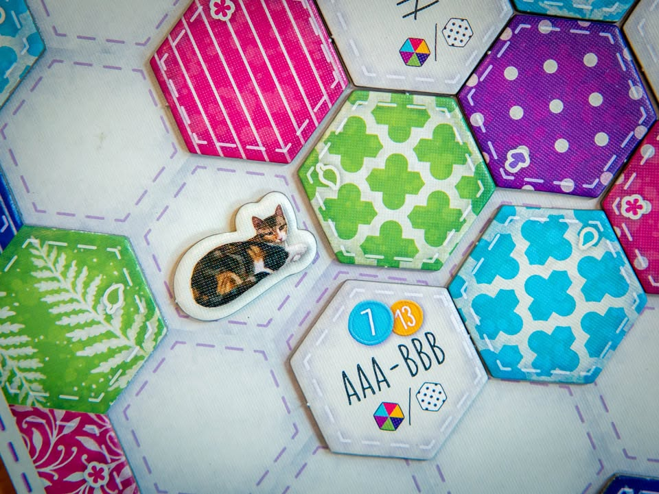

Calico #bite_size #first_impression
blog link: https_://boardnbon.wordpress.com/2020/08/29/calico/
.
🔹 เกมวางไทล์ขนาดเบาเล่นง่ายที่อารมณ์บนปกหลอกเราไว้คือมีแมวน่ารักมาวางไทล์ผ้าลายสวยสไตล์ Patchwork ที่ตอนแรกนึกว่านั่งเงียบเรียงไทล์ต่อทรงให้งดงามมุ้งมิ้งเล่นชิล แต่ดันเป็นเกมหัวร้อนกำหมัดเวลาเพื่อนหยิบไทล์แย่งเราไปซะอย่างนั้น ผลงานของ Kevin Russ (Overlord: A Boss Monster Adventure)
.
.
🔹 ไอเดียมันก็คือเกมผลัดกันวางไทล์ในบอร์ดตัวเองนั้นแหละ ถือไว้ในมือสองตานึงก็เลือกเล่นหนึ่งแล้วจั่วจากใบเปิดที่มีอยู่สาม วนไปเรื่อยๆจนกว่าจะวางครบทุกคน กิมมิคคือไทล์มีสองคุณสมบัติคือสีและลายคละกันอยู่หกแบบ (คือ 1 สีมี 6 ลาย และเกมมี 6 สี )
.
.
🔹 ความสนุกจะอยู่ที่รูปแบบการวาง pattern ที่หลากหลาย ในแต่ละรอบเราจะต้องวาง ไทล์ mission ไว้ที่บอร์ดเราสามอัน เงื่อนไขการทำแต้มอาจจะเป็นล้อมไทล์นี้ด้วย 6 สี/ลาย ต่างกัน หรืออาจจะเป็น 2 สี/ลาย เท่านั้น ถ้าทำได้อย่างใดอย่างหนึ่งจะได้แต้มชุดหนึ่ง แต่ถ้าทำได้ทั้งคู่ก็จะได้แต้มอีกกลุ่มหนึ่ง .... แน่ล่ะใครๆมันก็ต้องอยากได้ทุกอย่าง ซึ่งมันจะเริ่มนำไปสู่ความงึมงำเพราะอยาก optimized วางให้สวยโดยที่ไทล์ดันจั่วได้แบบสุ่ม!
.
.
🔹 นอกจากนี้ยังมีแต้มประปรายหลายอย่าง อย่างวางไทล์สีเหมือนติดกันสามอันจะได้แต้ม หรือแมวที่อาจจะงงว่ามีทำไม คือถ้าเราเอาลายผ้ามาวางเป็นกลุ่มตามที่เกมสุ่มมาเราก็จะล่อแมวมานอนได้แล้วก็เพิ่มแต้มให้กับเรานั้นเอง
.
.
🔹 ในเชิงการออกแบบแล้วจุดที่ทำให้เกมแตกต่างและดีกว่าเกม puzzle เรียบง่ายเจ้าอื่น (และซ่อนไว้เนียนมาก) คือบอร์ดการเล่นของเราจะมีไทล์ผ้าพิมพ์ไว้บนบอร์ดอยู่แล้ว ซึ่งเราสามารถใช้ประโยชน์จากมันในการทำแต้มจากชุดลายผ้าที่สุ่มมาได้อีก ถ้าสงสัยว่าดียังไงในเชิงออกแบบ คือเกมส่วนมากกระดานมันโล่งเราก็ต่อไทล์ไปเรื่อย แต่เกมนี้มันจะซ่อนโมเม้น 'อะฮ้า' ต่อแบบนี้ก็ทำแต้มได้ด้วยนิหว่าเพราะขอบมันลงพอดีอยู่บ่อยๆ
.
.
🔹 ไอ้ความต่อท่าไหนก็ได้แต้มที่มาพร้อมความโลภและความหงุดหงิดที่ไทล์ที่มีทั้งลายและสีตรงใจโดนหยิบตัดไปนี้ทำให้เกมมันสนุกกว่าที่เห็นเยอะเลยนะ ในแง่เกมสไตล์เบาๆที่เล่นแล้วหัวร้อนกว่าที่ตาเห็นไปไกล (ในความหมายดี) ก็ต้องยอมรับว่าธีมกับงานศิลป์ค่อนข้างตกสายที่ชอบอะไรน่ารักแบบโคซี่ๆได้ดี เกมเล่นไม่ยากเหมาะกับหลายโอกาส ตอนเล่นนี้กำหมัดแน่นมากเพื่อนแม่งจะหยิบไทล์ตัดกูไปไหน!!

--------------------------------
หมวด Bite Size (พอดีคำ) นี้กะว่าจะเขียนอะไรสั้นๆประมาณนี้ล่ะกัน ใหม่บ้าง ซ้ำบ้าง เกมที่ขี้เกียจเขียนบ้าง เขียนๆไว้ก่อนเผื่อมีอารมณ์อาจจะขยายไปลง Thought บ้าง จริงๆอยากเขียนสั้นกว่านี้ แต่ยังอดไม่ได้ที่จะต้องอธิบายอะไรเพิ่มตามนิสัย เดี๋ยวค่อยๆปรับไปล่ะกัน

