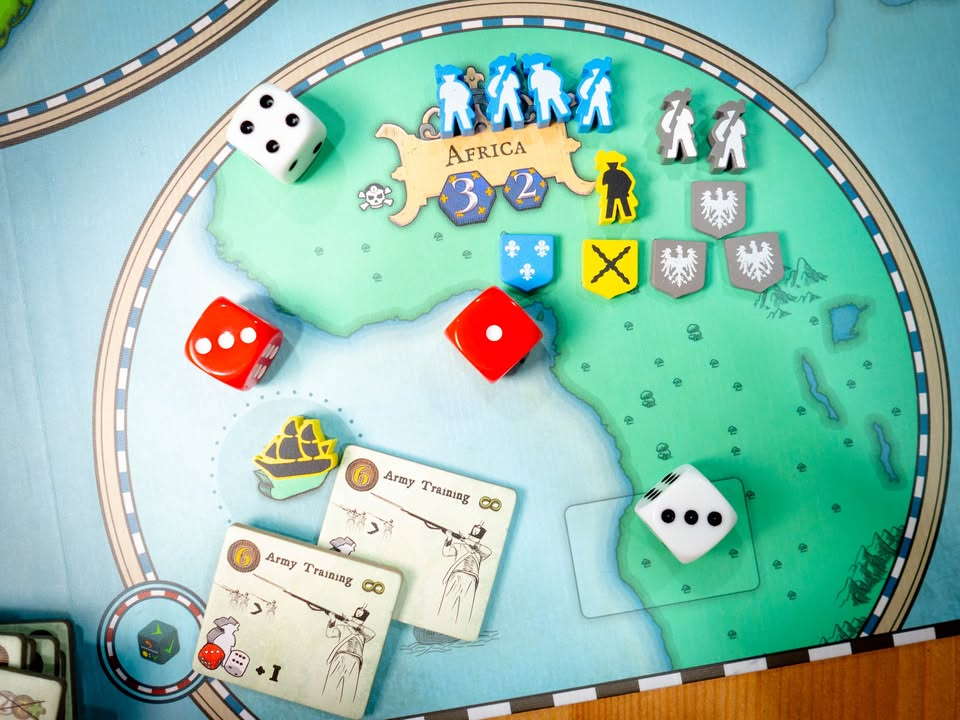
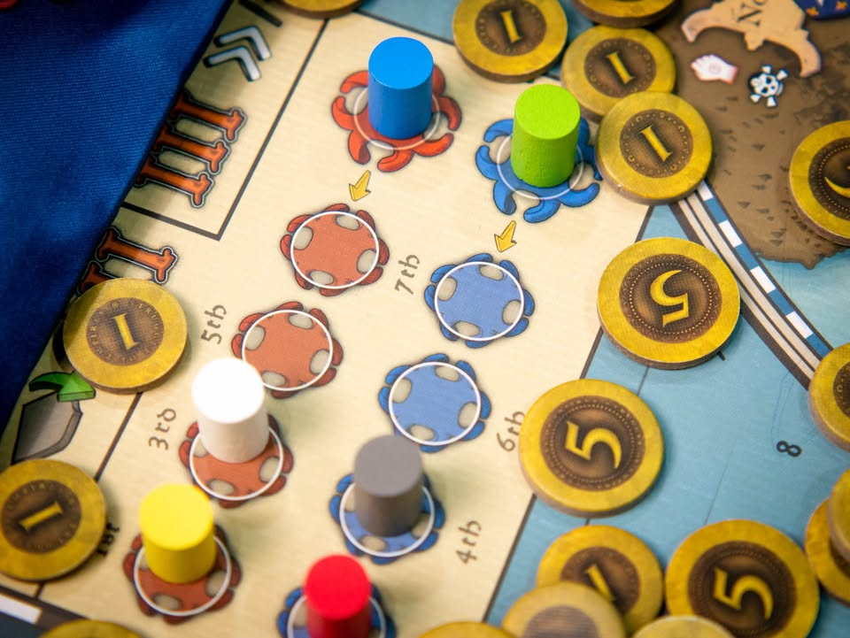
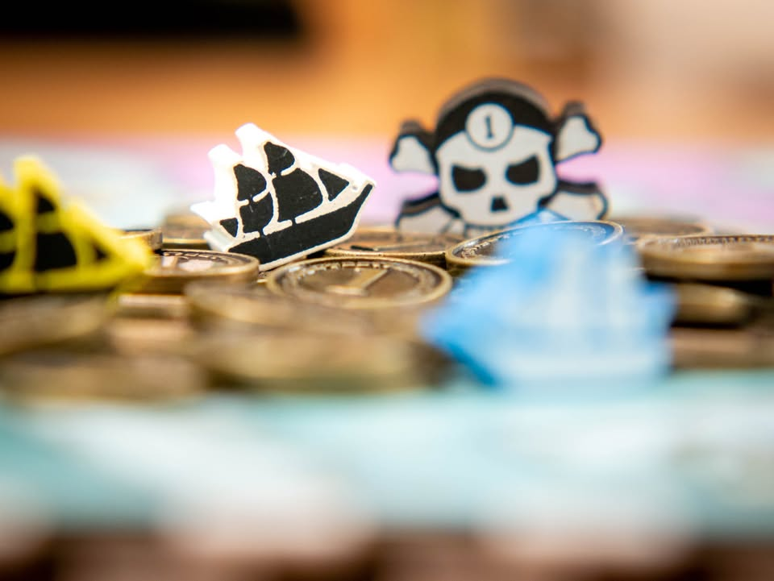
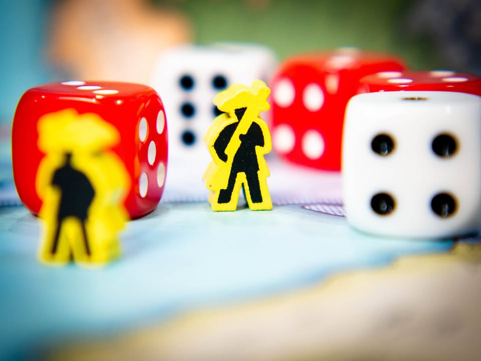
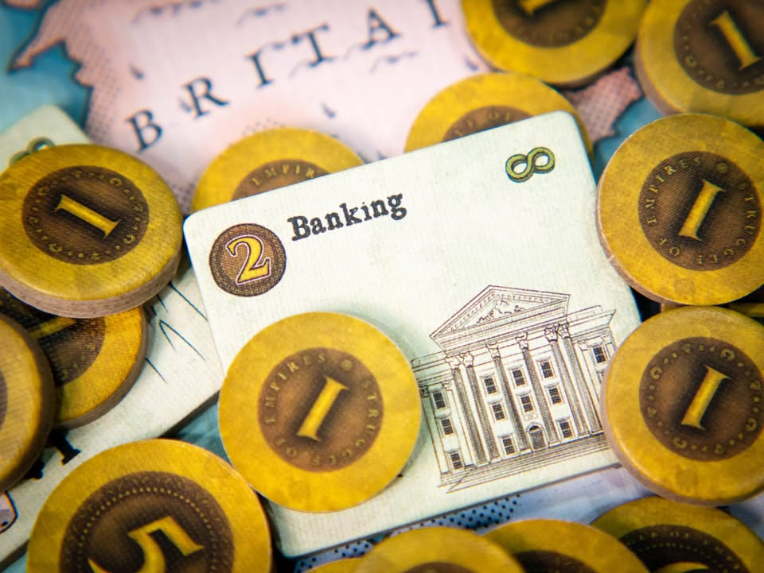
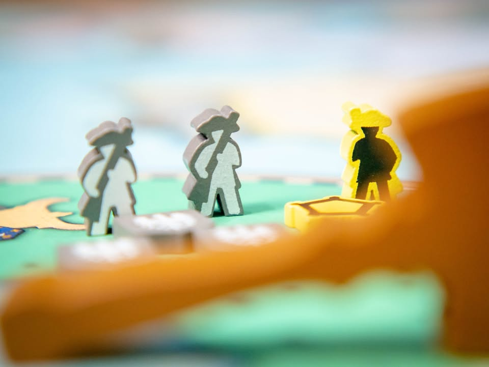
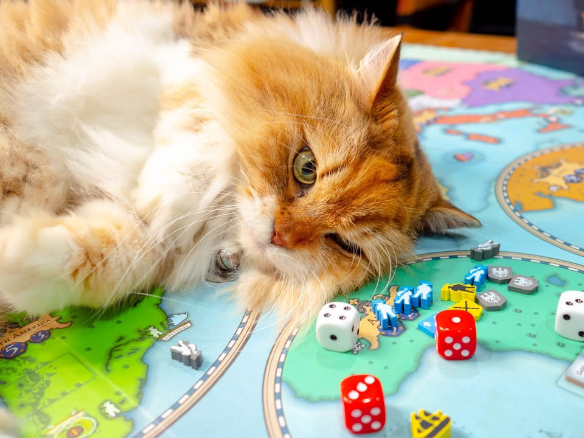

▪️ Struggle of Empires : Deluxe Edition #thought
blog link: https://boardnbon.wordpress.com/2020/09/26/struggle-of-empires-deluxe-edition/

▪️เป็นเกมสไตล์ Area Control ชิงความเป็นใหญ่ในพื้นที่จากนักออกแบบ Martin Wallance (Brass, Age of Stream) ที่เล่าถึงการต่อสู้ยึดครองดินแดนทั่วโลกของประเทศมหาอำนาจทั้งเจ็ดในยุคเรืองปัญญา (Age of Enlightenment สมัยล่าอาณานิคมนั้นแหละ) ลักษณะพิเศษคือมันเป็นเกมที่เหมาะกับผู้เล่น 5 - 7 คน ที่ผู้เล่นจำเป็นต้องประมูลเพื่อพาตัวเอง (หรือคู่แข่ง) ให้ไปอยู่ในหนึ่งในสองขั่วพันธมิตรที่จะเปลี่ยนไปหลายครั้งในเกม
.
.
▪️ ฉบับที่เอามาลงเป็นตัวปรับปรุงของตัว 2004 ที่ถ้าตัดเรื่องงานศิลป์ที่ทำใหม่และอุปกรณ์ที่ดีขึ้นแล้ว กติกาก็ปรับไม่มากนัก แต่ก็ลดส่วนที่เป็นดวงในจุดที่ค่อนข้างสููงลงเพื่อให้เกมทันสมัยมากขึ้น แต่โดยรวมเชิงเกมก็ไม่ได้เปลี่ยนอะไร 
.
.
▪️ อีกเรื่องที่คิดว่าน่าจะบอกไว้หน่อยคือบทความแรกของเพจผมก็คือเกมนี้ในฉบับ 2004 เนี่ยล่ะ ซึ่งจริงๆก็เขียนไว้แล้วแต่ว่าจะขอเขียนใหม่แบบไม่อ่านของเก่าดู  :)
.
.
▪️ ไอเดียหลักแล้วเกมนี้ก็คือ Majority Control ที่จำนวน 'ธงชาติ' คือตัวชี้วัดว่าใครจะได้แต้มในพื้นที่ และ 'ทหาร' คือเครื่องมือที่เอาไว้แย่งชิง 'ธงชาติ' ของฝ่ายอื่นแต่กุญแจสำคัญคือกลุ่มผู้เล่นจะถูกแบ่งออกเป็นสองพันธมิตร ที่ไม่สามารถโจมตีกันเองได้ แต่ว่าก็ไม่ได้บังคับว่าต้องช่วยเหลือกันด้วยเช่นกัน
.
.
▪️ เกมจะแบ่งออกเป็นสามยุคสมัย คิดคะแนนก็แค่สามครั้ง แอคชั่นนี้แทบไม่มีอะไรมีแค่ เพิ่มทหาร, เดินทหาร, โจมตี แล้วก็หยิบไทล์เทคโนโลยีที่ช่วยเพิ่มศักยภาพให้กับเรา (ถ้าพูดอีกแบบก็ยากกว่า Risk ไม่เท่าไร) แต่สิ่งที่เพิ่ม depth ให้กับเกมก็คือระบบพันธมิตรที่จะกำหนดว่าในแต่ล่ะยุคสมัยนั้นใครสามารถโจมตีใครได้บ้าง
.
.
▪️ จุดที่น่าสนใจที่สุดของเกมก็คือการพาผู้เล่นเข้าไปอยู่ในแต่ล่ะทีม ซึ่งจะมีการเปลี่ยนแปลงทั้งเกมสามครั้งตามยุคสมัย ขั้นแรกผู้เล่นคนแรกจะเลือกแท่งธงชาติที่ยังไม่มีทีมออกมาหนึ่งคู่ ของใครก็ได้ โดยคู่นี้จะวางอยู่คนล่ะฝั่งกัน จุดนี้จะเรียกว่า 'ข้อเสนอ' ซึ่งถ้าไม่มีใครคัดค้าน คู่ที่โดนเสนอมาก็จะโดนย้ายเข้าทีมแบบนั้นแหละ แล้วเลือกคู่ใหม่มาทำจนครบ
.
.
▪️ แต่ถ้ามีใครให้ราคาที่สูงกว่าผู้เล่นคนนั้นก็จะสามารถเปลี่ยนข้อเสนอใหม่ได้ ทำได้ทั้งเปลี่ยนคู่ใหม่ สลับฝั่ง หรือเปลี่ยนแค่ฝ่ายเดียวก็ได้ ก็ทำวนไปจนกว่าข้อเสนอของคนที่ประมูลสูงที่สุดจะไม่มีใครค้าน
.
.
▪️ มิติตรงนี้มันเลยมีหลายอย่าง ทั้งการประมูลว่าเราจะอยู่ข้างใคร หรือเราอยากจะตีใคร (หรือไม่อยากถูกใครตี) เพราะนี้มันเกมชิงพื้นที่และทีมจะเปลี่ยนได้แค่สามครั้งเท่านั้นทั้งเกม บางครั้งถ้าไม่ทุ่มจับคู่ให้ดีจากแต้มนอนมารอบแรกกลายเป็นอยู่กลางดงศัตรูซะงั้นก็มี
.
.
▪️ ซึ่งตรงนี้นำไปสู่ currency อีกอย่างนอกจากเงินที่เอาไว้ประมูล ก็คือสิ่งที่เรียกว่า Unrest Token หรือความไม่พอใจของประชาชนที่มีต่อสงครามและความฟุ่มเฟือยของรัฐบาล ทุกครั้งที่เราเงินไม่พอเราสามารถ 'กู้' เงินเพิ่มได้เสมอด้วยการหยิบ เหรียญ Unrest (รัฐบาลกู้เงินเยอะๆประชาชนที่ไหนเค้าชอบกัน) รวมไปถึงทุกครั้งที่ทหารตายก็ต้องหยิบ Unrest เช่นกัน ซึ่งความสำคัญของมันคือถ้าตอนจบเกมใครมีรวมกันเกิน 20 หน่วยให้แพ้ไปเลยเพราะประชาชนไม่พอใจโดนปฏิวัติ ส่วนคนที่เหลืออยู่ถ้ามีเยอะสุดก็ให้เสียแต้มเพิ่ม ซึ่งตรงนี้ทำให้การก่อสงครามหรือการทุ่มเงินประมูลมีเรื่องที่ต้องคิดเพิ่มโดยเฉพาะสงครามนั้นมีความเสี่ยงที่ทหารเราจะตายเองด้วย (แต่ในเกมมีใบเทคที่ช่วยลดจำนวน Unrest ด้วยนะ)
.
.
----------------------------------------------------------
🐸 Hang out friend
----------------------------------------------------------
.
.
🔹 เป็นเกมที่อารมณ์หลายจุดอาจจะรู้สึกว่า old school นิดๆ แต่ถ้าอยู่ถูกวงแล้วสนุกมาก แกนแม้จะเป็น Area Control ที่ต้องแย่งชิงพื้นที่แต่ก็ต้องคุยกันตลอดเวลาแม้ไม่ใช่ตาตัวเอง เนื่องจากพันธมิตรทีมเดียวกันถ้าอยากจะจูงใจเค้ายืมทหารช่วยเรารบเราก็ต้องเสนอสิ่งตอบแทนให้เค้าเช่นกัน (หรือกระทั้งการหว่านล้อมไม่ให้ทีมตรงข้ามช่วยกันเอง) คือชอบเล่นแหละแต่ก็จะหยิบมากางต่อเมื่อได้วงที่เรา happy ที่จะเล่นด้วยจริงๆเท่านั้น และการที่จะเอาคนแบบนี้มานั่งพร้อมกัน 7 คนได้นี้ค่อนข้างยากเลยล่ะ
.
.
💬 จุดกลางๆคือแกนหลักของเกมก็คือทอยเต๋าสู้ที่มีสัดส่วนดวงสูงไม่น้อยเทียบกับอารมณ์การคิดวางแผนในเกม ระบบการต่อสู้ก็คือเอาจำนวนทหารของสองประเทศ(รวมทหารที่เพื่อนให้ยืมมา)เป็นตัวตั้ง จากนั้นทอยเต๋าแล้วเอาผลต่างของสองลูกมาเพิ่มพลัง คนที่ชนะก็จะเปลี่ยนเจ้าของธง ส่วนคนแพ้ก็เสียทหารหนึ่งหน่วย (แปลว่าไม่ได้เสียหายเยอะนัก ยังสามารถตีคืนได้ และเกมนี้นับแต้มที่ธงไม่ใช่จำนวนทหาร) แม้ว่าจะมีส่วนของการบริหารความเสี่ยงว่าดวงจากการทอยเต๋ามันก็คือเลข 0-5 ที่เป็นส่วนต่างที่มากอยู่ดี ถ้าดวงไม่ดีก็อาจจะเซงหน่อย
.
.
💬 ส่วนทำไมต้องเอาเต๋าสองลูกมาลบกัน ก็เพราะว่าถ้าทอยลูกเดียวปกติโอกาสจะเท่ากันหมด (1/6) แต่การเอาสองลูกมาลบกันโอกาสจะออกมาเป็นระฆังคว่ำแทน อย่างแต้มสูงสุด คือ 6 - 1 = 5 ก็จะมีโอกาสเกิดลดลงเหลือแค่ประมาณ  5% ในขณะที่โอกาสที่จะออกส่วนต่างได้ 1 ก็จะมี 27% กิมมิคทางสถิติอีกอย่างที่น่าจะคุ้นกันดีคือถ้าบังเอิญทอยแล้วผลรวมได้ 7 (โอกาสเกิด 16.67%) ไม่ว่าใครทอยก็ต้องเสียทหารหนึ่งหน่วย (และทหารตายต้องโดน unrest ที่ถ้ามีมากเกินไปก็จะแพ้เกม)
.
.
💬 แต่เต๋ามันก็คือดวงอ่ะนะ ซึ่งถ้าไม่ชอบ luck factor ตรงนี้ (หรือไม่ได้เตรียม mindset ไว้ก่อนว่ามันเป็นเกมสไตล์ไหน) ก็น่าจะทำให้คุณไม่ชอบหรือมี bad impression เกมนี้เอาง่ายๆ
.
.
💬 อีกจุดหนึ่งคือไทล์เทคโนโลยีหรือความสามารถในเกมที่ต้องไปซื้อมามันแอบแบนๆบ้านๆไปนิด (ซึ่งก็เรียกว่าตามยุคสมัยที่เกมออกมานะ) ไม่ได้เป็น tech tree หวือหวาออกสายออกท่า ในแง่นี้ข้อดีก็คือเราจะได้สนใจอยู่กับที่การยึคพื้นที่และเจรจาเป็นหลักแทน แต่โดยรวมมันก็ค่อนข้างจืดตามสไตล์เกมเก่า
.
.
💬 ข้อสังเกตุอีกอย่างคือแม้เกมจะเล่นง่ายแต่ว่าใช้เวลาเยอะ ถ้าคนไม่เข้าใจเกมเนี่ยโอกาสพาวงกร่อยมีเยอะมาก อย่างการประมูลจับคู่ที่่ประมูลส่งๆ ไปจนถึงอารมณ์ช่วยกันโดยไม่ดูว่าใครแต้มนำแต้มตาม และเกมนี้จะสนุกที่ผู้เล่น 5-7 คน น้อยกว่านั้นไม่สนุก แต่ถ้ามีเลขคี่จะสนุกกว่าเพราะต้องประมูลดึงคนที่ 5/7 มาอยู่ฝ่ายเราให้ได้
.
.
🔸 ในแง่คุณภาพอุปกรณ์ Eagle-Gryphon Games ทำออกมาโดยรวมได้ดี ไทล์หนา งานศิลป์สะอาดตา แต่ในแง่รสนิยมการออกแบบ insert แล้วห่วยคงเส้นคงวา คือทำหลุมให้ใส่ของแบบพอมี แต่ใช้งานจริงล้วงยากมาก (สุดท้ายก็ต้องใส่ซอง zip lock อยู่ดี) ช่องไม่มีความพอดีหรือแบ่งเตรียมไว้จำเพาะเจาะจง (เรียกว่าไม่มีรสนิยมทางการออกแบบละกัน) ของทุกอย่างพอใส่ลงไปแล้วปิดฝาไม่สนิทอีก (ห่าน) คู่มือเองก็ลำดับวิธีเขียนวนเวียนชวนงง (เรียกกากนั้นแหละ) อธิบายเรื่องตัวเลขทอยเต๋าไปสามหน้าก่อนที่จะบอกว่าอ้อเกมนี้สู้ใช้เต๋า แบ่งหัวข้อแยกกันแล้วทำเป็นสรุปก่อนที่จะขยายความแล้วดูขัดๆกันจนน่ารำคาญ ทั้งที่จริงๆแล้วเกมมี้กติกาค่อนข้างตรงไปตรงมาและเข้าใจง่ายมาก เขียนยังไงให้มายากขนาดนั้น
.
.
💭 โดยรวมก็เป็นเกมที่ต้องการกลุ่มผู้เล่นเฉพาะทางหน่อย เพราะแค่บ้าบู๊อย่างเดียวไม่เก็ท 'การเมือง' ว่าใครควรจับกับใคร หรือคิดแผนแห้งๆอย่างเดียวก็ไม่ชอบแน่ๆ อาจจะต้องใช้ mindset แบบ Risk ในสเกลที่ลึกลงไปอีก พ่วงด้วยเวลาราวสามถึงสี่ชั่วโมง แต่ถ้าเก็ททั้งวงเกมนี้ก็สนุกจริงจังโวยวายกันทั้งเกม ถ้าใครชอบแนวซัก Rising Sun แต่อยากได้ระบบจับคู่ทีมที่มัน 'make sense' หน่อยก็แนะนำเกมนี้เลย (แต่ไม่มี miniature และทอยเต๋าสู้กันจริงจัง) เป็นเกมสไตล์นานๆกางทีที่ผมสนุกกับการได้เล่นมันทุกครั้งนะ .....

----------------------------------------------------------
Compatible Level - เกมนี้เข้ากับคนเขียนได้ระดับไหนนะ!!

🐸 Family, อาจจะมีช่วงเวลาที่ไม่เข้าใจกันบ้างแต่ครอบครัวคือสิ่งที่จะอยู่กับเราตลอดไป นี้คือเกมที่จะมีพื้นที่ถาวรในชั้นวางแน่นอน!! แม้บางเกมจะเปรียบดั่งคุณปู่ใจดีที่ได้เจอกันแค่ปีล่ะครั้ง แต่อันดับในใจนั้นคือความสนุกในช่วงเวลาที่เล่น หาใช่การได้เล่นซ้ำไม่รู้เบื่อเพียงอย่างเดียว [ex. กบโปรด, กบชอบ]

🐸 Hang out friend, เพื่อนกินเที่ยว ถ้าไม่ติดธุระอันใดก็พร้อมจะออกไปพบเจอ สนุกยามได้พบปะ แต่จะให้เจอกันบ่อยๆคงใช่ที - เกมสนุกที่อยากเล่นในระดับที่อยากจะหยิบกางเป็นบางครั้ง สลับสับเปลี่ยนไปเรื่อยตามจังหวะและโอกาส แต่เราก็ไม่ได้อยากซ้ำต่อเนื่องรัวๆ [ex. กบโอเค]

🐸 Someone I know, หากบังเอิญพบเจอ ก็คงได้ทักทายไต่ถาม หากแต่ในยามปกติมิอาจนึกชื่อออก ยืนคุยก็ได้ แต่คงไม่ได้เอื่อนเอ่ยนัดกินข้าว - บางเกมเราก็ไม่ได้อยากชวนเล่น แต่ถ้าไม่มีอะไรทำแล้วมีคนชวนก็เล่นก็ได้ [ex. กบเฉย]

🐸 I Turn left, You Turn Right - เธอชอบกินเผ็ด เราชอบกินอาหารญี่ปุ่น เธอชอบคนคารมดีพาไปกินที่หรู แต่เราชอบเล่นเกมอยู่กับบ้าน แม้จะได้คุยเป็นบางคราแต่คงไม่อาจพัฒนาความสัมพันธ์ - บางเกมแม้ว่าจะดีแค่ไหน แต่ถ้ารสนิยมมันไปด้วยกันไม่ได้ก็ไม่รู้จะเล่นไปทำไม [ex. กบไม่เล่น]
 
 
อนึ่ง : เป็นความรู้สึกในความ "อยากจะหยิบมาเล่นไหม?" ของผมเอง ไม่ได้เกี่ยวอะไรกับคุณภาพของเกม ไม่อิงมาตราฐานอื่นใดนอกจากตัวเองเท่านั้น ดูให้เป็นแค่ "อีกความคิดเห็นหนึ่ง" เท่านั้นก็พอนะครับ :)

