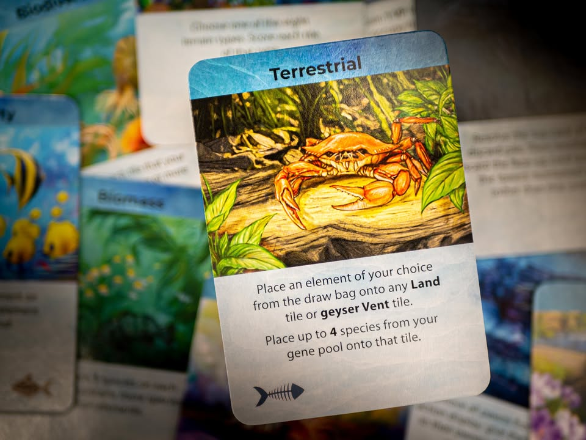

Dominant Species: Marine
.
blog link: https://boardnbon.wordpress.com/2021/02/25/dominant-species-marine/
.
▪️ เกมยูโรระดับหนัก ที่ให้เรารับบทเป็นเหล่าสัตว์น้ำ (และครึ่งน้ำ) ในยุคโบราณที่จะมาชิงความเป็นใหญ่ก่อนที่สูญพันธ์จากการโดนอุกกาบาตตกใส่.....(เอ๊ะ?!) ผลงานสุดท้ายจาก Chad Jensen ( Dominant Species, Combat Commander )
.
.
▪️ ไอเดียหลักก็คือเกม Area Control ส่งก้อนสีเราไปยืนจองพื้นที่ทำแต้ม ขับเคลื่อนเกมด้วยระบบ Worker Placement ที่เราจะต้องส่งคนงานไปแย่งช่องทำแอคชั่น 
.
.
▪️ เลเยอร์ที่สำคัญอย่างหนึ่งในเกมคือศักยภาพในการหาอาหารที่เราต้องพัฒนาสัตว์ของเราให้สามารถหากินในพื้นที่ให้ได้ ซึ่งมีตัวทั้งปรับตัวให้เรากินของที่มี ไม่ก็ปรับพื้นที่ให้มีของที่เรากิน หรือ....... เอาอาหารที่คนอื่นกินได้ออกไปมันจะได้อดตาย
.
.
▪️ เกมมันจะมีไทล์กลมๆแทนชนิดของอาหารอยู่หกแบบวางตามมุมรอยต่อของไทล์หกเหลี่ยม อยู่ตรงไหนก็แปลว่าตรงนั้นมีอาหารแบบนั้น ส่วนสัตว์ของเราถ้าบนบอร์ดมีไทล์อาหารแบบเดียวกันก็แปลว่าเราอาศัยอยู่ตรงนี้ได้ แต่ต่อให้กินไม่ได้ก็อยู่ได้เหมือนกันแค่ว่าถ้ามี event ออกมาเช็คก็ตายไปเท่านั้นเอง ไอเดียเกมเอาจริงๆก็มีแค่นี้แหละ
.
*(ตรงนี้จะต่างกับตัวเดิมที่ไม่มีข้าวกินจบรอบใหญ่ตายเลย)
.
.
▪️ แอคชั่นในเกมเหมือนจะดูเยอะคือมีถึงสิบสองแอคชั่น แต่เอาจริงๆใจความมันก็มีแค่ เติมอาหารลงบอร์ด เพิ่มวิธีหาอาหารให้ตัวเอง ขยายดินแดน โยกย้ายประชากร คิลเพื่อนบ้าน คิดแต้มในพื้นที่ ซึ่งแต่ละแอคชั่นก็สั้นๆกระชับตรงไปตรงมา
.
.
▪️ ระบบทำแอคชั่นเป็นแบบ Worker Placement ที่ผู้เล่นจะมี pawn จำนวนหนึ่งไปแย่งกันทำแอคชั่น ความยากของเกมนี้คือถ้าเราวางคนงานไว้ที่ไหนแล้วตัวต่อไปจะต้องวาง 'ต่ำ' (ช่องแอคชั่นที่อยู่ถัดลงไป) เท่านั้น ห้ามวาง 'ขึ้น' (วางก่อนหน้า) หมายความว่าเราไม่สามารถสลับลำดับการวางได้ตามใจชอบ ถ้าข้ามไปลงแอคชั่นสำคัญที่มักจะอยู่ด้านล่างเราก็มีตัวเลือกในตาต่อไปน้อยลง ต้องไปลำดับความสำคัญเอาหน้างาน
.
*(ตรงนี้จะต่างกับตัวเดิมที่ทุกคนแย่งกันวางคนงานให้ครบก่อน จากนั้นก็ไล่ resolve ตามลำดับในตอนจบรอบ ตัวนี้กลายเป็นวางคนงานแล้วทำแอคชั่นทันที แต่จะโดนบังคับจากลำดับก่อนหลังแทน)
.
.
▪️ พอลงแอคชั่นเป็นที่พอใจอีกตัวเลือกหนึ่งก็คือเก็บคนงานกลับเข้ามือมารอวนใช้ใหม่ แต่เนื่องจากมันเสียเทิร์นแถมไปเปิดรูว่างให้คนอื่นอีก ตรงนี้ก็ต้องวางแผนให้ดีเช่นกัน แต่เกมก็มีคนงานอีกแบบอยู่จำนวนหนึ่งที่ต้องไปตบตีแย่งกันนิดหน่อยระหว่างเล่น แต่ความเจ๋งมันคือมันวางไม่สนลำดับบนลงล่างแบบตัวปกติ แถมมีช่องพิเศษให้มันโดยเฉพาะด้วย แถมเตะคนงานคนอื่นเพื่อทำแอคชั่นซ้ำได้ด้วย 
.
.
▪️ ก็เล่นๆวนออกการ์ด event เลวๆแกล้งเพื่อนไปจนมีคนเล่นการ์ดอุกกาบาตที่อยู่ท้ายกองก็จบเกม
.
.
----------------------------------------------------------
🐸 Family, ลูกเพื่อนที่แสบไม่แพ้พ่อแม่
----------------------------------------------------------
.
.
🔹 ในฐานะเกม Area Control แล้ว เกมนี้เรียกได้ว่าถ้ามี 4 คนผมน่าจะหยิบมาเป็นตัวเลือก Top Pick แน่นอนสำหรับฝั่งเกมหนัก ( 5 คนจะเป็น El Grande, 6 คนจะเป็น Dominant Species ตัวเดิม) เพราะระยะเวลาการเล่นที่สั้นลง รวมถึงการปรับจูนเรื่องที่น่าหงุดหงิดในตัวก่อนหน้านั้นถูกทำให้ดีขึ้นเยอะในภาคนี้ (แต่ถ้าบอกว่าอันไหนสนุกสุดมากกว่าผมก็จะบอกว่าตัวเก่า แต่อันนั้นมันก็กางยากกว่าและเล่นนานกว่าเยอะ)
.
ลองเล่นสามคนไปก็ยังคิดว่าค่อนข้างดีนะตอนเล่นเป็นแล้วใช้เวลาราวสองชั่วโมง (ผ่านไปไวมาก!) แล้วก็เบียดกันสนุกอยู่
.
.
🔹 จุดเด่นคือ action มันค่อนข้างแน่น เพราะด้วยข้อจำกัดเรื่องลำดับการทำแอคชั่นก่อนหลังทำให้แม้เราจะมีแผนระยะยาวอยู่ในใจแต่ก็ยังต้องปรับระยะสั้นหน้างานตลอด เพื่อนแย่งลงช่องที่อยากได้ไปก็ป่วนแผนเราได้เยอะแล้ว และด้วยความที่เป็นเกม open information ทุกอย่างอยู่ตรงหน้าโดยที่มีตัวแปรหลากหลาย ช่องที่เราอยากจะทำก็มักวางไว้ในลำดับที่ถ้ารีบลงเร็วไปเราจะเสียแอคชั่นดึงตัวบ่อยเกินไปเพราะมันอยู่ต่ำมาก
.
.
🔹 หนึ่งในคีย์สำคัญที่อาจจะมีทั้งคนชอบหรือไม่ชอบก็คือความ 'ไม่ดั่งใจ' จากความสุ่มหลายอย่างในเกมที่จะมีผลต่อการเล่นระยะสั้นและกลางของเราเสมอ แต่ส่วนตัวผมคิดว่ามันก็สมกับความเป็นเกมแห่งการปรับตัวเพื่อความอยู่รอดนะ
.
.
🔹 ความสุ่มเริ่มตั้งแต่ชนิดอาหารที่เราจะสามารถเติมลงไปในกระดาน รวมถึงอาหารเราจะสามารถปรับตัวได้ พื้นที่ที่เราสามารถคิลเพื่อน ชนิดพื้นที่ที่สามารถคิดแต้ม รวมไปถึงการ์ดที่ออกมา 
.
แต่เกมนี้ไม่ได้ใช้ระบบ 'เติมของเมื่อหยิบออก' แต่ว่าจะมีการเปลี่ยนของที่สุ่มนี้ตามจังหวะ reset เกมที่จะเกิดเมื่อผู้เล่นทุกคนทำการดึงคนงานกลับอย่างน้อยหนึ่งครั้ง (ระบบการทำแอคชั่นในเกมมีแต่วางหรือดึง ตัวเกมไม่มีระบบรอบหรือเฟส) แล้วจึงจะมีการเปลี่ยนของที่สุ่มมาใหม่ ทำให้ในการ seed แต่ละครั้งแผนระยะกลางเราก็จะเปลี่ยนไปเรื่อยๆ
.
.
🔹 ระบบอาหารการกินนั้นถือเป็นส่วนสำคัญที่เพิ่ม dynamic ในแต่ละเกม เพราะว่าพื้นที่หากินในเกมมีแอคชั่นไปยุ่งหลายแบบ นอกจากเติมแล้วก็ยังมีแอคชั่น 'หยิบออก' ด้วย แต่ว่าการหยิบออกก็มีเงื่อนไขหลายอย่างที่ต้องวางแผนล่วงหน้าเช่นกัน รวมไปถึงไทล์รอยแยกของเปลือกโลกที่ทำให้แหล่งอาหารค่อยๆหายไปก็สามารถถูกเติมไปโดยผู้เล่นได้เช่นกัน แนวคิดเรื่องการตั้งแคมป์รอคิดแต้มจึงใช้ไม่ได้กับเกมนี้ เพราะถ้าอาหารไม่มีก็ตายเหี้ยนเลยนะ
.
.
🔸 ความ asymmetric ของผู้เล่นแต่ละคนจะมาจากการ์ด Trait Card ที่ถูกสุ่มมาให้เลือกยี่สิบใบ ตรงนี้ส่วนตัวพบว่ามันแอบมีความเก่งกากต่างกันเยอะไปหน่อย เท่าที่ลองเล่นคิดว่าใช้ official variant ให้ผู้เล่นมี Trait Card คนละสองใบแล้วเสริมด้วยการ draft นั้นถูกใจผมมากกว่าเพราะใบเดียวเดี่ยวๆมันแอบบางไปนิด (ถึงจะไม่ใช่เรื่องปกติของค่าย GMT เท่าไร แต่อยากได้การ์ดเสริมใหม่อ่ะ) กับความสามารถแบบสุ่มมันไม่ได้ขับเน้นว่าเรากำลังเล่นเป็นสัตว์ตาม player board ซักกะนิด
.
.
👁‍🗨 จุดกลางๆเรื่องความสุ่มในเกมที่บางคนอาจจะไม่ชอบ (แต่ผมคิดว่าเป็นการบริหารความเสี่ยงตามปกติ) คือการคิดแต้มพื้นที่แบบพิเศษในเกมนั้นจะเป็นการสุ่มจากการ์ดที่เปิดมา คือเราต้องวางตัวเองไปอยู่ตรงพื้นที่แต้มน้อยจัดแถมอาหารน้อยมากไม่รู้จะตายเมื่อไร เพื่อลุ้นว่าจะได้ score แต้มจาก event สุ่ม จะไม่แย่งไม่ได้เพราะแต้มเยอะจัด แต่ถ้าแย่งมาได้การ์ดไม่ออกดวงซวยติดต่อกันบ่อยๆก็อาจมีเซงได้เหมือนกัน
.
.
👁‍🗨 บรรยากาศที่น่าสนใจและอาจจะทำให้คนเขวได้ก็คือเกมนี้ไม่มีระยะนับแต้มที่ต้องวิ่งไปดักรอเหมือนเกม Area Control ทั่วไป แต่จะนับปูพรมก้อนใหญ่ก็ตอนจบเกมโน้น ในระหว่างเล่นเกมจะเน้นการนับแค่พื้นที่ย่อยที่เดียวจากการเลือกแอคชั่นเป็นหลัก ทำให้การพยายามไปเกาะเพื่อนไว้เสมอตรงที่มีแต้มในเกมนี้จึงสำคัญมาก ถ้าปล่อยใครไปยืนเดี่ยวในที่แต้มเยอะนี้มันก็จะ score ตรงนั้นรัวๆแน่นอน
.
แต่ว่าเกมก็มีการทำ Balance ที่น่าสนใจมากกว่าจะใช้ระบบให้ผู้เล่นไปแย่งกันเองตาม common sense เหมือนในเกมอื่น นั้นคือโดยปกติแล้วทุกครั้งที่มีการเลือกแอคชั่น tile scoring เราจะได้หยิบการ์ด event มาเล่นด้วย ซึ่งไทล์ที่แต้มเยอะจะมีสิทธิ์ในการเลือกการ์ดน้อยกว่า 
.
.
👁‍🗨 ถ้าจะมีอะไรที่คิดว่าขาดก็น่าจะเป็น cube ที่ไม่ใช่พลาสติกใสสีๆเนี่ยล่ะ อุตส่าห์ทำอาร์ทสีสวยสดมาแล้วดันให้ cube ไม้สีทึบบ้านๆมาซะได้
.
.
💭 โดยรวมผมชอบเกมนี้มากทีเดียว แม้ว่าจะมีหลายจุดที่ไม่เหี้ยมเท่าตัวเดิม แต่ก็รื้อออกมาทำใหม่ได้กระชับและเข้าถึงได้ง่ายขึ้นมากโดยที่ไม่ได้ทำให้เกมเจือจางไป แถมยังลบเรื่องน่ารำคาญหลายอย่างจากตัวเดิมไปด้วย มีความสดใหม่เป็นของตัวเอง ใครสายยูโรที่ชอบแนว Area Control ก็อยากให้ลองเล่นกันดูครับ 

----------------------------------------------------------
Compatible Level - เกมนี้เข้ากับคนเขียนได้ระดับไหนนะ!!

🐸 Family, อาจจะมีช่วงเวลาที่ไม่เข้าใจกันบ้างแต่ครอบครัวคือสิ่งที่จะอยู่กับเราตลอดไป นี้คือเกมที่จะมีพื้นที่ถาวรในชั้นวางแน่นอน!! แม้บางเกมจะเปรียบดั่งคุณปู่ใจดีที่ได้เจอกันแค่ปีล่ะครั้ง แต่อันดับในใจนั้นคือความสนุกในช่วงเวลาที่เล่น หาใช่การได้เล่นซ้ำไม่รู้เบื่อเพียงอย่างเดียว [ex. กบโปรด, กบชอบ]

🐸 Hang out friend, เพื่อนกินเที่ยว ถ้าไม่ติดธุระอันใดก็พร้อมจะออกไปพบเจอ สนุกยามได้พบปะ แต่จะให้เจอกันบ่อยๆคงใช่ที - เกมสนุกที่อยากเล่นในระดับที่อยากจะหยิบกางเป็นบางครั้ง สลับสับเปลี่ยนไปเรื่อยตามจังหวะและโอกาส แต่เราก็ไม่ได้อยากซ้ำต่อเนื่องรัวๆ [ex. กบโอเค]

🐸 Someone I know, หากบังเอิญพบเจอ ก็คงได้ทักทายไต่ถาม หากแต่ในยามปกติมิอาจนึกชื่อออก ยืนคุยก็ได้ แต่คงไม่ได้เอื่อนเอ่ยนัดกินข้าว - บางเกมเราก็ไม่ได้อยากชวนเล่น แต่ถ้าไม่มีอะไรทำแล้วมีคนชวนก็เล่นก็ได้ [ex. กบเฉย]

🐸 I Turn left, You Turn Right - เธอชอบกินเผ็ด เราชอบกินอาหารญี่ปุ่น เธอชอบคนคารมดีพาไปกินที่หรู แต่เราชอบเล่นเกมอยู่กับบ้าน แม้จะได้คุยเป็นบางคราแต่คงไม่อาจพัฒนาความสัมพันธ์ - บางเกมแม้ว่าจะดีแค่ไหน แต่ถ้ารสนิยมมันไปด้วยกันไม่ได้ก็ไม่รู้จะเล่นไปทำไม [ex. กบไม่เล่น]
 
 
อนึ่ง : เป็นความรู้สึกในความ "อยากจะหยิบมาเล่นไหม?" ของผมเอง ไม่ได้เกี่ยวอะไรกับคุณภาพของเกม ไม่อิงมาตราฐานอื่นใดนอกจากตัวเองเท่านั้น ดูให้เป็นแค่ "อีกความคิดเห็นหนึ่ง" เท่านั้นก็พอนะครับ :)

