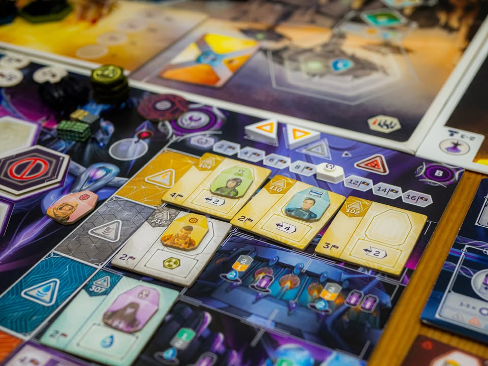
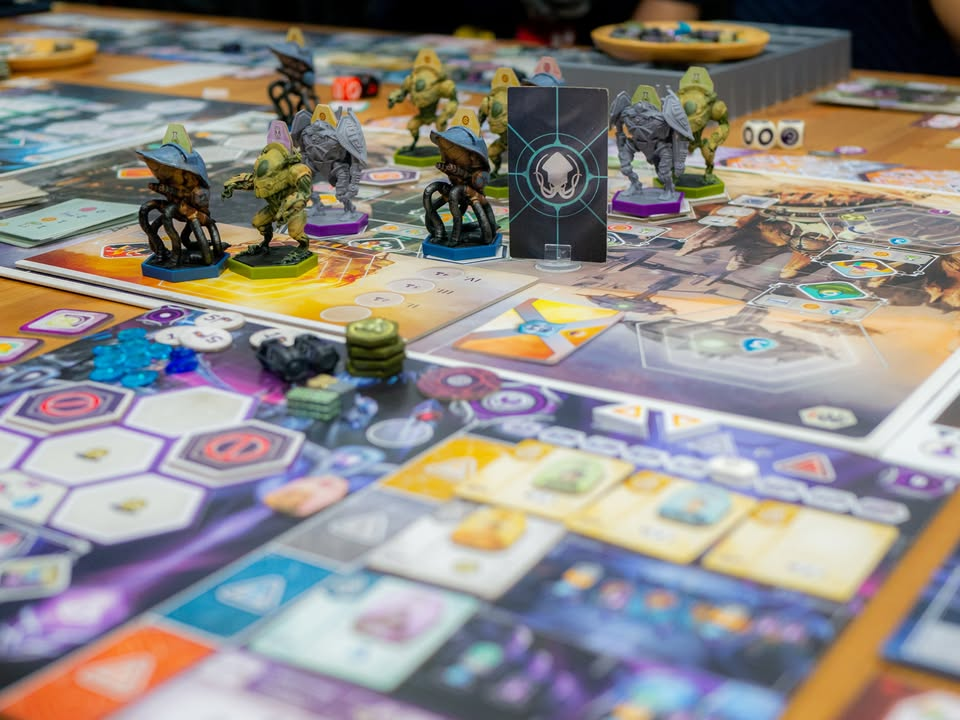
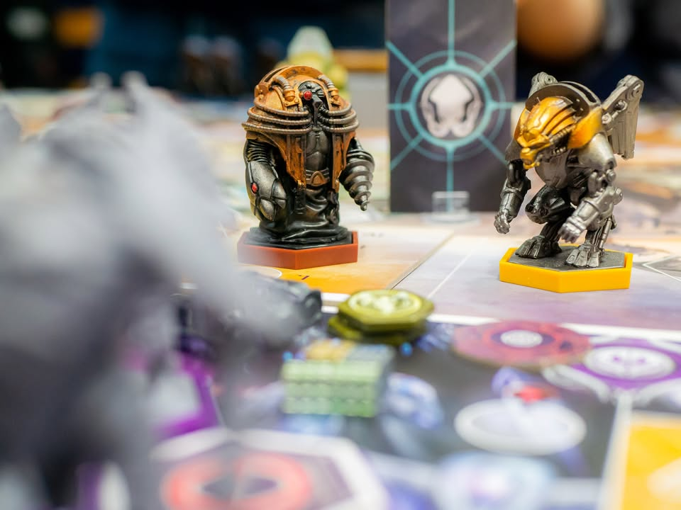
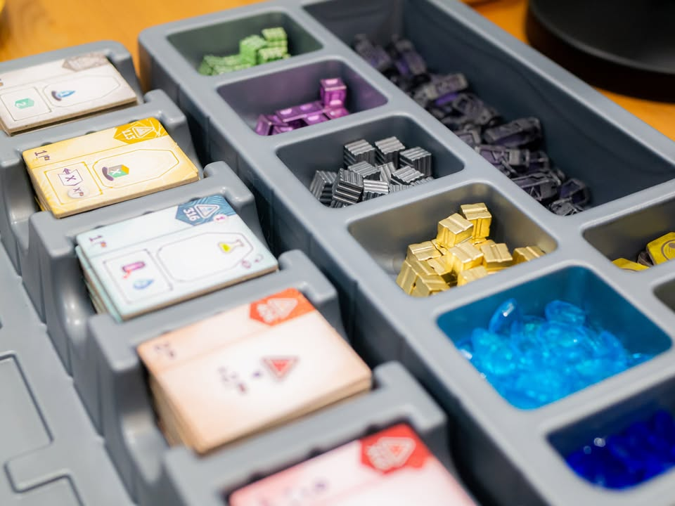

Anachrony's Expansions (Fractures of Time & Future Imperfect) #bite_size
.
🔹 ผมเคยเขียนเกี่ยวกับเกมตัวหลักไว้ตั้งแต่สี่ปีที่แล้ว อันนี้เอาตัวเสริมใหม่จากมุมมองตัวเองมาเล่าสู่กันฟังครับ ส่วนรีวิวอันเก่าอ่านได้ตรงนี้เลย https://tinyurl.com/yyz7tycx
.
.
🔹 ตัวเสริม Fracture of Time นั้นจะเพิ่มเผ่าใหม่มาให้เล่น (รวมถีงปรับ balance ตัวเก่า แต่ว่าเกมยังเล่นได้สี่คนเหมือนเดิม) และระบบการเล่นใหม่คือการ Blink ที่เป็นการเอาหุ่นที่เราทำแอคชั่นไปแล้ว 'กระโดดวาร์ป' ไปทำแอคชั่นช่องอื่นได้อีกครั้ง โดยการกระโดดก็ต้องไปหาทรัพยากรพลังงานชนิดใหม่บนบอร์ดเสริมอีกที
.
.
🔹 การกระโดดได้เนี่ยทำให้ decision space ของเกมเพิ่มมาหลายขยักอยู่เพราะช่องที่เคยเต็มอาจจะกลับมาใช้ได้ใหม่ การเลือกว่าจะย้ายตัวที่ทำไปแล้วหรือใช้ตัวที่มีก็ต้องคิดเพิ่มอีกนิด กิมมิครองๆที่เอามาเสริมกลไกนี้แม้จะฟังเหมือนเยอะแต่ก็เข้าใจง่ายตามธีมดี 
.
.
🔹ระบบที่ปรับของเดิมอย่างตึก Anomaly ที่จะได้รับหากเรายุ่งกับกระแสเวลาเยอะเกินไป ที่มีหลายแบบแตกต่างกันนี้ผมค่อนข้างชอบนะเพราะบางตึกมีความสามารถแถมด้วย ทำให้การวางแผนกู้มันมีมิติมากขึ้น ไม่เหมือนอันเดิมที่มันก็เหมือนๆกันแค่เกะกะนิดหน่อย
.
.
🔹ในฐานะตัวเสริมแล้วผมคิดว่าถ้าชอบตัวหลักแล้วก็ควรมีตัวนี้เลยล่ะ ขี่หุ่นโดดไปมาสนุกดี แต่ถ้าใส่กล่องนี้เดี่ยวๆอาจจะโหวงไปหน่อยเพราะที่ให้โดดมีน้อยลง คิดว่าใส่กับโมดูล Pioneers of New Earth ที่ให้เราปรับหุ่นไปหาของก็ลงตัวดี
.
.
🔸 แต่ตัวเสริมอีกชุดคือ Future Imperfect นั้นผมค่อนข้างผิดหวัง (มีสามโมดูลเล็ก และหนี่งโมดูลใหญ่)
.
.
🔹 โมดูลใหญ่คือ Intrigues of the Council จะให้เราเอา Objective Card ที่เป็นแต้มระยะยาวออกไปแล้วให้ผู้เล่นไปลงช่องแอคชั่นเพื่อหยิบไทล์สองส่วน ได้แก่หมวดของแต้ม และส่วนคะแนนมาวางประกอบกัน ระหว่างเล่นก็สามารถวางไทล์ทับแก้หมวดแก้แต้มกันไปมาได้ (ธีมว่าการเมืองงี้) แต่เล่นจริงแล้วแต้มนิดนึง เล่นล่ะไม่อิน ขี่หุ่นมาเล่นการเมืองงี้ คือผมชอบไอเดียนะแต่รู้สึกว่าแข่งตามเป้าหมายสุ่มต้นเกมมันค่อนข้างพอดีเหมาะกับสไตล์เกมมากกว่า 
.
.
🔹 ซ้ำร้ายด้วยระบบกลไก Mission Card ส่วนตัวสุ่มๆที่แต่ละตาจะบังคับ (แบบอ้อมๆ เพราะถ้าทำก็ได้อะไรนิดนึง แต่ถ้าไม่ทำก็เสียแต้ม) ให้เราต้องไปทำแอคชั่นช่องนั้นนี้ตามการ์ดบอก ถ้าใส่รวมกันกับตัวเสริมอื่นแล้วรู้สึกว่ามันลีลาเกินไป กลายเป็นเกมงึมงำไปซะอย่างนั้น เพราะช่องที่อยากทำจริงๆก็ต้องมอง เคลมตามเป้าก็จะเอา แถมอยากจะโดดวาร์ปก็ต้องคิด แต่ด้วยความที่มันมีอะไรให้ทำงึมงำเยอะดีหลายคนอาจจะชอบนะ มีความรู้สึกว่าต้องวางแผนต่อรอบเยอะขึ้น
.
.
🔹 แต่โมดูลย่อยอีกสองอันคือการวางวาร์ปไทล์หมวดใหม่เพื่อเอาการ์ดแรงๆมาเล่น (Quantum loops) กับระบบกู้แอคชั่นฉุกเฉิน (Hypersync Future Actions) ที่คงไม่ได้ใช้บ่อยๆแต่มีไว้ก็ช่วยให้เกมไม่อึดอัดนักนี้ผมคิดว่าดีนะ แต่ตัวความที่มันไม่ใช่โมดูลหลักผมเลยคิดว่ากล่องนี้ค่อนข้าง false เพราะไม่ใส่เลยซักอันก็ได้ผิดกับ Fracture of Time ที่มีแล้วเกมสนุกแบบเห็นได้ชัด (แต่เนื่องจากมีแล้วจากการที่ซื้อกล่อง infinity box ผมก็จะใส่สองอันนี้ไว้เป็น default ล่ะ)
.
.
🔹 ส่วนคุณภาพ insert ของกล่อง Infinity นั้นก็โอเคจัดวางเป็นระเบียบดี แต่ข้อหงุดหงิดคือมันใส่ตึกไม่พอดีเวลาใส่ตัวเสริมครบกับการจัดวางหลายจุดต้องล้วงไทล์เองเพราะเว้นร่องไว้ไม่พอ แล้วก็พลาสติกคิดว่ามันน่าจะหนากว่านี้อีกนิดนะ แต่โดยรวมก็ใช้งานในเชิงจัดระเบียบได้ดี เว้นที่ไว้รอใส่ซองให้แล้วด้วย
.
.
🔹 ในแง่หนึ่งแล้วผมค่อนข้างหงุดหงิดเวลาเล่นเกมที่ใช้ตัวเสริมระบบโมดูลที่ทำมาหลายแบบแต่ดันใส่พร้อมกันหมดไม่ได้ เยอะไปบ้าง ไม่เข้ากันบ้าง แถมต้องมาคอยแยกการ์ดใส่ของเข้าออกอะไรอีกแบบนี้พอควร ถ้าให้จัดชุดที่ชอบ ส่วนตัวแล้วผมคิดว่าคง Base + Fractures of Time + Pioneers of New Earth นั้นเป็นตัวที่ผมน่าจะชอบมากสุด ถ้าชื้อแยกทีหลังกล่อง Future Imperfect นี้ไม่ค่อยน่าสนใจเท่าไร เพราะตัวหลักที่ให้เรามาปรับ Objective มันลีลาเยอะเกินไปแต่ดันให้ผลนิดเดียว โมดูลรองก็ไม่ได้มีผลอะไรกับการเล่นนัก (แต่อีกล่ะ เชื่อว่าถ้าใครซื้อมาขนาดนี้แล้วก็คงเอาหมดกันอยู่ดี กับหลายคนอาจจะชอบก็ได้เพราะงึมงำดี แต่ผมคิดว่ามันเยอะกว่าตัวเกมมากเกินไป)

--------------------------------
หมวด Bite Size (พอดีคำ) นี้กะว่าจะเขียนอะไรสั้นๆประมาณนี้ล่ะกัน ใหม่บ้าง ซ้ำบ้าง เกมที่ขี้เกียจเขียนบ้าง เขียนๆไว้ก่อนเผื่อมีอารมณ์อาจจะขยายไปลง Thought บ้าง จริงๆอยากเขียนสั้นกว่านี้ แต่ยังอดไม่ได้ที่จะต้องอธิบายอะไรเพิ่มตามนิสัย เดี๋ยวค่อยๆปรับไปล่ะกัน

