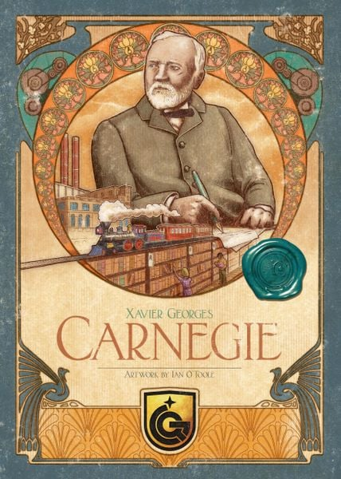

คุยเล่นเล่าสู่กันฟังถึง เกมที่ผมซื้อ/KS ที่ผมกดช่วงนี้
.
▪️ ผมเลือกเกมจากสัญชาตญาณ (ซึ่งแป๊กบ่อย) โปรดอย่าเชื่อผมเยอะ กับผมซื้อเกมน้อยลงพอควร อะไรดูแล้วรอรีเทลได้ก็รอไรงี้ อันนี้เรียกว่ามาแบ่งปันประสบการณ์กันนะฮะ ไม่ใช่ข่าว ไม่ใช่ป้ายยา ไม่ได้สรุปอะไรทั้งนั้น
.
.
▪️ อนึ่งผมไม่ใช่สายอ่านคู่มือล่วงหน้าเพราะเดี๋ยวก็ลืม และไม่เล่นเกมกระดานบนแบบโต๊ะเสมือนทั้งหลายแหล่เพราะจับแลัวความสนุกดร๊อปเยอะจนกลายเป็นไม่ซักเกม แถมมักจะมีอย่างน้อยหนึ่งคนที่ไมค์กาก
.
.
🔹 Tinner Tail : ไม่กด รอรีเทล ผมไม่ใช่ติ่งมาร์ติน (แม้ Age of Stream, Brass จะนับเป็นสองในสามสุดยอดเกมประจำตัว) ผมเคยเล่นตัวเก่าแล้วเกมก็เพลินๆดี เอาเรื่องจริงมาผูกเป็นเกมได้โอเค แต่มาสมัยนี้ถือว่าเป็นเกมที่เล่นก็ได้ ผ่านเลยไปก็ไม่ได้พลาดอะไร ตัวใหม่ปรับจูนหลายอย่างตามสมัย แต่ไม่น่าจะต้องรีบ
.
.
🔹 Darwin's Journey : ไม่กด ค่าส่งแพง รอรีเทล แถมกลิ่นประมาณนิวตันที่ผมไม่ค่อยถูกกับความงืมงำมันเท่าไร ไว้รอเกมมาค่อยว่ากัน
.
.
--------------------------
.
.
🔹 Carnegie: Deluxe Edition
.
.
🔸 type?: KS  ส่งเดือน 9
.
.
🔸 why?: ผลงานจากทีมทำ Troyes เกมใช้เต๋าที่ผมชอบมากที่สุดเกมหนึ่ง ที่เหลือไม่อ่านเช่นเคย กดๆไปก่อน
.
.
🔸 why you shouldn't get it?: เพราะนอกจาก Troyes แล้วทีมนี้ไม่มีผลงานเข้าตาผมเลยซักเกม (แต่จะเรียกแป๊กก็เกินไปแต่ไม่เก็บไว้กับตัวซักเกม) จริงๆรอรีเทลก็ได้ของสำหรับ KS ไม่ได้อลังอะไร แต่เนื่องจากคิดว่ายังไงก็ซื้อแหละ เลยกดไว้ล่ะกันเพราะราคารีเทลอาจจะไม่ต่างมากนัก 
.
.
----------------------------
.
.
🔹 Human Punishment: The Beginning
.
.
🔸 type?: KS ส่งเดือน 9 
.
.
🔸 why?: เพราะมันโม้ว่าเหมือน Battlestar Galactica ( นี้คือเกมหาพวกมีคนทรยศที่ดีที่สุด end of discussion ) ส่วนวิธีเล่นก็แนวอเมริเทรชจ๋าๆ มีหลายทีมเป็นฝั่งคนต้องร่วมมือกันป้องกันทีม AI ส่งไวรัสทำโลกแตก แต่เกมก็มีทีมที่ทำตัวแบบ the things แพร่เชื้อให้คนอื่น กับทีมโดดเดี่ยว แต่ทีมคนชนะไม่พอ แต่ละคนมี objective ลับอีก ตรงนี้จะคล้ายๆ Nemesis ที่สุดท้ายก็ระแวงกันทั้งวง
.
.
🔸 why you shouldn't get it?: เอาจริงๆผมก็อาจจะถอน แต่พอดีมันเป็นเกมแบบที่คงไม่มีใครเอามาให้เล่นก็ลังเลเหมือนกัน ไว้ใกล้ๆว่ากันอีกที จุดหนึ่งที่เกมนี้ไม่ได้เลียนแบบ BSG คือบทมัน fixed หน่อยๆ (สิ่งหนึ่งที่ทำให้ BSG เจ๋งสุดๆสำหรับผมคือการแจกบทสองรอบ) กับผมไม่ค่อยชอบความ hidden objective แบบ Nemesis เท่าไร 
.
.
แต่ถ้าเว่ากันซื่อๆผมว่าโอกาสแป๊กเยอะอยู่ เพราะไม่รู้จะขับเน้นให้เราอินกับเรื่องในเกมได้แค่ไหน ยิ่งขี่เกมดังต่อให้ทำได้ดีนิดหน่อยแต่ไม่เจ๋งจริงก็โดนเทยับได้ง่ายๆ 
.
.
🔸 extra: ค่ายนี้ก่อนหน้าออก Human Punishment: Social Deduction 2.0 ที่เป็นการ์ดเกมเล่นคล้ายๆ Good Cops, Bad Cops ใช้ธีมเดียวกันนี้แหละ เกมก็โอเคนะแต่มันกางยากหน่อยเพราะเลือกคนเล่นมากๆ ภาษาต้องได้ อารมณ์ต้องมี
.
.
-----------------------
.
.
🔹 Coffee Traders
.
.
🔸 type?: pre-order ตัดเงินก่อน
.
.
🔸 why? : เพราะเป็นงานจากทีมสร้าง Wildcatters เกม underdog ที่ผมอวยเป็นระยะๆ (ตอนนี้ก็ underdog อยู่) แก๊งไหนชอบเล่น Brass แล้วมี 4 คนก็อยากให้ลองเล่น Wildcatters กันดูครับ ส่วนเกมนี้สนุกไหม? อ่านก่อนปล่าว? ก็ตอบว่าไม่ได้อ่านครับ ถือเป็นกล่องสุ่มเช่นเคย
.
.
🔸 what if I'm also interested? : per-order ปิดไปแล้วแต่เอาจริงๆรอรีเทลก็ได้ ตอนแรกกะว่าจะรอรีเทล แต่เห็นเปิด pre มันส่งผ่าน VFI คงไม่โดนภาษีก็เลยกดๆมา ดูจากจำนวนอุปกรณ์แล้วกดที่หลังก็คงไม่ต่างกันนัก

