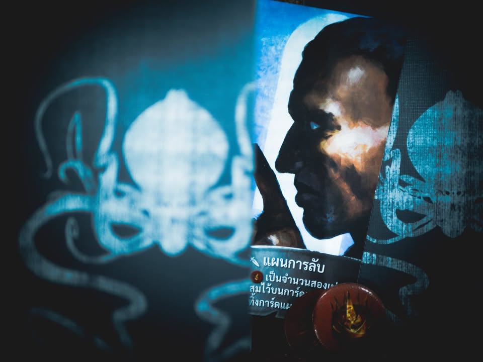
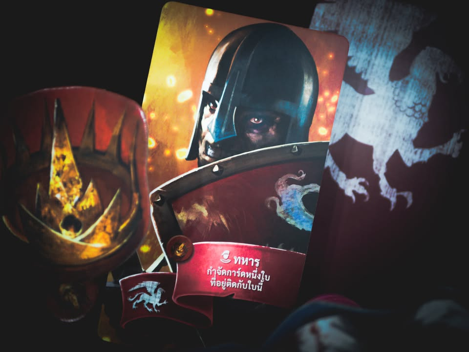
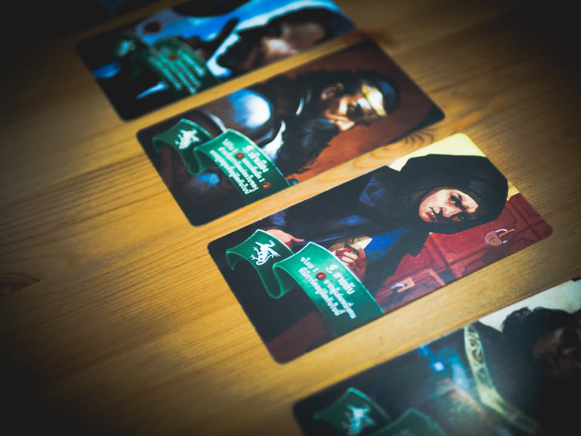

Oriflamme - ออริเฟลม #bite_size #first_impression

▪️ เกมเบาใช้ความคิดอารมณ์กึ่งปาร์ตี้ใช้เวลาไม่นาน ว่าด้วยการแย่งชิงอำนาจของเหล่าขุนนาง 

▪️ ไอเดียของเกมคือผู้เล่นจะผลัดกันวางการ์ดตัวละครจากสำรับที่ทุกคนมีเหมือนกัน แต่มีการสุ่มทิ้งออก (ทำให้ไม่รู้ว่าใครเหลือบทอะไรให้เล่น) วางต่อแถวกัน โดยจะวางด้านหน้าหรือด้านหลังแถวก็ได้ จากนั้นก็ไล่เปิดแสดงผล เกมเข้าใจง่ายอธิบายนาทีเดียว

▪️ ไอเดียที่ฟังเหมือนจะไม่มีอะไรแต่มันก็มีกลยุทธ์ที่น่าสนใจหลายอย่างที่เกิดจากความสามารถการ์ดที่หลากหลาย บางใบบอกว่าจะกำจัดการ์ดที่อยู่หัวแถวหรือท้ายแถว การ์ดบางใบจะกำจัดการที่อยู่ด้านข้าง รวมไปถึง effect หลายอย่างที่ตอนเราเลือกตำแหน่งวางจะต้องคิดถึงลำดับการเกิดผลว่าเราจะได้ประโยชน์ไหม รวมไปถีงสามารถเก็บไว้ยังไม่หงายเปิดเพื่อสะสมแต้มรอจังหวะก็ได้

▪️ ผมคิดว่ามันเป็นเกมที่ดีนะ กลุ่มที่เล่นพวกประมาณ Citadel (หรือ Coup, Avalon, Blood Bound, Love Letter,  Mascarade) น่าจะชอบเกมนี้ได้ไม่ยาก เพราะมันมีกลยุทธ์การเลือกตำแหน่งกับการแสดงผล กับข้อดีที่ผมคิดว่าดีกว่าเกมอื่นคือมันอธิบายกฎง่ายกว่าเยอะ การ์ดทุกใบความสามารถมันก็อยู่ตรงหน้า สรุปใน player aid ใบเดียวก็ไปเดาๆเอาว่าเพื่อนวางอะไร คือถ้าเป็นเกมกลุ่มพักกลางวันเกมนี้เหมาะเลย

▪️ ถ้าจะมีอะไรที่ไม่ตรงสไตล์ผมเท่าไรก็น่าจะเป็นเรื่องที่เอาจริงๆเราก็คาดเดาไม่ได้ว่าคว่ำไว้ตรงนี้แล้วเพื่อนคนต่อไปมันจะเอาอะไรมาวางติดกับเราทำให้ลำดับแสดงผลกับตำแหน่งเปลี่่ยนไปไหมนะไรงี้ (แต่มันคือความลุ้นเฮฮาสนุกๆของเกมสไตล์นี้แหละ) ทำให้คุณไม่น่าจะมีโอกาสได้เห็นผมเล่นเกมนี้ เพราะคนล่ะแนวกันไปไกล เปิดมาเกมแรกโดนเล่นวางดักตีตายงงๆโง่ๆ รุมคิลกูจัง หัวร้อนฉิบหาย สาดดดดดดดดดดดด

--------------------------------
หมวด Bite Size (พอดีคำ) นี้กะว่าจะเขียนอะไรสั้นๆประมาณนี้ล่ะกัน ใหม่บ้าง ซ้ำบ้าง เกมที่ขี้เกียจเขียนบ้าง เขียนๆไว้ก่อนเผื่อมีอารมณ์อาจจะขยายไปลง Thought บ้าง จริงๆอยากเขียนสั้นกว่านี้ แต่ยังอดไม่ได้ที่จะต้องอธิบายอะไรเพิ่มตามนิสัย เดี๋ยวค่อยๆปรับไปล่ะกัน

--------------------------------
📌 disclosure: 
* เกมแปลไทยโดย Dice Cup Board Game Cafe ตอนนี้ยังเป็นสถานะ Pre-Order ผมไม่ได้รับการสนับสนุนใดๆจากทางร้านให้มาโพส แค่พอดี KarnGG เอามาให้ลองเล่นเลยเขียนถึงประสบการณ์ตามปกติ

