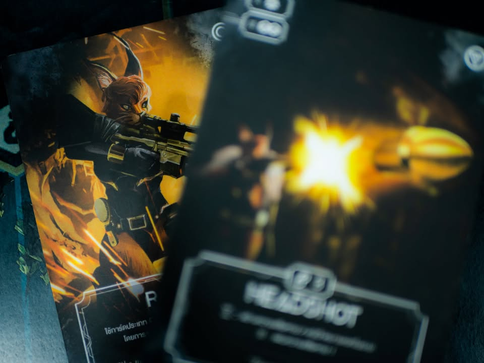
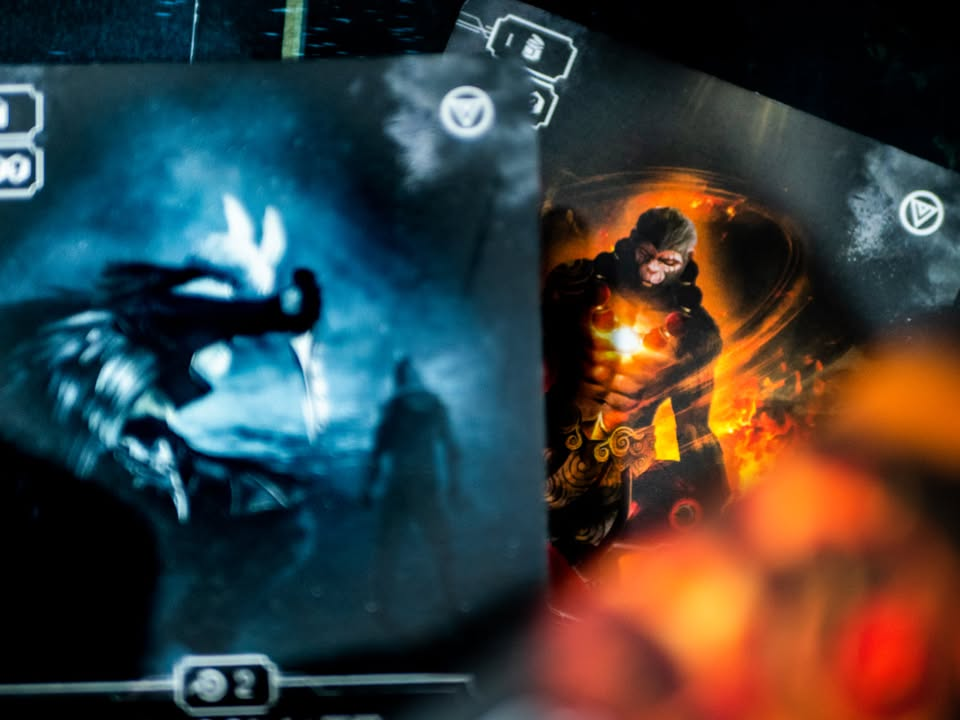
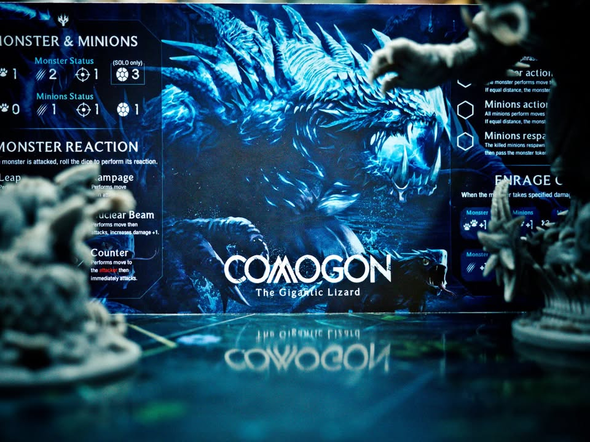
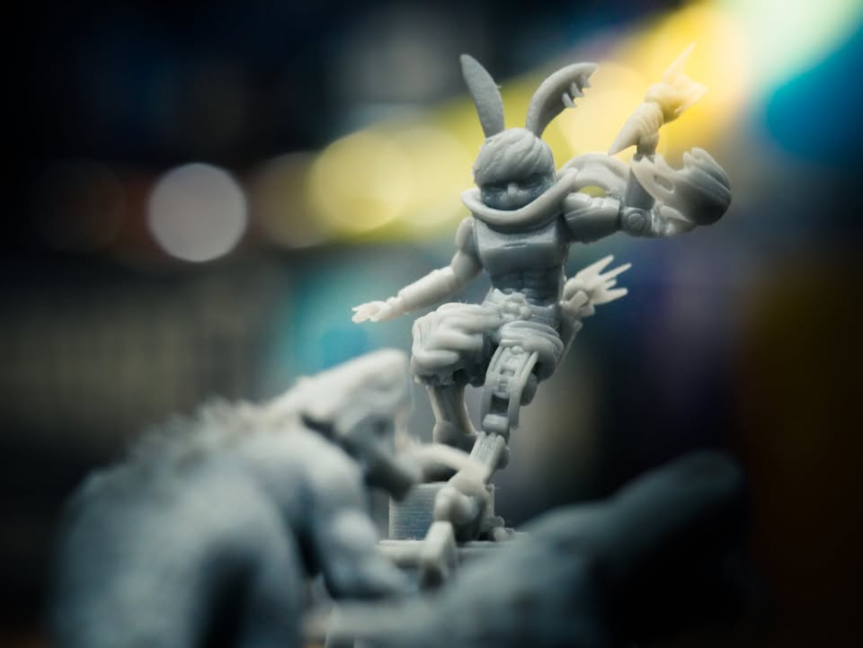
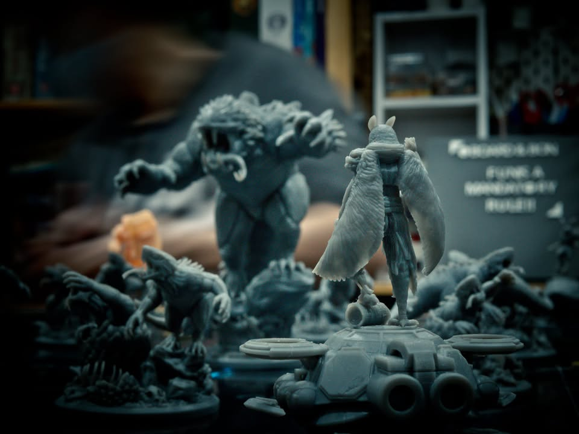
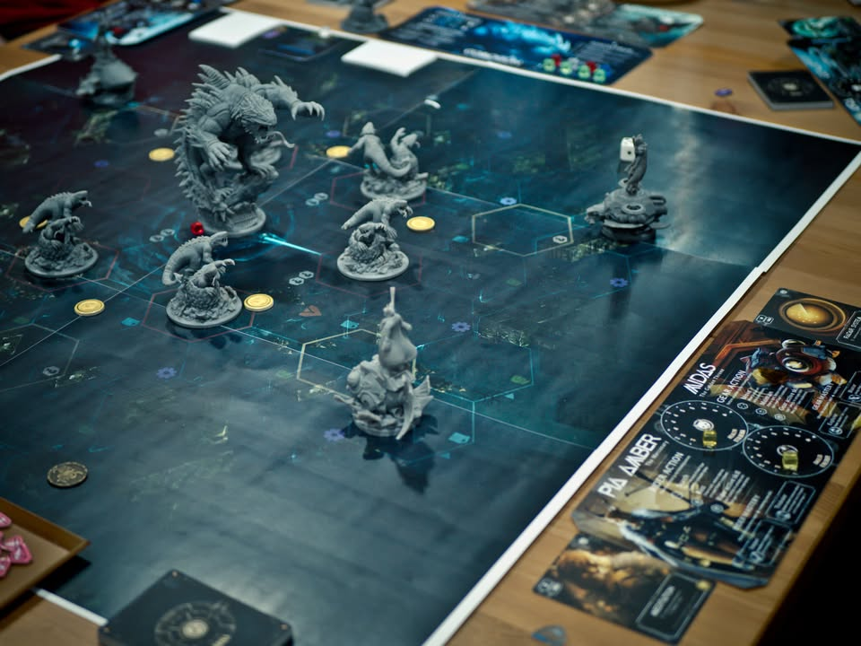
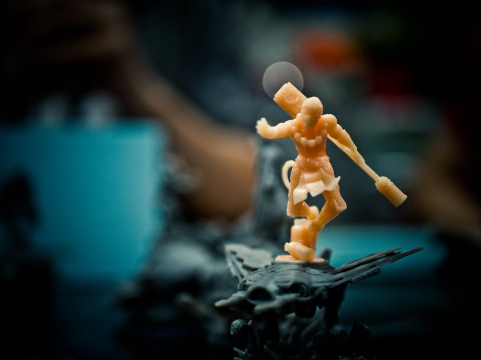
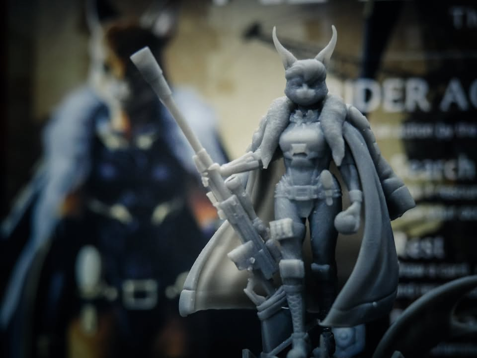
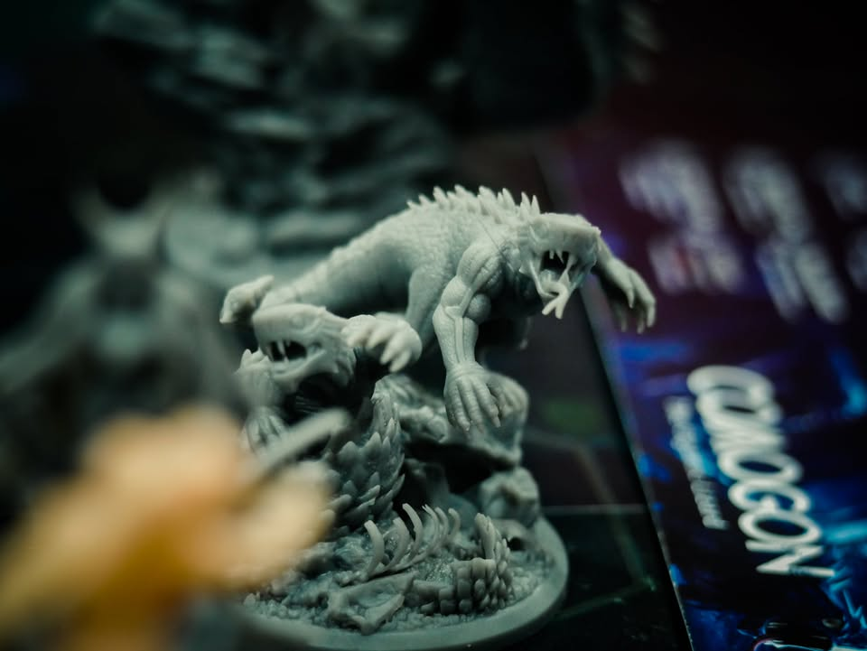
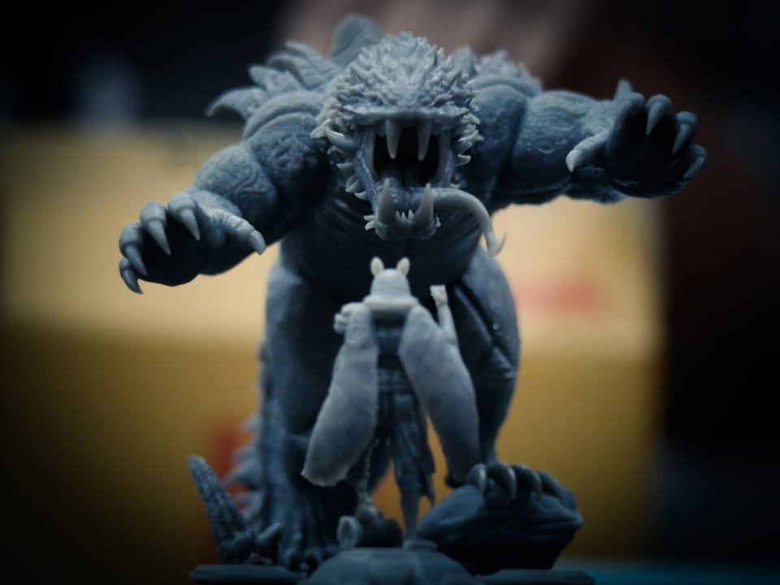

Barbaric: บาบาริค (Testing Prototype) #bite_size #first_impression

*ทุกสิ่งที่คุณ เห็น/อ่าน ทั้งหมดกำลังอยู่ระหว่างการพัฒนา และเกมยังไม่เข้าสู่ช่วงระดมทุนแต่มีการเริ่มโปรโมทบ้างแล้ว

▪️ ผลงานใหม่ที่กำลังเตรียมเข้าระดมทุนของค่าย Hexa House ผู้ผลิต Victim เกมหนีผีไทยที่ถือว่าไปตลาดโลกได้ค่อนข้างน่าประทับใจ รอบนี้มาในยุค post apocalypse ที่มนุษย์ล่องจุ้นไปหมดแล้วแต่เหล่าสรรพสัตว์ก็พัฒนาตัวเองจนล้ำหน้าพร้อมกับขี่ยานติดอาวุธเข้าไปขุดค้นอารยธรรมที่หลงเหลือของมนุษย์

▪️ แกนเกมโดยสังเขปก็คือเราจะคุมตัวละครหนึ่งตัวพร้อมกับยานคู่ใจหนึ่งลำ จากนั้นสิ่งที่เราจะต้องทำมีสองอย่างคือ วิ่งไปแย่งแกนพลังงานตรงกลางแผนที่แล้วออกมาให้ได้ หรือว่าเด็ดหัวคู่แข่งสองคน

▪️ เกมเนี่ย tech tree จะมารูปการ์ด ที่ต้องจั่วมาจาก deck ส่วนตัวกับต้องใช้ทรัพยากรในการวาง ช่วงแรกๆเราก็ต้องเดินๆวนๆหาของอัพตัวหน่อย พอเริ่มเก่งก็หาจังหวะไปสอยเพื่อน แต่ว่านอกจากเพื่อนแล้วต้องระวัง monster ตัวน้อย ใหญ่ (ใหญ่สาดดดดดดดด) ที่จะมาจ้องงับเรา แล้วยิ่งเกมนานมันก็ยิ่งงับเก่งกับเกิดลูกออกมายั้วเยี้ยเก็บไม่หมดสิ้นซักที

▪️ ตาหนึ่งค่อนข้างไวเพราะหลักๆเราก็คือ เดิน/สำรวจเก็บทรัพยากร/โจมตี/reset action ตัวละครกับยานนี้มาแยกกัน หยิบสลับกันไปมาได้ ตอนเล่นมันต้อง draft มาผสมกันทำให้สไตล์ในการเล่นมันเปลี่ยนไป เพราะแต่ละอันมีท่าไม่เหมือนกัน บางตัวเน้นยิงตรง บางตัวก็เอายานพุ่งชนแม่ม 

▪️ ตัวละครแต่ละตัวจะมี deck ของตัวเอง ยานแต่ละลำก็มี deck ของตัวเองเช่นกัน พอจับคู่กันแล้วก็จะมาสับรวมกันเป็น deck ส่วนตัวในเกม ระหว่างเล่นก็มีการจั่วแล้วค่อยมาอัพเกรดคน/ยาน แต่บางใบก็จะเป็น effect คือแทนที่จะเป็น tech tree ตรงๆก็เอาไปซุกไว้กับการ์ดความสามารถด้วยไรงี้ ทำให้บางครั้งเราก็ต้องเลือกแอคชั่นที่ไม่ใช่สายบู๊เพื่อสะสมพลังมาอัพเกรดตัวเอง

▪️ อนึ่งโจมตีเกมนี้ไม่มีเต๋านะยิงง่ายๆเลย แต่มีเรื่องระยะ แล้วก็มีการ์ดหลบหรือลดพลัง รวมไปถึงทักษะฟื้นพลังกับซ่อมยานด้วย และการตายจะไม่โดนกำจัดออกจากเกมแต่ว่าจะไปเกิดใหม่ที่ขอบแผนที่ทันที ไม่มีใครโดนเท

▪️ สำหรับ target ของเล่นสวย เกมสั้น (ประมาณ 60-75 นาที) setup ไม่วุ่นวาย กติกาไม่หนักหัว (เอาง่ายๆว่าสาย เห้ยของสวย ไหนมาสะบัดกางเล่นหน่อยสิ) เน้นมาไล่ตีบวกเพื่อนกันเฮฮา เกมนี้ค่อนข้างน่าสนใจนะ ผมเข้าใจว่ากะทำแบบ System ที่ถ้าเวิร์คนี้คงเห็นออกมาอีกหลายตัว (อารมณ์ Unmatched  ไรงี้ ) ตอนที่ผมทดสอบก็ยังมีจุดไม่ลงตัวที่ก็กำลังปรับแก้อยู่ตรงนั้นตรงโน้น แต่โดยไอเดียแกนหลักค่อนข้างตรงกลุ่มล่ะ 

▪️ ส่วนตัวแนวเน้นบู๊ตบตีเพื่อนนั้นไม่ใช่แนวผมนัก แต่ตอนเล่นก็ค่อนข้าง enjoy นะเพราะมันฉับไวดี สอนง่าย แล้วก็ sense of progress ยิ่งเวลาผ่านไปตัวเรายิ่งเก่งก็โอเคเลย ถ้ามีเวลาไม่เยอะแล้วเพื่อนชวนผมก็ไม่มีปัญหาในการเล่นนะ
--------------------------------
📌 disclosure: 
* เป็นบอกเล่าความเห็นส่วนตัว โพสนี้ไม่ได้รับการสนับสนุนในทางใดจาก Hexa House นอกจากแวะเล่นเกมด้วย

--------------------------------
หมวด Bite Size (พอดีคำ) นี้กะว่าจะเขียนอะไรสั้นๆประมาณนี้ล่ะกัน ใหม่บ้าง ซ้ำบ้าง เกมที่ขี้เกียจเขียนบ้าง เขียนๆไว้ก่อนเผื่อมีอารมณ์อาจจะขยายไปลง Thought บ้าง จริงๆอยากเขียนสั้นกว่านี้ แต่ยังอดไม่ได้ที่จะต้องอธิบายอะไรเพิ่มตามนิสัย เดี๋ยวค่อยๆปรับไปล่ะกัน

