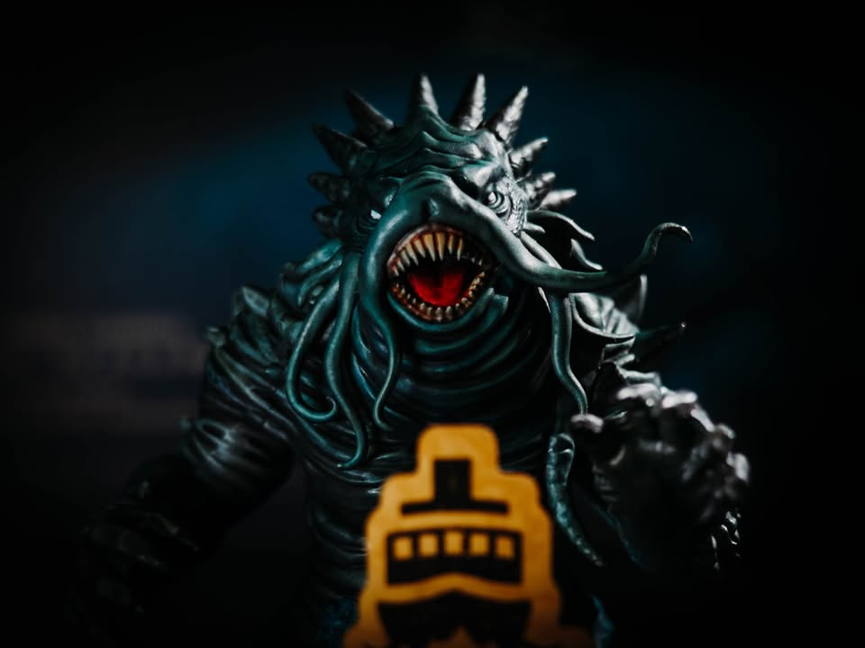
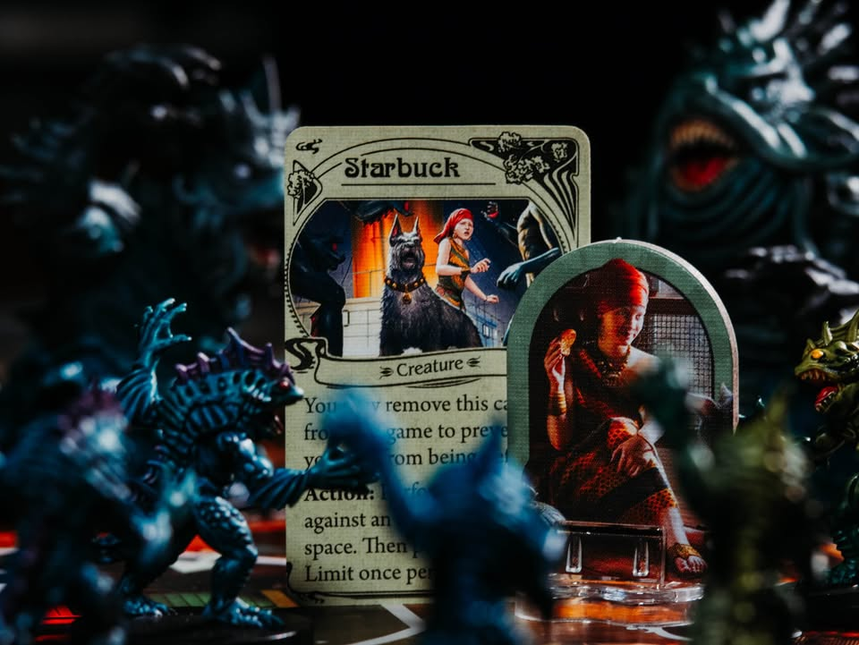
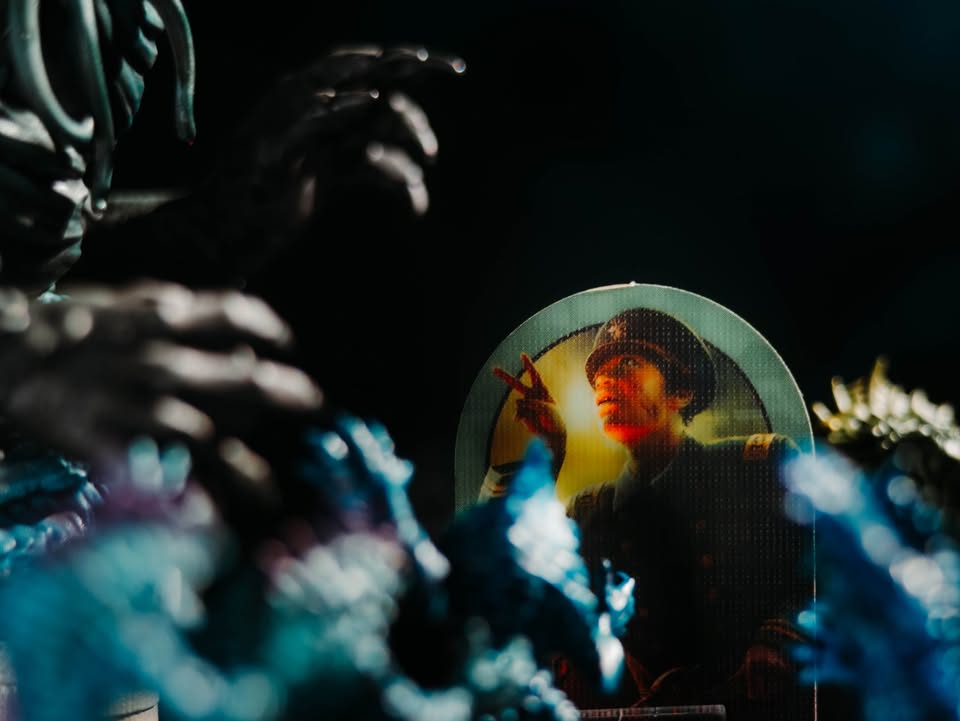
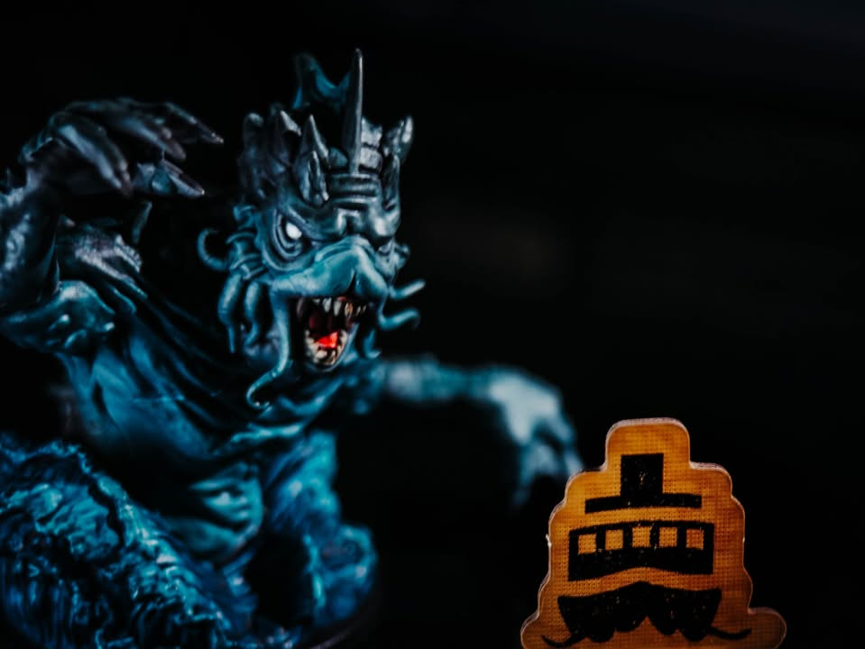
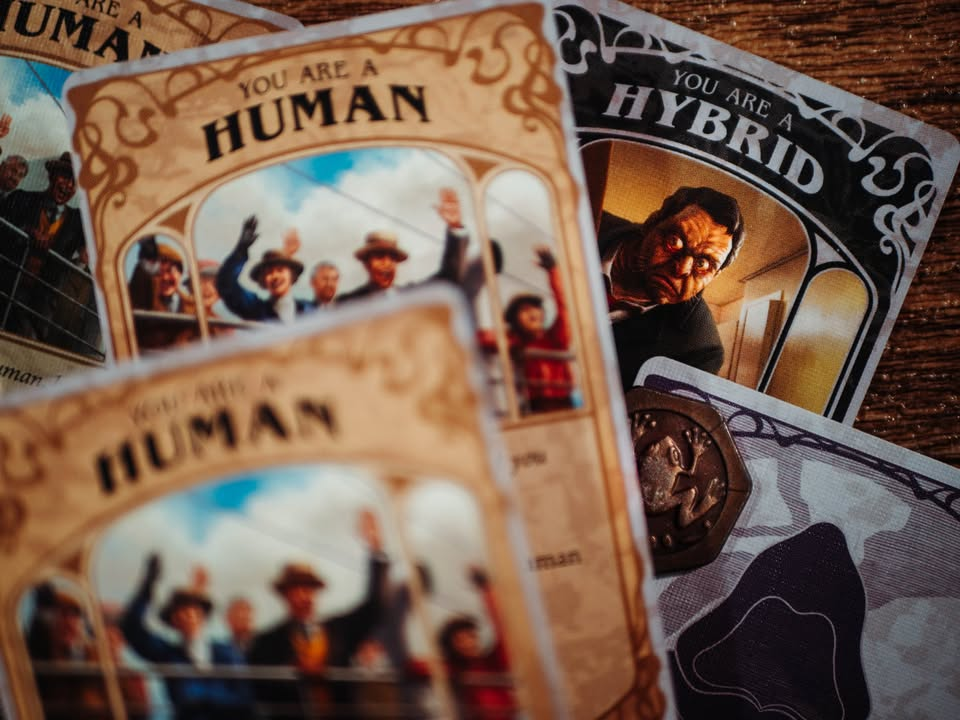
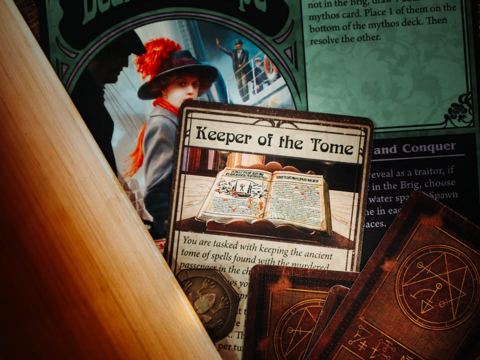
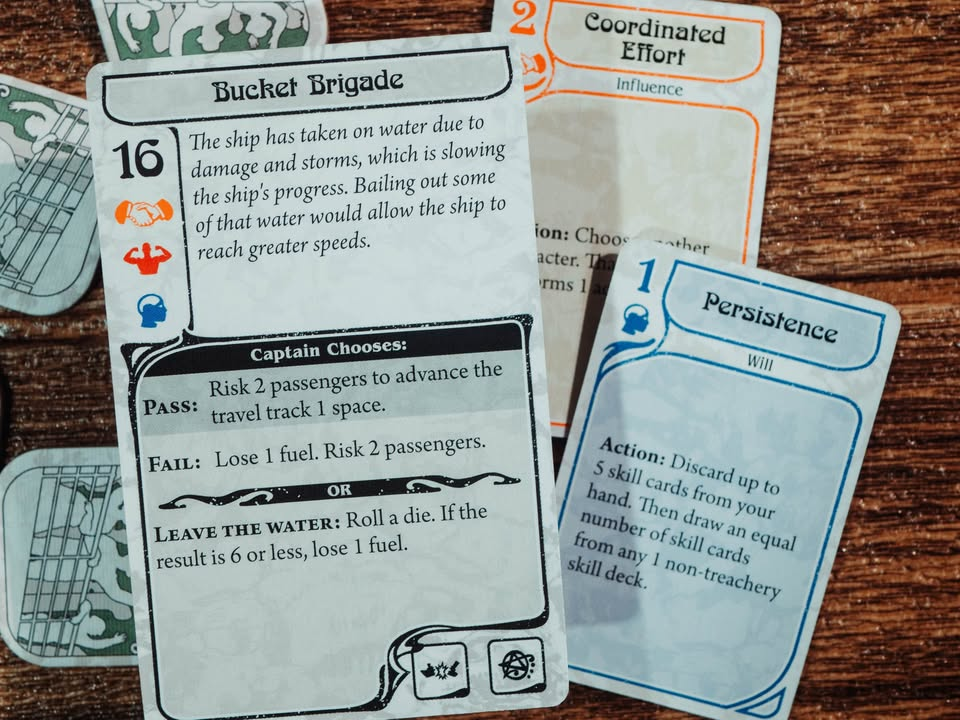
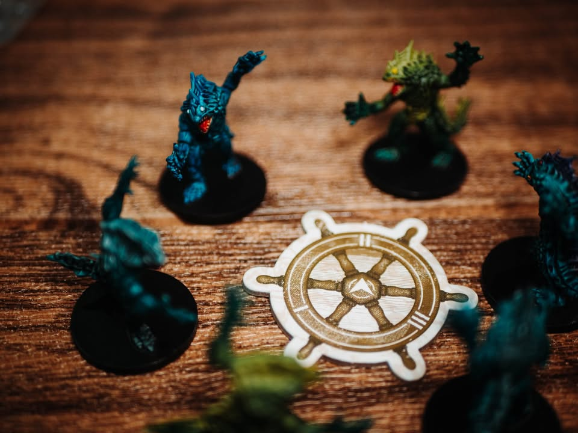

Unfathomable: ความลึกไร้ก้นบึ้ง
blog : https://boardnbon.wordpress.com/2021/11/18/unfathomable/

=====================================
▪️ เสียงหวูดดังผ่านทะเลนิ่งสงัด ไอน้ำลอยล่องและการสั้นสะเทือนของอากาศที่เกิดจากพร้อมกับการเคลื่อนไหวจากท่อเครื่องจักรที่ไอน้ำรุ่นใหม่เอี่ยม หัวเรือแหวกลอนคลื่นเงียบสงบ ในขณะที่ผมกำลังครุ่นคิดถึงบ้านเกิดที่จากมานาน

▪️ "วันนี้เป็นวันที่ดี" กับตันสิงห์พูดกับผม ได้ยินว่าเค้าเคยไปร่วมรบที่ไหนซักทีก่อนมาลงเอยที่เรือลำนี้ ฝีมือการใช้ปืนคาบศิลาของเค้านี้ไม่ใช่ย่อยเลย

▪️ "ด้วยทะเลที่สงบแบบนี้ ฉันเชื่อว่าเธอจะพาเราไปถึงบอสตั้นก่อนเที่ยงพรุ่งนี้"

▪️ สรรพนาม 'เธอ' นั้นหาได้ถึงผมไม่ หากแต่เป็นภาษาคนเรือที่พูดถึงสิ่งที่กำลังพาเราทะยานข้ามมหาสมุทรแอตแลนติกอันกว้างใหญ่ นามว่า 'เอสเอสแอตแลนติกก้า' ตอนที่ผมเห็นเธอครั้งแรกที่ท่าผมก็คร้ามครั่นในความสง่างามของเธอ ชื่อของเธอก็ทำให้ผมนึกย้อนถึงฝันร้ายในวัยเด็กที่ผมได้เดินทางท่องไปท่ามกลางหมู่ดารา ละทิ้งบ้านเกิดจากการตามล่าของปีศาจจักรกลสีเงาวับ เพื่อตามหาโลกที่สาบสูญ

▪️ วันนี้เป็นวันที่ดีจริงๆ เพราะนับตั้งแต่ออกเดินทางมา เรือของพวกเราก็ถูกสิ่งมีชีวิต หน้าตาเหมือนปลาคอยบุกจู่โจมมาตลอด บางคราอมนุษย์ที่นางยิปซีกับหมาของเธอเรียกว่า 'เดก้อน' ความเกรงขามที่มาพร้อมกับกงเล็บที่พร้อมจะบีบทุกสิ่งให้บิดเบี้ยวนั้นทำให้เรือของเราจวนเจียนจะไปอยู่ที่เดียวกับสมอเรืออยู่หลายครา

▪️ ย่างเข้าวันที่สี่ของการเดินทาง ไอ้คนอินเดียแดงนั้นอยู่ๆก็เพ้อเจ้อห่าเหว พร้อมกับลุกมาช่วยพวกปลาผีบ้านั้นพังเรือเราอีก! โชคดีที่ผมเอาสันปืนฟาดหัวมันไปได้หนึ่งที ตอนนี้ก็เลยเอามันไปมัดไว้ในห้องเก็บของ หวังว่ามันคงไม่บ้าออกมาอาละวาดอีก

▪️ ที่แปลกคือศัลยแพทย์หญิงของเรือ ผมไม่ทราบจริงๆว่าวิทยาศาสตร์กับเทววิทยาแล้วก็เวทมนต์นั้นทำงานร่วมกันได้อย่างไร แต่เหมือนนางจะสามารถอ่านหนังสือหน้าตาโบราณพร้อมกับเอยถ้อยที่ไม่เหมือนภาษาไหนๆ และทุกคราแสงประหลาดดั่งทวยเทพมาชุมนุมที่แสบพร่าจนตาเกือบมืดบอดก็ขับไล่พวกปลาปีศาจนั้นได้ทุกคราไป น่าเสียดายแค่มันดูจะทำให้เธอเหนื่อยกายแสนสาหัส ทำให้ต้องใช้เวลานานพอดู

▪️ อาร์พรุ่งนี้เราคงจะพอมองเห็นชายฝั่ง นิมิตจาก 'ท่านพ่อ' บอกเล่าไว้ชัดแจ้งว่าคัมภีร์อันน่ารังเกียจนี้ต้องดับสูญในห้วงนทีแห่งนี้ และนิมิตของท่านพ่อนั้นมิมีทางเป็นอื่น

▪️ มันคงง่ายกว่าหากผมทำให้เธอต้องอัปปางตั้งแต่เราผจญอยู่ในความโกลาหลเมื่อวาน  สภาพของผู้โดยสารเองก็พร้อมจะแหลกสลายหากมีเพียงแค่ลมพัดผ่าน ผมต้องเสียเวลาพูดปลุกใจเสียแทบแย่ 

▪️ ก็ผมน่ะไม่เหมือนพวกเหม็นกลิ่นคาวปลาที่พร้อมว่ายอยู่กลางทะเลเป็นวันๆหรอกนะ  อย่างน้อยก็อยากจะเห็นฝั่งแล้วค่อยพายเรือเล็กหรืออย่างแย่ก็ยิงพลุสัญญาญแล้วลอยคอซักครึ่งวันก็พอไหวอยู่

▪️ ผมคงต้องเดินไปหากัปตันเพื่อบอกลาครั้งสุดท้ายเสียหน่อย หวังว่าเค้าจะไม่หัวเสียกับผมนัก
.
.
.
.
▪️ เอ๊ะ เราต้องเขียนรีวิวเกมนิหว่า ดันเล่านิทานซะงั้น
=====================================

▪️ Unfathomable เป็นเกมสายธีมที่เล่าถีงการเดินทางของเรือ SS แอตแลนติกก้า ที่กำลังเดินทางไปบอสตั้น แต่ในขณะเดินทางตัวเรือและเหล่าผู้โดยสารก็เริ่มถูกสิ่งมีชีวิตที่เหมือนปลาเริ่มโจมตี แต่ว่าอันตรายนั้นไม่ได้มีแค่จากภายนอก เพราะในบรรดาผู้โดยสารเองก็มีคนที่อยากจะให้เรือไปไม่ถึงจุดหมายอยู่เช่นกัน

▪️ แกนหลักของเกมนี้คือการ "โหวต" ในแต่ละรอบผู้เล่นจะเลือกทำสองแอคชั่นที่ตัวเองต้องการ จากนั้นเปิด Mythos การ์ดมาหนึ่งใบ โดยการ์ดนี้จะเป็นเหตุการณ์ไม่ดีทั้งหลายที่เกิดขึ้นในเรือที่ผู้เล่นจะต้องมาช่วยกันส่งการ์ดสีในมือให้เลขถึงจุดที่กำหนด จากนั้นก็จบรอบ ง่ายๆแค่นี้แหละเล่นวนๆไปจนเรือถึงที่หมาย หรือไม่ก็ทรัพยากรบนเรือหมดไปซะก่อน

▪️ จุดเด่นสำคัญของเกมนี้คือการแจกบทสองครั้ง ครั้งตอนต้นเกมและอีกครั้งตอนกลางเกม (เกมนี้ใช้ธีมว่าโดนปีศาจสิงสู่) หมายความว่าเราจะไม่รู้เลยว่าทีมฝ่ายโกงจะออกมาเมื่อไร หรือว่าเราทำดีแทบตายจะเป็นตัวโกงไหม ตรงนี้ก็จะทำให้เราต้องเล่นโดยที่ไม่ optimal move ดีเกินไปในครึ่งแรก

▪️ ไอเดียการโหวตจะเริ่มจากตัวละครแต่ละตัวจะมีพื้นเพที่แตกต่างกันทำให้แต่ละรอบจะได้รับสกิลการ์ดแตกต่างกัน โดยการ์ดจะมีอยู่หกหมวดที่ก็มีธีมและความสามารถต่างกันไป ส่วนการ์ด Mythos แต่ละใบก็จะต้องการความช่วยเหลือของสีไม่เหมือนกัน การ์ดที่สีตรงจะนับเป็นแต้มบวกในขณะที่สีไม่ตรงจะเป็นแต้มลบ การส่งจะเป็นแบบปิดพร้อมกับใส่การ์ดจากกองสุ่มเข้าไปด้วยเสมอ ทำให้ตอนเปิดมาเราไม่อาจจะแน่ใจได้จริงๆว่าแต้มลบนั้นมาจากใคร

▪️ เกมนี้ฝ่ายคนจะแพ้ได้หลายทางมากทั้ง อาหารหมด น้ำมันหมด ขวัญกำลังใจหมดจนกลายเป็นบ้า ผู้โดยสารตายหมด เรือเสียหายมากเกินไป หรือโดนฝูงปีศาจถาโถมจนเต็มเรือ ในขณะที่การชนะมีได้ทางเดียวคือพาเรือไปให้ถึงที่หมาย

▪️ ตัวการ์ด Mythos เนี่ยนอกจาก Event ซวยกับซวยกว่าแล้วจะมีไอคอนเดินเกมอยู่จำนวนหนึ่ง มีทั้งเรียกปีศาจมาโจมตีเรือเรา มีแทรคพิธีกรรมฝ่ายคนที่ถ้าครบแล้วจะทำให้ปีศาจต้องหายไปจากกระดาน แล้วก็มีช่วยเดินแทรคเดินทางที่เมื่อเดินครบจำนวน 

▪️ ซึ่งว่ากันง่ายๆหน้าที่ฝ่ายคนก็คือพยายามโหวตกับยื้อชีวิตตัวเองไปเรื่อยๆนั้นแหละ แต่นอกจากนี้ก็ต้องวิ่งซ่อมเรือบ้าง ออกไปปกป้องผู้โดยสารคนอืนบ้าง วิ่งออกไปตบตีมนุษย์ปลา deep one ที่บุกเข้ามาบ้าง รวมไปถึงมาประชุมกันว่าจะจับใครที่น่าสงสัยให้เข้าไปในคุกบ้างมันจะได้ไม่ออกมาป่วน.......

▪️ ที่นี้ฝั่งคนทรยศนอกจากยืนแอบเนียนส่งการ์ดติดลบแล้วยังสามารถเผยตัวได้ด้วย หลังจากเปิดตัวแล้วเราก็จะยังวิ่งอยู่ในเรือนั้นแหละ แต่จะได้การ์ดสายคนชั่วมาช่วยป่วนเกมได้โดยตรงมากขึ้นเพื่อเร่งกดดันเกม (แต่ด้วยมิติของเกมแล้วฝายคนทรยศจะพยายามเปิดตัวให้ช้าที่สุด แต่ถ้าเว)

• เกมหาคนทรยศ สำหรับสายธีมจัดๆ 
• เกมใช้ภาษาเยอะ ต้องอ่านได้ทั้งวงเพราะมีส่วนที่เป็นความลับ แต่ภาษาใช้ซ้ำๆแบบการ์ดเกม 
• เหมาะกับ mindset อินธีมที่นั่งนอยด์จับผิดสงสัยเพื่อนตอนมันเล่น ไม่เหมาะอย่างยิ่งกับสายวางแผน หรือส่งไพ่ให้จบพ้นๆตาตัวเองไปแล้วเล่นมือถือรอ

 -----------------------------------------
🐸 [กบโปรด] 
 -----------------------------------------
 
🔹 จริงๆก็ต้องบอกก่อนว่าปกติผมจะเล่นสายยูโรกลางหนักเป็นหลัก สายธีมเนี่ยปกติไม่ค่อยเล่นเท่าไร แต่อันไหนถ้าคลิกนี้จะชอบมากๆ (โดยที่ก็ไม่จำเป็นต้องเป็นเกมใช้สมองนะ)โดยเฉพาะ Battlestar Galactica ที่สำหรับผมแล้วเป็นเกมหาคนทรยศสายธีมที่ชอบสุดๆ เพราะเป็นเกมที่ผสมความตอแหลและหวาดระแวง ร่วมไปถึงบรรยากาศการพูดคุยที่ผมเอ็นจอยกับมันทุกครั้งที่เล่น และ Unfathomable ก็เป็นภาคแยกที่รับเอาแนวคิดนี้กลับมาทำใหม่ได้อย่างน่าสนใจ

🔹 จุดเด่นคือจริงๆ ที่คนจะ hit or miss ของเกมคือบรรยากาศและความไม่แน่นอน คุณจะไม่รู้เลยว่าตานี้เราเป็นคนดีแล้วไปกลางเกมจะเป็นคนแบบไหน หรือเพื่อนคนที่แสดงออกว่าดีตอนนี้จริงๆมันส่งการ์ดแบบที่มันพูดไว้ไหมนะ ว่าแต่เอ๊ะเราแน่ใจได้จริงๆหรือว่าการติดลบที่เกินมันมาจากคนๆนั้นเพราะก่อนหน้าอีกคนมันก็จั่วนอกสีตัวเองไปนิ? เป็นเกมที่สร้างความระแวงสงสัยให้กับเราไปทั้งเกม 

🔹 อีกอารมณ์หนึ่งที่เกมนำเสนอแล้วผมชอบมากคือการต้องยอมปล่อยวางให้เรือโดนบ้าง เพราะว่าผู้เล่นมีทรัพยากรในการโหวตที่จำกัด ช่วยทุกอย่างไม่ได้ ก็ต้องปรึกษากันดูว่าส่งช่วยอะไรได้แค่ไหน ซึ่งตรงนี้นอกจากจะเป็นทีมเพลย์แล้วยังเปิดช่องว่างให้ฝ่ายคนทรยศได้พูดคุยโน้มน้าวสร้างจังหวะหักหลักตอนโหวตได้ด้วย

🔸 แต่ถ้าคุณไม่อินกับการนั่งระแวงเพื่อนหรือคุยกับคนอื่นนอกเทิร์น เกมนี้จะเป็นเกมที่ไม่สนุกเอามากๆสำหรับคุณเพราะมันจะกลายเป็นเกมที่รอรอบนานจัดแล้วตานึงๆก็ไม่ได้ทำอะไรนาน ทำสองแอคชั่นง่ายๆแล้วก็โหวต บางคนก็บอกว่ามัน repetitive ซ้ำซากไรงี้ ซึ่งผมก็ไม่เห็นด้วยเท่าไรเพราะเกมไหนๆมันก็มีลูปซ้ำๆเป็นของตัวเอง แต่นั้นแหละถ้าไม่อินเกมอะไรก็น่าเบื่อ

🔸 ผมเคยได้ยินมาจากหลายคนว่าข้อเสียของ 'system' นี้คือถ้าใครเปิดตัวแล้วจะเหงามากไปทั้งเกมเพราะไม่มีอะไรทำ ซึ่งตรงนี้ผมคิดว่ามันเป็นจริงนะ.... แต่ในมุมผมแล้วมันก็ไม่เชิงข้อเสียแต่มันแค่คาแรกเตอร์ของเกมที่บังคับให้คุณไม่เล่นบุ่มบ่ามจนเกินไป หรือถ้าพูดอีกมุมหนึ่งคือเกมมันค่อนข้างเลือกคนเล่นเยอะเหมือนกัน ถ้า mindset ไม่ตรงนี้เหงายาวมาก (ถ้าชอบสั้นหน่อยก็ไปเล่น Darkmoon ได้ แต่พอมันสั้นกว่าความอินก็โดนทอนไปเยอะตามระยะเวลาอะนะ)

👁‍🗨  แน่นอนว่าเกมนี้ไม่เหมาะสำหรับ mindset แบบ master mind หรือสายวางแผนกลยุทธ์อะไร แต่จะมาเล่นเอาฮามั่วซั่วก็ไม่ได้เช่นกัน แต่มันเป็นเกมสำหรับคนที่พร้อมจะเบลนไปกับเกมจริงๆ ถ้ามีคนไม่อินซักแค่คนเดียวเกมจะกร่อยเอาง่ายๆเพราะถ้าส่งการ์ดแบบไม่มีใจจะพาเรือไปข้างหน้า (หรือล่มเรือ) นี้เกมนี้ไม่มีอะไรเลย เป็นเกมส่งการ์ดดวงๆไม่สนุก

👁‍🗨  ในแง่งานศิลป์ตัวเกมส่วนตัวผมไม่มีปัญหาอะไรนะ แต่ก็มีเพื่อนในวงกับหลายคนบอกว่าการ์ด Event กับ การ์ดโหวตทำแอคชั่นนี้มันโล่งจนดูเหมือนขี้เกียจไปหน่อย คือไม่มีรูปเลย มีแต่ตัวหนังสือเต็มพรืด ประหนึ่งอ่านเกม prototype อยู่ แต่ตรงนี้ค่อนข้าง minor ไม่ได้มีผลต่อประสบการณ์การเล่นรวมอะไร

👁‍🗨  ผมตั้งใจมากที่จะไม่เปรียบเทียบเกมนี้กับ Battlestar Galactica ที่เป็นต้นฉบับในข้อเขียนนี้ ด้วยสาเหตุใหญ่คือ BSG มันเลิกผลิตไปแล้ว แต่ถึงมีสองเกมผมคิดว่าถ้าเจอผู้เล่นใหม่ผมก็น่าจะกาง Unfatomable ให้ก่อนเสมออยู่ดีเพราะมันเข้าเกมได้เร็วกว่า ถ้าอินแล้วเล่นไปสองสามครั้งก็อาจจะมีสลับไปไปขี่ยานอวกาศบ้าง แต่ทั้งสองเกมก็ไม่สามารถแทนที่กันเองได้แต่อย่างใด ถ้าไม่เคยเล่น BSG มาก่อนก็ไม่ต้องโหยหาครับ 

💬 โดยสรุป สำหรับอารมณ์อยากจะเล่นเกมสายธีม กับวงที่มีพร้อมจะเล่นเกมบลัฟพ่วงสตอรี่ย์นี้ยังไงก็ชอบมาก ถ้ามีตัวเสริมก็คงมีอะไรสนุกๆออกมาให้เล่นอีกเยอะ แต่เท่าที่มีในกล่องหลักก็สนุกเพียงพอในระดับที่กล่องเดียวจบแล้วครับ

--------------------------------
📌 disclosure: 
* เกมนี้ผมส่งไปทำสีที่ร้าน Bewitched และจ่ายเงินในฐานะลูกค้าตามปกติ แต่จะบอกว่าผมเล่นเกมที่มี miniature ไม่เยอะนัก แล้วเกมที่คิดว่าอยากจะจ่ายตังทำสีน่ะ ก็มีไม่กี่เกมหรอก (ปกติซองยังไม่ซื้อ insert นี้ยิ่งแล้วใหญ่) แล้วร้านเค้าทำเรทราคามาดีด้วยล่ะ 

💰 support: สามารถสนับสนุนผมทางอ้อมได้ด้วยการซื้อสินค้า Say Hi Board N Bon มูลค่า 1 บาทพ่วงกับเกมอื่นเมื่อซื้อของกับร้าน Bewitched ( เป็นโครงการสนับสนุน Creator ของทางร้าน เงินไม่เข้าผมโดยตรง แต่จะเป็นข้อมูลที่นำไปสู่การสนับสนุนกลับจากทางร้านในรูปแบบต่างๆ) https://shp.ee/vpzkpn8 
-----------------------------------------

😍 กบโปรด - อวยไส้แตก ยากมากที่เล่นแล้วจะรู้สึกไม่สนุก
.
😁 กบชอบ - พร้อมจะเล่นตลอด 
.
🙂 กบโอเค - ชอบในบางแง่มุม แต่อาจจะเล่นไม่บ่อยหรือเล่นแค่บางอารมณ์
. 
😐 กบเฉย - ไม่ได้เกลียดอะไร ถ้าไม่มีตัวเลือกอื่นก็เล่นได้อยู่
.
🖕 กบไม่เล่น - ไม่ตรงจริต (ไม่ได้แปลว่าห่วยหรือไม่ดี) ขอเล่นเกมอื่นล่ะกัน
.
อนึ่ง : เป็นความรู้สึกในความ "อยากจะหยิบมาเล่นไหม?" ของผมเอง ไม่ได้เกี่ยวอะไรกับคุณภาพของเกม ดูให้เป็นแค่ "อีกความคิดเห็นหนึ่ง" เท่านั้นก็พอนะครับ :)
.
ข้อเขียนที่ยาวหน่อยถ้าใน fb อ่านยากสามารถไปอ่านใน boardnbon.wordpress.com ได้ครับจะจัดหน้าดีกว่านี้
-------------------------------------------

