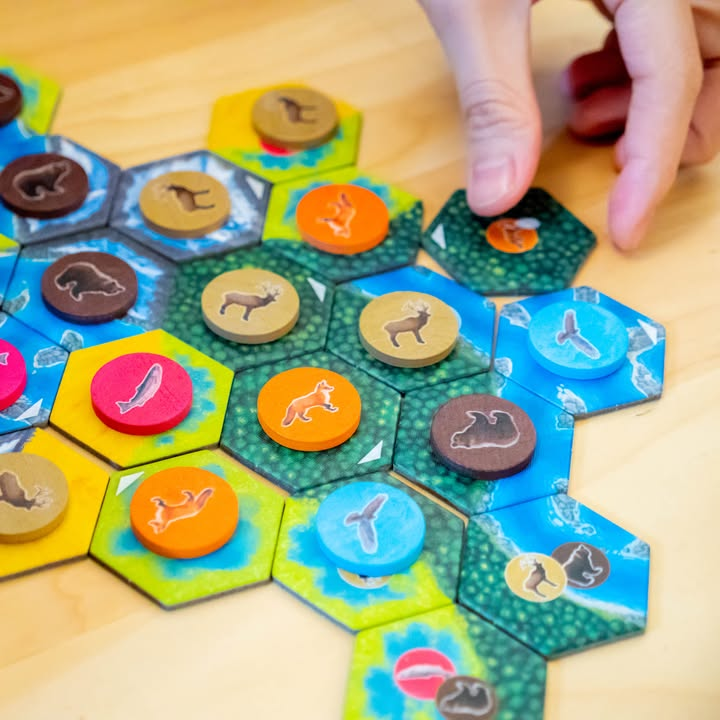
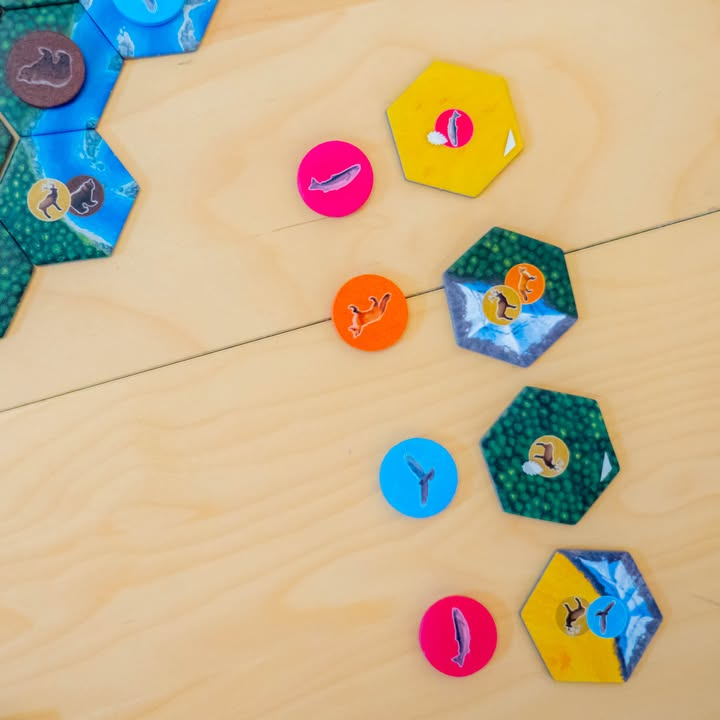

Cascadia #bite_size #first_impression

▪️ เกม tile laying ระดับเบา (แต่เชื่อได้ว่าเล่นแล้วหัวอุ่นกว่าที่คุณคิด) ที่จะมาให้เราสรรสร้างพื้นที่ธรรมชาติและจัดสรรเอาสัตว์มาอาศัยอยู่ให้เกิดแต้ม ผลงานของ Randy Flynn

▪️ ไอเดียของเกมคือเราจะต้องผลัดกันหยิบไทล์พื้นที่ กับโทเคนสัตว์ป่ามาวางต่อกันในพื้นที่ของเรา โดยไทล์พื้นที่จะเก็บสัตว์ได้ตัวเดียวและตามที่กำหนดเท่านั้น ตัวไทล์กับสัตว์จะสุ่มจับคู่กันมาทำให้ต้องคิดหน่อยว่าอยากจะได้คู่ไหน

▪️ ส่วนที่ขับเคลื่อนการตัดสินใจของเราคือการ์ดเป้าหมายที่บอกว่าสัตว์ชนิดไหนต้องวางจัดกลุ่มยังไงถึงจะได้แต้ม ซึ่งแต่ละชนิดก็จะสุ่มๆกันมาอย่างเช่นนกในเกมนี้อาจจะต้องวางให้กระจายมากที่สุด แต่อีกเกมอาจจะเน้นให้อยู่เป็นกลุ่ม ด้วยความที่แต่ละพื้นที่มันวางสัตว์ได้แค่อันเดียวแถมบังคับด้วยว่าจะวางอะไร ตรงนี้ทำให้เราต้องช่างใจอยู่ตลอดว่าจะหยิบคู่ไหนดีนะ ที่วางแล้วเราจะได้แต้มเยอะ

▪️ แต่ว่านอกจาก pattern ที่ต้องทำตามแล้ว เราก็ยังมีความโลภที่อยากจะทำให้พื้นที่ชนิดเดียวกันติดกันมากที่สุดด้วยเพราะว่าจะมีแต้มพิเศษให้ ซึ่งทำให้เกมมีเลเยอร์การตัดสินใจที่สนุกดี เพราะอยากได้ไปหมดเลยสองสามอย่างพร้อมๆกัน

▪️ ลูกเล่นที่น่าสนใจอีกนิดก็คงจะเป็นโทเคนพิเศษที่เราสามารถทิ้งเพื่อ 'โละ' จั่วโทเคนสัตว์ใหม่ทั้งหมด (ทำทีจะมีเพื่อนในวงโฮร้องว่าเปลี่ยนทำมายยยยยยยย) หรือสามารถหยิบคู่พื้นที่/สัตว์ อันไหนก็ได้ ตรงนี้ก็ช่วยทำให้เกมไม่เครียดจนเกินไป

▪️ เกมอื่นที่ใกล้เคียงน่าจะ Calico แต่เกมนี้มาในบรรกาศที่สบายใจและรู้สึกลุ้นไปกับการเติบโต แทนที่จะเป็นอารมณ์อัตคัดแค้นสมองหาทางทำ maximize แต้ม ทำให้กลุ่มคนเล่นของ Cascadia กว้างกว่าเยอะเลย

▪️ ถ้าให้เรทคงซัก [กบชอบ] คือเป็น puzzle + tile laying กลุ่มเบาที่น่าจะสนุกที่สุดที่ได้เล่นปีนี้เลย (แต่ปกติก็ไม่ค่อยได้เล่นแนวนี้นะ......) ถ้ามีอะไรที่ไม่เสียดายนิดๆก็คงเป็นอาร์ทที่ธรรมดาไปหน่อย ไม่แห้งแต่ก็ไม่สวยขนาดไปชมว่างามแท้ ถ้าได้ซักอย่าง Parks นี้เจ๋งเลย ( เอาจริงๆที่เอามาลงช้าเพราะแอบขี้เกียจเขียนเนื่องจากตอนเล่นไม่ได้จัดฉากเลยถ่ายไม่ถูกใจเท่าไร) กับถ้าไปอยู่วงคิดนานก็จะแอบน่าเบื่อหน่อยๆ หยิบซักทีสิพี่จ๋าาาาาาาาา 

--------------------------------
📌 disclosure: 
* ค่าย Stronghold Board Game ที่ทำแปลไทยเค้าไม่ได้สนับสนุนอะไรมานะ แต่มันดีจริงๆ ควรมีติดบ้าน เล่นได้ทั้งครอบครัว ซื้อฉบับไหนก็แล้วแต่สะดวกฮะ (แต่เดาว่าตัวแปลไทยน่าจะมาพร้อมการ์ด Promo นะ)

💰 support: สามารถสนับสนุนผมทางอ้อมได้ด้วยการซื้อสินค้า Say Hi Board N Bon มูลค่า 1 บาทพ่วงกับเกมอื่นเมื่อซื้อของกับร้าน Bewitched ( เป็นโครงการสนับสนุน Creator ของทางร้าน เงินไม่เข้าผมโดยตรง แต่จะเป็นข้อมูลที่นำไปสู่การสนับสนุนกลับจากทางร้านในรูปแบบต่างๆ) https://shp.ee/vpzkpn8 

--------------------------------
หมวด Bite Size (พอดีคำ) นี้กะว่าจะเขียนอะไรสั้นๆประมาณนี้ล่ะกัน ใหม่บ้าง ซ้ำบ้าง เกมที่ขี้เกียจเขียนบ้าง เขียนๆไว้ก่อนเผื่อมีอารมณ์อาจจะขยายไปลง Thought บ้าง จริงๆอยากเขียนสั้นกว่านี้ แต่ยังอดไม่ได้ที่จะต้องอธิบายอะไรเพิ่มตามนิสัย เดี๋ยวค่อยๆปรับไปล่ะกัน

