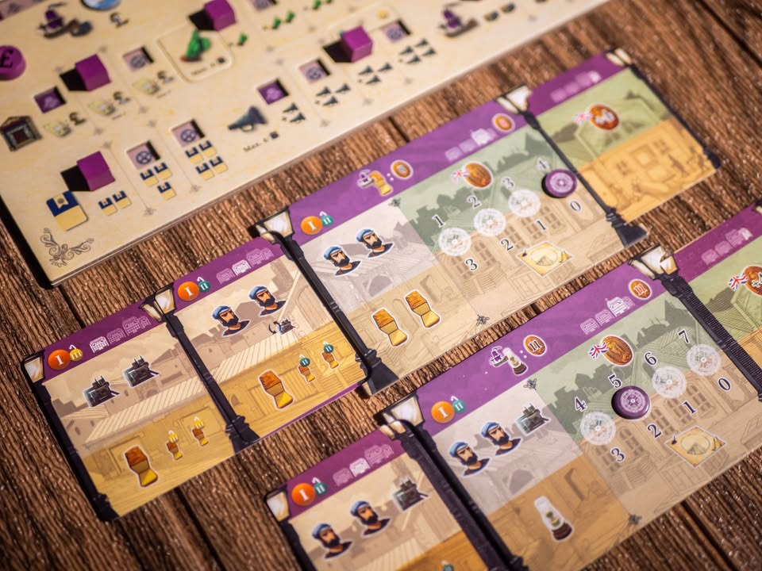
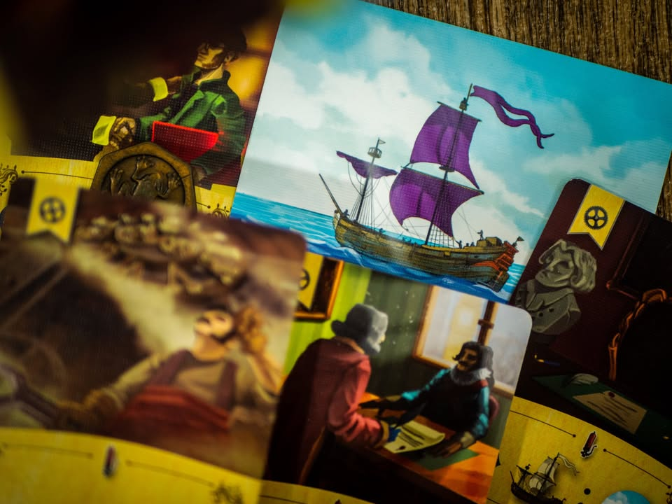
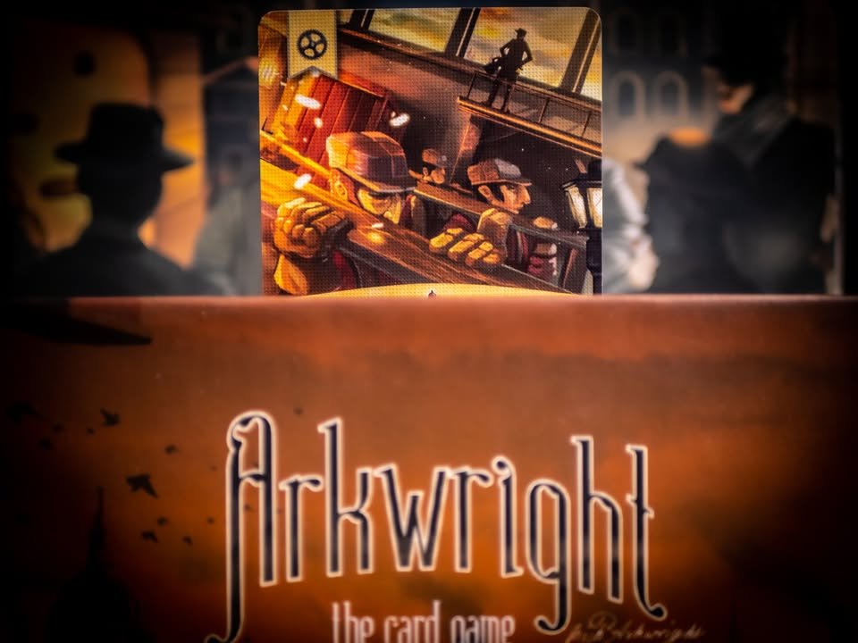
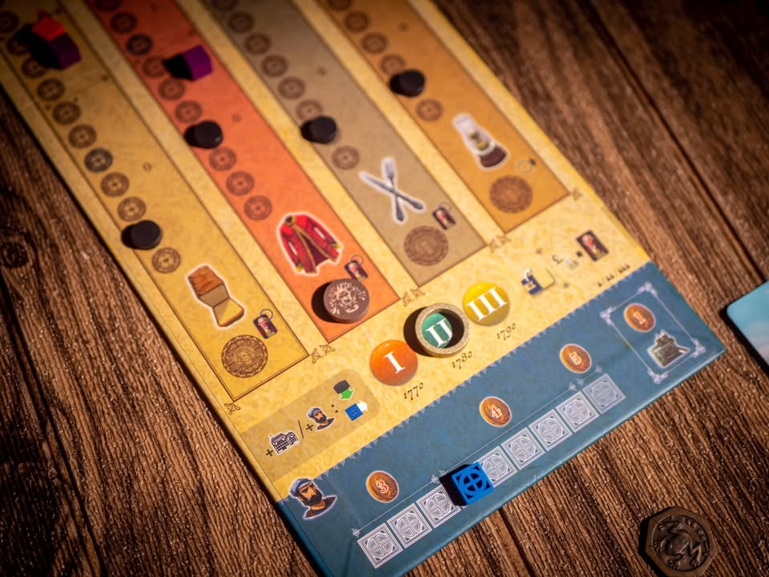
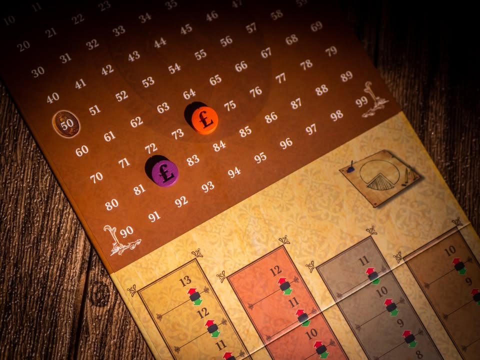

Arkwright: The Card Game #thought
blog link: https://boardnbon.wordpress.com/2021/11/26/arkwright-the-card-game/

▪️ ปี 1769, ช่างทำนาฬิกานามริชาร์ด อาร์คไรท์ ได้จดหนึ่งในสิทธิบัตรที่เปลี่ยนโฉมหน้าของโลกไปตลอดกาล นั้นคือเครื่องปั่นด้าย (spinning frame) ที่ส่งผลอังกฤษพลิกโฉมเข้าสู่ยุคปฎิวัติอุตสหกรรมโดยเริ่มจากการผลิตสิ่งทอด้วยความรวดเร็ว 

▪️ แต่ว่าเกมนี้นี้เราไม่ได้มาปั่นผ้าขายล่ะ.......... เราไปอยู่ในยุคนั้นเฉยๆ......

▪️ เกมนี้เป็นเกมยูโรระดับหนักที่มาในรูปหลอกตาว่าเป็นการ์ดเกม การเล่นก็ไม่ได้ซับซ้อนเราจะมาเป็นนายทุนมาแข่งผลิตสินค้า 4 แบบ (อาหาร,เสื้อผ้า,เครื่องเงิน,ตะเกียง) แข่งขายกันในประเทศไม่พอ ต้องมาหาสินค้าหอบขึ้นเรือไปขายที่อินเดียด้วย  

▪️ เกมจะแบ่งให้เราเล่นเป็นเทิร์นตามชนิดสินค้าไล่เรียงต่อกัน อย่างเช่นในช่วงของสินค้าอาหาร เราจะได้เล่นกันคนละแอคชั่นจากนั้น ทุกคนที่มีโรงงานทำอาหารมันก็จะเดินสายการผลิตได้สินค้ามา ส่วนเราก็ต้องจ่ายค่าจ้างคนงานในไลน์ให้เรียบร้อย (ถ้าเงินไม่พอตอนนี้ก็ต้องขายหุ้นด่วนราคาขาดทุนมาใช้หนี้) จากนั้นสินค้าจะถูกนำไปขายทันที ส่วนที่ขายในประเทศไม่พอก็จะเก็บไว้หรือส่งเรือไปขายก็ได้ พอจบเราก็เริ่มรอบใหม่ทำแบบเดิมแต่เปลี่ยนชนิดสินค้าเป็น เสื้อผ้า/เครื่องเงิน/ตะเกียง ตามลำดับ

▪️ วนสินค้าครบสี่ชนิดก็ครบหนึ่งยุค เล่นกันสามยุคก็จบเกม พูดอีกแบบทั้งเกมก็เล่นกันแค่ 12 รอบ 12 แอคชั่น

▪️ แอคชั่นที่เราทำได้ก็จะเป็นจำพวก ซื้อหุ้นของตัวเอง/ เปิดโรงงานใหม่ / จ้างคนงานมาใส่โรงงาน / เปลี่ยนคนงานเป็นเครื่องจักร / พัฒนาคุณภาพสินค้าและช่องทางการจัดจำหน่าย / การเร่งทำโอทีผลิตสินค้าเพิ่ม รวมไปถึงการรีบส่งสินค้าทางเรือออกไปก่อนรอบสินค้าตัวเอง

▪️ ไอเดียการแข่งขันในเกมจะเกิดจากความต้องการของสินค้าแต่ละประเภทที่เกิดจาก "รายได้ประชากร" ที่ถ้าเราเปิดโรงงานเยอะ จ้างงานบ่อยคนก็มีเงินซื้อของเพิ่ม พร้อมกับ ''ความน่าซื้อ" ของสินค้า ที่จะเพิ่มผ่านการเพิ่มคุณภาพสินค้า กับเพิ่มช่องทางจัดจำหน่ายของโรงงานผู้เล่น และแน่นอนว่าอีกอย่างคือ ราคา ยิ่งตั้งแพงก็ยิ่งขายได้น้อย ส่วนถูกไปก็อาจจะไม่มีเงินจ้างคนงาน.....

▪️ เกมนี้ไม่ใช่นับเงินเยอะสุดชนะ แต่ว่าจะนับมูลค่ารวมของหุ้นเราแทน ซึ่งจริงๆมันก็จะคล้ายๆกันแหละ แต่ว่าราคาหุ้นมันจะเพิ่มตามทักษะการขายของเรา หรือลดลงถ้าส่งเรือไปขายตลาดนอก เพราะเรือสมัยโน้นล่มโคตรบ่อย ผู้ถือหุ้นใจคอไม่ค่อยดี  คนที่แบ่งจังหวะไปซื้อตอนถูกๆแล้วค่อยๆปั้นราคาหุ้นมาก็จะได้เปรียบกว่า 

▪️ แต่ว่าเกมมีแค่ 12 แอคชั่นแล้วการซื้อหุ้นมันก็นับเป็นแอคชั่นด้วยนี้สิ.......เข้าซื้อไวได้ของถูกแต่ก็อาจจะเสียจังหวะปั่น engine ทำเงินได้เหมือนกัน

▪️ จริงๆเกมก็มีเท่านี้แหละ แต่ก็จะมีกิมมิคในส่วนของการ์ดแหกกฎที่เราสามารถตัดสินใจเลือกหยิบเพื่อให้เรามีความได้เปรียบบางอย่าง หรือจะเลือกพัฒนาสายของโรงงานเราก็ได้

▪️ เกมมีแบ่งเป็น basic กับ expert ส่วนตัวคิดว่าไม่ต้องเสียเวลาไปเล่น basic game นะ จัดให้ครบๆไปเลยดีกว่าไม่ได้ต่างกันขนาดนั้นหรอก

-----------------------------------------
ถ้าเคยเล่น Arkwright ต้นฉบับที่เป็นบอร์ดเกมมาก่อน
-----------------------------------------

= ระบบตลาดขายของไม่ต้องสลับกัน resolve วนเช็คว่าจะได้ขายสินค้าไหม ทุกคนขายได้ เรื่องดีคือตัดเรื่องยุ่งยากไปได้เยอะ (มว๊ากกก) ข้อเสียคือการตัดราคาขายมันหายไป
= appeal ปรับ function นิดหน่อยเอาไว้ช่วยกำหนด demand การซื้อในประเทศ
= ตัดระบบ action tile ทิ้งหมด เป็นให้เลือกทำอิสระ
= เรือ build in มาเลยไม่ต้องหามาขับ แต่ว่าการเดินเรือมีผลต่อราคาหุ้น 'รุนแรง' กว่าตัวเดิม
= หาเงินยากกว่าตัวเดิม
= development tile มีน้อยกว่าเดิม แต่ได้ track tech tree มาอันหนึ่ง
+ ไม่ต้องมาเรียง token คนงานโบลิ่งแล้ว

-----------------------------------------
🐸 [กบชอบ] 
-----------------------------------------
🔹 ในฐานะที่ผมชอบเกมต้นฉบับที่เป็นบอร์ดใหญ่อยู่แล้วก็บอกได้ว่าประทับใจในการปรับย่อความใหญ่ลงมาในกล่องขนาดเล็กที่ setup ง่าย สอนไว โดยที่ยังเก็บอารมณ์หลักไว้ได้ดีของตัวใหญ่ไว้ และยังคงความเป็นเกมหนักคิดเลขเยอะไว้เหมือนเดิม

🔹 จุดที่ทำให้เกมสนุกสำหรับผมคือการบริหาร 'จังหวะ' ทำแอคชั่นในช่วงสินค้าต่างๆ อย่างเช่นถ้าผมเปิดโรงงานตะเกียงอย่างเดียว ในอีกสามช่วงสินค้าที่เหลือผมจะไม่ได้ผลิตอะไรมาขายก็จริงแต่ก็แปลว่าผมจะมีจำนวนแอคชั่นเหลือเอาไว้ทำให้โรงงานตะเกียงผมเทพได้ (ซึ่งจริงๆก็เป็นเรื่องเดียวกับตัวต้นฉบับ แต่จำนวนแอคชั่นมีน้อยกว่ามาก)

🔹 ซึ่งเอาจริงๆทำโรงงานเดียวมันไม่ชนะใครหรอก ทุกคนเลยต้องมาคุมหลายๆโรงงาน แล้วมาดูกันว่าเราจะสามารถทำแอคชั่นไหนในจังหวะไหนถึงจะคุ้มค่ามากที่สุด คือมันจะมีโรงงานแบบเน้นขายแพงเอาเงิน โรงงานเน้นขายถูกเอาหน้าให้หุ้นขึ้น หรือไม่ก็โรงงานเน้นผลิตส่งออกไรงี้ 

🔹 การที่หุ้นขึ้นในเกมนี้ส่วนหนึ่งก็มาจากการที่สินค้าเรามีความน่าซื้อมากกว่าคนอื่นในตลาด ซึ่งไอ้การได้มามันต้องลงทุน เราก็ต้องไปดูว่าจะใช้วิธีลดราคา (ที่มักจะขาดทุน) หรือไปเสียแอคชั่น (ที่มีน้อยมาก) ไปพัฒนา ซึ่งส่วนผสมในการตัดสินใจพวกนี้ก็เป็นส่วนที่ทำให้เกมสนุกสำหรับผม แบบโรงงานก็เพิ่ม คนงานก็อยากจ้าง แต่ถ้าไม่ลงทุนพัฒนาโรงงานให้ขายได้เยอะๆหุ้นก็ไม่ขึ้นอีก

👁‍🗨 จุดกลางๆอันหนึ่งของเกมนี้คือมันมันแห้งมาก (เหมือนกับตัวเดิมแหละ) คือเหมือนนั่งมอง spreadsheet มากกว่าเล่นเกม ธีมก็ไม่ได้มีอะไรให้จับต้อง เหมือนทำงานมากกว่าเล่นเกม ถ้าไม่ชอบเกมสไตล์นี้ก็ผ่านได้เลย

🔸ข้อเสียในเชิงการออกแบบสำหรับผมคือ...... มันเป็นเกมที่ฝืนมากๆที่จะมาเรียกว่าการ์ดเกมเพราะส่วนที่เป็นบอร์ดมีเต็มไปหมด แถมไอ้ตรงส่วนที่เป็นการ์ดดันออกแบบมาห่วยใช้งานชวนสับสนมาก จะให้มาหมุนๆเปิดครึ่งเดียวทำไมก็ไม่รู้ ส่วนที่เป็นการ์ดจริงๆนี้ก็แค่พวกคนงานเท่านั้นแหละกับตัวช่วยนับว่าตอนนี้คุณภาพโรงงานเรามีเท่าไร ซี่งไอ้ของพวกนี้ทำเป็นบอร์ดแล้วเอามาร์คเกอร์มาวางหรืออะไรแบบนั้นก็ได้ ฝืนเกิ๊น กับไทล์ไม่รู้จะทำอันเล็กชวนหายง่ายไปไหน -_- ซึ่งที่เล่ามาก็ไม่ได้มีปัญหาอะไรกับความสนุกนะ

💬 แม้ฟังดูแล้วเกมมันจะไม่มีอะไร แค่เปิดโรงงาน หาคนมาแล้วขายๆของมันจะยากอะไร แต่ว่าเกมมันหนัก หนัก และหนัก! (weight 3 ปลาย) ใช้เวลาเองก็ไม่น้อย (100 นาทีนี้เล่นไงว่ะ?) จะทำอะไรคิดแล้วคิดอีกชีวิตเจ้าของกิจการเวลารัดตัว ซึ่งตรงนี้ก็แล้วแต่รสนิยมทางการเล่นเลยครับ แต่สำหรับผมคิดว่า ใครสายเกมหนักก็ซื้อๆไปเหอะ ทดแทนตัวใหญ่ไม่ได้ก็จริงแต่พกง่ายกางไว ช่วยให้เนียนกางได้บ่อยกว่า ถ้าไม่เคยเล่นตัวใหญ่แล้วเกิดเล่นตัวนี้แล้วชอบขี้นมาก็อย่าลังเลที่จะจัดตัวใหญ่ครับมันส์ไปอีกแบบ

-----------------------------------------

😍 กบโปรด - อวยไส้แตก ยากมากที่เล่นแล้วจะรู้สึกไม่สนุก
.
😁 กบชอบ - พร้อมจะเล่นตลอด 
.
🙂 กบโอเค - ชอบในบางแง่มุม แต่อาจจะเล่นไม่บ่อยหรือเล่นแค่บางอารมณ์
. 
😐 กบเฉย - ไม่ได้เกลียดอะไร ถ้าไม่มีตัวเลือกอื่นก็เล่นได้อยู่
.
🖕 กบไม่เล่น - ไม่ตรงจริต (ไม่ได้แปลว่าห่วยหรือไม่ดี) ขอเล่นเกมอื่นล่ะกัน
.
อนึ่ง : เป็นความรู้สึกในความ "อยากจะหยิบมาเล่นไหม?" ของผมเอง ไม่ได้เกี่ยวอะไรกับคุณภาพของเกม ดูให้เป็นแค่ "อีกความคิดเห็นหนึ่ง" เท่านั้นก็พอนะครับ :)
.
ข้อเขียนที่ยาวหน่อยถ้าใน fb อ่านยากสามารถไปอ่านใน boardnbon.wordpress.com ได้ครับจะจัดหน้าดีกว่านี้
-------------------------------------------

