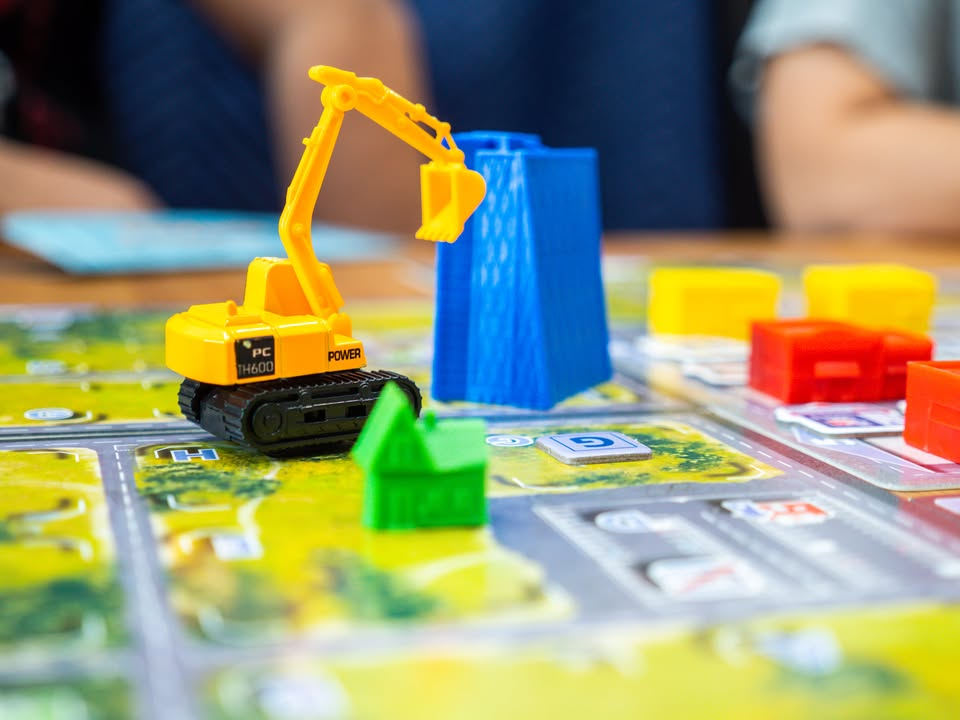
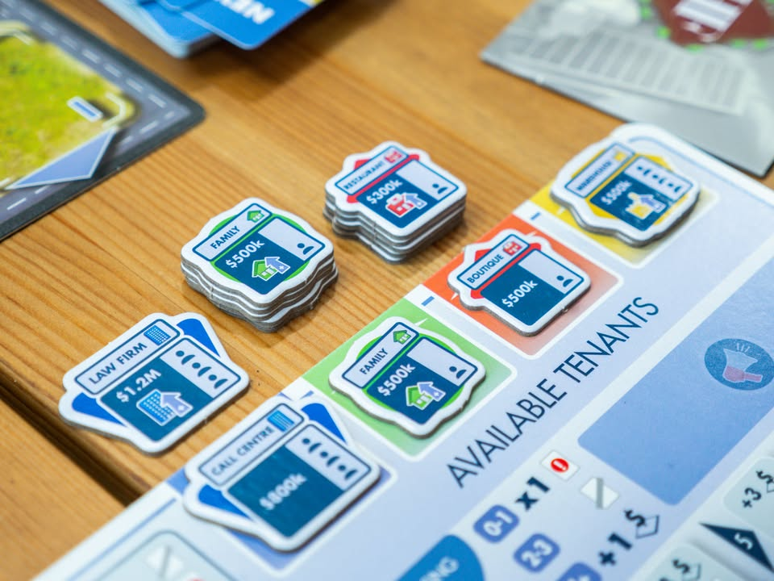
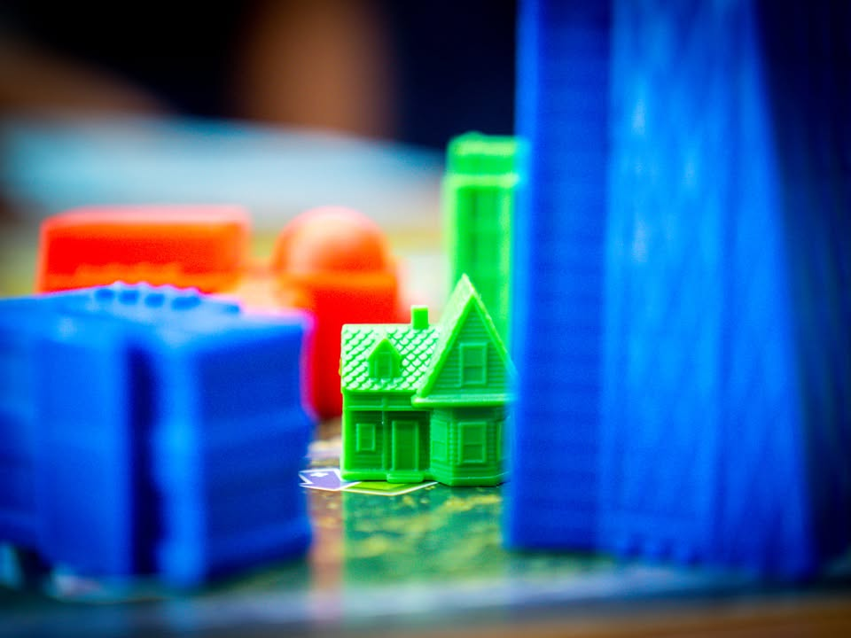
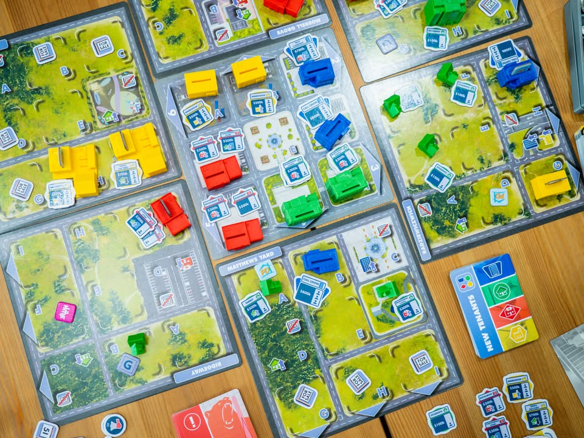
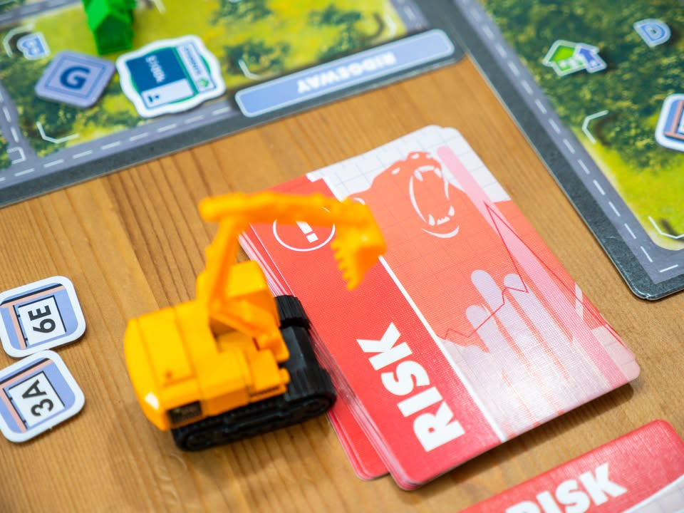

Magnete: The First City  #bite_size #first_impression

▪️ เกมยูโรระดับกลางที่จะให้เรามาพัฒนาที่ดิน สร้างสิ่งปลูกสร้าง หาคนมาเช่าซื้อแล้วก็ขายทำกำไรงามๆ แล้ววนลูป ผลงานแรกของ James Naylor

▪️ ไอเดียเกมคือในแต่ละรอบเราจะมีแอคชั่นให้เลือกทำหลักๆคือซื้อที่ดินว่างๆ จากนั้นก็สร้างตึกมาตั้งไว้ (มีสี่แบบคือที่อยู่อาศัย สำนักงาน ย่านการค้า และโรงงาน) แล้วก็ขาย โดยการซื้อขายที่ดินมันจะมีราคาตามตารางที่ยิ่งเล่นยิ่งราคาขึ้น

▪️ อย่ากระนั้นเลย จริงๆแล้วเกมนี้มันเป็นเกมปั้นอสังหาฯดึงคนมาอยู่เยอะๆแล้วขาย! เพราะการสร้างตึกอย่างเดียวในเกมนี้ไม่ทำเงิน เราต้องพยายามดึงดูดให้คนมาเช่าด้วยการทอยเต๋า ซึ่งไม่ใช่การทอยเต๋าโง่ๆอะไรแบบนั้นแต่ว่าจำนวนที่จะทอยได้ต้องดูว่าพื้นที่รอบๆมั้นมีศักยภาพคนจะมาเช่าสูงไหม

▪️ อย่างเช่นถ้าจะหาคนมาเช่าสำนักกงานก็ให้นับว่าแถวนั้นมีบ้านคนอยู่เยอะหรือยัง (ในทางกลับกันหมู่บ้านที่ห่างไกลที่ทำงานคนก็ไม่ค่อยอยากมาอยู่) อะไรแบบนั้น ยิ่งผู้เช่าเยอะยิ่งทอยได้เยอะ จากนั้นก็เอาเต๋ามา matching ดูว่าจะหยิบผู้เช่าจากใน pool กลางมาใส่ได้ไหม ตรงนี้การก่อสร้างตึกของผู้เล่นในวงก็จะมีผลกับคนอื่นด้วย เพราะราคาขายนี้คือเอาจำนวนคนเช่ามาคูณ ยิ่งตึกใหญ่คนเยอะก็กำไรแยะ หรือผู้เล่นจะใช้วิธีเก็บค่าเช่ากินยาวๆก็ได้เหมือนกัน

▪️ ลูกเล่นเล็กๆน้อยๆน่าสนใจก็มีหลายอย่างทั้งทำเลที่ซื้อที่ไหนก็ได้แต่ราคาแพง หรือจะรอซื้อที่ลดราคาที่สุ่มออกมาเรื่อยๆก็ได้ แต่ว่าหลายทำเลในเกมนั้นจะเพิ่มหรือลดหน้าเต๋าให้ตึกแต่ละประเภทแตกต่างกัน รวมถึงการใช้โทเคนโฆษณาเพื่อ fixed หน้าเต๋า 

▪️ การจบเกมทำมาง่ายแต่ได้ผลดี ก็คือยิ่งเราเล่นเกมไปตลาดก็จะฟองสบู่ราคาที่ดินพุ่งเอาๆ แต่ก็ต้องจั่วการ์ดที่มีผลทำให้ตัวแปรตลาดพังเพิ่มขึ้นเรื่อยๆ ซึ่งเลขตรงนี้เหลือศูนย์เมื่อไรก็จบเกม ส่วนที่ดินที่เราซื้อไว้ถ้าขายไม่ทันก็ต้องขายตอนราคาฟองแตกราคาร่วงจุกๆเอาเรื่องอยู่

▪️ แนะนำให้เล่นตัวเต็มไปเลยนะไม่ต้องเล่นเบสิคโหมดให้เสียเวลา

▪️ เอาจริงๆแล้วเป็นเกมที่ผิดคาดมาก (แบบมากๆ) เพราะตอนอ่านรูลนี้คิดได้อย่างเดียวว่า .... เกมเหี้ยไรว่ะเนี่ยยยย ทอยเต๋าโง่ๆเสียเวลาเล่นแน่นอน เปิดมาเจอรถตักดินของเล่นก็แบบ เหี้ยไรว่ะเนี่ยยยย ตอนเทสครั้งแรกนี้ก็แจ๊คพ็อตพอดีภรรยาที่ไม่ได้เล่นเกมด้วยกันมาเป็นปีดันว่างพอดี ผมถีงกับออกปากถามคนในวงเลยว่า ขอเปลี่ยนเกมได้ไหม ไม่อยากเสียสล็อตเวลาทองคำ แต่เล่นๆไปอ้าวเห้ยสนุกเฉย

▪️ ตอนที่สนุกคือเข้าใจว่าเห้ยนี้มันเกมเงินต่อเงิน รวยแล้วก็รวยต่อไปเอาเงินมาออกตึก แต่ว่าก็ต้องพกดวงมาทอยดึงผู้เช่าอยู่ดี กับตอนเริ่มเข้าใจว่ามันสร้างตึกตามใจไม่ได้มันต้องดูคนอื่นด้วย ไม่งั้นตอนดึงคนเช่าแล้วเต๋าให้ทอยมันน้อย

▪️ ถ้ามีอะไรที่ไม่ชอบคือมิติคนเช่ากับลำดับความคิดตอนเล่นมันตื้นเกินไปหน่อย คือทอย 4 5 6 มาจัดชุดซ้ำๆกันสามสี่ลูกเท่านั้นเอง ของก็ค่อนข้างชัดว่าเออดวงดีก็ได้คนเช่าชุดใหญ่มา (ถ้ามีให้หยิบ) ถ้าเกมมันทำให้มีตึกหลากหลายกว่านี้ก็อาจจะดี (มั้ง เพราะถ้าเยอะไปมันก็อาจจะวุ่นวายจนไม่สนุก) แต่ไอ้ความที่เน้นเต๋าแต้มเยอะพวกโบนัสทำเลทองทั้งหลายเลยโคตรสำคัญขึ้นมาทันที ก็กลับมาที่ต้องเอาเงินมาฟาดแย่งที่หนึ่งจะได้ไปจองที่ก่อน

▪️ สิ่งที่น่าสนใจคือมันเป็นเกมที่ adapt ตัวเองไปอยู่ได้หลายกลุ่มดี กลุ่มแรกคือกลุ่มยูโรกลางเบา/ครอบครัว เล่นกันแบบเฮฮาได้เลยซื้อขายๆ เอาเธอมาช่วยสร้างบ้านหน่อยโรงงานฉันจะได้มีคนมาอยู่ กับอีกกลุ่มเลยคือมันจะเป็นเกม 'ขนม' ของกลุ่ม heavy economic (พวกชอบเล่นเกม 18XX Series ไรงี้) ที่ต้องมีการฟาดแย่งชิง turn order มาจองที่ดินกับเลือกสร้างสิ่งปลูกสร้างที่ช่วยส่งเสริมกัน รวมไปถีงการแย่งชิงสิทธิ์ในการแย่งผู้เช่าที่มีจำนวนจำกัด

▪️ ในส่วนตัวผมคงให้ซัก 'กบโอเค' ก็จะมีอารมณ์ประมาณว่า "เกมสนุกดีนะ แต่อยากเล่นเกมอื่นอ่ะ" ด้วยความรู้สึกว่าเกมเบากว่าที่เล่นปกติไปหน่อย แต่เกมก็กางง่ายดีมีติดไว้ก็ต้องรื้อกติกาอะไรเยอะ ตึกค่อนข้าง overproduction แต่ก็ทำมาสวยงาม

--------------------------------
หมวด Bite Size (พอดีคำ) นี้กะว่าจะเขียนอะไรสั้นๆประมาณนี้ล่ะกัน ใหม่บ้าง ซ้ำบ้าง เกมที่ขี้เกียจเขียนบ้าง เขียนๆไว้ก่อนเผื่อมีอารมณ์อาจจะขยายไปลง Thought บ้าง จริงๆอยากเขียนสั้นกว่านี้ แต่ยังอดไม่ได้ที่จะต้องอธิบายอะไรเพิ่มตามนิสัย เดี๋ยวค่อยๆปรับไปล่ะกัน▪️

