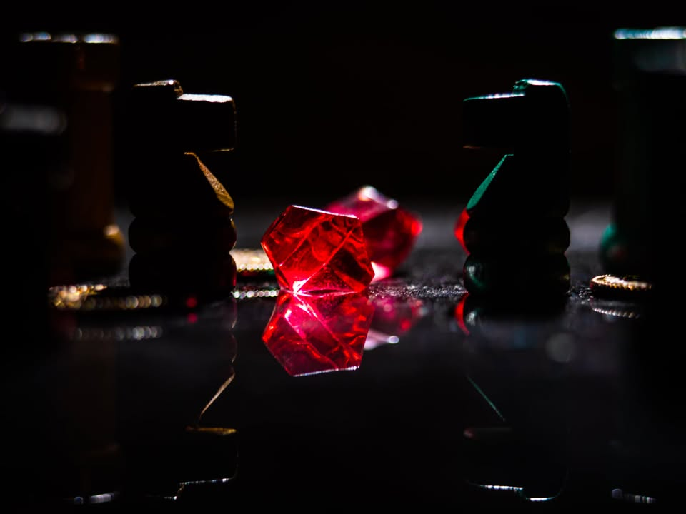
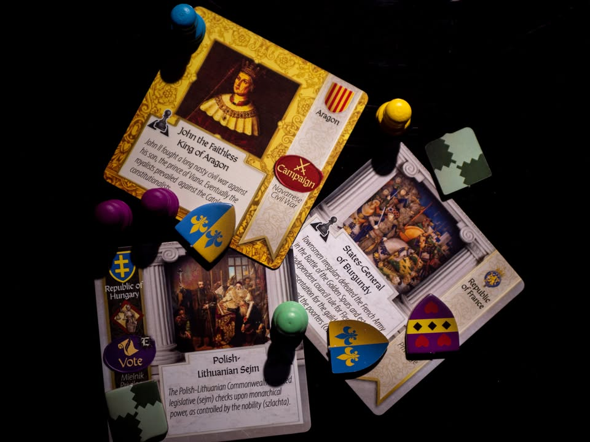
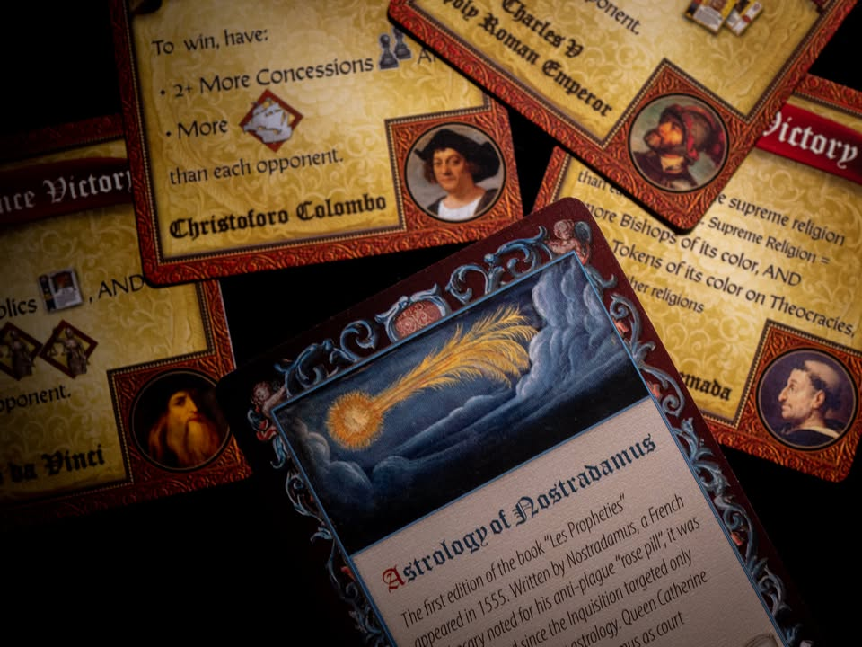
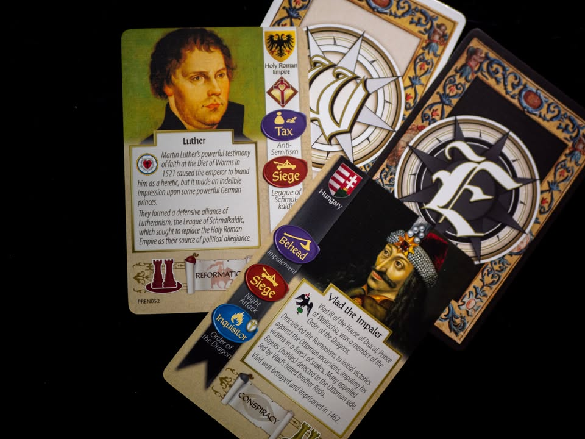
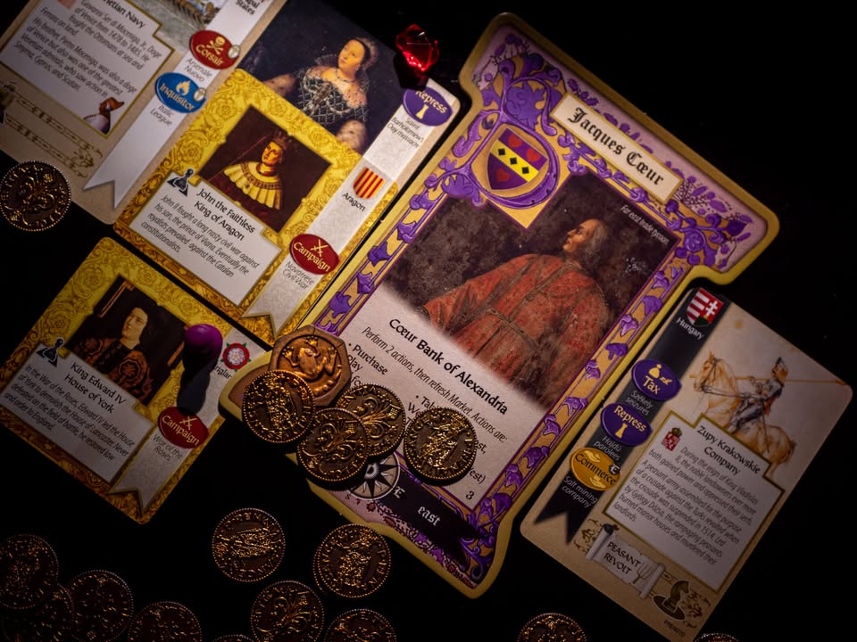

▪️ Pax Renaissance 2nd edition #bite_size

▪️ tldr; เล่นเหมือนเดิมมี minor change หลายจุด ของสวยขึ้นเยอะมว๊าก แต่ไอคอนดันดูยากกว่าเดิม เคยเขียนถึงไว้แล้ว https://tinyurl.com/28zty6js 

▪️ ถ้าย่อให้สั้นเราก็เป็นนายธนาคารในยุคเรเนซองส์จ่ายเงินซื้อ event ให้คนนี้ไปตีคนโน้นว่างๆก็ตั้งด่านเก็บเงินตามท่าเรือ ไม่ก็จับลูกสาวใครซักคนไปแต่งงานกับกษัตริย์ หรือจะล้มล้างไปสร้างสาธารณรัฐมาแทนก็ได้ ก่อสงครามศาสนา ยุยงให้เกิดการจลาจรเปิดทางให้เราได้ตำแหน่งใหญ่โตก็ได้ทั้งนั้น แต่ทั้งนี้เราไม่ได้อยู่ในแผนที่ แค่ชักใยให้โลกมันเดินไปทางที่เราต้องการเฉยๆ

▪️ รูปเก่าบนผ้าใบผืนใหม่ของเหล่านายธนาคารผู้กุมโลหะแห่งมนตราที่เสียงกระทบของมันนั้นสร้างลำนำของโลกให้ดำเดินไป

▪️ สำหรับผมแล้ว Pax Renaissance เป็นเกมกลุ่ม My All Time Top 10 (ที่มีมากกว่า 10 เกม......) แต่โดยปกติก็ไม่ได้แนะนำให้ใครมาเล่นเท่าไร เพราะมันเป็นเกมประเภท 'อิหยั่งว่ะ' ที่ต้องใช้เวลาและ mindset ตอนเล่นที่เฉพาะทางหน่อยๆ คือคุณต้องคิดเยอะเพื่อโยงทิศทางของเกมให้ไปในทางที่ต้องการ แต่ว่าโลกของเกมนี้มัน 'เหมือนจริง' เกินไป มีเหตุการณ์มากมายที่เราควบคุมไม่ได้จากความสุ่มแหละผู้คน (โอเค หลายคนพูดด้วยซ้ำว่าเรียกเกมยังรู้สึกแปลกเพราะมั่วฉิบหาย ซึ่งเข้าใจได้)

▪️ แต่กระนั้นกว่าผมจะได้กาง Pax Renaissance 2nd เวลาก็ผ่านมาเป็นปีเลยทีเดียว

▪️ โดยทั่วไปแล้วตัวเกมไม่ได้เปลี่ยนอะไร กติกาบางส่วนที่ทำให้เกมดีขึ้นอย่างเห็นได้ชัดก็สามารถเอามาใช้กับตัวเก่าได้ (repressed token ให้วางไว้บนการ์ด king/state เสมอ, การย้ายเส้นทางการค้าไปหมู่เกาะเครื่องเทศต้องมีเรือก่อนอย่างน้อยหนึ่ง) จริงๆก็มีหลายจุดจำพวกสมดุลย์ของการ์ดและการที่ทุกพื้นที่สามารถเป็นทั้งสามศาสนา (จากเดิมสอง) ก็จะอารมณ์ what if อ๊อตโตมันบุกมาถึงอิตาลีแล้วเปลี่ยนศาสนาล่ะ? (หรือกลับกัน) มาหน่อยๆ

▪️ ตัวใหม่นั้นทำออกมาสวยงามมากทั้งการเลือกใช้ token ที่รูปทรงเหมือนหมากรุกบนกระดานจริงๆ แล้วการปรับเปลี่ยนรูปและรูปแบบการจัดวางใหม่ ตัวกติกาเองก็ใช้ประโยชน์จากกล่องที่ใหญ่ขึ้นทำให้คู่มือสามารถใส่รูปประกอบอธิบายได้มากมาย และมีการเรียบเรียงให้อ่านง่ายขึ้น (แต่ก็ยังต้องโยงไปมาอยู่ดีนะ)

▪️ มันเกือบจะเรียกได้ว่าเป็น perfect imperfect เกมสำหรับผมได้เลยถ้าไม่ติดอยู่สองเรื่อง......

▪️ อย่างแรกคือ ไอคอนมองยากฉิบหายเลยพี่จ๋าาาาา คือมันเป็นเกมแนวเราอยากจะ control บางสิ่งให้มากกว่าคนอื่น การที่จะต้องรู้ว่าเค้ามีอะไรและสามารถชนะในเงื่อนไขอะไรได้นั้นมันสำคัญมาก แต่ไอคอนหมวดที่ว่ากลับไม่เด่นเอาซะเลยโดนกลืนไปหมด (เอาจริงๆก็มองยากทุกอัน) ตรงนี้ 1st edition ชนะขาดลอยในเรื่องความคลีนของทุกไอคอน (ตำแหน่งแผนที่ของ 1st ก็ดีกว่าเพราะบอกที่เลย อันใหม่มาเป็นธง ที่ถ้าไม่คุ้นแผนที่ยุโรปก็จะมีสะดุดนิดๆ) 

▪️ อย่างที่สองที่จะเรียกความผิดของเกมไหมก็ไม่ใช่ แต่ว่าเสน่ห์ของความเป็นเกมกล่องเล็กเว่อร์ที่สำแดงความสามารถของนักออกแบบที่จะเค้นเอาข้อมูลมหาศาลลงมาในพื้นที่เล็กจิ๋วจุเกมใหญ่โคตรนั้นได้หายไปจากเราแล้ว ซึ่งตรงนี้เป็นเสน่ห์หนึ่งของนักออกแบบคนนี้ที่ผมชื่นชมเสมอ (มากพอที่จะหยิบเอาเกมตระกูลนี้เอาไปแซะพวกนักออกแบบที่บ่นงึมงำว่าอยากสร้างเกมใหญ่แต่อุปกรณ์มันไม่อลังพอ) ตรงนี้ก็น่าเสียดายอยู่เหมือนกัน 

▪️ ถ้ามีโอกาสหรือเวลาว่างมากพอจะมานั่งอ่านกติกาเกมพร้อมกับสนุกไปกับการอ่านเกร็ดประวัติศาสตร์ที่สอดแทรกอยู่ตามคู่มือและการ์ดทุกใบ (ไม่ต้องแปะป้ายด้วยนะว่าเป็นเกมส่งเสริมการเรียนรู้) และมองว่ามันคือเกมที่เราต้องไหลตามโลกและหาโอกาสเต้นรำไปกับจังหวะนั้นเพื่อหาทางชนะ ก็มาลองความอิหยั่งว่ะกับเกมนี้ได้ครับ (แต่จริงๆแนะนำให้เริ่มที่ Pax Pamir 2nd ไม่ก็ Pax Viking นะ)

--------------------------------
หมวด Bite Size (พอดีคำ) นี้กะว่าจะเขียนอะไรสั้นๆประมาณนี้ล่ะกัน ใหม่บ้าง ซ้ำบ้าง เกมที่ขี้เกียจเขียนบ้าง เขียนๆไว้ก่อนเผื่อมีอารมณ์อาจจะขยายไปลง Thought บ้าง จริงๆอยากเขียนสั้นกว่านี้ แต่ยังอดไม่ได้ที่จะต้องอธิบายอะไรเพิ่มตามนิสัย เดี๋ยวค่อยๆปรับไปล่ะกัน

