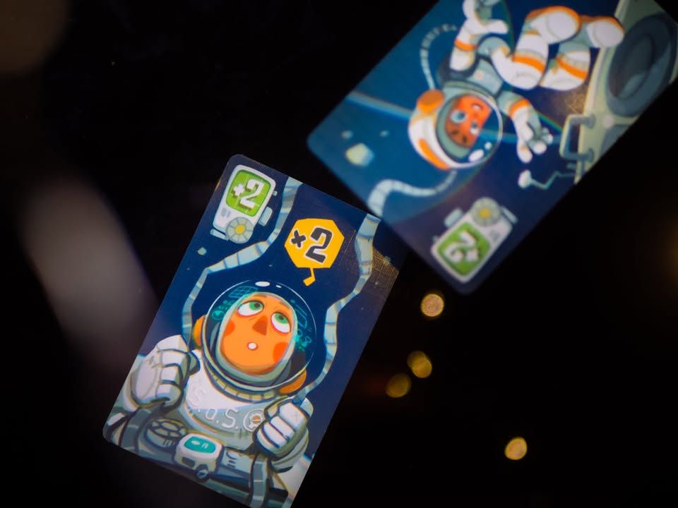
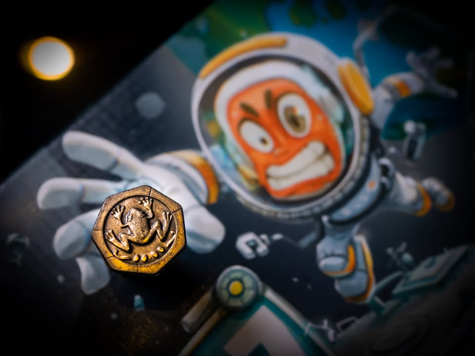
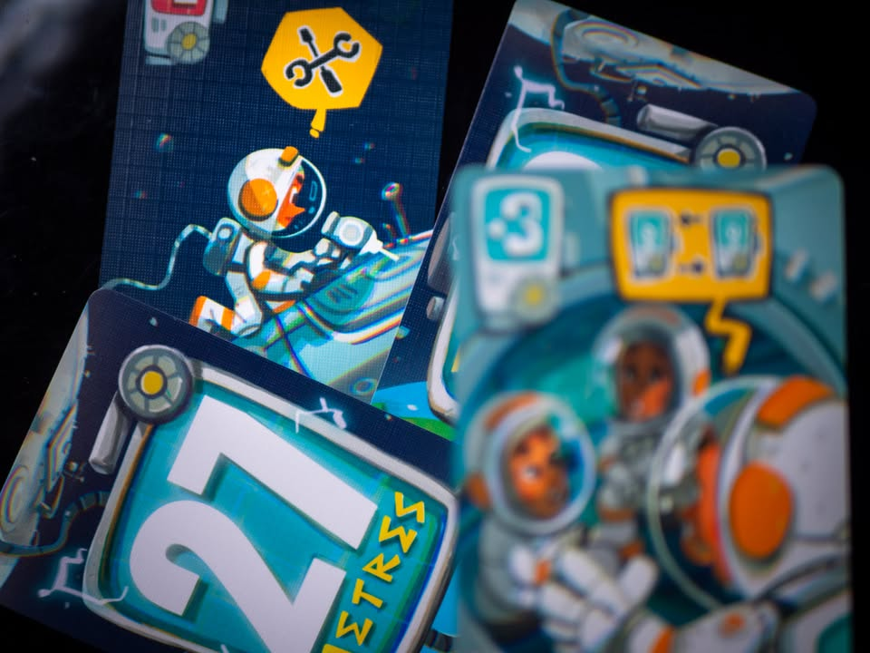

27 Meters #bite_size 

▪️ เกมปาร์ตี้เบาๆคั่นเวลาที่เล่าถึงสถานะการณ์ที่เราต้องส่งคนออกไปนอกยานอวกาศและพวกเราคือคนที่จะผ่อนสายออกซิเจนให้เจ้าหน้าที่คนอื่น แต่ว่าสายนั้นยาวได้แค่ 27 เมตรและใครที่ทำสายเกินเลขนี้ก็จะต้องถูกลงโทษ! ผลงานจากนักออกแบบไทยขาประจำ Vatcharis Thanomsub 

▪️ เกมนี้ผมเคยช่วยเค้าโปรโมตเมื่อปีก่อน วันนี้เค้าส่งเกมมาให้ล่ะ ถ้าให้พูดมันก็จะเป็นเกมปาร์ตี้แนว 'กูต้องรอดตานี้เมิงอะรีบตายแทนกูซ้าาาาา' (แต่โพสนี้ไม่ใช่โพสโปรโมทนะ เป็นโพสบ่นตามปกติ)

▪️ วิธีเล่นเกมก็ไม่มีอะไรแค่ผลัดกันลงการ์ดที่จะค่อยๆบวกเลขสายออกซิเจนไปทีละนิด จนพอเริ่มปริ่มจะเกินนั้นแหละคนในวงก็จะเริ่มมองหน้ามองตากันว่าจะลงใบไหนดีให้ไม่เกิน 27 

▪️ อารมณ์ 'กูต้องรอด' ของเกมนั้นมีหลายท่า เพราะการ์ดมันไม่ได้มีแค่ความยาวสายแต่พ่วงความสามารถเสริมให้มาแกล้งกันด้วย ทั้งเล่นแล้วให้เปลี่ยนทิศการเล่น หรือเล่นแล้วบังคับให้คนต่อไปเล่นสองตาติด หรือกระทั้งสละการ์ดในมือเพื่อขอยืดเวลาไปอีกซักตาแล้วหวังว่าคนอื่นจะพังก่อน

▪️ กิมมิคที่น่าสนใจคือเวลาลงการ์ดใบหนึ่งเนี่ยเราจะต้องหงายการ์ดจากกองมาด้วยอีกหนึ่งใบ เพราะว่ามันอาจจะมีเครื่องหมายตกใจที่ทำให้เราเผลอผ่อนสายไปมากกว่าที่ควรมีผลทำให้เลขมันบวกเกินกว่าการ์ดที่เราลงไว้และอาจจะทำให้เกิน 27 จนแพ้ไปก็ได้ ตรงนี้ก็เล่นกับอารมณ์อยากให้ตัวเองยืนริมเส้นแล้วเพื่อนซวยได้ดี เพราะถ้าพลาดซวยเองในวงก็ฮาไป แต่ก็มีข้อเสียอยู่นะที่ทำให้บางรอบเกมแม่งจบไวเกิ๊น

▪️ มองจากตามเวทและกลุ่มเป้าหมายไม่มีอะไรให้ติถือว่าวาง position ได้ดี แต่จุดที่ผมไม่ชอบเลย... ก็คือ "การเรียบเรียงวิธีเล่น" ที่.......เออ .... สรุปว่าไม่ต้องไปอ่านให้ตัวเองงงเล่นว่าเกมง่ายๆผลัดกันทิ้งการ์ดนี้ทำไมฉันต้องมาวนอ่านอยู่ห้าหกรอบแล้วก็ เอ๊ะ เอ๊ะ เล่นถูกยังว่ะ เขียนแบ่ง section กับ flow ไม่ค่อยดีเท่าไร สรุปข้ามไปดูวิธีเล่นในเพจผู้ผลิตไม่ก็ดูคลิปการสอนได้เลยดีกว่าเยอะ คู่มือกระดาษนี้เอาไปเผาทิ้ง (หรือผมมีปัญหากับการอ่านคู่มือภาษาไทยเองฟระ?)

▪️ รวมๆก็เป็นเกมปาร์ตี้ตลกๆกูต้องรอด! ที่เพลินๆเล่นไม่นานเหมาะกับใครที่อยากแทรกซึมเอาเกมกระดานไปเล่นกับหมู่ non-gamer ได้ดีเกมหนึ่ง ติดเรื่องคู่มือนิดหน่อยแต่ไปดูคลิปแทนเอาก็ได้เกมไม่ได้ยากอะไร แค่ผลัดกันลงการ์ดแล้วมองหน้าเพื่อนยิ้มๆ....ติดนิดเดียวดันหงายมาแล้วเผลอตกใจปล่อยมือซะได้เกิน 27 เฉย...

--------------------------------
📌 disclosure: 
* ร้าน Stronghold ผู้แปล/นำเข้า/จัดจำหน่าย ส่งสินค้ามาให้เพราะเคยช่วยโปรโมทเกมเมื่อปีก่อน แต่ข้อเขียนนี้เป็นการแสดงความเห็นของผมที่มีต่อเกมโดยไม่ได้เป็นการรับจ้าง 
 
💰 support: สามารถสนับสนุนผมทางอ้อมได้ด้วยการซื้อสินค้า Say Hi Board N Bon มูลค่า 1 บาทพ่วงกับเกมอื่นเมื่อซื้อของกับร้าน Bewitched ( เป็นโครงการสนับสนุน Creator ของทางร้าน เงินไม่เข้าผมโดยตรง แต่จะเป็นข้อมูลที่นำไปสู่การสนับสนุนกลับจากทางร้านในรูปแบบต่างๆ) https_://shp.ee/vpzkpn8 
--------------------------------

หมวด Bite Size (พอดีคำ) นี้กะว่าจะเขียนอะไรสั้นๆประมาณนี้ล่ะกัน ใหม่บ้าง ซ้ำบ้าง เกมที่ขี้เกียจเขียนบ้าง เขียนๆไว้ก่อนเผื่อมีอารมณ์อาจจะขยายไปลง Thought บ้าง จริงๆอยากเขียนสั้นกว่านี้ แต่ยังอดไม่ได้ที่จะต้องอธิบายอะไรเพิ่มตามนิสัย เดี๋ยวค่อยๆปรับไปล่ะกัน

