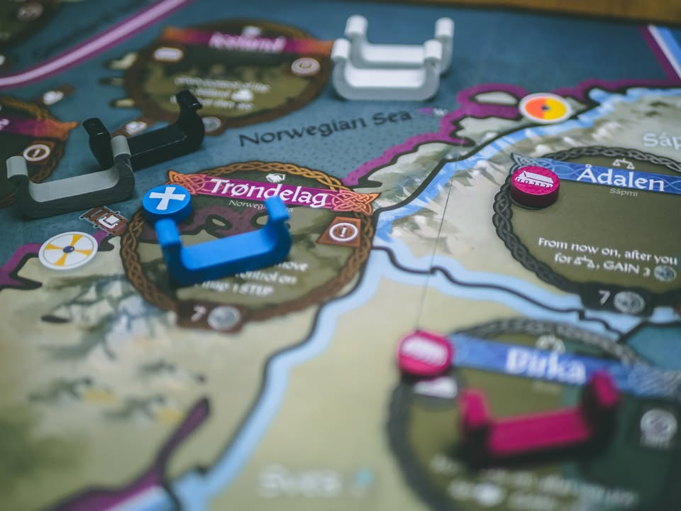
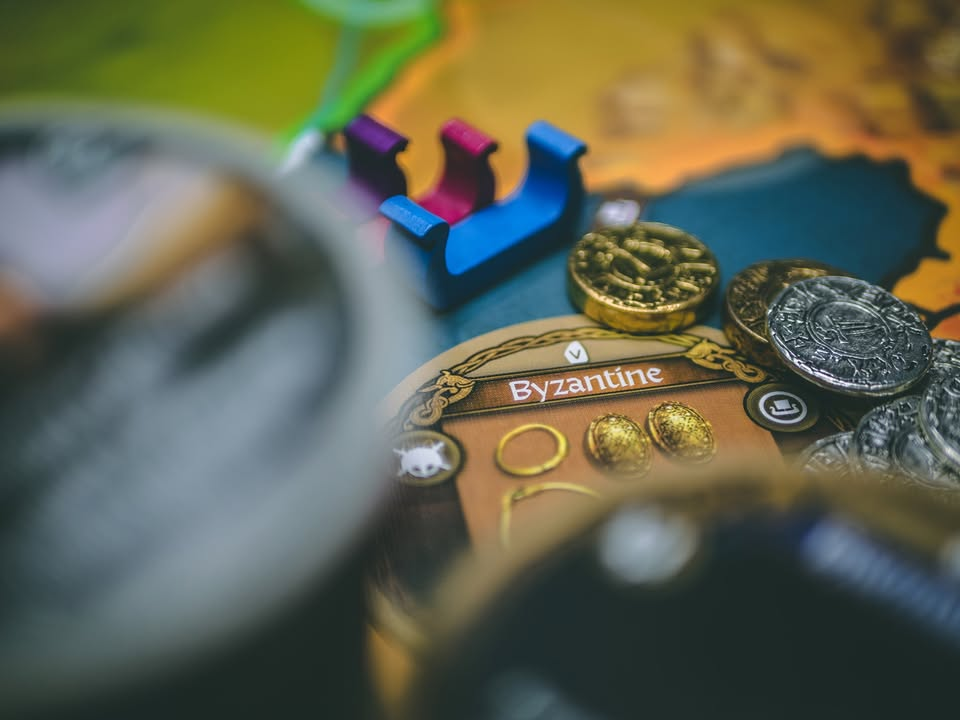
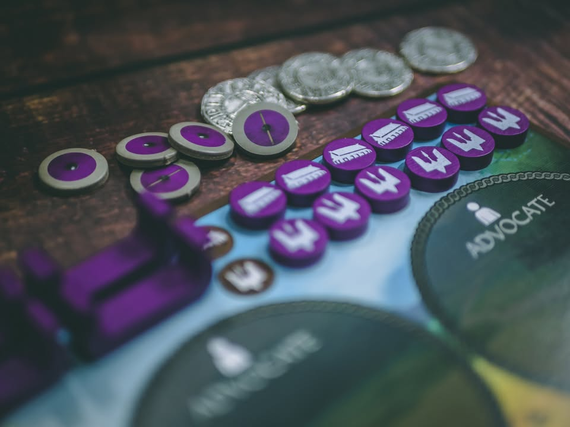
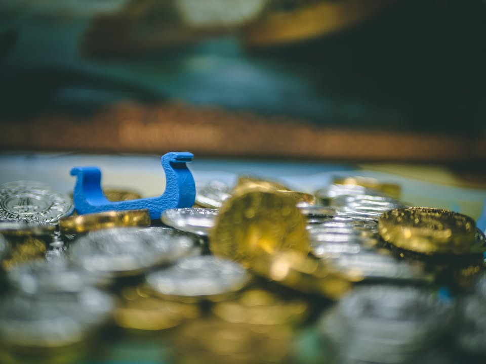
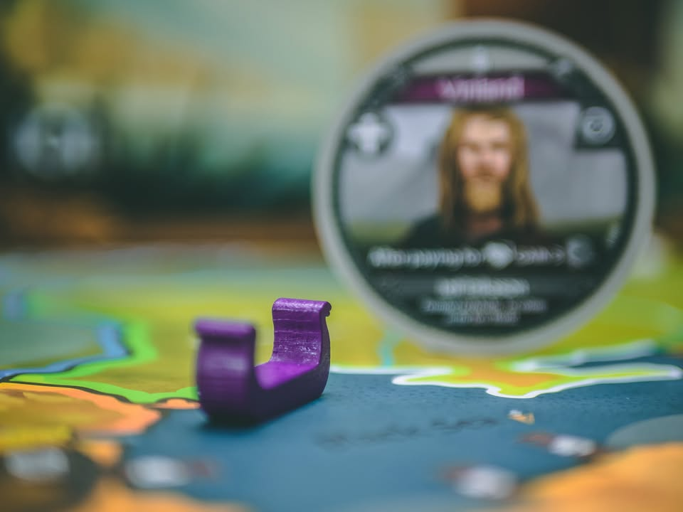
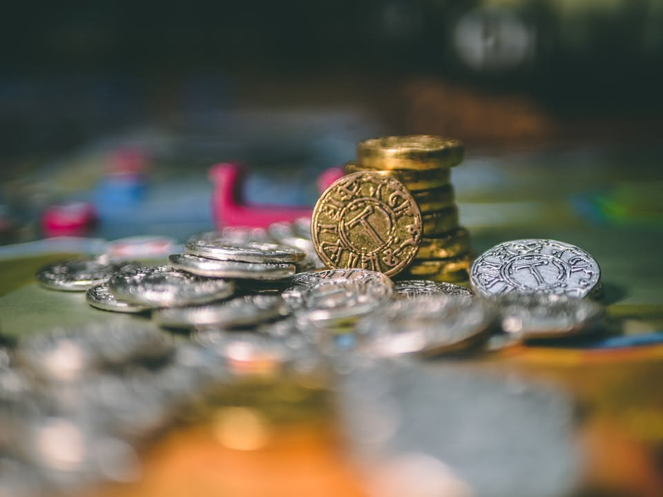
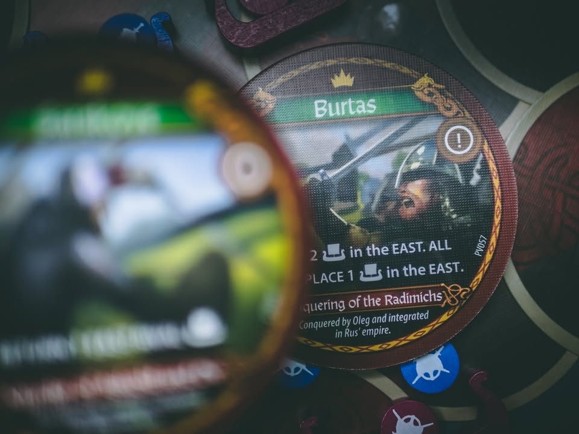
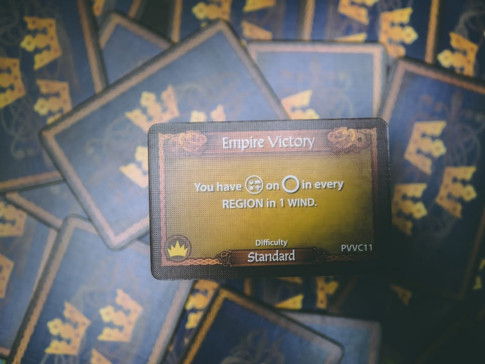

Pax Viking #thought
blog link: https://boardnbon.wordpress.com/2021/04/16/pax-viking/
.
▪️ เกมยูโรระดับกลาง น้องเล็กของซีรี่ย์ Pax (แต่ดันกล่องใหญ่สุด) ที่โดนวางตัวให้เข้าถึงง่ายที่สุดของไลน์ โดยคราวนี้จะเล่าถึงยุคสมัยของชาวไวกิ้งผู้ครอบครองท้องทะเลในช่วงศตวรรษที่สิบ เราคือยาร์ล (Jarl) หัวหน้าเผ่าตามหน้าประวัติศาสตร์ที่จะนำพาเรือรบยาว (Longship) อันเกรียงไกรที่นำพาพวกเค้าข้ามทะเลอันกว้างใหญ่ไปถึงทวีปอเมริกาและจรดอีกฟากฝั่งทะเลแคสเปี้ยนเพื่อพบเจอชาวอินเดียและจีน ผลงานของ Jon Manker นักออกแบบที่เอาผลงานของ Phil Eklund มาสร้างสรรค์ใหม่ให้กลายเป็น 'เกมมากขึ้น' มาแล้วหลายเกม
.
.
▪️ ใช่แล้ว! ชาวไวกิ้งล่องเรือไปทวีปอเมริกาก่อนโคลัมบัสตั้งห้าร้อยปี (Vinland)  และพวกเค้าไม่ได้ใส่หมวกมีเขาสัตว์ดั่งที่ริชชาร์ท วากเนอร์ คีตกวีเอกเยอรมันจัดคอสตูมการแสดงไว้ให้พวกเราดูจนคนยุคหลังคิดว่าไวกิ้งนั้นแต่งตัวแบบนี้
.
.
▪️ แนวคิดการเล่นเกมคือ 'เรื่องเล่าขานและการเดินทาง' ที่เป้าหมายคือการส่งเหล่าผู้ติดตามของเรากระจายไปทั่วแผนที่ตามเงื่อนไขจบเกมที่ถูกสุ่มขึ้นมา ตัวเกมจะมีตลาดกลางให้เราไปหยิบซื้อ saga tile หรือเรื่องเล่า ที่ตอนอยู่กับมือนั้นทำอะไรไม่ได้เลยจนกว่าเราจะล่องเรือยาวไปยังพื้นที่ตามเหตุการณ์ในมือ เราถึงจะเล่นการ์ดนั้นได้
.
.
▪️ เรื่องเล่าในเกมมีทั้งเทพเจ้านอร์สที่ช่วยให้เราแกร่ง, เหล่าผู้ติดตามที่มาเสริมความสามารถ, เมืองที่จะถูกนำไปวางในแผนที่ที่จะให้ผลผลิตแด่ผู้ครอบครอง และการ์ดเหตุการณ์ที่อาจจะพลิกสถานการณ์ในเกม 
.
.
▪️  เช่นเดียวกับ Pax อื่นๆ เกมนี้มีการ์ดเยอะมากและสุ่มออกมาแค่ราวหนึ่งในแปดต่อเกมเกมหนึ่งเท่านั้นเอง ตัวเกมยังมีเมืองอีกหลายจุดในกระดานที่ให้พลังที่แตกต่างกัน การบุกยึดเมืองดับลินในไอร์แลนด์จะมอบกองเรือพิเศษให้ไปตีคนอื่นต่อ เมืองการค้าอย่างอินเดียและชางอัน (ใช่แล้ว.... ชาวนอร์สไปถึงอินเดียและชายแดนจีนมาแล้ว) ที่จะมอบเงินการค้าให้กับเรา
.
.
▪️ วิธึเล่นในเกมก็ค่อนข้างง่ายเพราะทำอยู่แค่ ซื้อการ์ด, เดินเรือไปตรงที่จะเล่นการ์ด, เล่นการ์ด, ใช้พลังในเมือง, ตียึดเมือง วนอยู่แค่ห้าแอคชั่นนี้แหละโดยจะผลัดกันทำคนล่ะสี่แอคชั่นวนไปเรื่อยๆ ที่เหลือก็คือพยายามทำตามเป้าหมายกลางให้ได้พร้อมกับรุมขัดไม่ให้คนอื่นทำเป้าหมายได้ไปพลางๆ
.
.
▪️ เกมจะจบลงเมื่อผู้เล่นคนใดคนหนึ่งเคลียร์เงื่อนไขการชนะหรือเมื่อกองการ์ดเรื่องเล่าหมดไป ผู้เล่นที่ส่งผู้ติดตามออกไปในแผนที่มากที่สุดก็จะชนะไป ส่วนผู้ติดตามนี้โดยปกติก็จะถูกส่งไปตอนที่เราล่องเรือไปหาที่เล่นการ์ดเรื่องเล่านั้นแหละ

-----------------------------------------
🐸 Family -- น้องเล็กเลือดใหม่ผู้โลดโผน หากแต่ยังคงอัตลักษณ์แห่งวงตระกูลไว้ไม่เสื่อมคลาย
-----------------------------------------
.
🔹 สำหรับแฟนๆ Pax Series ก็จะพูดว่าในที่สุดเกม Pax ที่ชวนคนอื่นเล่นได้!! แต่ถ้ามองอีกแง่หนึ่งด้วยความที่เจือจางอารมณ์ Pax ไปเยอะจะเรียกมันว่าเป็นเกมยูโรกลิ่น Pax น่าจะเหมาะกว่า กติกาย่อยมาง่ายตรงประเด็น โดยที่ยังเก็บความเอาตัวรอดหน้างานที่ต้องคอยเล็งแล้วเล็งอีกว่าคนอื่นมันจะเคลียร์เป้าหมายได้หรือยังนะ 
.
.
🔹 ข้อดีอย่างหนึ่งคือเกมสอนง่ายมาก วิธีการเล่นไม่ซับซ้อน ข้อมูลที่จำเป็นก็อยู่ในบอร์ดผู้เล่นหมด การใช้คำก็มี Player Aid อธิบายพร้อม เงื่อนไขการชนะเองก็มีแบบง่ายโคตรเอาไว้ให้ลองสอนเล่นด้วย แต่กระนั้นกติกาบางจุดก็เขียนแอบงงนิดๆเหมือนกันนะ แต่โดยรวมก็คือเป็นเกม complexity ระดับกลางเบา ที่เล่นจบได้ในเวลาชั่วโมงครึ่ง
.
.
👁‍🗨 ถ้าพูดกว้างๆหน่อยเกมนี้เป็นเกมแนว Card Driven ที่มีเป้าหมายแน่นอนว่าต้องทำอะไร แต่ว่าการ์ดน่ะมันจะออกมาแบบสุ่มที่ไม่ได้การันตีว่าจะช่วยให้เราบรรลุเป้าหมายได้ เป้าหมายทุกใบจะมาในแนวๆว่าต้องส่งคนงานของเราไปประจำจุดต่างๆในแผนที่ตามเงื่อนไข ซึ่งหลายๆครั้งเงื่อนไขที่ว่าก็ทำไม่ได้ถ้าการ์ดไม่มี แต่เนื่องจากหากหมดกองเมื่อไรคนที่ส่งผู้ติดตามออกไปเยอะสุดจะชนะ เกมก็เลยเน้นให้เราเดินทางไปทั่วพร้อมกับหาช่องชนะกลางทางไปพลางๆ
.
.
👁‍🗨 แน่นอนว่าถ้าคนที่ชอบเกม Pax จะคุ้นเคยกับอารมณ์และสีสันแบบนี้อยู่แล้ว แต่จากมุมสายยูโรทั่วไป mindset แบบนี้ถ้าไม่เข้าใจแต่แรกก็อาจจะคิดว่าเกมออกแบบมาไม่ดีก็ได้เพราะเหมือนสุ่ม seed มั่วซั่ว ซึ่งอันนี้เป็นความตั้งใจของเกมแต่อันนี้แล้วแต่คนชอบนะ
.
.
🔹 ความประดักประเดิดนิดๆจากมุมคนเล่นเกม Pax อยู่แล้วก็คือเกมนี้มันเป็น Pax lite ที่คนผ่านยูโรกลางเบามาก็เล่นได้ก็จริง แต่รุ่นพี่ก่อนหน้ามันไม่ได้ย่อยง่ายแบบนี้ หมายความว่าในฐานะ gateway to Pax อาจจะทำงานไม่ได้เต็มที่นัก เพราะถ้าเป็นคนกลุ่มที่ต้องงัดเกมนี้มาเพื่อแนะนำก็มักจะขยับไปต่อไม่ถนัดนัก แต่ถ้าคิดว่าอยากเอาแนะนำอารมณ์ 'แปลก' ของการควบคุมอะไรบางอย่างไม่ได้ให้ลองก็ถือว่าโอเค
.
.
👁‍🗨 แต่สำหรับคนเล่นเกมทั่วไป เกมนี้ก็เป็นเกมยูโรปกติทั่วไปเนี่ยล่ะ แค่อาจจะต้องมอง flow ต่างจากเกม objective base ทั่วไปนิดนึงตรงที่ความสุ่มจากการ์ดมันสูง
.
.
👁‍🗨 คีย์ของเกมนี้คือด้วยความที่เป็น Objective Base การที่ผู้เล่นจะต้องคอยจับตาดูว่าใครกำลังมีโอกาสชนะในเงื่อนไขไหนในระหว่างเกมจึงสำคัญมาก หากมีผู้เล่นที่ไม่เข้าใจตรงส่วนนี้ก็จะทำให้เกมกร่อยได้อย่างง่ายดาย ปฏิสัมพันธ์ระหว่างการเล่นก็จะเน้นหนักไปที่การดักและตัดคู่แข่งเยอะเหมือนกัน จุดนี้ก็ทำให้เกมมัน 'ลึก' มากกว่าที่เห็นจากกติกาอยู่เหมือนกัน (แม้จะมีม่านหมอกของความสุ่มการ์ดมาทำให้คิดว่าเกมมันเดาทางได้ยากก็เถอะ)
.
.
🔸 จุดที่ไม่ชอบนักก็น่าจะเป็นกระดานแผนที่มันใหญ่ในแบบที่ทำให้ผู้เล่นที่อยู่คนละฟากอ่านตัวหนังสืออีกด้านไม่ออก ยิ่งการ์ดนี้ยิ่งไม่ต้องพูดถึงเลยเพราะตัวหนังสือจะเล็กมาก กลายเป็นข้อมูลที่จำเป็นหลายอย่างที่กระจายบนกระดานก็ไม่สามารถมองให้ทั่วๆได้ ตรงนึ้ก็ทำให้ตอนเล่นกับตอนสอนมีแอบหงุดหงิดเหมือนกันเพราะมองกระดานได้ไม่ทั่ว
.
.
🔸 กับอีกจุดที่ค่อนข้างส่วนตัวคือกล่องมันใหญ่มากเมื่อเทียบกับเกม Pax ก่อนๆสมัยที่ยังเป็นค่ายเล็ก ความรู้สึก wow ของเกมใช้หัวทางการออกแบบเจ๋งๆมันเลยลดหายไปเยอะเหมือนกัน แต่ที่แน่ๆคือกลายเป็นเกมพกยากไปซะอย่างนั้น
.
.
🔸 ในแง่ component นี้ผมแอบหงุดหงิดการ์ดวงกลมประมาณนึงเหมือนกันนะ เพราะสับยากมากแถมการ์ดค่อนข้างบาง โทเคนผู้ติดตามเองก็ดันทำมาหน้าเดียวต้องเสียเวลาพลิกหา แต่รวมๆก็ไม่ได้มีอะไรที่เป็นข้อเสียจริงจังอะไร เหรียญเหล็กนี้โคตรหนาจนน่าตกใจ
.
.
👁‍🗨อัตตราการเล่นซ้ำของเกมถือสูงเพราะการ์ดเอามาใช้รอบนึงน้อยมาก จุดที่น่าสนใจคือเกมมีเป้าหมายกลางหลายระดับเพื่อเอาไว้ปรับความยากง่ายของเกม แต่น่าเสียดายนิดหน่อยที่เป้าหมายในแต่ละความยากนั้นมีสุ่มน้อยนิดหน่อย คือเลือกออกมาสี่จากห้าเท่านั้นเอง (แต่เกม Pax ปกติที่ไม่มีสุ่มเลย) แต่ด้วยความที่การ์ดมันไม่ซ้ำเป้าหมายการชนะที่นิ่งๆมันก็ช่วยให้คนที่เล่นซ้ำไม่ต้องพะวงเหนื่อยสมองมากเกินไปเหมือนกัน
.
.
💭 เท่าที่เล่นมาแม้เกมจะรองรับถึงหกคนแต่คิดว่าซักสี่คนนี้กำลังดีล่ะ เยอะกว่านี้ตลาดมันหมุนเร็วไปจนทำอะไรไม่ได้และระยะเวลารอมันค่อนข้างนาน ส่วนสามคนอาจจะมีอารมณ์ที่สองคนตัดกันอีกคนวิ่งสบาย ก็จะเหมาะกับวงที่เข้าใจเกมว่าถ้าไม่จำเป็นก็ไม่ต้องตีกันเองแต่เน้นค่อยจับตาสมดุลย์ไปพร้อมกับขยายพื้นที่ตัวเอง
.
.
💭 ถ้าตัดเรื่อง Pax Series ออกไป เกมนี้ก็เป็นยูโรที่เหมาะกับคนเล่นทั่วไปโดยไม่จำเป็นว่าต้องสนใจเกมตระกูล Pax มาก่อน กติกาไม่วุ่นวายนัก สอนง่าย มีความเป็นเกมสูง สามารถมาทดลองอารมณ์ของตระกูลนี้ได้โดยที่ไม่ต้องกระโจนเข้าสู่ความอิหยั่งว่ะที่อาจจะรับมือได้ยากซักหน่อยของเกมรุ่นพี่ และก็คงเป็น Pax ที่ผมน่าจะหยิบมากางบ่อยกว่าตัวอื่นเหมือนกัน เพราะมันง่ายดีแม้ในหลายๆแง่มันอาจจะ 'ลึก & เนิร์ด' ไม่เท่าตัวอื่นก็เถอะ
.
.
💭 แต่ทั้งนี้ทั้งนั้นเกมมันก็แอบเลือกวงอยู่เหมือนกันนะ ไปเล่นวงใสๆหรือวงที่ไม่ได้ชอบอะไรที่ control ไม่ค่อยได้นี้อาจจะกร่อยได้ง่ายๆ

----------------------------------------------------------
Compatible Level - เกมนี้เข้ากับคนเขียนได้ระดับไหนนะ!!

🐸 Family, อาจจะมีช่วงเวลาที่ไม่เข้าใจกันบ้างแต่ครอบครัวคือสิ่งที่จะอยู่กับเราตลอดไป นี้คือเกมที่จะมีพื้นที่ถาวรในชั้นวางแน่นอน!! แม้บางเกมจะเปรียบดั่งคุณปู่ใจดีที่ได้เจอกันแค่ปีล่ะครั้ง แต่อันดับในใจนั้นคือความสนุกในช่วงเวลาที่เล่น หาใช่การได้เล่นซ้ำไม่รู้เบื่อเพียงอย่างเดียว [ex. กบโปรด, กบชอบ]

🐸 Hang out friend, เพื่อนกินเที่ยว ถ้าไม่ติดธุระอันใดก็พร้อมจะออกไปพบเจอ สนุกยามได้พบปะ แต่จะให้เจอกันบ่อยๆคงใช่ที - เกมสนุกที่อยากเล่นในระดับที่อยากจะหยิบกางเป็นบางครั้ง สลับสับเปลี่ยนไปเรื่อยตามจังหวะและโอกาส แต่เราก็ไม่ได้อยากซ้ำต่อเนื่องรัวๆ [ex. กบโอเค]

🐸 Someone I know, หากบังเอิญพบเจอ ก็คงได้ทักทายไต่ถาม หากแต่ในยามปกติมิอาจนึกชื่อออก ยืนคุยก็ได้ แต่คงไม่ได้เอื่อนเอ่ยนัดกินข้าว - บางเกมเราก็ไม่ได้อยากชวนเล่น แต่ถ้าไม่มีอะไรทำแล้วมีคนชวนก็เล่นก็ได้ [ex. กบเฉย]

🐸 I Turn left, You Turn Right - เธอชอบกินเผ็ด เราชอบกินอาหารญี่ปุ่น เธอชอบคนคารมดีพาไปกินที่หรู แต่เราชอบเล่นเกมอยู่กับบ้าน แม้จะได้คุยเป็นบางคราแต่คงไม่อาจพัฒนาความสัมพันธ์ - บางเกมแม้ว่าจะดีแค่ไหน แต่ถ้ารสนิยมมันไปด้วยกันไม่ได้ก็ไม่รู้จะเล่นไปทำไม [ex. กบไม่เล่น]
 
 
อนึ่ง : เป็นความรู้สึกในความ "อยากจะหยิบมาเล่นไหม?" ของผมเอง ไม่ได้เกี่ยวอะไรกับคุณภาพของเกม ไม่อิงมาตราฐานอื่นใดนอกจากตัวเองเท่านั้น ดูให้เป็นแค่ "อีกความคิดเห็นหนึ่ง" เท่านั้นก็พอนะครับ :)

