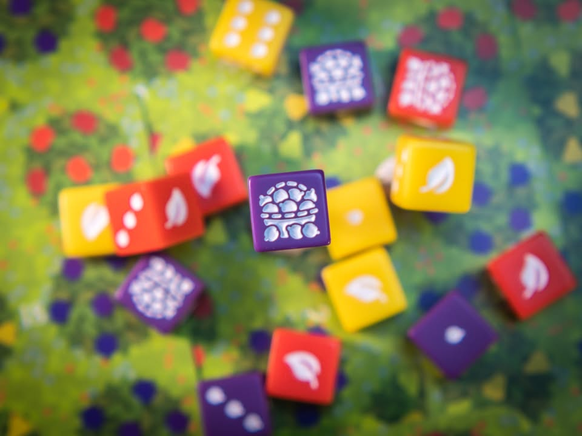
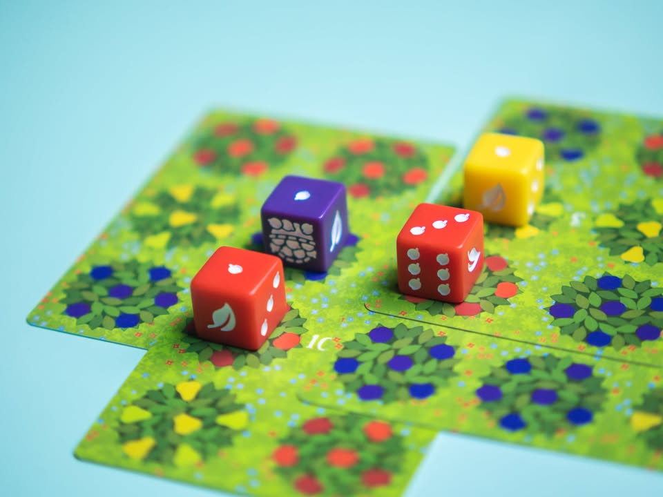
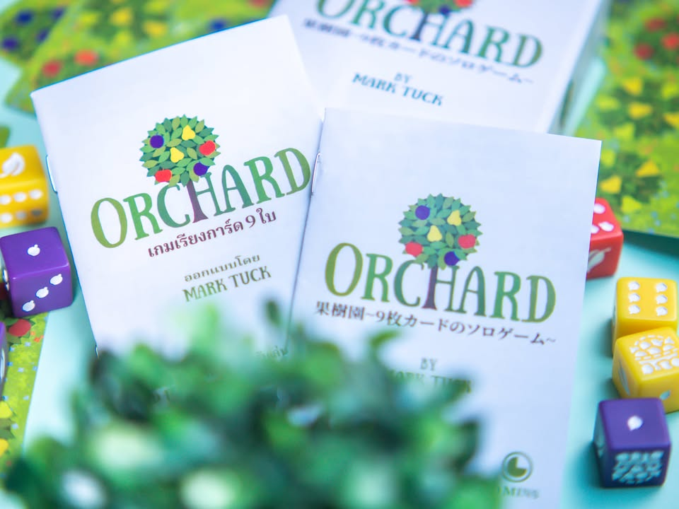
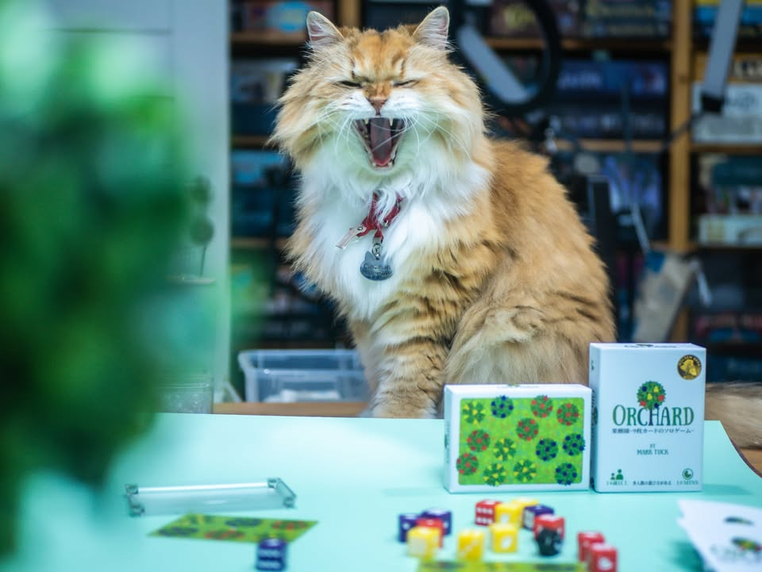

Orchard #bite_size

🔹 เกมสั้นคั่นเวลากล่องพกสะดวกที่เหมาะกับการนั่งเล่นคนเดียว วิธีเล่นก็มีแค่ลงการ์ดทีละใบให้ต้นไม้สีมันซ้อนกัน ยิ่งซ้อนเยอะก็จะได้แต้มเยอะ โดยเราจะวางลูกเต๋าลงไปบอกเป็นนัยว่าต้นไม้เราได้เติบโต 
.
.
🔹(เผื่องง คือคำว่า Orchard แปลว่าสวนผลไม้นะ เป็นคนละคำกับ Orchids ที่แปลว่ากล้วยไม้)
.
.
🔹 จั่วๆวางๆสิบนาทีจบ พูดเหมือนง่ายแต่เล่นจริงให้ได้แต้มเยอะๆนี้ปวดหัว(ในแง่ดีนะ)เหมือนกัน เพราะเวลาวางซ้อนมันต้อง perfect match ห้ามทับไม่ตรงสีไม่งั้นเจอแต้มลบ ก็ต้องบิดๆมองๆ ล่วงหน้าผสมกับดวงนิดๆจากการจั่วให้ได้ลำดับที่ตรงใจ ตอนเล่นก็จะแบบหมุนๆอ่ะห่านสีนี้ดันไม่ตรงขัดใจใช้ได้
.
.
🔹 เสริมว่าถ้ามีหลายกล่องก็มีโหมดเล่นหลายคนด้วย
.
.
🔹 เมื่อก่อนเกมนี้ชนะรางวัลประกวด  2018 9-Card Nanogame Print and Play Design Contest ของ BoardGameGeek เลยนะ แต่เกมมีการ์ดมากกว่า 9 ใบนะแค่เล่นเกมรอบละ 9 ใบเฉยๆ
.
.
🔹 ก็เป็นเกมสนุกเพลินๆกติกาไม่ต้องรื้อฟื้นมาก กล่องนี้เป็นภาษาไทย/จีน จาก Dexker พับลิชเชอร์ไต้หวันส่งมาให้พร้อมกับอีกเกม รูลแปลไทยคิดว่ากลางๆไม่ดีไม่แย่ แต่ข้อเสียจริงๆน่าจะเป็นที่การใช้ font ไม่ดีทำให้สระมันซ้อนกันน่ารำคาญนิดหน่อย (คงเพราะจ้างแปลอย่างเดียวแต่ไม่มีคนตรวจตอนพิมพ์) ไม่รู้เหมือนกันว่าร้านไหนไทยใครจะเอาเข้ามา แต่เอาจริงๆเกมมันก็ง่ายๆแหละสอนแป๊บๆได้ล่ะทำเองหรือซื้อต่อ eng ก็ได้ แต่ถ้าเอาไปแนวซื้อฝากก็คือว่าโอเค

--------------------------------
หมวด Bite Size (พอดีคำ) นี้กะว่าจะเขียนอะไรสั้นๆประมาณนี้ล่ะกัน ใหม่บ้าง ซ้ำบ้าง เกมที่ขี้เกียจเขียนบ้าง เขียนๆไว้ก่อนเผื่อมีอารมณ์อาจจะขยายไปลง Thought บ้าง จริงๆอยากเขียนสั้นกว่านี้ แต่ยังอดไม่ได้ที่จะต้องอธิบายอะไรเพิ่มตามนิสัย เดี๋ยวค่อยๆปรับไปล่ะกัน

