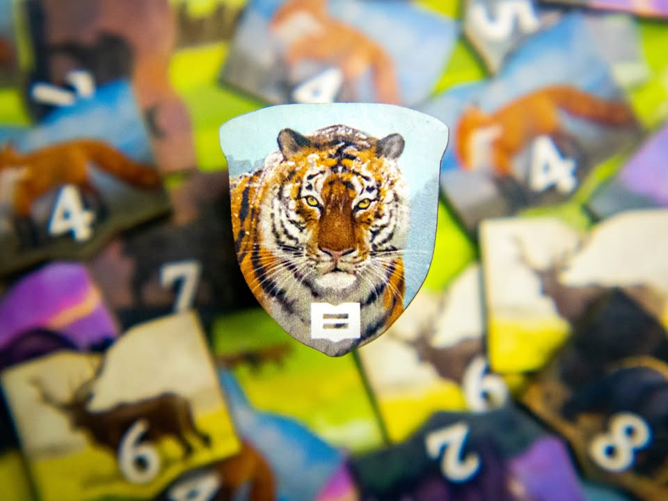
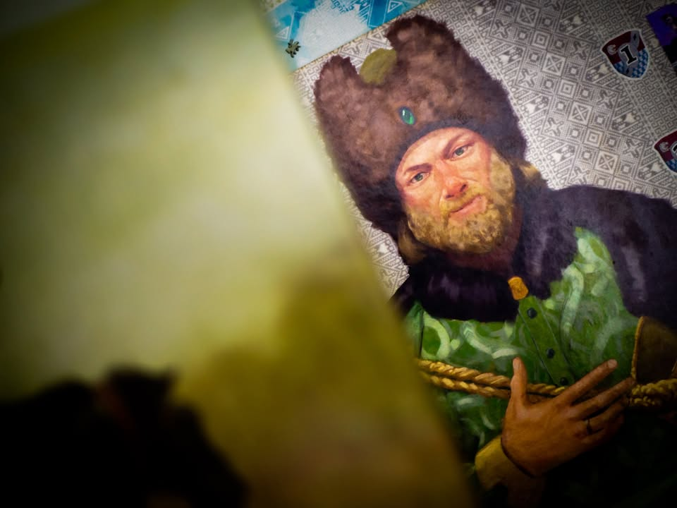
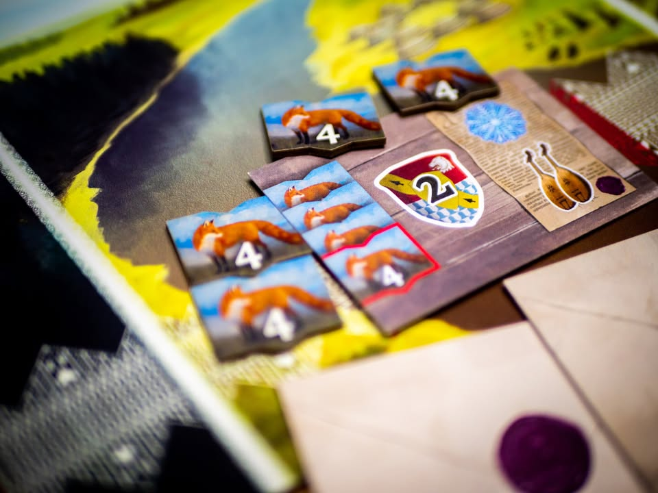
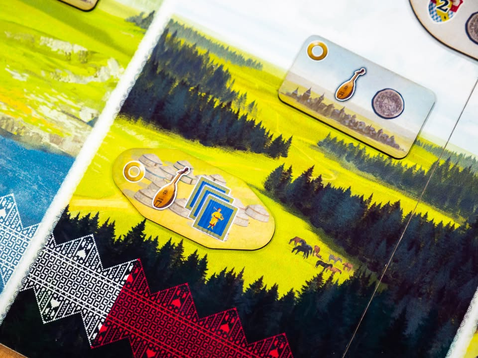
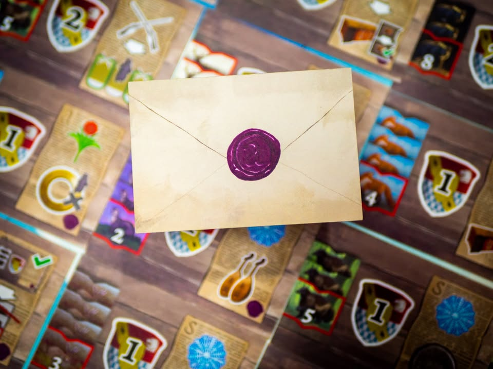
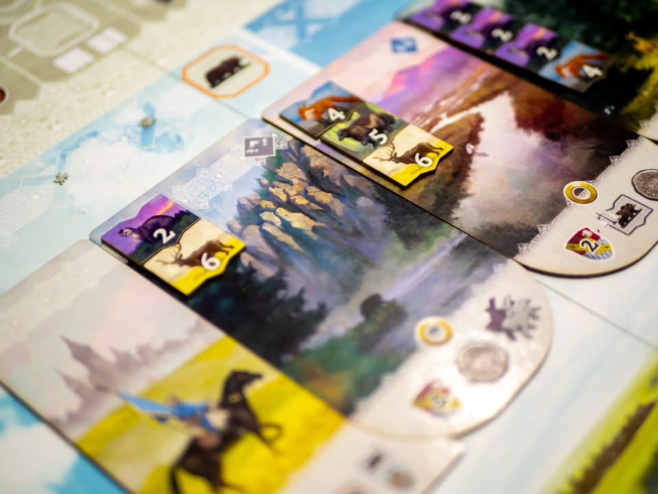
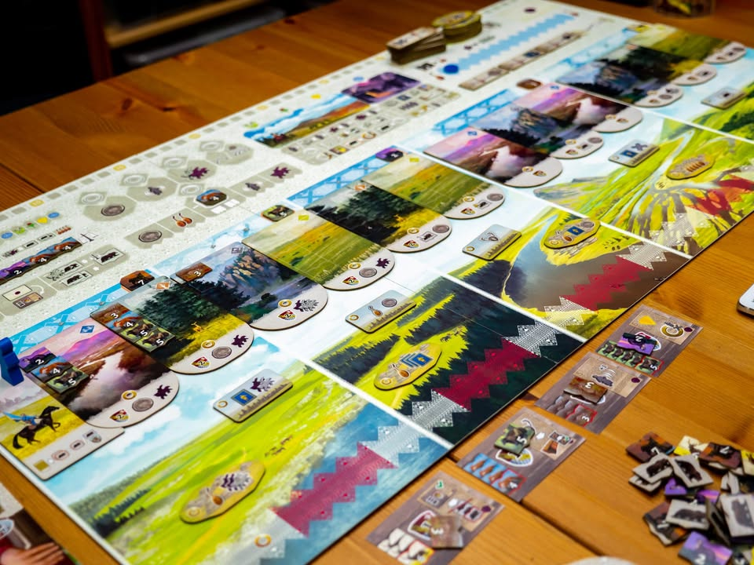

▪️Stroganov 
blog: https://boardnbon.wordpress.com/2021/05/16/stroganov/

▪️ เกมยูโรระดับกลางที่จะให้เราเดินทางไปในพื้นที่อันกว้างใหญ่ในไซบีเรีย ล่าสัตว์น้อยใหญ่ พัฒนาบ้านเมื่อเพื่อเอาใจซาร์ (ตำแหน่งกษัตริย์ของกลุ่มชนชาวสลาฟ - Slavic หรือพื้นที่ในแถบรัสเซียในปัจจุบัน)  ผลงานของ Andreas Steding (Hansa Teutonica,  Gùgōng, The Staufer Dynasty) #thought #first_impression
.
.
📌 disclaimer - กล่องที่เขียนนี้เป็นกล่อง prototype ที่คุณภาพวัสดุไม่เหมือนกับที่ทำขายจริง แต่ใช้กติกาการเล่นฉบับเดียวกับที่วางขาย ทาง Dexker ที่เป็น publisher ไต้หวันได้ทำการส่งเกมนี้ให้ผมทำการทดสอบโดยไม่มีค่าใช้จ่าย และผมไม่ได้รับเงินหรือสิ่งตอบแทนใดในการทำข้อเขียนนี้
.
.
▪️ กระดานหลักของเกมจะแทนพื้นที่กว้างใหญ่ในไซบีเรียพร้อมไทล์พื้นที่ธรรมชาติที่เต็มไปด้วยสัตว์น้อยใหญ่วางเรียงเป็นเส้นตรง ไอเดียหลักของเกมนี้คือเอาคนงาน (เกมเรียก Cossack หรือกลุ่มทหารในรัซเซีย/ยูเครน) เดินหน้าไปตามไทล์พื้นที่ พอหยุดแล้วก็เลือกทำแอคชั่นในพื้นที่นั้น ทีนี้ของที่ให้ทำก็มีหลายสาย ตั้งแต่ออกล่าสัตว์เพื่อเอาขน หรือถ้าล่าสัตว์หมดแล้วจะเลือกพัฒนาพื้นที่มาเก็บไว้เก็บไว้ทำแต้มก็ได้ ตามพื้นที่ก็จะมีไทล์เมืองไทล์เต็นท์ไทล์กับการ์ดโบนัสให้หยิบ 
.
.
▪️ คีย์หลักของเกมคือขนสัตว์ที่มีอยู่แปดชนิด การได้มาหลักๆคือต้องไปล่าตามแผนที่ หรือเอาม้าไปแลกจากตลาดกลาง ที่นี้ความซับซ้อนของเกมจะอยู่ที่การทำแอคชั่นบางอย่างในแต่ล่ะพื้นที่ต้องจ่ายคนสัตว์ประจำพื้นที่นั้นๆด้วย แปลว่าเราจะล่ามั่วๆไม่ได้ เพราะแอคชั่นมีน้อย แต่ถ้าสัตว์ไม่มีให้เก็บตรงกับที่เราอยากได้เราก็จะเหนื่อยๆเหมือนกัน (แต่เกมมีระบบแปลงขนสัตว์ให้)
.
.
▪️ ถ้าพูดให้ง่ายหน่อยคือเกมให้เราเดินเป็นเส้นตรง อยากเดินใกล้ไกลก็ได้ (แต่อยากเดินไกลต้องจ่ายม้าเป็นค่าเดินทาง) พอถึงช่องแล้วมันก็จะมีของให้เลือกทำสี่ห้าอย่างแต่เรามีโควต้าทำจำกัด จะเดินถอยหลังก็ไม่ได้ แปลว่าเราต้องคิดคร่าวๆประมาณหนึ่งว่าจะแวะที่ไหนบ้าง ทำอย่างนี้สามฤดู (รอบในเกม) พอเข้าหน้าหนาวก็พากันกลับไปจุดเริ่มต้นเติมของแล้วก็วนมาใหม่
.
.
▪️ เล่นกันสี่ปี (12 แอคชั่น) ก็จบเกม
.
-----------------------------------------
[🐸 Someone I know, สาวงามบ้านไร่จากรัสเซีย ดวงตาน่าหลงใหลหากแต่พอถึงบ้านกลับลืมเธอได้อย่างง่ายดาย] 
-----------------------------------------

🔹 ผมคิดว่าตอนเล่นมันก็เพลินๆดีนะ นั่งคิดงืมงำออกท่าตามสาย มีอารมณ์ขัดใจว่าอยากทำโน้นนี้ไปหมดแต่ทรัพยากรกับแอคชั่นไม่พอ แต่เหมือนสิ่งที่เกมขาดไปคือสเน่ห์ที่จะทำให้อยากกลับมาเล่นซ้ำ เลยทำให้มันเป็นเกมสนุก ที่มีเกมระดับเดียวกันอยู่เต็มตลาดไปหมดแล้ว
.
.
🔹 ข้อดีคือสอนง่าย ไอคอนชัด ข้อมูลที่จำเป็นมีอยู่ครบในกระดาน flow หลักเป็นเส้นตรงมีแค่เดินหน้าแวะทำโน้นนี้ ส่วนระบบทรัพยากรก็วนใช้อยู่แบบเดียวแต่มันต้องออกท่าใช้หลายทีทำให้ต้องหยุดคิดบ่อยดี 
.
.
🔸 แต่ข้อเสียหลักจริงๆคือเกมแห้ง (Dry) มากเล่นแล้วไม่รู้สีกถึงธีมอะไรเลย ซึ่งจริงๆไม่ใช่ข้อเสีย แต่ว่าเกมมันทำงานศิลป์มาสวยมาก แนวคิดการเอาธีมมาใส่ในช่องแอคชั่นก็ค่อนข้างดี แต่เล่นจริงไม่ได้มองอะไรเลยอ่ะ กลายเป็นเกมแลกขนสัตว์ไปๆมาๆให้มันเก็บของทำแต้มได้ คือถ้าอยากเล่นเกมเดินทางสวยๆนี้ไปเล่น Parks เถอะ.......
.
.
🔸 อย่างที่บอกคือเกมมันไม่มีสเน่ห์ให้กลับมาลองใหม่ ทั้งๆที่มีสายการเล่นหลายท่า ส่วนหนึ่งเพราะการทำแต่ละสายมันก็ไม่ได้แตกต่างกันมาต้องมาตัดแย่งล่าสัตว์เหมือนกัน ก็อยู่ที่ว่ามันมีสัตว์อะไรสุ่มมาให้ล่ามากกว่า เกมมีการ์ด mission กับระบบโบนัสให้เล่นก็จริงแต่ว่ามันเก็บได้ค่อนข้างยากและสุ่ม โบนัสรายทางช่วยให้มีอะไรต้องคิดหน้างานแต่ว่า noise มันต่ำเกินกว่าจะมีผลต่อการตัดสินใจหลักของเรา
.
.
💭 เป็นเกมที่เสียดายงานอาร์ทพอควร แต่ด้วยความที่มันไม่ยากมากกับภาพสวยก็อาจจะชวนกลุ่มเพื่อนให้ลองขยับจากพวก gateway ได้เหมือนกัน คืออย่างที่บอกเกมมันก็เล่นสนุกนะแค่มันไม่มีอะไรเด่นเป็นพิเศษเทียบกับของที่ผมเคยเล่นมาแล้ว

----------------------------------------------------------
Compatible Level - เกมนี้เข้ากับคนเขียนได้ระดับไหนนะ!!

🐸 Family, อาจจะมีช่วงเวลาที่ไม่เข้าใจกันบ้างแต่ครอบครัวคือสิ่งที่จะอยู่กับเราตลอดไป นี้คือเกมที่จะมีพื้นที่ถาวรในชั้นวางแน่นอน!! แม้บางเกมจะเปรียบดั่งคุณปู่ใจดีที่ได้เจอกันแค่ปีล่ะครั้ง แต่อันดับในใจนั้นคือความสนุกในช่วงเวลาที่เล่น หาใช่การได้เล่นซ้ำไม่รู้เบื่อเพียงอย่างเดียว [ex. กบโปรด, กบชอบ]

🐸 Hang out friend, เพื่อนกินเที่ยว ถ้าไม่ติดธุระอันใดก็พร้อมจะออกไปพบเจอ สนุกยามได้พบปะ แต่จะให้เจอกันบ่อยๆคงใช่ที - เกมสนุกที่อยากเล่นในระดับที่อยากจะหยิบกางเป็นบางครั้ง สลับสับเปลี่ยนไปเรื่อยตามจังหวะและโอกาส แต่เราก็ไม่ได้อยากซ้ำต่อเนื่องรัวๆ [ex. กบโอเค]

🐸 Someone I know, หากบังเอิญพบเจอ ก็คงได้ทักทายไต่ถาม หากแต่ในยามปกติมิอาจนึกชื่อออก ยืนคุยก็ได้ แต่คงไม่ได้เอื่อนเอ่ยนัดกินข้าว - บางเกมเราก็ไม่ได้อยากชวนเล่น แต่ถ้าไม่มีอะไรทำแล้วมีคนชวนก็เล่นก็ได้ [ex. กบเฉย]

🐸 I Turn left, You Turn Right - เธอชอบกินเผ็ด เราชอบกินอาหารญี่ปุ่น เธอชอบคนคารมดีพาไปกินที่หรู แต่เราชอบเล่นเกมอยู่กับบ้าน แม้จะได้คุยเป็นบางคราแต่คงไม่อาจพัฒนาความสัมพันธ์ - บางเกมแม้ว่าจะดีแค่ไหน แต่ถ้ารสนิยมมันไปด้วยกันไม่ได้ก็ไม่รู้จะเล่นไปทำไม [ex. กบไม่เล่น]
 
 
อนึ่ง : เป็นความรู้สึกในความ "อยากจะหยิบมาเล่นไหม?" ของผมเอง ไม่ได้เกี่ยวอะไรกับคุณภาพของเกม ไม่อิงมาตราฐานอื่นใดนอกจากตัวเองเท่านั้น ดูให้เป็นแค่ "อีกความคิดเห็นหนึ่ง" เท่านั้นก็พอนะครับ :)

