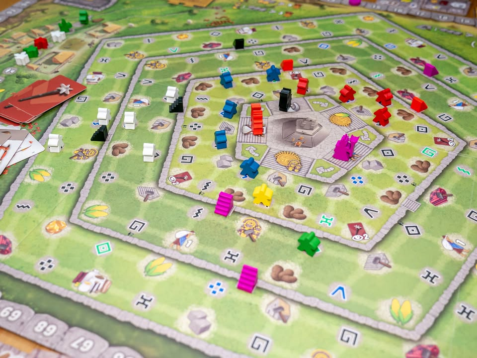
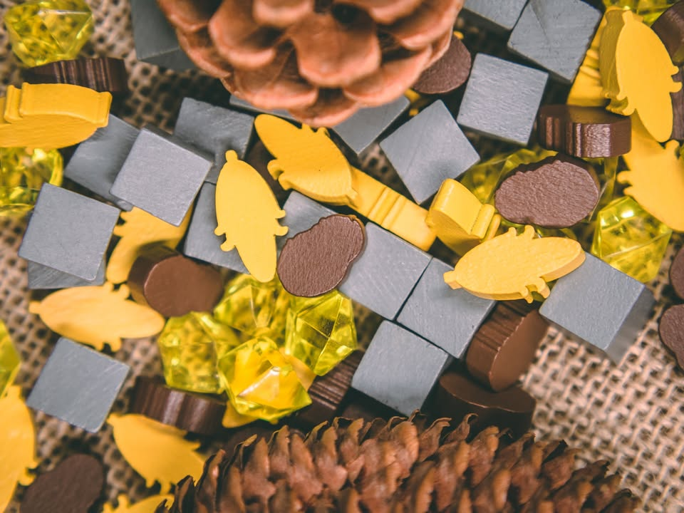
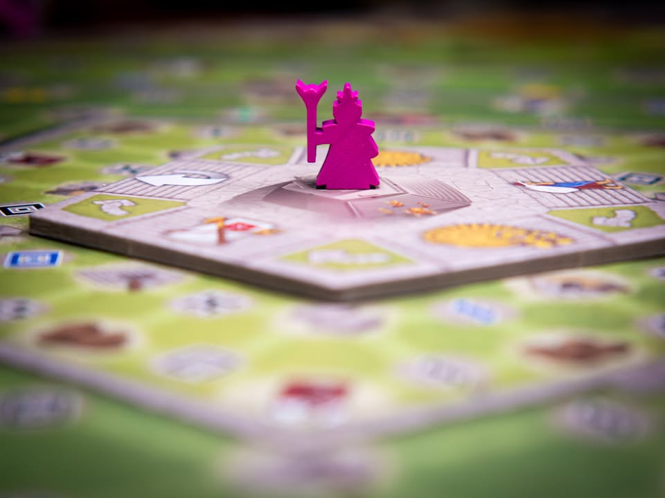
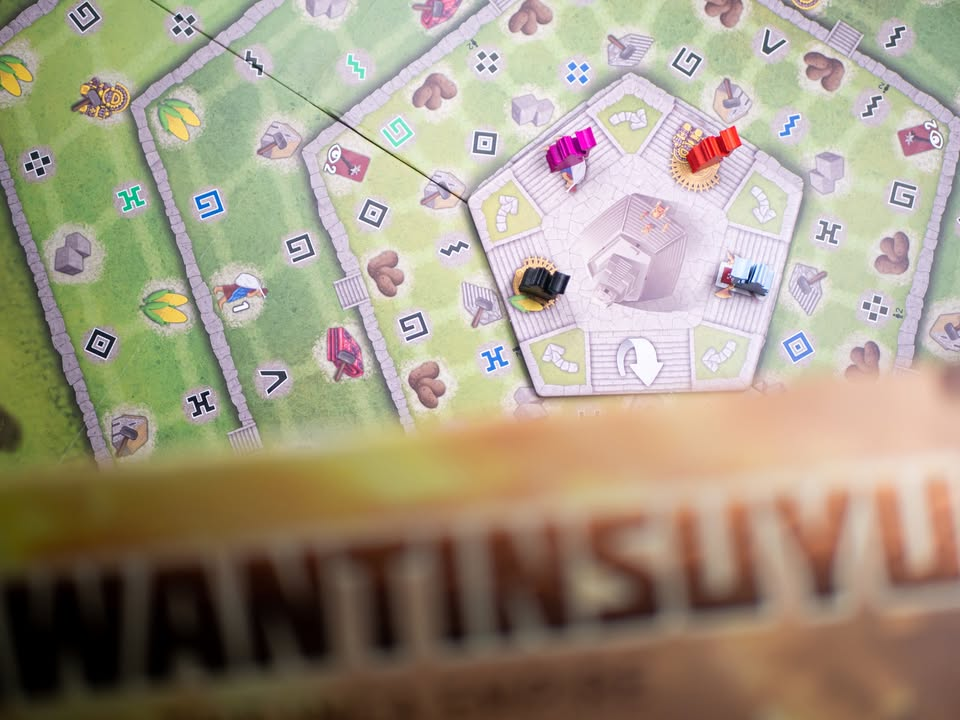

Tawantinsuyu: The Inca Empire #thought 
Blog link: https://boardnbon.wordpress.com/2021/06/06/tawantinsuyu-the-inca-empire/

▪️ เกมยูโรระดับหนัก (แต่มีความซับซ้อนระดับกลาง) ธีมหลวมๆว่าด้วยการพัฒนาอณาจักรของชาวอินคา ผลงานของนักออกแบบ Dávid Turczi (Anachrony, Tekhenu และระบบ solo ให้กับเกมอีกมากมาย)
.
.
▪️ ตาวันตินซูยู นั้นเป็นภาษาเกชัวที่มีความหมายว่าพื้นที่ทั้งสี่ เพราะแบ่งการปกครองออกเป็นสี่ส่วนโดยมีศูนย์กลางอยู่ที่เมืองกุสโก (Cusco) โดนนับเป็นอาณาจักรโบราณที่ยิ่งใหญ่ที่สุดในพื้นที่ก่อนที่จะพบจุดจบจากการรุกรานของสเปนในช่วงการสำรวจทวีปอเมริกา 
.
.
▪️ แกนหลักของเกมถ้าพูดง่ายๆก็ Worker Placement นี้แหละผลัดกันเอาคนงานไปวางลงช่องแอคชั่นเก็บของสร้างโน้นนี้ แต่ในรายละเอียดแล้วมันเป็นเกมที่ใช้แนวคิดที่ต่างออกไปเยอะทีเดียว 
.
.
▪️ สิ่งที่เห็นตั้งแต่แรกคือเกมมีช่องให้ลงคนงานจำนวนมาก (85 ช่องที่ใช้ไม่หมด) แต่ชนิดของแอคชั่นเวลาเอาคนงานไปวางบนกระดานจริงๆมีไม่กี่อย่าง มีแค่เก็บทรัพยากรดิบครึ่งหนึ่งอีกครึ่งก็คือเอาทรัพยากรไปจ่ายสร้างของ
.
.
▪️ วิธีการออกแบบคือเกมจะกระจายแอคชั่นพวกนี้ไปทั่วกระดาน โดยจุดที่เราสามารถวางคนงานได้นั้นจะมีแอคชั่นอยู่รอบๆสามอย่างไม่ซ้ำกันเสมอ เราเอาคนงานไปลงช่องไหนก็จะได้เลือกทำแอคชั่นที่อยู่รอบๆนั้นหนึ่งอย่าง (ถ้าพูดอีกแบบ ไอ้คำว่าเกมนี้มีแอคชั่นให้ทำเยอะนั้นจะเรียกว่าเป็นการเล่นคำก็ไม่ผิดอะไร)
.
.
▪️ แต่สิ่งที่ทำให้เกมนี้โดนจัดเป็น weight 4 จะเริ่มการที่เกมเริ่มซ้อนเลเยอร์การตัดสินใจบางๆลงไปอีกหลายชั้นจากตรงนี้
.
.
▪️ เกมนี้คนงานมีหลายสี แต่ละสีก็มีกิมมิคนิดหน่อยแต่สาระคือถ้าช่องข้างๆมีคนงานสีเหมือนกันหนึ่งตัว แทนที่เราจะได้ทำแอคชั่น หนึ่งในสาม ก็จะกลายเป็นสองในสาม แต่ถ้ามีมากกว่านั้นเราก็จะได้ทำแอคชั่นเป็น สาม สี่ ห้า ครั้งเลย .... เริ่มอยากหาสีเหมือนกันมาวางติดกับเพื่อนล่ะไหม? 
.
.
▪️ แต่ช่องแอคชั่นแต่ละอันจะมีสัญลักษณ์อยู่จำนวนหนึ่ง การจะเอาคนงานไปลงช่องนั้นได้เราก็ต้องมีการ์ดที่ตรงกันด้วยไม่งั้นก็ลงไม่ได้....
.
.
▪️ แต่ถ้าลงได้แล้ว บังเอิญว่าก่อนหน้าเราสร้างเทวรูปบูชาไว้แล้วมีสัญลักษณ์ตรงกับการ์ดที่เราเล่นเราก็จะได้โบนัสเพิ่มด้วยนะเอ่อ!
.
.
▪️ แต่คุณเห็นกระดานมันใช่มะ? จริงๆมันแบ่งออกเป็น ห้าด้านแต่ละด้านแบ่งออกเป็นสามชั้น แล้วมันเกี่ยวอะไรกับเรา? คือเราจะมีตัวนักบวชเป็นสีเราอยู่ (ประมาณว่าหัวหน้าคุมงานน่ะ) ซี่งตัวหัวหน้าทีมเราจะอยู่ประจำได้แค่ด้านเดียว 
.
.
▪️ ระบบของเกมคือยิ่งเราวางคนงานห่างจากนักบวชมากแค่ไหนก็ต้องจ่ายอาหารเพิ่มมากขึ้นเท่านั้น ซี่งระยะทางมีทั้งความลึกและด้านข้าง ประมาณว่าอยู่ตรงหน้าไม่ไปไร เบี่ยงซ้ายขวาก็จ่ายเพิ่มนิดหน่อย แต่ทำงานลับหลังนี้จ่ายแพงเหลือหลาย ในระหว่างเกมหลักๆเราจะต้องเลือกระหว่างเดินนักบวชหรือลงคนงานนี้แหละ
.
.
▪️ แต่การเดินนักบวชเนี่ยไม่ได้แค่ย้ายที่หาทำเลลงแอคชั่นเฉยๆ เพราะช่องด้านที่เราจะไปลงมันมีแอคชั่นอยู่อีกกลุ่มให้เราทำด้วย ที่น่าสนใจ (และสำคัญ) คือมันเป็นแอคชั่นกลุ่มที่จะ activate ของที่เราสร้างมาให้เกิดประโยชน์ กับ เอาไว้เติมทรัพยากรในการเดินเกมอย่างการ์ดที่เอาไว้ลงแอคชั่น 
.
.
▪️ ถ้าพูดง่ายๆจะลงคนงานซักตัวก็ตัวแปรให้คิดมากมายทีเดียว เพราะมันไม่ใช่แค่เกมของมาสร้างแล้วจบไป มันต้องมาพร้อมการคำนวนว่าเราอยากทำอะไร แล้วเราทำได้ไหม ทำแล้วคุ้มไหม แล้วถ้าระหว่างที่เรากำลังคิดอยู่นั้นช่องที่อยากทำโดนเพื่อนแย่งไปก่อน (ส่วนมากไม่ได้ตั้งใจ) ก็บูม! คิดใหม่จ้าาาาา
.
.
▪️ ที่เหลือก็แนวยูโรสร้างของสะสมพลัง จัดชุดกับเดินแทรคกันไปตามเรื่อง ไม่ได้ซับซ้อนอะไร
.
.
▪️ ระหว่างเล่นเราก็จะมีจังหวะเก็บคนงานจากกองกลางมาเข้าสต๊อกไว้ใช้งานพอหมดหมู่บ้านทีก็คิดแต้มที คิดครบสามครั้งก็จบเกม
.
----------------------------------------------------------
🐸 Hang out friend, 
----------------------------------------------------------
.
🔹 มันเป็นเกมที่ผมมีนิยามประมาณว่ามันเป็นเกมแบบนาฬิกาอนาล๊อก ที่ตัวเกมไม่ได้เดินตัวแกนกลางเด่นๆ หรือระบบมินิเกมโดดๆ แต่เป็นเกมที่กลไกสอดรับระบบความคิดให้พาทุกอย่างไปด้วยกันเหมือนฟันเฟืองชิ้นเล็กๆหลายส่วนของนาฬิกา จากมุมมองนี้เกมออกแบบมาได้สมูทมาก ทุกระบบมันประคองการตัดสินใจเค้าด้วยกันโดยที่ไม่ได้อึดอัดบังคับว่าเราต้องทำอะไร 
.
.
🔹 เป็นอีกเกมที่ผมอยากจะบอกว่า 'อย่าไปกลัว weight' นักเพราะมันเป็นเกมที่ flow ไม่ได้ซับซ้อนอะไร แต่ความยากมันมาจากความอยากจะ optimized ทุกสิ่งอย่างแทน ถ้าเอาแค่ flow ก็เกมระดับกลางทั่วไปนี้แหละ player aid ทำมาค่อนข้างดีตอบคำถามได้เกือบทุกอย่าง (แต่ก็แอบมีกฎบางอันไม่ได้บอก อย่างการที่ต้องเอาคนออกจากหมู่บ้านเวลาส่งนักรบไปยึดดินแดน กลายเป็นคนฟังบางคนวางแผนผิดเพราะเชื่อแต่ player aid อย่างเดียว)
.
.
👁‍🗨 ส่วนกลางๆของเกมนี้คือด้วยความที่  optimized element มันเยอะทำให้ผู้เล่น AP (analysis paralysis - คิดนานนนนน) ได้ง่ายมาก ได้โน้นก็อยากได้ ไอ้นี้ก็อยากทำ คิดๆเสร็จอ้าว ไอคอนในมือไม่มี.... อ่ะไหนลองมองสิมีช่องคล้ายๆกันไหม โอ๊ะมีๆ แต่ต้องจ่ายอาหารเพิ่ม ซึ่งมีไม่พอ งึมงำๆๆ
.
.
🔸 ส่วนที่ผมไม่ชอบเป็นการส่วนตัวที่สุดในเกมนี้คือ ระบบให้จ่ายอาหาร
.
.
🔸 คือมันลำใยมาก แค่จะหาที่ลงพร้อมกับโบนัสตรงนั้นตรงนี้ แล้วต้องมานับว่าอาหารจะพอจ่ายไหม โดยที่ต้องมานั่งนับว่าอ้อตรงนี้อยู่ตรงหน้าจ่ายเท่านี้ ตรงนี้เลื่อนไปหน่อยจ่ายเพิ่มเท่าโน้น อ้าวตรงนี้มีส่วนลด แล้วเราจะมีมันอาหารพอไปทำแอคชั่นอื่นไหมนะ ไรงี้ คือลำดับความคิดมันค่อนข้างสะดุดไม่สมูทเท่าไร แบบว่าไอเดียมันดีนะ วิธีใช้ก็สมเหตุสมผล แต่แอบรู้สีกว่ามัน 'เกินๆ' ไปหน่อยสำหรับเกมที่มีเลเยอร์การคิดแบบนี้
.
.
🔹 ในแง่กลไก Worker Placement ที่โดนรื้อมาทำใหม่ก็น่าสนใจดีเพราะตัวคนงานที่วางลงไปในกระดานแล้วจะไม่ถูกเอาออก แต่จะค่อยๆเติมพื้นที่ลงไปเรื่อยๆ ด้วยคนงานสีที่สุ่มมากับการ์ดในมือผู้เล่น ทำให้ช่องแอคชั่นบนกระดานไม่จำเป็นต้องสุ่มซ้ำอีก
.
.
🔹 เกมมีระบบหนึ่งที่น่าสนใจคือระบบจบยุคที่จะจบเมื่อเราดึงคนงานออกจากหมู่บ้านหมด ตรงนี้เป็น optional คือไม่จ้างก็ได้ กับมีตัวเลือกให้หยิบจากอีกกองที่ไม่มีผลกับการจบรอบ ตรงนี้คนในวงก็จะไปลีลาเอาหน้างานใครอยากเร่งจบใครอยากดึงเกม ก็ทำให้เกมมีไดนามิกระหว่างผู้เล่นที่สนุกดี 
.
.
💭 ก็เป็นเกมยูโรที่ดีอีกหนึ่งเกมครับ แม้ในมิติเชิงเกมจะไม่มีอะไรใหม่ แต่แนวคิดการเดินเกมกลับปรุงมาได้แปลกใหม่โดยที่ไม่รู้สึกแปลกแยก ถ้าเป็นกลุ่ม advance อยู่แล้วก็ไม่มี learning curve อะไร มานั่งออกท่าได้เลย แต่ถ้าเป็นกลุ่ม casual ก็จะมีกลไกเกมและลำดับความคิดที่ต้องใช้เวลาทำความคุ้นเคยซักหน่อย ส่วนตัวให้เรทเท่านี้เพราะรู้สึกว่าแม้ระบบความคิดเกมจะสมูท แต่ก็ยังขาดพลังของการอยากกลับมาลองท่าแบบใน Tzolkin หรือ Teotihuacan ไรงี้ ถึง BGG จะเขียนว่า weight 4 แต่เกมมันเล่นแล้วไม่เหนื่อยกางสองรอบติดเลยก็ได้เล่นกันไวๆนี้ชั่วโมงครึ่งก็จบได้  

----------------------------------------------------------
Compatible Level - เกมนี้เข้ากับคนเขียนได้ระดับไหนนะ!!

🐸 Family, อาจจะมีช่วงเวลาที่ไม่เข้าใจกันบ้างแต่ครอบครัวคือสิ่งที่จะอยู่กับเราตลอดไป นี้คือเกมที่จะมีพื้นที่ถาวรในชั้นวางแน่นอน!! แม้บางเกมจะเปรียบดั่งคุณปู่ใจดีที่ได้เจอกันแค่ปีล่ะครั้ง แต่อันดับในใจนั้นคือความสนุกในช่วงเวลาที่เล่น หาใช่การได้เล่นซ้ำไม่รู้เบื่อเพียงอย่างเดียว [ex. กบโปรด, กบชอบ]

🐸 Hang out friend, เพื่อนกินเที่ยว ถ้าไม่ติดธุระอันใดก็พร้อมจะออกไปพบเจอ สนุกยามได้พบปะ แต่จะให้เจอกันบ่อยๆคงใช่ที - เกมสนุกที่อยากเล่นในระดับที่อยากจะหยิบกางเป็นบางครั้ง สลับสับเปลี่ยนไปเรื่อยตามจังหวะและโอกาส แต่เราก็ไม่ได้อยากซ้ำต่อเนื่องรัวๆ [ex. กบโอเค]

🐸 Someone I know, หากบังเอิญพบเจอ ก็คงได้ทักทายไต่ถาม หากแต่ในยามปกติมิอาจนึกชื่อออก ยืนคุยก็ได้ แต่คงไม่ได้เอื่อนเอ่ยนัดกินข้าว - บางเกมเราก็ไม่ได้อยากชวนเล่น แต่ถ้าไม่มีอะไรทำแล้วมีคนชวนก็เล่นก็ได้ [ex. กบเฉย]

🐸 I Turn left, You Turn Right - เธอชอบกินเผ็ด เราชอบกินอาหารญี่ปุ่น เธอชอบคนคารมดีพาไปกินที่หรู แต่เราชอบเล่นเกมอยู่กับบ้าน แม้จะได้คุยเป็นบางคราแต่คงไม่อาจพัฒนาความสัมพันธ์ - บางเกมแม้ว่าจะดีแค่ไหน แต่ถ้ารสนิยมมันไปด้วยกันไม่ได้ก็ไม่รู้จะเล่นไปทำไม [ex. กบไม่เล่น]
 
 
อนึ่ง : เป็นความรู้สึกในความ "อยากจะหยิบมาเล่นไหม?" ของผมเอง ไม่ได้เกี่ยวอะไรกับคุณภาพของเกม ไม่อิงมาตราฐานอื่นใดนอกจากตัวเองเท่านั้น ดูให้เป็นแค่ "อีกความคิดเห็นหนึ่ง" เท่านั้นก็พอนะครับ :)

