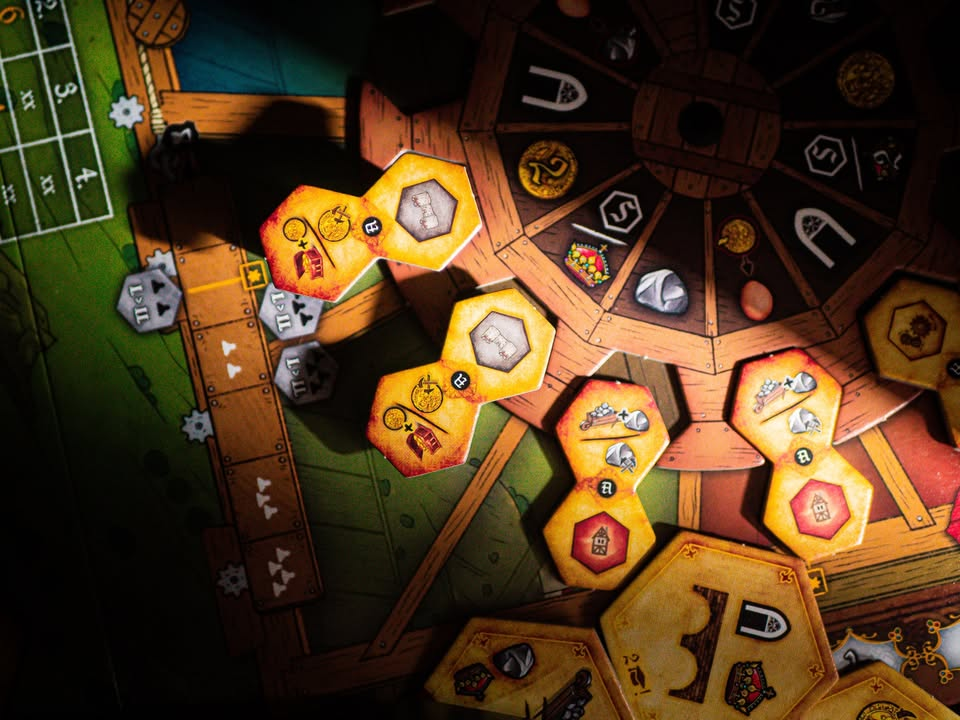
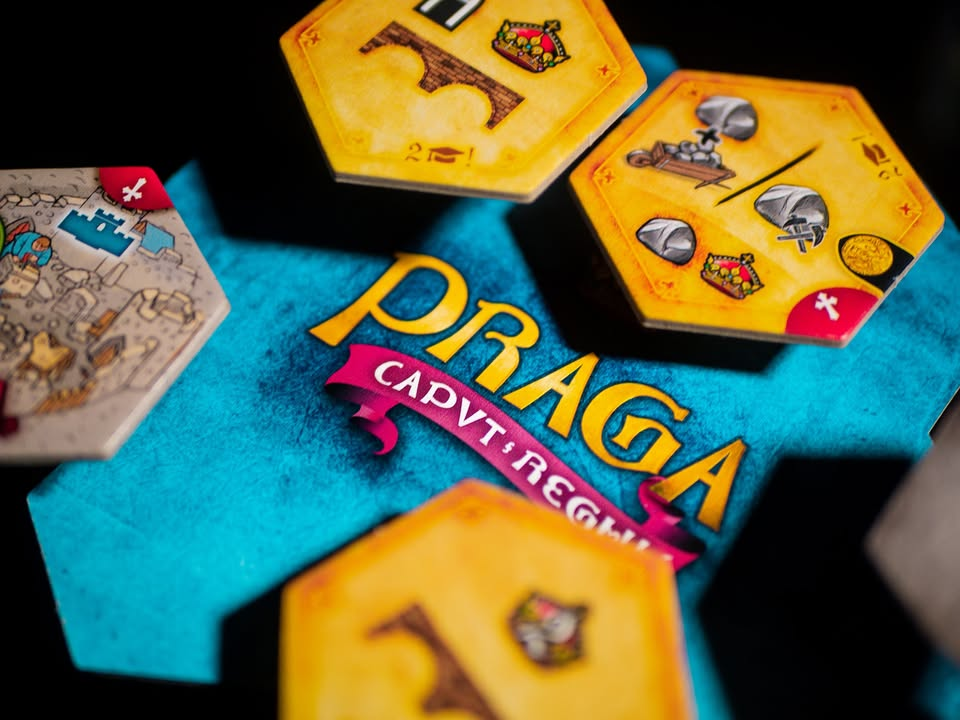
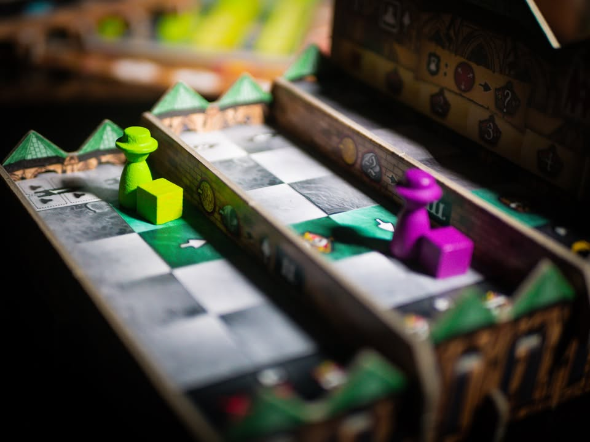
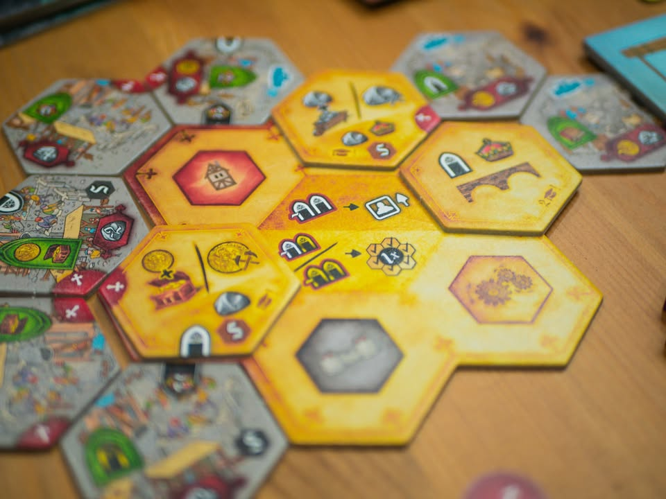
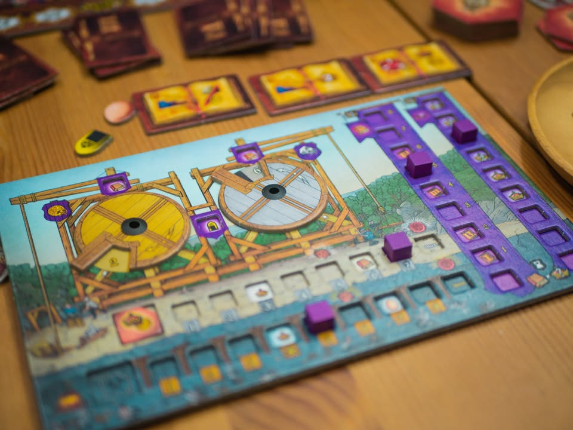
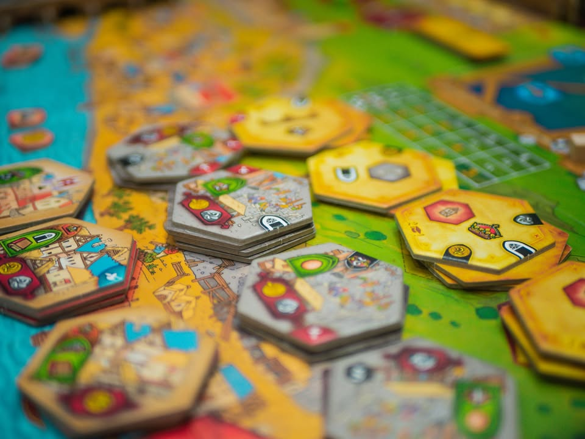

Praga Caput Regni #thought
blog link: https_://boardnbon.wordpress.com/2021/06/11/praga-caput-regni/
.
◾️ เกมยูโรระดับกลางหนักธีมหลวมๆว่าด้วยการสร้างเมืองปรากในรัชสมัยของพระเจ้าชาลส์ที่สี่ ผลงานของ Vladimír Suchý (Underwater Cities, Pulsar 2849)
.
.
◾️ สะพานชาลส์ - สะพานที่เชื่อมสองฝั่งแม่น้ำวัลตาวาซึ่งไหลผ่านกลางกรุงปราก หนึ่งในแลนด์มาร์คสำคัญที่อยู่ท้ากาลเวลามากว่า 600 ปี ตามปูมบันทึกแล้วส่วนผสมสำคัญที่ใส่ในปูนสมัยนั้นคือ 'ไข่ไก่' และเราจะได้ใช้ทรัพยากรนี้ในการแลกเปลี่ยนแต้มสำคัญในเกมนี้ด้วย
.
.
◾️ ในเชิงภาพรวมแล้วมันก็คือเกม Point Salad แบบทำอะไรก็ได้แต้มกึ่งๆบังคับให้ทำแทบทุกสิ่งตามแต่จังหวะจะอำนวย โดยสิ่งที่เตะตาคนเห็นเกมนี้ครั้งแรกมากที่สุดก็เห็นจะเป็น กงล้อเลือกแอคชั่น ที่ทำหน้าที่เป็นตัวนับรอบการเล่นในตัว
.
.
◾️ ตัวกงล้อที่หมุนได้เกมนี้จะมีร่องเอาไว้วางไทล์สำหรับทำแอคชั่น ในไทล์หนึ่งจะมีแอคชั่นให้ทำสองอย่างเราก็ต้องเลือกทำอย่างใดอย่างหนึ่ง พร้อมกับหมุนกงล้อไปหนึ่งคลิกแล้วเอาไทล์ไปต่อท้ายแถว วนอย่างนี้ไปเรื่อยๆจนจบเกม
.
.
◾️ ซึ่งตรงการเลือกก็จะมีกิมมิคที่สำคัญอย่างหนึ่งคือแต่ล่ะร่องมันมีโบนัสเสริมไม่เหมือนกัน ตรงนี้ก็ถือว่ามีผลกับการเลือกพอดูเพราะทั้งเกมแอคชั่นเรามีค่อนข้างน้อยการได้ของเสริมตรงจังหวะก็มีผลมาก และไทล์บางโซนถ้าจะหยิบต้องจ่ายเงินเพิ่ม แต่ถ้าวางทิ้งไว้นานแล้วจะมีแต้มแถมมาล่อตาล่อใจแทน
.
.
◾️ แอคชั่นจะแบ่งเป็นสองกลุ่มหลักคือแบบสะสมทรัพยากรพื้นฐานกับเอาของไปแลกเป็นไทล์ที่มีสามแบบ แบบแรกคือไทล์ที่ทำเพื่อเสริมโบนัสให้กับแอคชั่นของเราเอง แบบที่สองแบบที่สองคือการสร้างป้อมไว้รอบๆไทล์แอคชั่นเรา ซี่งเกมมันจะกิมมิคที่เราอยากจะวางหมุนเหลี่ยมให้ชนกันเพื่อเอาโทเคนคูณแต้ม และก็อันสุดท้ายคือแลกไทล์ร้านค้าไปวางไว้ที่บอร์ดกลางในเมืองก็จะเป็นกิมมิค area control เล็กๆเพื่อชิงโบนัสเพิ่ม
.
.
◾️ ที่เหลือก็แปลงของวางไทล์เอาแต้มตรงนี้ เอาตัวคูณเพิ่มตรงโน้น พร้อมกับบริหารจังหวะโบนัสไปเรื่อย จุด challenge  หลักๆคือแอคชั่นจำกัด แต่เราก็ต้องสละแอคชั่นสร้างมาผลิตของ แล้วเราจะใช้ของที่มียังไงให้คุ้ม
.
.
◾️ เล่นจนล้อหมุนครบรอบที่กำหนดก็จบเกม (มีกิมมิคฉลาดๆคือในล้อจะมีช่องวางคิวป์ พอหมุนครบรอบมันจะหล่นลงไปในรูทำให้ล้อหมุนต่อไม่ได้เป็นเครื่องช่วยเตือนว่าหมุนครบรอบหนึ่งแล้ว)

----------------------------------------------------------
🐸 Hang out friend, ค่ำคืนที่งดงาม แม้ตื่นมาจะไม่อยากโทรหา แยกย้ายตามทางจนกว่าจะกลับมาเจอกันใหม่
----------------------------------------------------------
.
🔹 ในฐานะเกมสมัยใหม่ที่บดระบบการเล่นมาผสมกันแล้วปั่นให้เนียนแล้ว เกมนี้ถือว่าอยู่แถวหน้า ทำมากลมกล่อมมาก ใครเป็นสายยูโรน่าจะชอบกันเพราะระบบของเล่นเหมือนจะเยอะแต่ว่าไอเดียความคิดไม่ซับซ้อนและสอนค่อนข้างง่าย แต่เกมนี้มีอารณ์แบบที่ทำให้ผมไม่ฮุกนักตรงที่พอจบเล่นจบแล้ว ไม่ค่อยอยากซ้ำแก้มือ
.
.
👁‍🗨 ความรู้สึกนี้สำหรับผมคล้ายกับที่เจอใน Tawantinsuyu คือมันเป็นเกมแบบที่ในเชิงอารมณ์การเล่นแล้วไม่มีอะไรใหม่เลย แต่เป็นการโชว์ทักษะการออกแบบเกมของคนทำว่าสามารถผสมเครื่องปรุงและกรรมวิธีใหม่ออกมาได้โดยที่เราไม่รู้สึกแปลกแยก ตรงนี้ยอมรับในกึ๋น แต่เกมนี้มันไม่มี 'สาย' ชัดๆ พอเล่นจบแล้วก็เลยรู้สึกจบเลยล่ะกัน รอมีอารมณ์อยากเล่นก็ค่อยหยิบมาใหม่ (คือผมเป็นพวกชอบเกมมีท่าให้ลอง จะได้กลับไปนอนคิดต่อ)
.
.
👁‍🗨 ในแง่หนึ่งถ้าชอบพวกอารมณ์ที่ของต่างชนิดมันฟีดทรัพยากรข้ามกันไปแบบใน Paladin of the west kingdom (กบเผาทิ้ง) เกมนี้ก็มีกลิ่นแบบนั้นออกมาจางๆแต่ว่ามันไม่ได้บังคับให้เราทำ โดนเพื่อนหยิบอันนี้เราก็หลบไปหยิบอันโน้น มันก็เลยเป็นเกมที่ค่อนข้างสงบประมาณหนึ่งในแง่โดนแย่งแล้วไม่ขัดใจแค่หาทางไหลไปต่อ
.
.
🔸 เป็นเกมที่ไม่มีข้อเสียอะไรจริงจัง นอกจากความรู้สึกที่พวกไทล์เทคโนโลยีมันความสามารถบางเหลือเกิน พวกโบนัสจบก็แต้มนิดๆหน่อยๆ ไทล์ตลาดตรงกลางก็แต้มน้อยจนขี้เกียจไปแย่งลง อย่างที่บอกตะกี้แหละว่าผลของมันคือทำให้เกมไม่มีจุดคิดเครียด เพราะตรงไหนก็ไม่ได้มีแต้มโดดเด่นตู๊มต้าม ทำอะไรก็ได้ไปเรื่อย (ตรงนี้อาจจะเป็นข้อดีของบางคน) กับบอร์ดอาร์ทมันรกไปหน่อย แต่ก็สวยดีแหละ
.
.
👁‍🗨 ข้อสังเกตุอย่างหนึ่งของผมคือ แม้ตอนเล่นจะไม่รู้สึกถึงธีมอะไร (ปกติของเกมยูโรอ่ะนะ) แต่กลไก และกิมมิคของเกมนี้ทำการบ้านมาเพื่อสอดรับกับธีมตั้งต้นดีนะ คือพออ่านพวก background element มาแล้วจะไม่รู้สึกว่าสักแต่สวมธีมฝืนๆให้มันลงมาเป็นเกมไรงี้ กับที่ต้องชมอีกอย่างคือเกมแทรก icon ไว้ค่อนข้างครบถ้วน (แต่บางอันก็งงนิดๆต้องเปิดคู่มืออยู่ดีนะ)
.
.
💭 เป็นเกมยูโรที่ดีมากเกมหนึ่ง presentation สวย กติกาคลีน สอนง่าย แค่ถ้าผ่านเกมมาเยอะหน่อยอย่างกลุ่ม Heavy อาจจะไม่รู้สึก wow มาก ใครเป็นสายเกมไหลทำแต้มไปเรื่อยแบบมีแผนหลวมๆไม่เน้นเครียดก็น่าจะชอบเกมนี้กัน

----------------------------------------------------------
Compatible Level - เกมนี้เข้ากับคนเขียนได้ระดับไหนนะ!!

🐸 Family, อาจจะมีช่วงเวลาที่ไม่เข้าใจกันบ้างแต่ครอบครัวคือสิ่งที่จะอยู่กับเราตลอดไป นี้คือเกมที่จะมีพื้นที่ถาวรในชั้นวางแน่นอน!! แม้บางเกมจะเปรียบดั่งคุณปู่ใจดีที่ได้เจอกันแค่ปีล่ะครั้ง แต่อันดับในใจนั้นคือความสนุกในช่วงเวลาที่เล่น หาใช่การได้เล่นซ้ำไม่รู้เบื่อเพียงอย่างเดียว [ex. กบโปรด, กบชอบ]

🐸 Hang out friend, เพื่อนกินเที่ยว ถ้าไม่ติดธุระอันใดก็พร้อมจะออกไปพบเจอ สนุกยามได้พบปะ แต่จะให้เจอกันบ่อยๆคงใช่ที - เกมสนุกที่อยากเล่นในระดับที่อยากจะหยิบกางเป็นบางครั้ง สลับสับเปลี่ยนไปเรื่อยตามจังหวะและโอกาส แต่เราก็ไม่ได้อยากซ้ำต่อเนื่องรัวๆ [ex. กบโอเค]

🐸 Someone I know, หากบังเอิญพบเจอ ก็คงได้ทักทายไต่ถาม หากแต่ในยามปกติมิอาจนึกชื่อออก ยืนคุยก็ได้ แต่คงไม่ได้เอื่อนเอ่ยนัดกินข้าว - บางเกมเราก็ไม่ได้อยากชวนเล่น แต่ถ้าไม่มีอะไรทำแล้วมีคนชวนก็เล่นก็ได้ [ex. กบเฉย]

🐸 I Turn left, You Turn Right - เธอชอบกินเผ็ด เราชอบกินอาหารญี่ปุ่น เธอชอบคนคารมดีพาไปกินที่หรู แต่เราชอบเล่นเกมอยู่กับบ้าน แม้จะได้คุยเป็นบางคราแต่คงไม่อาจพัฒนาความสัมพันธ์ - บางเกมแม้ว่าจะดีแค่ไหน แต่ถ้ารสนิยมมันไปด้วยกันไม่ได้ก็ไม่รู้จะเล่นไปทำไม [ex. กบไม่เล่น]
 
 
อนึ่ง : เป็นความรู้สึกในความ "อยากจะหยิบมาเล่นไหม?" ของผมเอง ไม่ได้เกี่ยวอะไรกับคุณภาพของเกม ไม่อิงมาตราฐานอื่นใดนอกจากตัวเองเท่านั้น ดูให้เป็นแค่ "อีกความคิดเห็นหนึ่ง" เท่านั้นก็พอนะครับ :)

