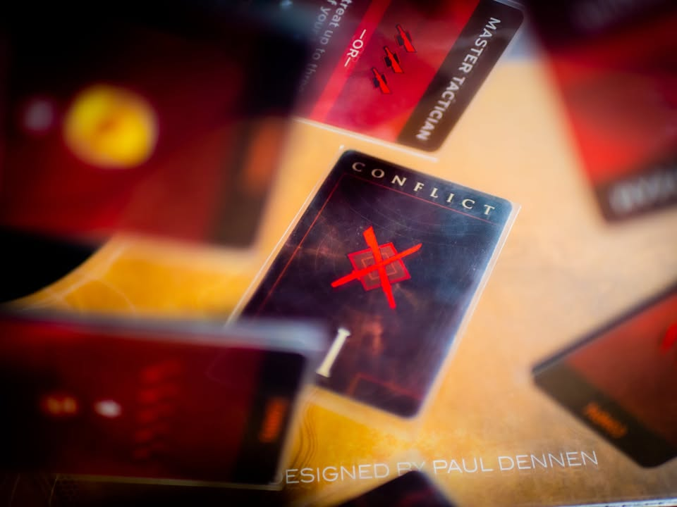
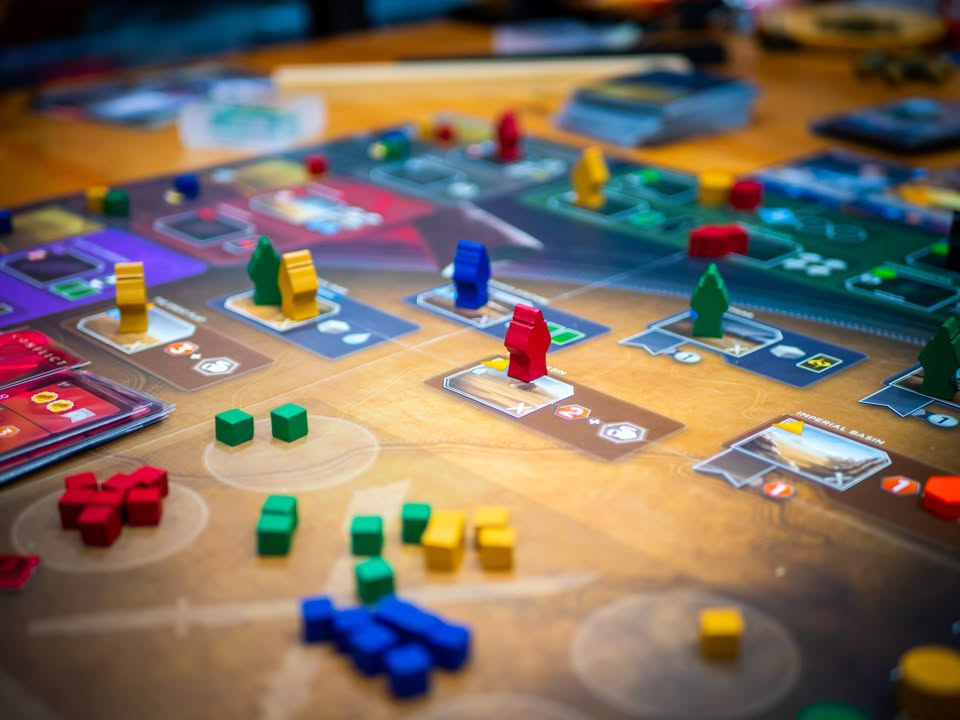
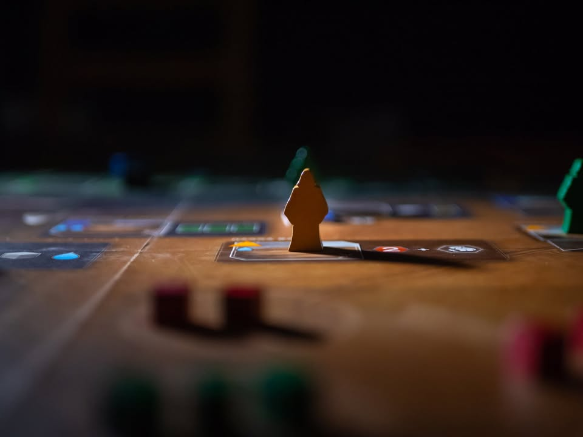
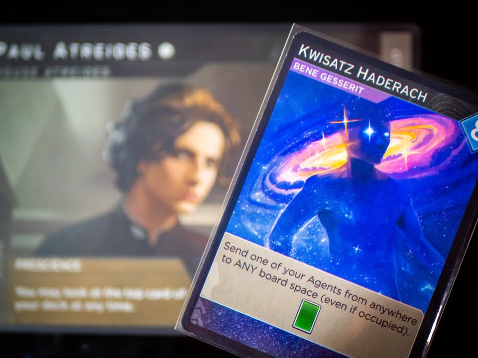
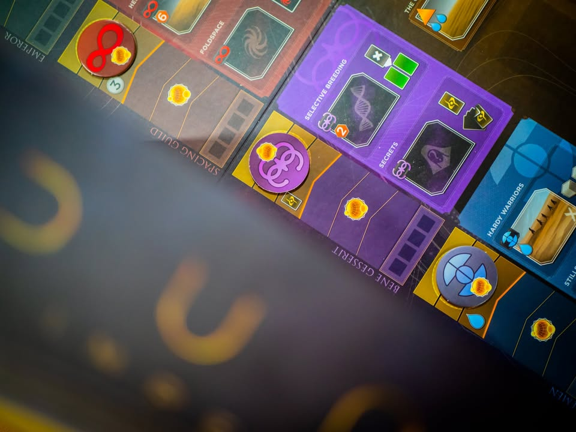

Dune Imperial #thought #first_impression
blog : https://boardnbon.wordpress.com/2021/06/13/dune-imperial/
.
▪️ เกมระดับกลางที่สร้างอิงนวนิยายวิทย์ศาสตร์ขึ้นหิ้งอย่าง Dune ที่เราจะรับบทเป็นตระกูลที่มาช่วงชิงพื้นดาวอาราคิส โดย Paul Dennen ( Clank! )
.
.
▪️ ในจักรวาลของดูน มนุษย์ได้เดินทางไปยังหมู่ดาวไร้ที่สิ้นสุดและถูกปกครองใต้อำนาจจักรพรรดิ แม้นเทคโนโลยีมากมายจะถูกพัฒนาอย่างไม่หยุดยั้ง แต่มนุษย์จำนวนมากก็ยังคงใช้ชีวิตไม่ต่างกับยุคโบราณเท่าใดนัก ด้วยเพราะวิทยาการคอมพิวเตอร์และระบบปัญญาประดิษฐ์ถือเป็นสิ่งต้องห้ามที่มีโทษถึงตายแก่ผู้ถือครอง ด้วยเหตุจากมันเคยเกือบทำลายล้างมนุษย์จนสิ้นสูญ 
.
.
▪️ Mentat คือเหล่ามนุษย์ผู้ได้รับการฝึกฝนการใช้สมองจนถึงขีดสุดเพื่อทดแทนเครื่องจักร พวกเค้ามีจำนวนน้อยนิดและเป็นดั่งมันสมองของเหล่าผู้มีอำนาจ หนึ่งในสายงานของพวกเค้าคือต้นหนยานไวเหนือแสง คอยคิดคำนวนทดแทนดั่งเป็นคอมพิวเตอร์เพื่อนำทางการเดินทางของยานอวกาศอันซับซ้อน
.
.
▪️ หากแต่สมองที่ทดแทนได้กระทั้งคอมพิวเตอร์ก็ไม่อาจนำทางยานสู่ห้วงอวกาศได้อย่างปลอดภัย พวกเค้าจำเป็นต้องเสพเอา 'เครื่องเทศ' พิเศษที่มีผลทำให้ระบบประสาทล่วงรู้เฉียบคมรวมถึง 'ญาณ' ในการรับรู้อนาคตอันใกล้เพื่อให้ทำหน้าที่นำร่องได้อย่างลุล่วง
.
.
▪️ หากปราศจากเครื่องเทศ การเดินทางข้ามดาวก็เป็นได้เพียงความฝัน จักรวรรดิจะสิ้นสูญหรือดำรงอยู่ก็ขึ้นอยู่กับเครื่องเทศนี้เท่านั้น
.
.
▪️ ในห้วงจักรวาลอันกว้างใหญ่มีเพียงดาวดวงเดียวเท่านั้นที่สามารถผลิตเครื่องเทศได้ นั้นคือดาวแห่งทะเลทราย (dune) ที่ชื่อว่า อาราคิส แต่การเก็บเกี่ยวเครื่องเทศก็ไม่อาจเป็นได้โดยง่ายเพราะมันถือกำเนิดกลางทะเลทรายที่มีหนอนทะเลทรายขนาดยักษ์ที่ลำตัวยาวถึงกิโลเมตรจำนวนมากอาศัยอยู่ และพวกมันว่องไวต่อการสั้นสะเทือนยิ่ง ผู้รบกวนมันย่อมประสบกับหายนะที่กลืนกินได้ทุกสิ่งอย่าง 
.
.
▪️ และผู้ที่ครอบครองดาวดวงนี้ก็จะเป็นผู้ที่ควบคุมจักรวรรดิ
.
.
▪️ กระนั้นดาวอันตรายนี้ก็ยังมีชนพื้นเมืองอาศัยอยู่ นั้นคือคือชาวเฟรเมน พวกเค้าคุ้นชินกับสัตว์อันตรายนี้กระทั้งการขึ้นขี่หลังหนอนยักษ์ถือเป็นการบรรลุความเป็นผู้ใหญ่ และเพื่อการอาศัยอยู่ในดินแดนทะเลทรายที่น้ำคือทรัพยากรอันล้ำค่า พวกเค้าได้พัฒนาชุดสูทที่รักษาความชื้นของร่างกายทั้งจากเหงื่อและของเสียวนกลับมาใช้ใหม่
.
.
และน้ำกับความชื้นบนดาวดวงนี้มีค่าเพียงใดสำหรับชาวเฟรเมนน่ะหรือ? มันมีค่ามากพอที่การถ่มน้ำลายลงพื้นคือการกล่าวชื่นชมในฝ่ายตรงข้าม และยามชีวิตดับสิ้นของเหลวในร่างกายชนเผ่าจะถูกนำแปรรูปเผื่อกักเก็บไว้เป็นส่วนกลางของเผ่า
.
.
▪️ อีกฟากหนึ่ง สำนักนางชี Bene Gesserit กลุ่มอำนาจทรงพลังที่เป้าหมายสูงสุดคือการสร้างสุดยอดมนุษย์ Kwisatz Haderach ผ่านโปรแกรมเพาะพันธุ์มนุษย์ที่ดำเนินการผ่านรุ่นต่อรุ่นมากว่าหนึ่งหมื่นปี เหล่านางชีจะดำเนินการทั้งเบื้องหน้าและเบื้องหลังชักใยจับคู่หรือกระทั้งให้นางชีในสำนักสืบทอดเชื้อไขของเป้าหมาย 
.
.
▪️ Kwisatz Haderach คือผู้ตื่นรู้ ผู้เห็นอดีตและอนาคต และเป็นผู้ที่เข้าถีงความทรงจำทั้งมวลของมนุษย์ หนึ่งในตัวกระตุ้นสำคัญคือเครื่องเทศนั้นเอง และตัวละครหนึ่งในเรื่องนี้คือผลผลิตนั้น
.
.
▪️ ที่พล่ามมายาวๆคือเกมมันถ้าดูแต่กระดานอาจจะรู้สึกว่ามันทำมาดูแห้งเกินไป แต่จริงๆแล้วกลไกมันผูกกับ lore มาค่อนข้างดีเลยนะ ไม่ได้ตัดแปะโง่ๆ เลยอยากอินโทรไว้เผื่อใครไม่รู้จักจะได้สนุกขึ้น แบบมันมาสู้เหี้ยอะไรกันตรงนี้ แล้วเครื่องเทศนี้มันอิหยั่ง ต่างกะเกลือพริกไทยตรงไหนทำไมมาแย่งกันจังว่ะ
.
.
▪️ เกมนี้เล่นยังไง? คือ worker placement ธรรมดาๆเนี่ยล่ะ แต่ความลีลามันคือการผนวกระบบ deck building เข้าไป เวลาเราจะลงคนงานก็ต้องลงการ์ดด้วย ตัวการ์ดจะมีไอคอนบอกว่าเราสามารถส่งคนไปได้ที่แอคชั่นหมวดไหน พร้อมกับจะมีความสามารถของการ์ดเพิ่ม พอลงคนงานหมดการ์ดที่เหลือที่กำลังจะโดนทิ้งจะมี function รองว่าเราจะได้ค่าการชักจูงให้เราไปซื้อการ์ดใหม่ๆจากตลาดมาเพิ่ม ตรงนี้แผนการเราก็จะเปลี่ยนไปตามมือ แต่เราก็สามารถเน้นได้ว่าอยากลงหมวดไหนบ่อยผ่านการซื้อการ์ดเพิ่ม
.
.
▪️ การรบในเกมจะมาในรูปแบบประมูล โดยตอนต้นรอบจะมีการ์ดเปิดบอกว่าใครรบชนะจะได้อะไร ระหว่างเล่นเราก็สามารถลงแอคชั่นจ้างทหารมาเพิ่มแล้วก็ดันทหารลงไปสนามรบเพื่อแทนการประมูลได้
.
.
▪️ เกมเล่นจนกว่าใครจะมีแต้มครบสิบ หรือว่าการ์ดสงครามหมดกอง (หรือสิบรอบจบ)

----------------------------------------------------------
🐸 Hang out friend, หลานชายตัวป่วนเจอหน้าก็ชวนไปเล่นกะบะทราย
----------------------------------------------------------
.
.
🔹 สำหรับผมแล้วเกมนี้น่าจะเป็นประสบการณ์การเล่นเกม weight กลางที่ enjoy ที่สุดในรอบหลายปี ซึ่งค่อนข้างผิดคาด เพราะตอนอ่านกติกาก็ดูไม่มีอะไรซับซ้อน แต่เล่นแล้วสนุกซะงั้น ตอนแรกคิดว่าเพราะเรารู้ lore เลยอินกว่าปกติหน่อย แต่เพื่อนที่ไม่รู้ด้วยก็บอกว่าสนุกอยู่นะ
.
.
🔹 คือในเชิงออกแบบและประสบการณ์มันแบบว่า เออหว่ะ แค่นี้พอล่ะ ไม่ฝืนยัดกลไกมากไปเพื่อสักให้แตกต่าง แล้วก็ไม่แบนราบน่าเบื่อตื้นเขิน best move มันชัดมากเหมือนเกม weight กลางเกลื่อนๆทั่วไป คือมันเป็นเส้นบางๆที่ผมคิดว่าเกมนี้ทำได้ดี
.
.
🔹 ข้อดีคือ flow อธิบายง่ายไม่ซับซ้อน downtime ค่อนข้างต่ำ เนื่องจาก ตานึงมีมือแค่ห้าใบมันก็เลือกลงได้ไม่กี่ที่ แต่เกมจะตึงจากการที่เรามีคนงานแค่สองคน กับการที่เราต้องเลือกว่าจะใช้ใบไหนทำแอคชั่น ใบไหนจะเก็บไว้ทิ้งเอาโบนัส
.
.
🔹 luck factor ที่น่าสนใจคือพวกการ์ดพิเศษที่จั่วได้ระหว่างเกม ซี่งจะช่วยแหกกฎทั้งตอนลงแอคชั่นและตอนตอนสู้ ความสามารถค่อนข้างดีทุกใบรู้สึกดีเวลาที่ได้ใช้ จังหวะการสู้ที่นอกจากจะมีทหารให้เห็นตอนทำแอคชั่นแล้ว การ์ดหลายใบเวลาทิ้งจากมือก็ช่วยเสริมทหารให้อีก และมีการ์ดพิเศษช่วยบวกด้วย ทำให้การต่อสู้ในเกมไม่นิ่งแบบเห็นผลทันที
.
.
👁‍🗨 เกมนี้ระบบ deck building ค่อนข้างบาง การ์ดไม่ได้วนบ่อยและการ trash การ์ดออกจากเกมเพื่อทำให้กองจั่วบางไม่ใช่สาระหลักของเกมนี้ ส่วนตัวพบว่าการแทรก worker placement มาตอนเล่นการ์ดนี้มันเวิร์คมากๆ เพราะ deck building ทั่วไปมันเล่นอยู่กับตัวคนเดียว ลงการ์ดๆๆ คอมโบแล้วนั่งรอ แต่พอมันต้องรอดูเพื่อนกับบอร์ดเปลี่ยนก็ทำให้จังหวะตัวคนเดียวหายไป แล้วดึงให้เราอยู่กับเกมตลอดเวลา (อย่าง Clank! ที่ต่างคนต่างเดินผมก็ไม่ถูกใจนัก)
.
.
🔸ข้อเสียที่ทำให้ค่อนข้างหงุดหงิดคือตัวละครมีน้อยเกินไปมากแค่แปดตัว แถมบางตัวก็ก๊ากกกกาก คือถ้าไม่มีตัวเสริมนี้อาจจะเล่นรอบสองรอบแล้วอาจจะเบื่อเอาง่ายๆ ต้องมีเยอะกว่านี้ซักสี่เท่าอ่ะ
.
.
💭 แต่มันก็ไม่ใช่สุดยอดเกมที่มอบความลุ่มลึกในการเล่นอะไร อย่าไปคาดหวังอะไรแบบนั้น แต่มันทำออกมาแบบพอดี๊ พอดีมากจริงๆเล่นแล้วสนุก คือสำหรับผมแล้วเกมที่สนุกคือเกมที่ระหว่างเล่นแล้วต่างคนต่างสงสัยว่าเพื่อนมันออกคอมโบกันโกงจังว่ะ ไม่ใส่กำไรบางๆเรียบจนลืมหยิบใช้
.
.
++ DUNE
+ กลไกหลักเข้าใจง่าย
+ คู่มือทำมาดี (แต่หลายจุดก็น่าจะทำ highlight ออกมาหน่อย)
+ ระบบกับธีมทำมาด้วยกันดี
= keyword หลายอันใช้คำธรรมดาหน่อยก็ได้
= เป็น Deck building  ก็จริงแต่ไม่ได้หมุนมือทำ engine โหดๆเพราะรอบน้อย
= งานศิลป์กระดานค่อนข้างแห้งเมื่อเทียบกับธีมที่มี lore หนักแน่น
= ตัวละครยังมีไม่เยอะพอ ไอ้ที่มีก็เก่งกากต่างกันเกินไปหน่อย รอตัวเสริมแล้วเนี่ย

----------------------------------------------------------
Compatible Level - เกมนี้เข้ากับคนเขียนได้ระดับไหนนะ!!

🐸 Family, อาจจะมีช่วงเวลาที่ไม่เข้าใจกันบ้างแต่ครอบครัวคือสิ่งที่จะอยู่กับเราตลอดไป นี้คือเกมที่จะมีพื้นที่ถาวรในชั้นวางแน่นอน!! แม้บางเกมจะเปรียบดั่งคุณปู่ใจดีที่ได้เจอกันแค่ปีล่ะครั้ง แต่อันดับในใจนั้นคือความสนุกในช่วงเวลาที่เล่น หาใช่การได้เล่นซ้ำไม่รู้เบื่อเพียงอย่างเดียว [ex. กบโปรด, กบชอบ]

🐸 Hang out friend, เพื่อนกินเที่ยว ถ้าไม่ติดธุระอันใดก็พร้อมจะออกไปพบเจอ สนุกยามได้พบปะ แต่จะให้เจอกันบ่อยๆคงใช่ที - เกมสนุกที่อยากเล่นในระดับที่อยากจะหยิบกางเป็นบางครั้ง สลับสับเปลี่ยนไปเรื่อยตามจังหวะและโอกาส แต่เราก็ไม่ได้อยากซ้ำต่อเนื่องรัวๆ [ex. กบโอเค]

🐸 Someone I know, หากบังเอิญพบเจอ ก็คงได้ทักทายไต่ถาม หากแต่ในยามปกติมิอาจนึกชื่อออก ยืนคุยก็ได้ แต่คงไม่ได้เอื่อนเอ่ยนัดกินข้าว - บางเกมเราก็ไม่ได้อยากชวนเล่น แต่ถ้าไม่มีอะไรทำแล้วมีคนชวนก็เล่นก็ได้ [ex. กบเฉย]

🐸 I Turn left, You Turn Right - เธอชอบกินเผ็ด เราชอบกินอาหารญี่ปุ่น เธอชอบคนคารมดีพาไปกินที่หรู แต่เราชอบเล่นเกมอยู่กับบ้าน แม้จะได้คุยเป็นบางคราแต่คงไม่อาจพัฒนาความสัมพันธ์ - บางเกมแม้ว่าจะดีแค่ไหน แต่ถ้ารสนิยมมันไปด้วยกันไม่ได้ก็ไม่รู้จะเล่นไปทำไม [ex. กบไม่เล่น]
 
 
อนึ่ง : เป็นความรู้สึกในความ "อยากจะหยิบมาเล่นไหม?" ของผมเอง ไม่ได้เกี่ยวอะไรกับคุณภาพของเกม ไม่อิงมาตราฐานอื่นใดนอกจากตัวเองเท่านั้น ดูให้เป็นแค่ "อีกความคิดเห็นหนึ่ง" เท่านั้นก็พอนะครับ :)

