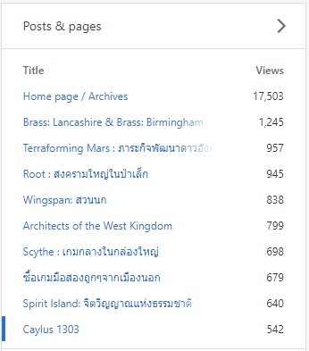
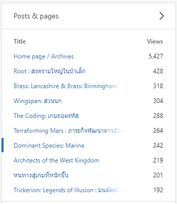

▪️ เห็นข่าวค่ายไทยจะเปิดตัวแปลเกมใหญ่ (ใหญ่แหละ) ตอนแรกว่าจะหาเลขอะไรมาทำมีมหน่อยแต่ว่าแอบเชื่อมโยงได้อีกแบบแทน
.
.
▪️ ผมทำเพจมาหกปี เวลาโพสอะไรลง fb ก็จะเอาลง blog ใน wordpress ด้วยเพื่อไม่ให้เนื้อหามันกระจัดกระจาย พอมาดู stat top 10 ของแต่ละปีก็พบว่ามันชื่อซ้ำๆกับโดนแปลไทยไปเป็นสัดส่วนเยอะเหมือนกัน แบบคนดูเยอะติดต่อกันต่อเนื่องเป็นปีย่อมไม่ธรรมดา ยอดวิวก็มาทั้งจากความน่าสนใจตอนเกมออกแล้วก็ (คิดว่า) มาจากตอนแปลไทยแล้วคนมา search หารีวิว (เลยขออนุมานว่า feedback ดี)
.
.
▪️ ไม่ได้ลงมาเพื่ออวดว่าตัวเองปั่นมานะ คือยอดวิวมันไม่ได้เยอะอะไรเลยไม่รู้จะปิดเลขทำไม แต่ถ้ารวมกับยอดจาก fb ก็กะเล่นๆว่าน่าจะ x2 มั้ง? ( พอดี fb มันไม่ได้ group ให้ดูง่ายๆแบบนี้อ่ะนะ) แค่จะมาตั้งข้อสังเกตว่าพวกเกมใหญ่หน่อยที่แปลมาแล้วนี้ค่ายเค้าก็ต้องคิดมาแล้วแหละว่ามีคนซื้อ อิงจากข้อมูลเพจเฉพาะทางอย่างผมก็ยังเป็นในเทรนเดียวกันเลย
.
.
▪️ สงสัยต้องทำรีวิว Agricola ทิ้งไว้แล้วนั่งมอง stat บ้าง............ (เอาจริงๆโพสนี้มาเพื่อพิมพ์ประโยคนี้แหละ.......)

