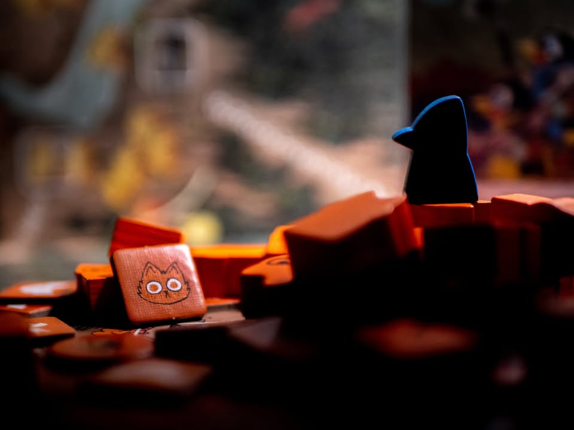
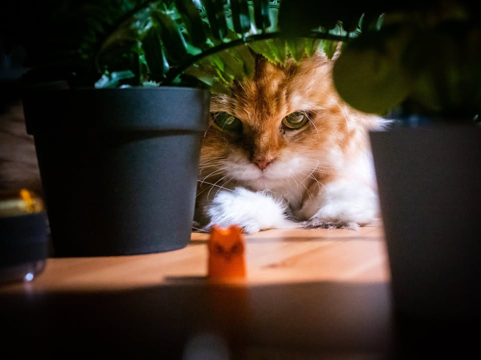
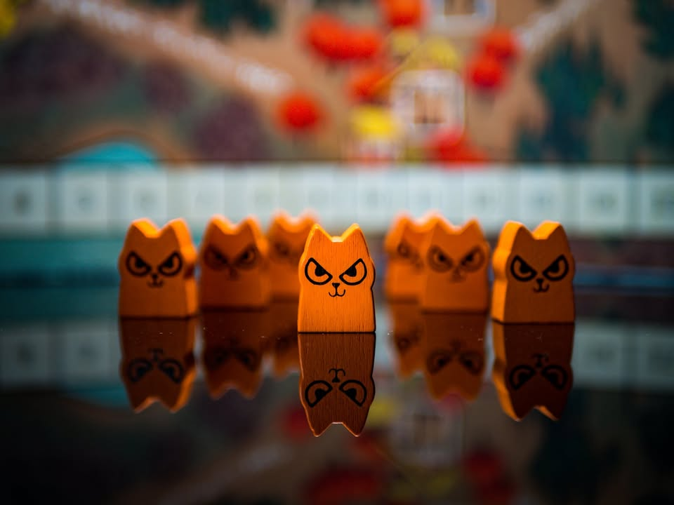
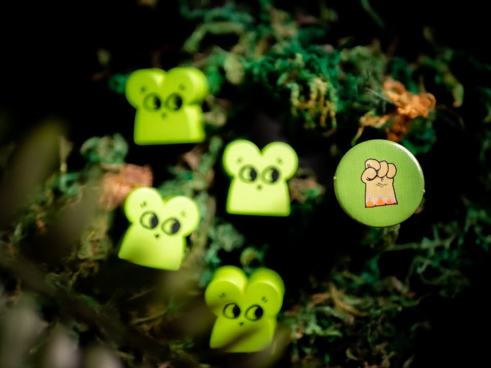

▪️ ช่วงนี้ Root กระแสกลับมาเพราะแปลไทย  เลยอยากจะยกมุมที่คนอื่นอาจจะไม่ค่อยเน้นเท่าไรให้ฟังล่ะ นั้นคือโดยแกนแล้วมันคือเกมที่ว่าด้วยการต่อสู้ของรัฐบาลกับกลุ่มผู้ก่อความไม่สงบ
.
.
▪️ โดยตรงนี้ไม่ได้พูดถึงความชอบธรรมหรือคุณธรรมแต่อย่างใด คือไม่ว่าใครจะเป็นตัวดีหรือตัวร้ายแต่รัฐบาลก็คือรัฐบาล คนที่จะมาล้มด้วยวิธีการใช้กำลังก็เรียกผู้ก่อความไม่สงบนั้นแหละ
.
.
▪️ เพราะว่าไอเดียต้นฉบับของเกมนี้มาจากเกมสงครามซีรี่ย์ COIN ของค่าย GMT โดย COIN ย่อมาจาก COunterINsurgencies หรือต่อต้านผู้ก่อความไม่สงบ (หลังๆก็มีแตกไปแนวอื่นบ้างแต่อิงระบบหลักที่เป็น Card Driven กับมีหลายฝ่ายแบบเดียวกัน)
.
.
▪️ มันจะมีอีกคำที่เรียกว่าผู้ก่อการร้าย (terrorism) ที่มีคำว่า terror ที่แปลว่าความหวาดกลัวซึ่งจะต่างกันตรงเป้าหมายนั้นคือใช้ความรุนแรงโดยไม่เลือกปฏิบัติ (indiscriminate vs selective)
.
.
▪️ COIN ตัวอย่างที่ดังๆอย่าง Cuba Libre ที่สร้างจากเรื่องจริงซึ่งเล่าถึงรัฐบาลเผด็จการในคิวบา เหตุการณ์เดียวกับที่พี่เช เกบาร่า ที่มีหน้าโผล่ไปท้ายสิบล้อบ้านเราเต็มไปหมดเข้าร่วมอยู่ ก็จะมีกลุ่มก่อการร้ายสองกลุ่มต่างอุดมการณ์ที่ร่วมมือกัน ในขณะเดียวกันเหล่ามาเฟียผู้คุมธุรกิจคาสิโนก็ต้องหาทางทำเงินและเอาตัวรอดในสงครามกลางเมืองผ่านการประสานประโยชน์
.
.
▪️ ทั้งสี่ฝ่ายนี้ใช้แผนที่ร่วมกัน ขยับกำลังพลและปรับพื้นที่ด้วยกฎเดียวกันแต่เป้าหมายการชนะต่างกัน ฝั่งรัฐบาลก็ต้องการความเสถียรภาพ ฝั่งมาเฟียเงินถึงก่อนก็ชนะ ผู้ก่อการร้ายฝั่งหนึ่งต้องการที่มั่น ขณะที่อีกฝั่งขอแค่ประชาชนเชื่อแนวคิดของพวกเค้ามากพอ ซึ่งก็เป็นเกมที่เอาเหตุการณ์จริงมาทำเป็นเกมเล่นสนุกได้อย่างลงตัว
.
.
▪️ ทีนี้คิดว่าน่าจะเริ่มเห็นสิ่งที่ผมพยายามจะโยงให้ดู
.
.
▪️ ในเกม Root ก็จะเล่า story ซ้อนทับกันเลย โดนเน้นที่เผ่าแมวกับนกเป็นหลัก เพราะมันเป็นตัวแทนของรัฐบาลและกลุ่มผู้ก่อความไม่สงบที่การแก้ปัญหาคือการชิงพื้นที่ด้วยกำลังทหาร 
.
.
▪️ ในขณะที่กลุ่มผู้ก่อความไม่สงบชาววู๊ดแลนด์ที่เป็นชาวบ้านเนี่ยทรัพยากรไม่เยอะเน้นการต่อสู้แบบกองโจรกับแต้มมาจากการ 'สร้างความรู้สึก' ว่าฉันอยู่ตรงนี้ และฝ่ายคนจรโดดเดี่ยว(แรคคูนและพวกสัตว์ตัวเทาๆทั้งหลาย) จะหากินจากการประสานผลประโยชน์ให้กับทุกฝ่าย (พอใส่ตัวเสริมชาวแม่น้ำไป เราก็จะเห็นกลุ่มพ่อค้าที่ทำกำไรจากความขัดแย้ง และลัทธิศาสนาหัวรุนแรงที่มาพร้อมความเชื่อพิลึกพิลั่น)
.
.
🔹 Root จึงเป็นภาพจำลองสงครามกลางเมืองที่ผ่านการเคลือบน้ำตาลมาอย่างหนาแน่นแถมไส้ในก็ไม่ขมแต่กลมกล่อมเป็นช็อกโกแลตเข้มๆ
.
.
▪️ อีกเรื่องที่อยากเสริมคือ มันเป็นเกมตีกันที่คุณยังชวนผู้เล่นสันติจ๋าๆมาเล่นด้วยได้ ด้วยการเล่นเป็นตัวคนจรที่เดินไปทั่วแผนที่และไม่มีทางตายได้นั่นเอง โดยที่แทนที่จะไปเล่นเสี้ยมเสริมชาวบ้านในวง จะไปเล่นเป็นเกม rpg ส่งของช่วยเหลือชาววู๊ดแลนด์ก็ได้ โอเคคุณอาจะแย้งว่ามันไม่ค่อยเกี่ยวกับคนอื่น แต่อย่างน้อยคุณก็ไม่โดนเทนั่งเหงาจากทั้งวงนะ ซึ่งตรงนี้ผมคิดว่ามันเป็นข้อดีที่น่าสนใจมากเพราะยังนึกเกมอื่นที่ทำได้ไม่ออกนอกจะเป็นเกมสไตล์ multiple solitaire
.
.
📌 ไม่ได้รับตังมาโพสนะ อยากเกาะกระแสบ้างแต่ไม่อยาก repost ของเก่าเฉยๆ ไหนๆแล้วหาเรื่องถ่ายรูปด้วย (แต่เอาจริงๆผมก็แอบมี hidden agenda หน่อยๆว่าอยากให้คนซื้อเกมที่มันแปลไทยแบบที่ไม่ได้มีแต่คู่มือกันเยอะๆ ค่ายในไทยเค้าจะได้เห็นว่ามันขายได้แหละ เกมอื่นๆดีๆมันจะได้ตามมาอีกเรื่อยๆ อย่างเช่น.................)

🔹 ผมเคยเขียนถึง Root เอาไว้ที่ : Root : สงครามใหญ่ในป่าเล็ก https://tinyurl.com/xt7x3b8j

🔹 ผมเคยเขียนถึง Cuba Libra เอาไว้ที่ : https://tinyurl.com/yct7b48r

