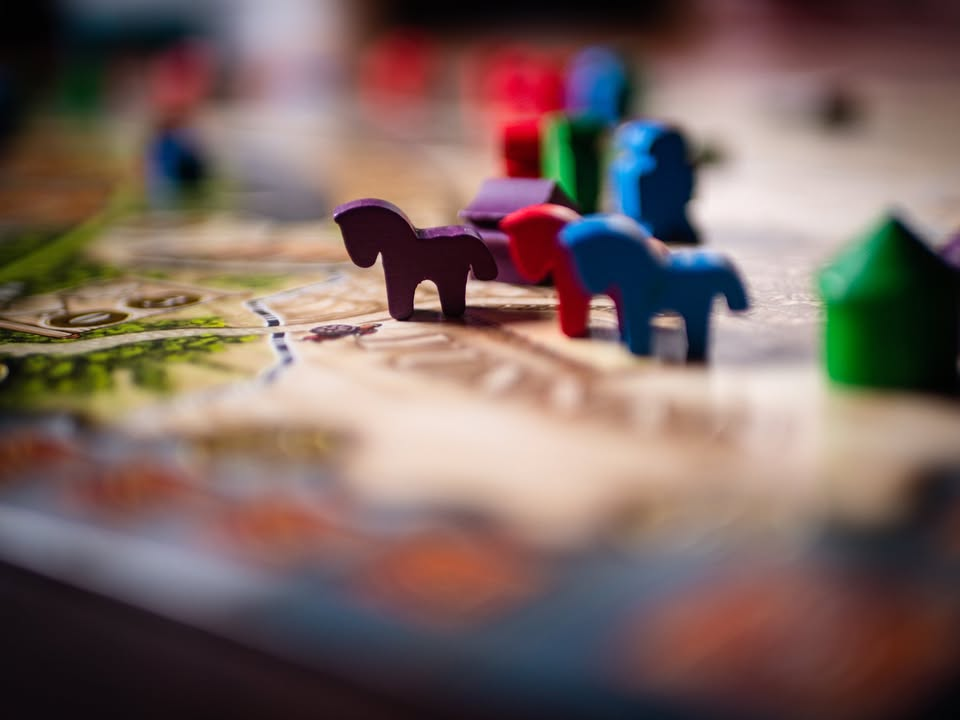
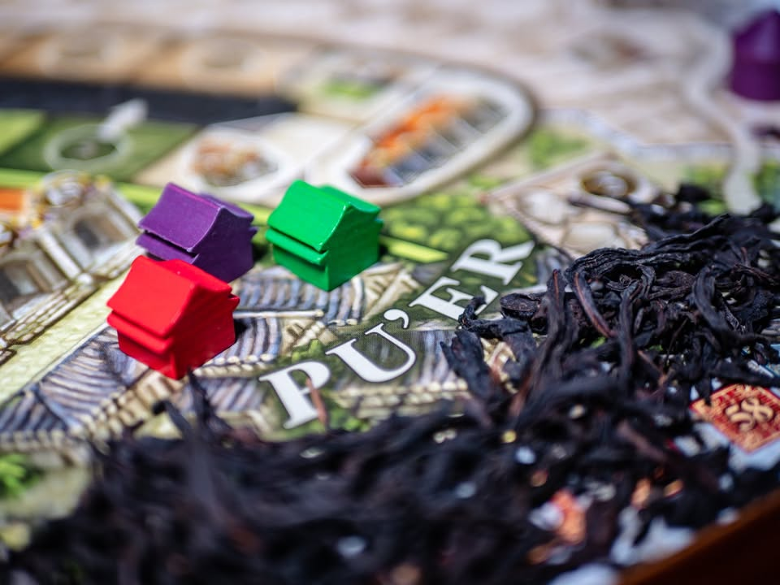

Yunnan หอมกลิ่นชาว่าจะพัก...แต่เตะกันยับ 
blog link: https_://tinyurl.com/5dspxxz3
.
▪️ มณฑลยูนนานแหล่งกำเนิดชาผูเอ่อร์อันลือชื่อ รสเข้มข้นกลิ่นแรงจัด กรรมวิธีการผลิตอันสืบทอดมานั้นจะหมักไว้ในเข่งแล้วอัดเป็นก้อนเพื่อให้ง่ายต่อการขนส่งในสมัยโบราณที่ต้องขนย้ายบนหลังม้าลัดเลาะผ่านภูเขาเป็นระยะทางไกล
.
.
▪️ เกมนี้ก็จะเล่าถึงการเดินทางของเหล่าพ่อค้าใบชาที่ต้องเดินทางรอนแรมไปตามเส้นทางใบชา (The Tea-Horse Road) จากมณฑลยูนนานลัดเลาะผ่านเสฉวน  ข้ามเทือกเขาหิมาลายามุ่งสู่ธิเบต สิ่งที่เราจะต้องทำคือขยายศักยภาพในการเดินทางไปสู่พื้นที่ห่างไกล ไปพร้อมๆกับลงทุนในจำนวนพ่อค้าและการก่อตั้งโรงน้ำชาไว้กลางทาง แต่หากพื้นที่ใดรุ่มรวยเป็นพิเศษล่ะก็ เจ้าหน้าที่ก็จะแวะมาถามหา
.
.
▪️ แกนเกมเดินด้วยระบบที่ผสมระหว่าง worker placement กับประมูล คือมันจะมีช่องแอคชั่นไว้ให้เราเลือกเพิ่มศักยภาพการค้าของเรา อย่างถ้าอยากเดินไปขายไกลๆให้เงินเยอะก็ต้องลงตึกอัพเกรดม้า อยากได้โทเคนสะพานไว้เป็นทางลัดหรือโทเคนโรงน้ำชาก็ต้องมาลงอีกตึก ถ้าอยากส่งคนไปเดินเยอะๆก็ต้องเพิ่มศักยภาพในการจ่าย 'ค่าต๋ง' ที่เจ้าหน้าที่จะเรียกเก็บตอนเดินข้ามพรมแดน...
.
.
▪️ แต่ละตีกจะมีช่องให้ลง ถ้าพูดง่ายๆก็คือลงก่อนจ่ายถูกกว่า หรือเราจะลงช่องแบบจ่ายถูกพิเศษก็ได้ แต่ว่าช่องพวกนี้ถ้ามีคนจ่ายแพงกว่าจะโดนเตะออกไป ไม่เหมือนกับช่องแพงที่การันตีว่าได้ทำแน่ๆแต่ต้องจ่ายขั้นต่ำแพงกว่า
.
.
▪️ พอประมูลจบเราก็จะได้พาคนงานที่เหลือจากการประมูลเดินทางออกจากเมือง คนงานจะข้ามพรมแดนได้ไม่เกินโควต้าที่เราเพิ่มมา และต้องไม่ไกลไปกว่าม้าที่เราเพิ่มไว้ โดยเราสามารถสร้างสะพานไว้ลัดเส้นทางเพื่อประหยัดเวลา รวมไปถึงโรงน้ำชาเพื่อสร้างเพิ่มรายรับ แต่ถ้าเส้นทางเราขาดช่วงเราจะต้องเสียรายได้บางส่วนจากการที่ network ไม่สมบูรณ์ โดยความน่าสนใจอีกอย่างจะเป็นรายได้แต่ละรอบเราต้องคิดด้วยว่าจะแปลงเป็นแต้มเท่าไรแล้วจะเหลือเงินไว้ใช้ประมูลเท่าไรดี
.
.
▪️ ในแต่ละพื้นที่พ่อค้าและโรงน้ำชาจะให้เงินไม่เท่ากัน (แต่ว่ายิ่งไกลยิ่งได้เงินเยอะ) แต่ถ้าที่ไหนมีผลรวมของรายได้จากผู้เล่นทุกคนเยอะที่สุดที่ตรงนั้นจะมีผู้ตรวจการมาเยี่ยมทำให้ผู้เล่นบางคนต้องเสียพ่อค้าในพื้นที่นั้นไป หมายความว่าส่วนสำคัญมากในกระบวนการความคิดของเกมนี้คือการ เลือกว่าจะเดินทางอย่างไรให้เราได้เงินเยอะ แต่ไม่เด่นจนโดนเตะออกมา หรือเราจะไปช่วยชุมนุมตรงไหนดีให้มันเงินเยอะเพื่อนจะได้โดนเตะ และการโดนเตะนอกจากรายได้ตรงนั้นจะลดแล้ว network ก็อาจจะขาดทำให้เสียเงินเพิ่มอีก
.
.
▪️ อีกสิ่งที่ไม่พูดไม่ได้คือระบบ turn tracking ที่ออกแบบฉลาดมาก โดยมันถูกใช้เป็นทั้งตัวบอก turn order ไปพร้อมๆกับบอกว่าใครผ่านและบอก flow game วนเป็นวงกลมได้แบบสวยงาม เป็นการออกแบบที่คิดว่านักออกแบบ UI/UX ควรมาดูงานกัน
.
.
▪️ เกมนี้เป็นเกมเก่าที่ไม่ได้ดังเปรี้ยง แต่มีดีไซน์ที่ยอดเยี่ยมมากและมีระบบสวยๆอยู่เต็มไปหมด ระบบกระชับตรงไปตรงมาแค่ประมูลว่าเราจะเพิ่มศักยภาพการค้าในด้านไหน แล้วก็ขยับไปตามนั้น แต่ทว่ามี interaction ที่ค่อนข้าง 'เดือด' ทีเดียว ไม่ใช่เกมแบบต่างคนต่างเล่น
.
.
▪️ ตัวเกม OOP ไปนานแล้ว ราคาก็ขึ้นมาเยอะเหมือนกันและมีแผนที่จะเอามาพิมพ์ใหม่ปี 2023 โน้น (พิมพ์ไม่ผิด) ในแง่ความสนุกอาจจะไม่คุ้มค่าที่จะไปซื้อแพงๆ แต่ถ้ามีโอกาสได้เล่นก็อยากให้ลองเล่นกันดูครับ เป็นเกมที่ออกแบบมาได้สนุกควรค่าแก่การแวะไปเล่นอีกเกมหนึ่ง

--------------------------------
หมวด Bite Size (พอดีคำ) นี้กะว่าจะเขียนอะไรสั้นๆประมาณนี้ล่ะกัน ใหม่บ้าง ซ้ำบ้าง เกมที่ขี้เกียจเขียนบ้าง เขียนๆไว้ก่อนเผื่อมีอารมณ์อาจจะขยายไปลง Thought บ้าง จริงๆอยากเขียนสั้นกว่านี้ แต่ยังอดไม่ได้ที่จะต้องอธิบายอะไรเพิ่มตามนิสัย เดี๋ยวค่อยๆปรับไปล่ะกัน

