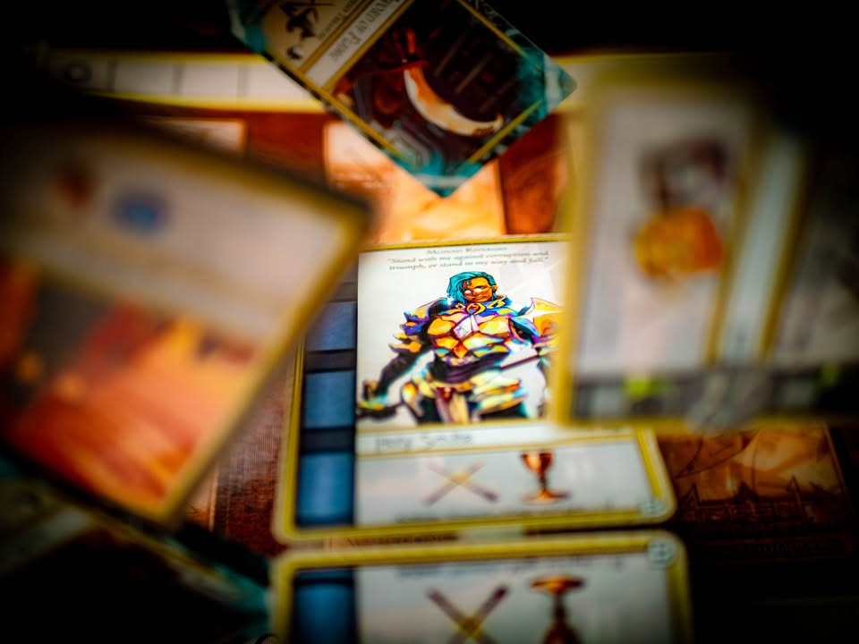
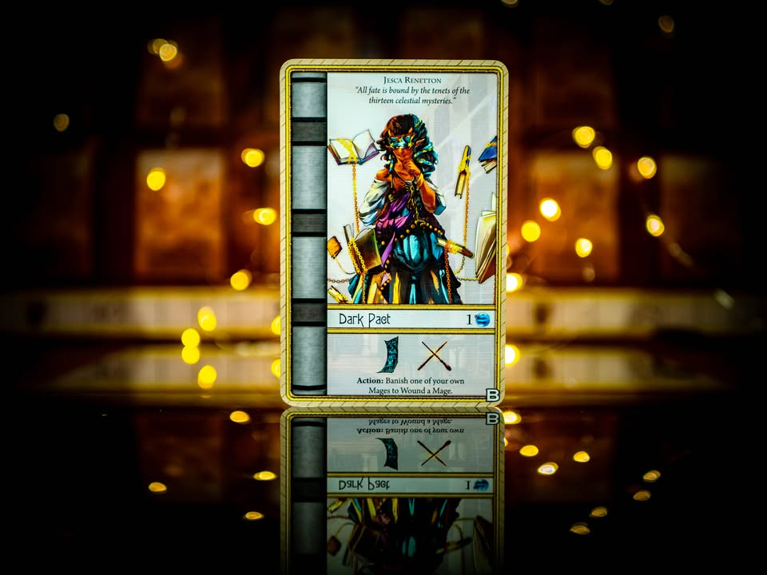
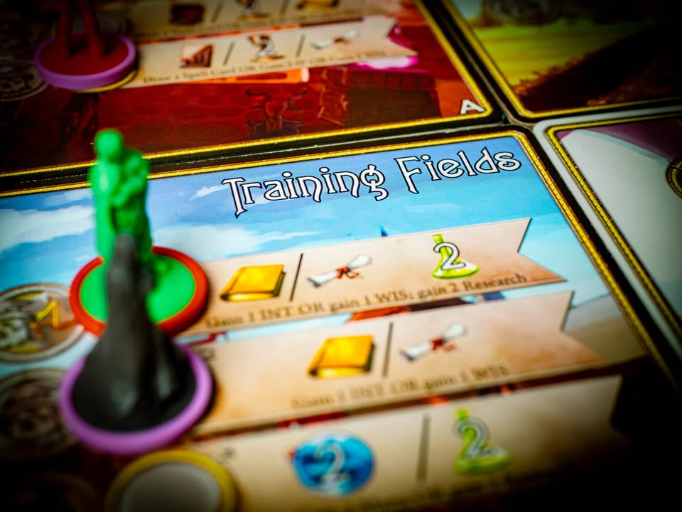
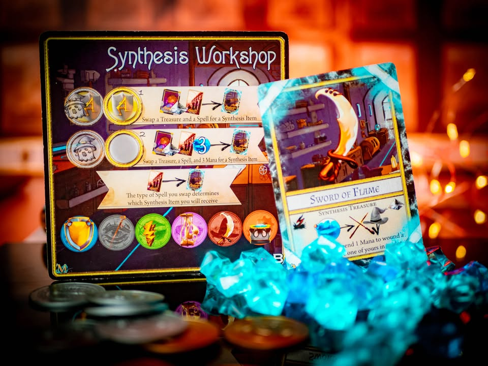
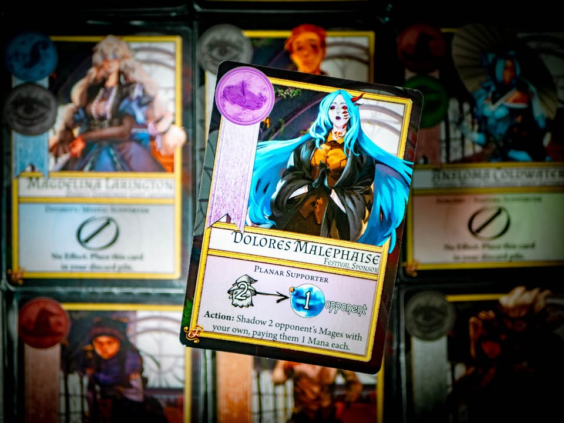

🔹 Argent: The Consortium  #bite_size #replay
▪️ ถ้าคุณกำลังมองหาเกมยูโรใช้ความคิดเน้นฝีมือแต่มีธีมพรั่งพรู งานอาร์ทไม่จำเจ และเป็นเกมที่ผู้เล่นกระทบกระทั้งกันในเกมระดับที่อยากลุกมาต่อยกัน พร้อมคำผรุสวาทในระดับสีแดงทั้งเกม คุณมาถูกที่แล้ว
.
.
▪️ ขอเริ่มจากให้นึกภาพเกมแห้งๆที่มีเป้าหมายลับสุ่มมาสิบสองใบที่นับครั้งเดียวตอนจบเกม
.
.
▪️ ทุกใบเขียนเหมือนกันว่าขอแค่มีทรัพยากร  X ชนิดมากที่สุดเอาไปเลยหนึ่งแต้ม
.
.
▪️ คุณแอบดูได้บางใบ บางใบก็ดูคนเดียว บางใบคนอื่นก็ดูด้วย
.
.
▪️ ทรัพยากรหลากหลายชนิด ที่แต่ละอันก็สามารถเคลียร์เงื่อนไขการ์ดได้มากกว่าหนึ่งใบ บางอย่างเอาไว้ใช้โจมตี บางอย่างเอาไว้ช่วยเรื่องการเล่น บางอย่างก็เอาไว้เป็นดั่งเชื้อเพลิงในการทำแอคชั่น
.
.
▪️ แอคชั่นมีแค่เอาตัวคนงานไปวางในช่องหยิบ จบรอบก็เป็นของคุณมาเก็บสะสมไว้
.
.
▪️ ถ้าคนงานคุณยังอยู่ตรงนั้นจนจบรอบนะ....
.
.
▪️ เพราะมันมีหลายสิบวิธีในเกมที่คุณจะเอาคนงานคนอื่นออกไปจากที่ตรงนั้น
.
.
▪️ ยิงเวทย์โจมตี เข้าสิงมิติเงา โยกย้ายผ่านมิติ กักขังสถานะ หรือกระทั้งพังห้องแม่งทิ้งเลย กูไม่ได้เมิงก็ต้องไม่ได้
.
.
▪️ คุณจะต้องเลือกว่าจะหนีไปแข่งอย่างอื่น หรือจะสู้เพื่อให้ได้ทรัพยากรชิ้นนั้นมา? 
.
.
▪️ แต่เกมมีแค่สิบสองแต้ม แล้วเค้กชิ้นนี้จะแบ่งกันอย่างไรถ้าไม่ฟาดฟันแย่งมา? เพราะถ้าเล่นกันหกคนใครๆมันก็อยากกอดสองแต้มแนบแน่น
.
.
▪️ แล้วแต้มที่สาม สี่ ห้าจะไปเบียดใครดีล่ะ?
.
.
▪️ เอาล่ะมาใส่โรยธีมเข้มๆลงไปเสียหน่อย เพราะมันคือการต่อสู้แย่งชิงตำแหน่งอาจารย์ใหญ่ในสถาบันเวทมนต์ กรรมการให้คะแนนมีสิบสองคน โดยแต่ละคนชอบไม่เหมือนกัน เราก็ต้องไปหานักเรียนที่มีทักษะวิชา เรียนรู้เวทย์ ออกไปหาอุปกรณ์มาตบทีแย่งทรัพยากรเอาใจกรรมการที่เราแอบไปสืบมาว่าเป็นใคร
.
.
▪️ นั้นล่ะ Argent: The Consortium 
.
.
.
+ Worker Placement ที่ระบบหลักตรงไปตรงมาไม่ซับซ้อนเวียนหัว
+ Replayability จากการสุ่มสูงโดยที่ไม่ใช่เกมดวงๆ
+ Meaningful Decision แอคชั่นมีจำกัดต้องเลือกตลอด
+ Icon base เข้าใจง่ายมี text กำกับ
+ Skill base ที่สุ่มเยอะๆระหว่างเกมมีแค่การ์ดในตลาด
= Direct Conflict เน้นๆ รักสันติเล่นไม่ได้เพราะโดนยำตีน
= งานศิลป์สไตล์อนิเมะ
= Passive Skill ของคนงานบางตัว OP ไปหน่อยใครๆก็ต้องมี
- อาจจะลุกมาต่อยกันได้
- ใช้พื้นที่วางการ์ดเยอะ ถ้าไม่มี stand มาตั้งอยู่อีกฝั่งจะมองยากหน่อย
.
.
▪️ ความซับซ้อนเกมน่าจะแถวๆ Terraforming Mars พวกการ์ดมีเยอะก็จริงแต่ไอเดียแบบเดียวกันเลยคือมองแค่ไอคอนก็รู้ล่ะว่ามันเอาไว้ทำไร ถ้างงก็จะมีตัวหนังสือกำกับเพิ่ม (ซึ่งก็คือแปลไอคอนอีกที) เรียกว่าถ้าเล่น TM แล้วสนุกฉิบหายกับการที่เล่นการ์ดแกล้งเพื่อน เกมนี้ที่การ์ดเกินครึ่งก็อารมณ์เดียวกับมีการอุกกาบาตไว้เผาทรัพยากรกับเมืองชาวบ้านนั้นแหละ
.
.
▪️ ส่วน replayability อยู่ในระดับสูง เพราะการ์ดทำคะแนนแต่ล่ะเกมจะสุ่มหมด ห้องที่กับทรัพยากรก็สุ่ม การ์ดเวทย์ การ์ดผู้ช่วย การอุปกรณ์เวทย์ก็มีหนาเป็นตั้ง คือต่อให้ห้องเดิม เป้าหมายเดิม สุ่มแค่การ์ดที่ออกเกมก็เดินไม่เหมือนเดิมแล้ว
.
.
▪️ ส่วนงานศิลป์สไตล์อนิเมะอาจจะไม่ใช่สำหรับทุกคนแต่ผมคิดว่าถ้าเล่นยูโรแห้งๆกันได้ไม่รู้จะบ่นอะไรกันนะ แถมถือว่าแปลกด้วยเพราะเกมจากค่ายญี่ปุ่นแท้ๆมักจะอินดี้จนไม่เคยเหลือเนื้อให้เสพเท่าไร แต่ยอมรับว่าตอนแรกๆก็หวั่นนิดหน่อยแต่พออินก็เออสนุกดีหว่ะ ชื่อเวทก็สื่อความสามารถที่ใช้ด้วยกันดี ไม่ได้มาแบบอวาเคดาฟราอิหยั่งว่ะ
.
.
▪️ เกมนี้ใครถาม ผมก็บอกเหมือนกันทุกครั้งว่า เกมนี้สนุก "เหี้ยๆ"

--------------------------------
หมวด Bite Size (พอดีคำ) นี้กะว่าจะเขียนอะไรสั้นๆประมาณนี้ล่ะกัน ใหม่บ้าง ซ้ำบ้าง เกมที่ขี้เกียจเขียนบ้าง เขียนๆไว้ก่อนเผื่อมีอารมณ์อาจจะขยายไปลง Thought บ้าง จริงๆอยากเขียนสั้นกว่านี้ แต่ยังอดไม่ได้ที่จะต้องอธิบายอะไรเพิ่มตามนิสัย เดี๋ยวค่อยๆปรับไปล่ะกัน

