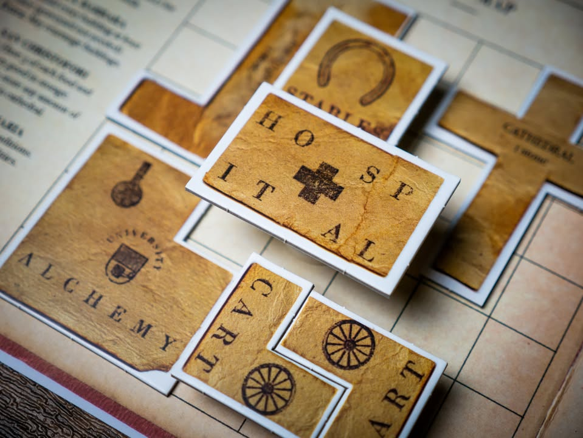
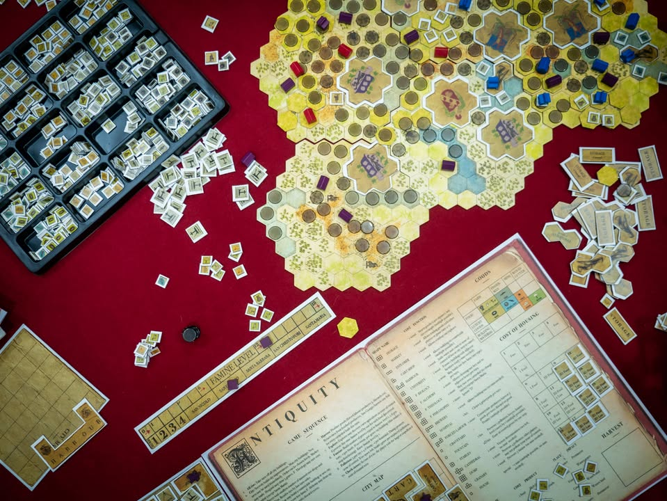

▪️ Antiquity #bite_size
.
▪️ เกมสร้างเมืองที่แทนที่จะเล่าถึงการรังสรรค์เมืองให้ศิวิไลซ์ต้องตาประชาชนเมื่อนเกมอื่นๆ กลับพูดถึงการเก็บเกี่ยวทรัพยากรให้สิ้นสูญไปพร้อมกับทิ้งมลพิษยังดินแดนแห้งเหือดและความตายจากโรคภัย ขอต้อนรับสู่เกมยูโรระดับหนักจากค่ายอินดี้อย่าง Splotter Spellen ผู้สร้าง Food Chain Magnate อันโด่งดัง
.
.
▪️ พูดให้ดาร์กไปงั้น ไอเดียคือเกมสร้างเมืองที่ผู้เล่นจะไปสร้างเมืองแย่งทรัยยากรกันในบอร์ดกลางที่สุ่มมาในแต่ละรอบ โดยความคูลคือไอ้ไทล์เมืองนี้มันจะมี zoom in เป็นบอร์ดผู้เล่นให้เราไปสร้างของวางผังตึกอีกที
.
.
▪️ ไอเดียการหาทรัพยากรในเกมนี้คือการส่งคนไปทำงานนอกเมือง แต่มีข้อกำหนดว่าต้องไม่เกินระยะสองช่องจากเมืองวางคนงานตรงไหนมันก็จะยืนเก็บเกี่ยวชนิดทรัพยากรตรงกับพื้นที่ ตัวคนงานก็จะค้างจนกว่าจะทำงานเสร็จ อยู่ในป่าก็โค่นต้นไม้รอบๆจนกลายเป็นทุ่ง อยู่ภูเขาก็หาหินหาทอง อยู่ริมน้ำก็ตกปลาหาหอยมุก อยู่ทุ่งโล่งเอาเอาพืชพันธ์กับสัตว์ไปเลี้ยง ได้ของมาก็วนสร้างเมืองไปเรื่อย
.
.
▪️ ความใสๆจะหมดตรงนี้ล่ะ
.
.
▪️ คนยุคกลางในเกมนอกจากจะทำไร่เลื่อนลอยตัดไม้จะป่าเรียบเป็นหน้ากลองไม่ปลูกใหม่แล้วยังสกปรกอย่างร้ายกาจ ที่ไหนที่ทำการเก็บทรัพยากรแล้วจะมีการวาง disc มลพิษทิ้งเอาไว้เพื่อบอกว่าหลังจากนี้ใช้งานอีกไม่ได้แล้วนะ นั้นคือยิ่งเล่นพื้นที่ในการใช้งานส่วนกลางก็จะเสื่อมโทรมลงไปเรื่อยๆนั้นเอง
.
.
▪️ จบรอบทีนึงค่าความอดอยากในเกมจะเพิ่มขึ้นทีละนิดไปพร้อมๆกับที่เราต้องหาที่สร้างหลุมฝังศพในเมืองเรา ซึ่งก็แน่นอนว่ามันกินที่ว่างในเมืองไปเรื่อยๆ และถ้าเอาไปวางทับตึกตึกเราก็จะทำงานไม่ได้
.
.
▪️ ซ้ำร้ายทุกจบรอบเมืองในเกมจะทำการทิ้งขยะที่ต้องถมในดินแดนตัวเองอีกและถ้าเราไม่สามารถหาว่างไว้ที่ทิ้งขยะได้คนในเมืองก็จะตายเพิ่มอีก
.
.
▪️ ก็เลยเป็นเหตุให้เกมนี้เราต้องรีบขยายเมืองไปยังพื้นที่ใหม่ๆที่ไม่ได้แค่เก็บเกี่ยวทรัพยากร แต่ยังต้องออกไปหาที่ทิ้งขยะกับเพิ่มช่องเก็บศพ
.
.
▪️ แต่เกมก็ไม่ได้ใจร้ายขนาดนั้นเพราะยังมีตึกเอาไว้ลดขยะกับจำนวนหลุมศพด้วยเช่นกัน
.
.
▪️ ความน่าสนใจอีกอย่างของเกมนี้คือการจะชนะนั้นเราต้องสร้างวิหารเพื่อบูชานักบุญคนใดคนหนึ่ง พอทำแล้วเราจะไดัพลังแหกกฎเกมมาแต่ว่ามันก็เป็นการกำหนดไปในตัวว่าคุณต้องเคลียร์เงื่อนไขแบบไหนถึงจะชนะ ถ้ารีบเลือกนักบุญเร็วก็ได้พลังมาใช้เร็วแต่ก็เปลี่ยนทีหลังยากถ้ารูปเกมไม่เป็นใจไรงี้
.
.
+ เกมยูโรหนัก แกนไอเดียไม่ซับซ้อน  แต่ต้องคิดวางแผนหลายขยัก
+ ตัวเกมมีซิกเนเจอร์ชัดเจน
= สโนว์บอล เดินโง่ๆก็เตรียมนั่งกวาดขยะกับเก็บศพทั้งเกม
= อาร์ทสไตล์กระดาษยับที่ตัดไดคัทเบี้ยวอาจจะไม่เหมาะกับทุกคน
- แกนไอเดียง่ายก็จริงแต่ก็แอบมีหยุ่มหยิมที่ลืมได้บ่อยเหมือนกัน
- Fiddy (ตามสไตล์ค่าย)
- เกมมีเฟสการวางแผนที่เป็นความลับแต่ดันไม่แถมฉากกั้นมา
- แทรคผู้เล่นคนอื่นยาก เพรามันมีเฟสงึมงำกับบอร์ดตัวเอง ถ้าไปนั่งดูเกมก็นานเกินจำเป็น
.
.
▪️ ถ้าใครเป็นสายชอบเกมงึมงำกลับไปนอนคิดท่ามาจากบ้านโดยที่ต้องคอยปรับแผนหน้างานจากแผนที่ที่ไม่เหมือนเดิมและกลยุทธที่คู่แข่งเอามาใช้ในกระดานกลาง เกมนี้ก็เป็นเกมที่สนุกมากเกมหนึ่งครับ ในแง่ราคาต้องเข้าใจก่อนว่าค่ายนี้ปกติก็แพงอยู่แล้ว เพราะพิมพ์ไม่เยอะ (แต่หมดแบบ OOP ตลอด) แต่ถ้าใครชอบเกมที่มีลายเซ็นของนักออกแบบคู่นี้ถ้ามีโอกาสก็น่าไปลองเล่นดูครับ 

--------------------------------
หมวด Bite Size (พอดีคำ) นี้กะว่าจะเขียนอะไรสั้นๆประมาณนี้ล่ะกัน ใหม่บ้าง ซ้ำบ้าง เกมที่ขี้เกียจเขียนบ้าง เขียนๆไว้ก่อนเผื่อมีอารมณ์อาจจะขยายไปลง Thought บ้าง จริงๆอยากเขียนสั้นกว่านี้ แต่ยังอดไม่ได้ที่จะต้องอธิบายอะไรเพิ่มตามนิสัย เดี๋ยวค่อยๆปรับไปล่ะกัน

