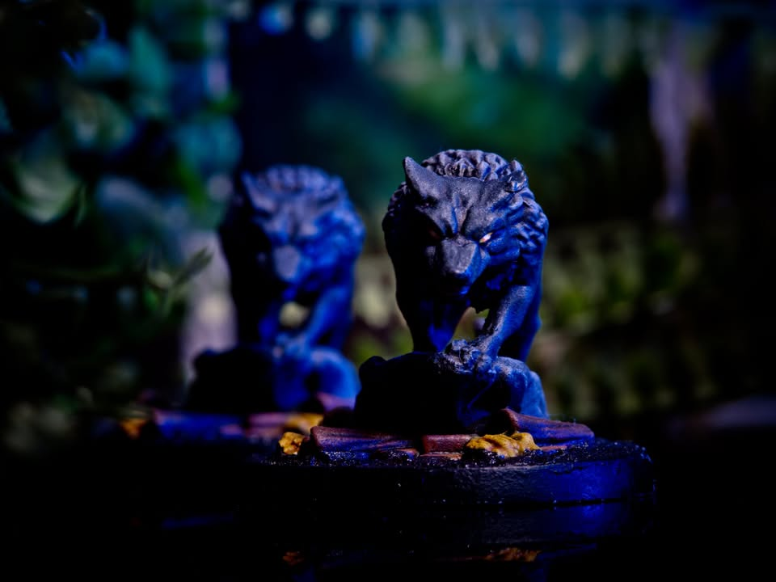
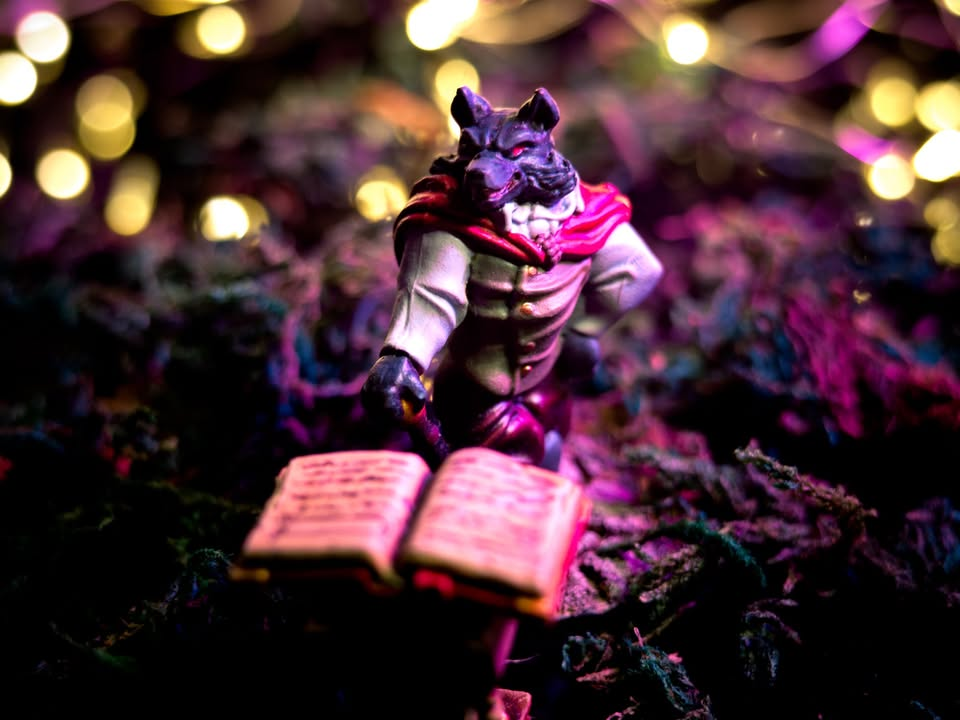
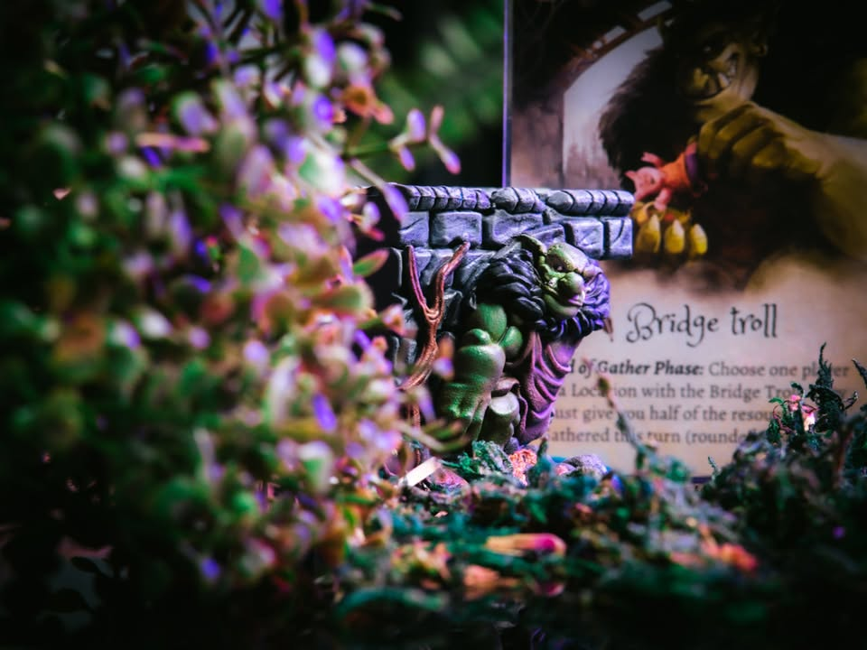
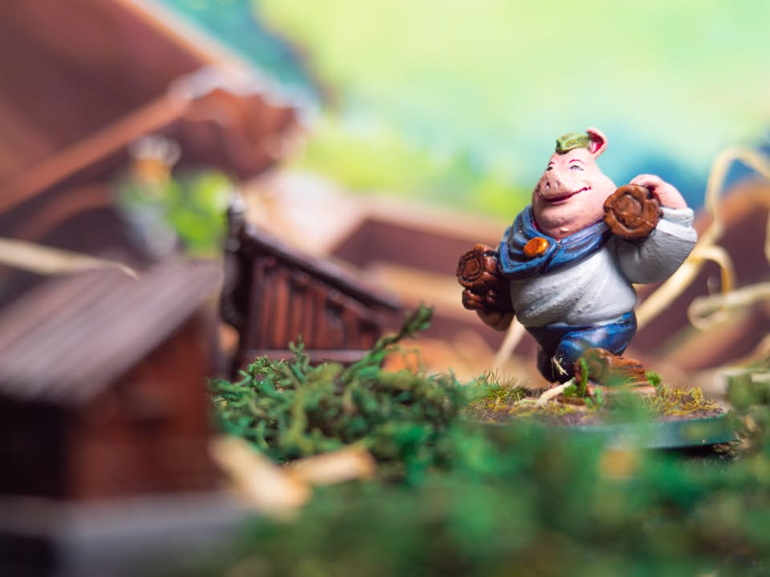

The Grimm Forest #bite_size
.
▪️ เกมเบาของสวยสร้างจาก เทพนิยายกริมม์  (Grimm's Fairy tales) ที่จะให้เราเป็นพี่น้องหมูน้อยไปเก็บทรัพยากรมาสร้างกระท่อม แต่สิ่งที่เราต้องกลัวนั้นไม่ได้มีแค่หมาป่า หากแต่เป็นเหล่าสัตว์ในเทพนิยายและพี่น้องลูกหมูที่จะมาแย่งของเรา!
.
.
--------------------------------
📌 โดยแต่เดิม เทพนิยายกริมม์นั้นเป็นหนังสือรวมเรื่องเล่าและนิทานพื้นบ้านจัดทำโดยพี่น้องตระกูลกริมม์ในปี 1812 ซึ่งเนื้อหานั้นไม่มีตรงไหนเหมาะกับแนวคิดนิทานเด็กสมัยนี้แม้แต่นิดเดียวเพราะเต็มไปด้วยความรุนแรงและจุดจบที่น่าเศร้า ก่อนที่จะเริ่มมีการนำโครงเรื่องมาตีความใหม่จนเป็นเรื่องสดใสน่ารักอารมณ์ดิสนีย์ดั่งที่เราเห็นกันในปัจจุบัน
--------------------------------
.
.
▪️ ไอเดียเกมไม่ซับซ้อนคือจะมีบอร์ดกลางที่มีทรัพยากรคอยเติมเรื่อยๆอยู่สามอย่างคือ ฟาง ไม้ อิฐ ในตาหนึ่งเราก็แค่คว่ำการ์ดไว้ว่าเราอยากจะไปเก็บอะไรในรอบนี้ จากนั้นก็บู๊ม! เปิดพร้อมกัน ถ้าชนกันก็ต้องแบ่งหารทรัพยากรกัน ถ้ารอดตัวก็ได้ของกองโตไปคนเดียว
.
.
▪️ แต่เกมมันไม่ง่ายขนาดนั้นเพราะว่ามันจะมีกองการ์ดเทพนิยายที่จะออกท่าแกล้งกันบ้าง เรียกมังกรมาเฝ้าของ ส่งหมาป่ามาก่อกวนบลาๆที่ทำให้การเก็บของมันยากขี้นรวมไปถีงการ์ดเหล่าเพื่อนในเทพนิยายทั้งหลายที่จะมาช่วยในการเล่นเรา
.
.
▪️ ส่วนทรัพยากรสามชนิดก็ไม่มีอะไรซับซ้อนแค่เอามาเปลี่ยนเป็นบ้านตามชนิดเท่านั้นเอง กิมมิคน่ารักคือบ้านแต่ละแบบจะต้องค่อยๆสร้างทีละส่วน พอใครออกบ้านได้ครบสามหลังก่อนก็ชนะไป
.
.
+ Presentation ดีของสวย
= ใช้ภาษาในการเล่นเยอะ เพราะต้องอ่านการ์ด
= Take That ถ้าโดนแกล้งหนักก็แอบหัวร้อนได้
= Double Guessing ถ้าเดาชนชาวบ้านบ่อยก็แอบเหงานิดๆ
.
.
▪️ เอาจริงๆความสนุกมันก็คือเกมเน้นเดาใจเพื่อนพร้อมทางหาหลบฉากไปพร้อมกับเน้นเล่นการ์ดแกล้งๆนั้นแหละ ตัวเกมแอบเหมาะกับผู้ใหญ่ที่อยากได้เกมเบามากกว่าเด็ก เพราะการ์ดแกล้งกันก็แอบหงุดหงิดหน่อยๆ (ส่งหมาป่ามาเผาทรัพยากรทิ้งหมดอดเก็บไรงี้) ของเล่นสวยมากก็จริงแต่ฟังชั่นไม่ได้มีอะไร แต่ด้วยรายละเอียดสวยงามก็ทำหน้าที่ดึงดูดความสนใจกับไปกับธีมได้ดี
.
.
▪️ เบากว่าเกมที่ผมเล่นตามปกติไปเยอะ แต่เกมก็ใหญ่เกินกว่าที่จะเป็น filler เลยไม่เหมาะกับคนที่เล่นสายหนักเป็นหลัก แต่ถ้าบ้านไหนไม่ติดเรื่องภาษาก็เอาไปเล่นกะลูกหรือมุ้งมิ้งแกล้งกันได้ฮะ

--------------------------------
📌 disclosure : ทางบีวิทเชดได้ส่งตัวเกมที่เพ้นท์ทำสีแล้วมาให้รีวิว (ต้องส่งคืน) โดยผมยังคงสิทธิ์ขาดทางการทำเนื้อหาทั้งหมดไว้โดยไม่มีการคิดค่าใช้จ่ายหรือมีการจ้างวานให้ทำการโฆษณา ในขณะเดียวกัน ทางบีวิทเชดได้ทำการมอบเลนส์ 7artisan 60mm Macro เป็นของขวัญแทนความขอบคุณในการทำ content ก่อนหน้าหลายชิ้นของผมและทางร้านขออนุญาตในการนำรูปที่ผมถ่ายไปใช้ประกอบการขายหน้าร้าน หากสนใจเกมหรืออยากใช้บริการทำสีจากทางร้านสามารถติดต่อได้โดยตรง โดยที่ผมไม่ได้มีส่วนได้ส่วนเสียครับ Bewitched boardgame cafe

📌 support: สามารถสนับสนุนผมทางอ้อมได้ด้วยการเพิ่มสินค้า Say Hi Board N Bon มูลค่า 1 บาท พ่วงใส่ตะกร้าเวลาซื้อเกมผ่านช่องทางออนไลน์กับร้านค้าผู้สนับสนุน (เงินไม่เข้าผม แต่ทางร้านจะได้รับทราบเป็นข้อมูลในการสนับสนุนผมครับ) https://shp.ee/vpzkpn8
--------------------------------
หมวด Bite Size (พอดีคำ) นี้กะว่าจะเขียนอะไรสั้นๆประมาณนี้ล่ะกัน ใหม่บ้าง ซ้ำบ้าง เกมที่ขี้เกียจเขียนบ้าง เขียนๆไว้ก่อนเผื่อมีอารมณ์อาจจะขยายไปลง Thought บ้าง จริงๆอยากเขียนสั้นกว่านี้ แต่ยังอดไม่ได้ที่จะต้องอธิบายอะไรเพิ่มตามนิสัย เดี๋ยวค่อยๆปรับไปล่ะกัน

