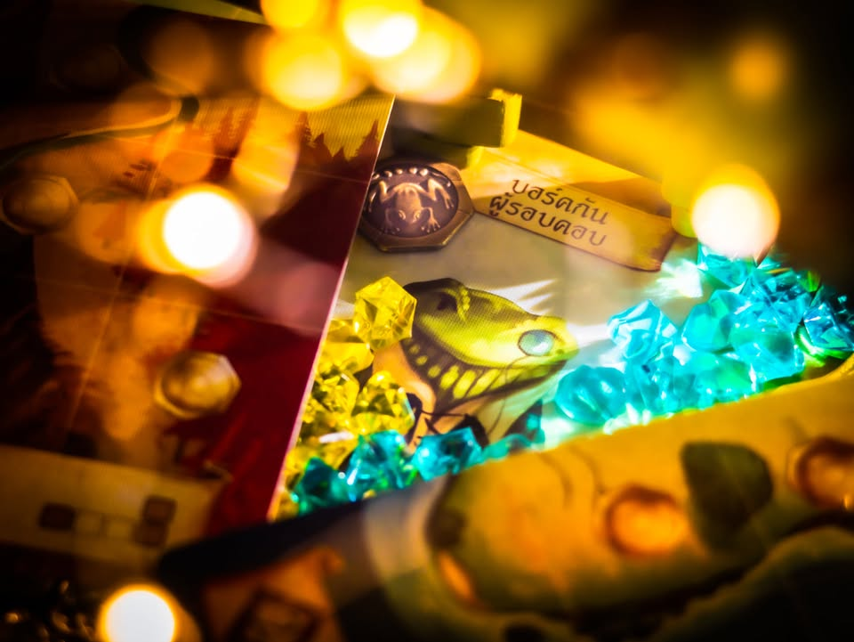
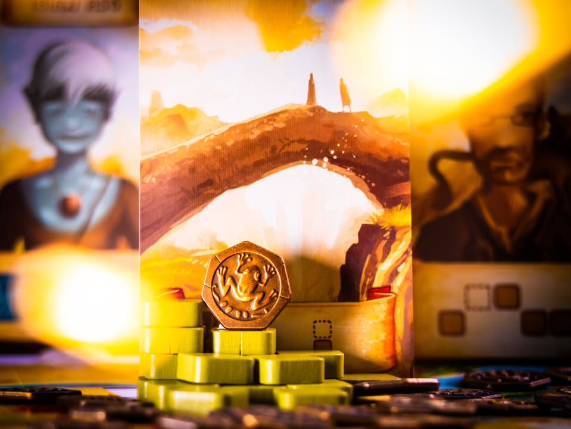
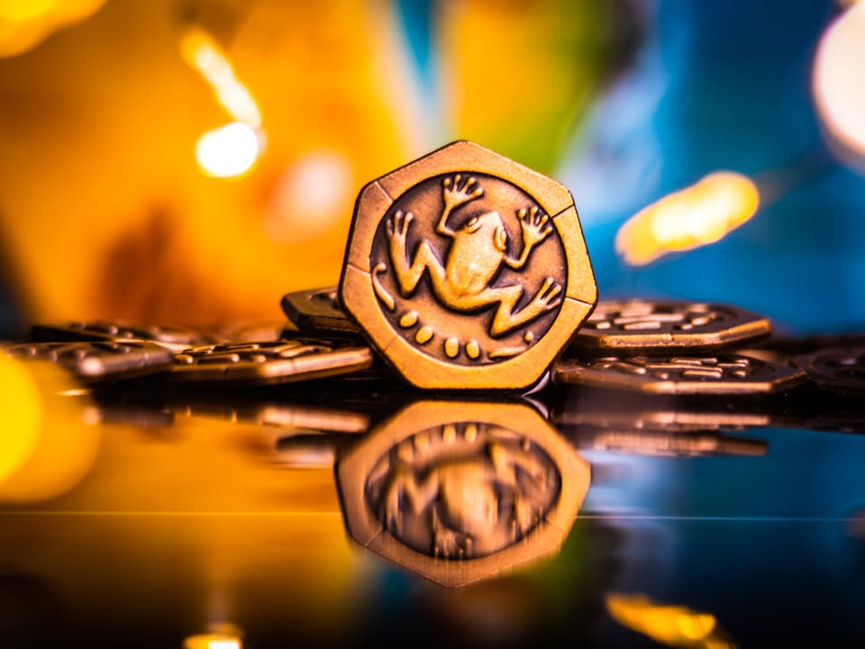
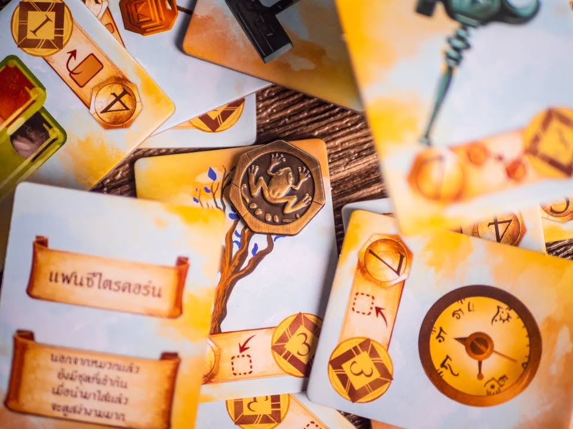
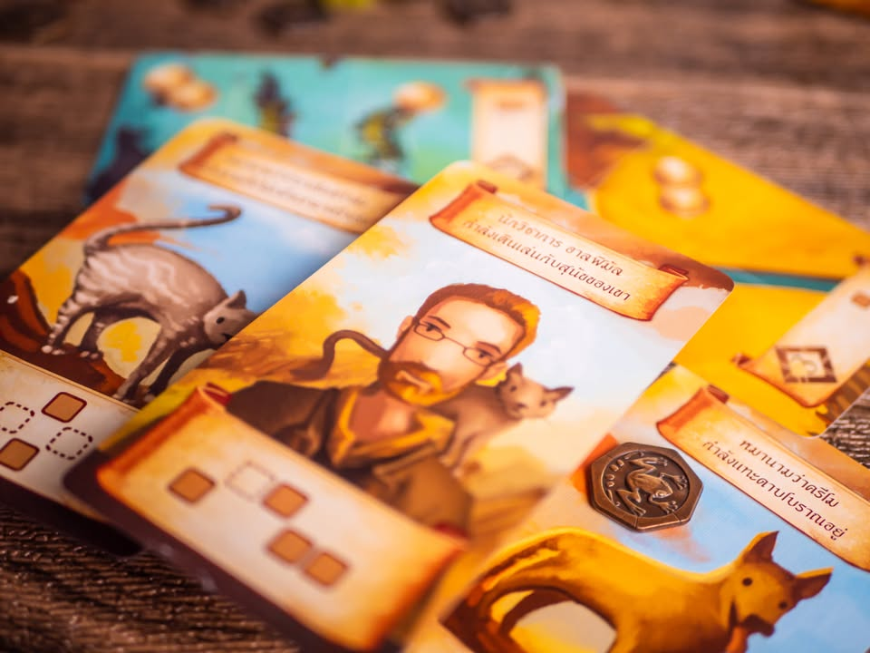
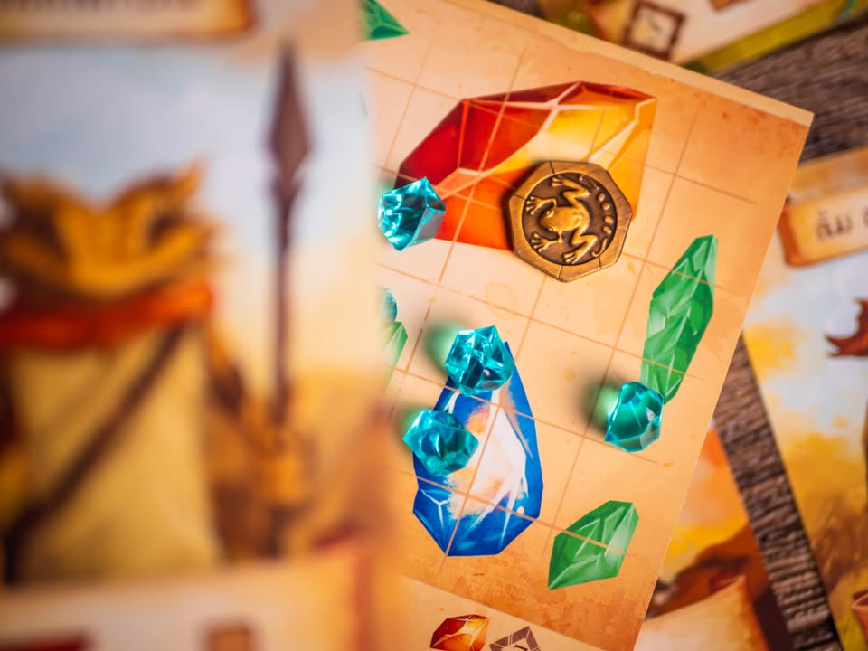
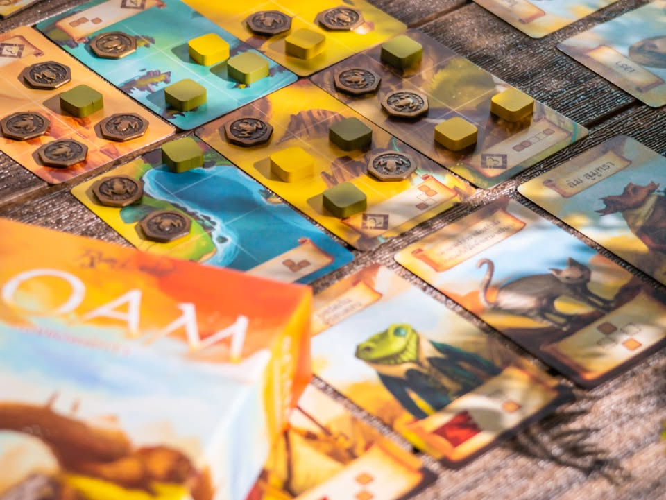

Roam #bite_size #first_impression 

▪️ ตัวข้าเดินท่อง.........สู่แดนมนตรา
▪️ ร่วมใคร่เสาะหา.......เหล่าผู้นิทรา
▪️ เดินหลงละเมอหา...ทั่วดินแดนฝัน
▪️ เฝ้าเร้าปลุกฟื้น.........ตื่นจากภวังค์ 
.
.
▪️เกมเบาภาพแปลกสบายตาที่ใช้โลกของ Near and Far, Above and Below ของนักออกแบบ Ryan Laukat ที่ออกแบบเอง วาดเอง ทำค่ายเองนักเลงพอ โดยรอบนี้จะเป็นเกม Majority Control ที่ต้องใช้สมองของเราในการวาง puzzle ให้ลงตัวเพื่อช่วยปลดปล่อยผู้คนจากความฝัน
.
.
▪️ไอเดียการเล่นคือ จะมีการ์ดแผนที่เป็นตารางวางไว้กลางบอร์ด ผู้เล่นแต่ละคนจะมีการ์ดตัวละครที่เมื่อใช้ก็จะสามารถวางไทล์ลงไปสำรวจในแผนที่ได้จำนวนหนึ่ง แต่มีเงื่อนไขว่าต้องวางให้ครบเป๊ะๆตามทรงรูปเลย พอแผนที่ไหนวางครบใครวางไว้เยอะกว่าก็จะได้แผนที่ใบนั้นมาเก็บไว้
.
.
▪️ ที่นี้การ์ดแผนที่นั้นพอหงายมามันจะกลายเป็นหน้าคนที่เราไปสะกิดให้ตื่นมาตามธีม! ซึ่งมันก็จะทำให้รูปแบบการวางไทล์ใหม่ๆมาให้เราเพิ่ม ก็เล่นวนๆไปใครเก็บครบสิบใบก่อนก็เกมจบแล้วมานับแต้มกัน
.
.
▪️ความน่าสนใจของเกมคือ puzzle มันไม่ได้ทื่อๆแค่วางสุมไปให้เยอะๆ แต่ระหว่างเกมเราสามารถเก็บเงินได้จากการวางไทล์แล้วเอาเงินไปแลกซื้อสิ่งประดิษฐ์ที่ช่วยแหกกติกาการวางบางอย่างให้กับเรา กับปกติเกมนี้การ์ดใช้แล้วต้องรอใช้ให้หมดทุกใบ แต่เราสามารถจ่ายเงินเพื่อรีบพลิกชิงตำแหน่งการวางได้ด้วย ทำให้ตัวเกมมันมีเลเยอร์การคิดที่น่าสนใจไม่นิ่งเกินไปเพราะต้องกระตุกคิดนิดนึง
.
.
▪️ ส่วนตัวเสริมเป็นตารางเพชรให้เรามาเล่น puzzle อีกขยักตอนเคลมการ์ดอันนี้แอบดวงประมาณหนึ่งส่วนตัวคิดว่ามันแอบเกินๆจากความพอดีที่เกมหลักทำไว้ แต่ถ้ามองเป็นสีสันลุ้นๆก็สนุกดีมั้ง?
.
.
+++ เหรียญกบทอง
+ Presentation สวย
+ Gameplay เบาแต่คิดหลายขยักแบบหมากรุก
= ธีมกับระบบไม่ไปทางเดียวกัน ทำให้ด้าน story telling แบนราบ
.
.
▪️ เป็นเกมที่ธีมงงงวยประมาณหนึ่งเพราะไม่ได้ไปด้วยกันกับกลไกเลย แต่ระบบเกมแม้จะเบาแต่ก็หงุดหงิด (ในแง่ดี) อารมณ์ว่าช่องนี้ก็อยากได้ ช่องโน้นก็อยากลง มองบอร์ดเพื่อนแล้วคิดแทนว่าถ้าเราลงไอ้นี้แล้วคนโน้นมันจะลงมาท่าไหน แล้วพอใส่การ์ดประดิษฐ์มาเล่นท่ายากย้ายไทล์เรานี้ บู๊ม! หัวอุ่นซะงั้น
.
.
▪️ ในแง่คู่มือไทยผมมีปัญหาส่วนตัวนิดนึงคือเค้าแปลมาถูกนะ แต่มันเป็นภาษาไทยไวยากรณ์อังกฤษที่ก็ชัดเจนดีในแง่ตีความ แต่ผมดันอ่านแล้วรู้สึกไม่ลื่นเลยไปโหลดตัว EN มาอ่านแทนไม่ต้องแปลสองเด้ง (แต่ไม่ได้หมายความว่าแปลไม่ดีนะ พอดีผมไม่ค่อยได้อ่านรูลไทย)
.
.
▪️ เป็นเกมสอนง่าย เล่นไม่นาน puzzle สวย ไม่ราบเรียบ ได้คิดงึมงำพอประมาณ  ในฐานะ thinky filler สำหรับคนเล่นเกมหนักนี้ถือว่าดีเลยนะ แล้ว position มันดีตรงที่เอาไปเล่นกับกลุ่มเกมเบา (จริงๆอันนี้กลุ่มหลัก) หรือคนที่ไม่เคยเล่นบอร์ดเกมได้ แต่เกมมันอาจจะ AP ง่ายหน่อย ที่น่าเสียดายคือมี Lore ดีๆแต่ไม่ได้เอาอะไรมาใช้เลยนอกจาก character design อารมณ์เราเก็บแผนที่แล้วได้  ผู้บ่าวผู้สาวหน้าตาคล้ายๆกันหมดคำบอกเล่าก็ล่องลอยแล้วไงต่อไรงี้ (ถ้าเล่นเกมอื่นเค้าด้วยอาจจะอินมั้ง?) ไทล์ก็เรียบๆไม่สื่อธีมอะไรเลย (แต่กล่องภาษาไทยมีสติกเกอร์ให้แปะเป็นรูปตัวละคร นี้ช่วยให้ดูดีขึ้นพอควร)
.
.
▪️ รอบนี้ผมมีธีมการถ่ายด้วยนะ นั้นคือการเดินทางไปปลุกคนในโลกความฝันของเหรียญกบทอง!!

------------------------------
📌 disclosure: ทาง Lanlalen ลานละเล่น ผู้แปล/นำเข้า/จัดจำหน่าย ได้ส่งเกมนี้มาให้ผมทำการรีวิวโดยไม่ต้องส่งคืน โดยที่ผมยังคงสิทธิ์ในการแสดงความคิดเห็นของตัวเองทุกประการโดยไม่คิดค่าใช้จ่ายหรือเป็นการจ้างวานโฆษณา

💰 support: สามารถสนับสนุนผมทางอ้อมได้ด้วยการเพิ่มสินค้า Say Hi Board N Bon มูลค่า 1 บาท เมื่อซื้อเกมผ่านช่องทางออนไลน์กับร้าน Bewitched ( เงินไม่เข้าผมโดยตรง แต่ร้านจะเห็นถึงอิมแพคที่ผมสร้างจนนำไปสู่การสนับสนุนในรูปแบบต่างๆครับ ) https://shp.ee/vpzkpn8 

-------------------------------
หมวด Bite Size (พอดีคำ) นี้กะว่าจะเขียนอะไรสั้นๆประมาณนี้ล่ะกัน ใหม่บ้าง ซ้ำบ้าง เกมที่ขี้เกียจเขียนบ้าง เขียนๆไว้ก่อนเผื่อมีอารมณ์อาจจะขยายไปลง Thought บ้าง จริงๆอยากเขียนสั้นกว่านี้ แต่ยังอดไม่ได้ที่จะต้องอธิบายอะไรเพิ่มตามนิสัย เดี๋ยวค่อยๆปรับไปล่ะกัน

