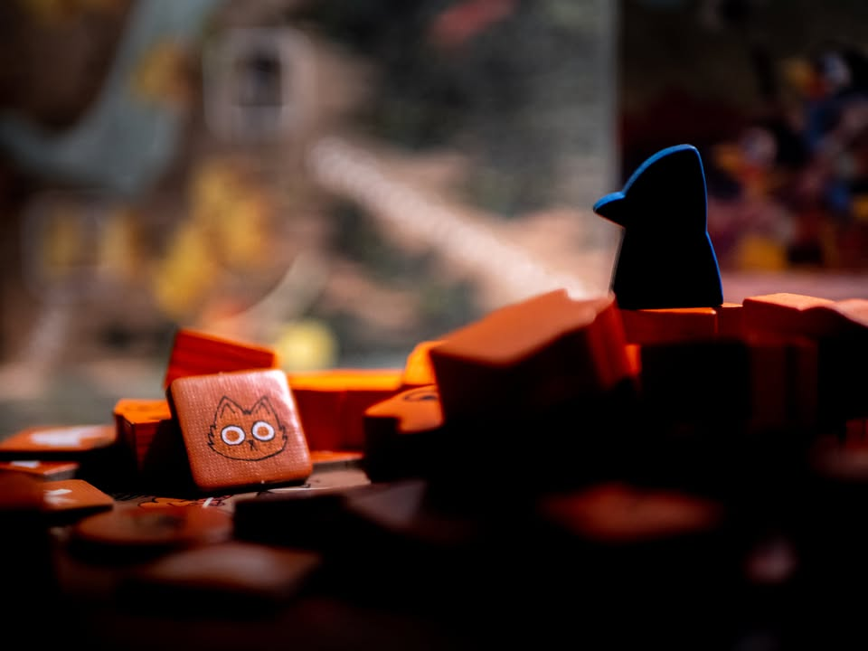
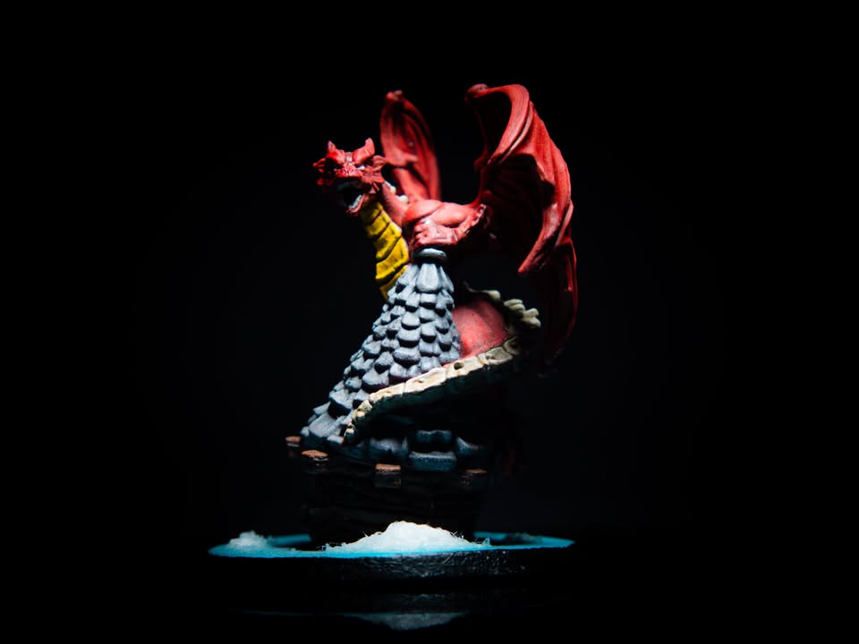
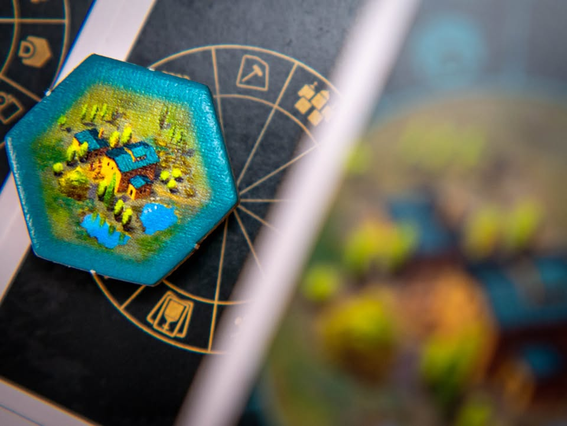

#บ่นไปเรื่อย 
▪️ พูดถึงการถ่ายรูปบอร์ดเกมเนี่ยผมคิดว่ามันมีตัวแปรใหญ่ๆอยู่สองอันที่ผมสนใจคือ 'มิติด้านลึก' กับ 'เรื่องราว'
.
.
▪️ อันนี้ออกตัวก่อนว่าผมสายชอบหยิบจับเลียนแบบลองเล่นไปเรื่อย ยังมีอะไรที่ต้องเรียนรู้อยู่เยอะมาก แค่เอาความสนใจตัวเองมาคุยกันเฉยๆนะ
.
.
▪️ ในส่วนของด้านลึก คือพวกบอร์ดเกมเนี่ยปกติมันเป็นอะไรที่ราบเรียบแล้วถูกมองจากบนลงล่างตลอดเวลา หลักการหนึ่งที่ผมพยายามมากที่จะเอามาจัดฉากคืออยากให้มันดูมีมิติหน้าหลัง เพราะมันไม่ใช่มุมที่เห็นกันโดยปกติ ซึ่งวิธีง่ายสุดคือหาอะไรมาบังนั้นแหละ (กล่องเกม หรือการ์ด) อีกอันที่ทำบ่อยก็คือการยกส่วนที่อยากให้เด่นมันสูงขึ้นเพื่อให้เกิดมิติหน้าชัดหลังเบลอที่แยกจุดที่อยากให้เด่นมันดูดีขึ้น (มีคนบอกเป็นซิกเนเจอร์เราแต่ก็บอกทุกทีนะว่าเราแค่ลอกมาใช้คนแรกๆเฉยๆ...)
.
.
▪️ อีกอันคือเรื่องราว ตรงนี้เป็นพื้นฐานของการถ่ายภาพทั่วไปอยู่แล้ว ซึ่งมันไม่ได้จำเป็นต้องขนาดมีความรู้สึกหรือแคปชั่นอะไรขนาดนั้น แค่อย่างน้อยก็มีเส้นนำสายตา พวกจุดตัดเก้าช่องจุดที่อยากเน้น หรือมีความเข้ากันนิดนึง เพราะนั้นแหละบอร์ดเกมส่วนมากมันแบนราบ จะให้วางสตอรี่สวยๆเหมือนเกมมีมินิทุกเกมไม่ได้หรอก
.
.
▪️ อีกประสบการณ์ที่เจอมากับตัว 95% คือ รูปที่ผมรู้สึกพอใจเนี่ยจะไม่ได้คิดมาก่อน แต่ก็เกิดจากหยิบๆวางๆย้ายไปย้ายมุมไปเรื่อยเนี่ยล่ะ กับหลายๆครั้งตอนแรกคิดว่าไม่ค่อยโดนแต่พอเรา crop จัดมุมทำสีใหม่แล้วเออมันดูมีอะไรขึ้นมา
.
.
▪️ ซึ่งเทคนิคพวกนี้ส่วนมากผมเรียนรู้การเอามาใช้จริงจากหลายๆคนที่เค้าถ่ายสวยๆอยู่แล้ว ส่วนที่เยอะระดับแรงบรรดาลใจให้มาจับกล้องนี้ก็ BoardGameShot เลย งานเจ๋งมาก ขยันหาไอเดียกับมุมตลอด แบบเข้!! เกมไม่มีอาร์ทเหี้ยไรเลยมันไปขุดหามุมมาได้ อยากทำให้เหมือนได้ซักหนึ่งในสี่ไรงี้
.
.
▪️ อย่างรูปที่เอามาลงนี้ในแง่ความนิยมคงไม่เยอะเท่าไรเพราะเกมมัน niche มาก แต่ว่าเป็นฉากที่ set เล่าเรื่องเดียวเลยคือ reformation ทางศาสนาของนิกายโปรเตสแตนต์ที่นำโดยมาร์ติน ลูเทอร์ การ์ดทุกใบ โทเคนทุกชิ้นที่วางนี้ทำมาเพื่อสื่อเรื่องนี้อย่างเดียว กับ  Root ที่เล่าถึงการพ่ายแพ้ของทีมแมว ตอนแรกก็แค่เอาโทเคนวางกองๆไว้เฉยๆแล้วเออเอานกมาวางนี้มันดูได้อยู่ ตอนแรกดูไม่ค่อยชอบเท่าไรเพราะโทเคนแมวมันแสดงสีหน้าไม่ได้ว่าแพ้ พอดีมีไทล์หน้าแมวมาก็เลยได้ภาพที่ผมพอใจนะ
.
.
▪️ แต่ก็มีเยอะแหละเกมที่นึกเรื่องไรไม่ออกก็วางๆถ่ายๆเหมือนตอนเล่นเกมเอา :P

