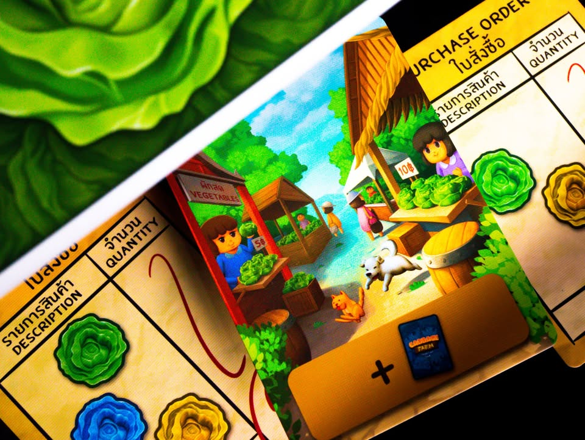
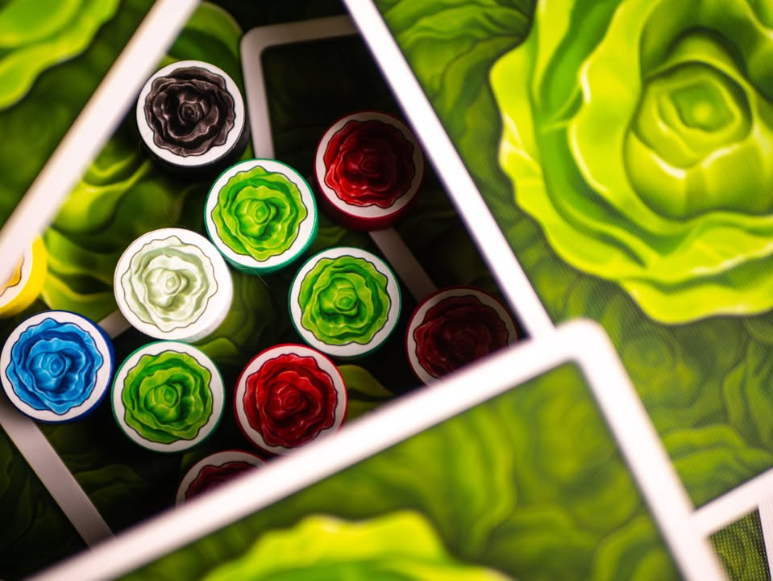
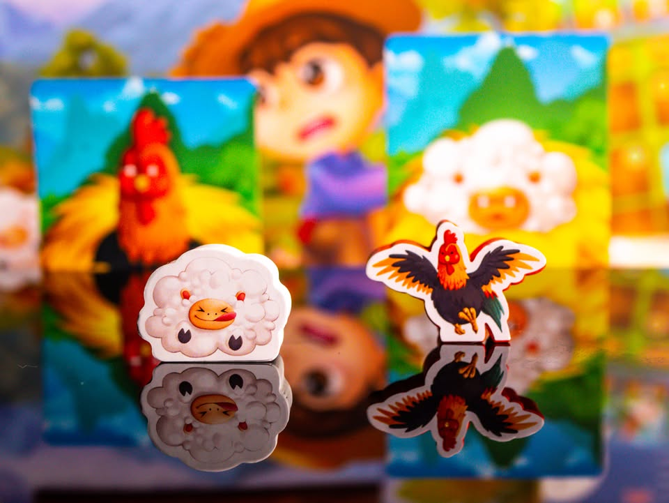
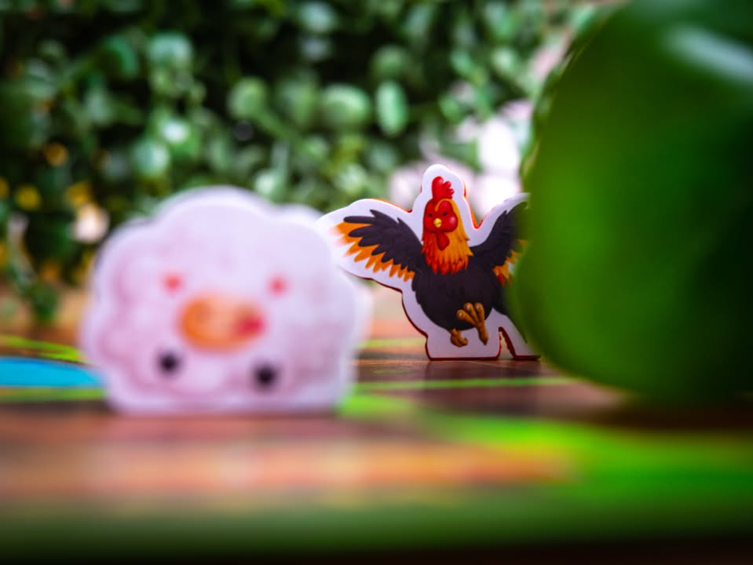

Cabbage Farm #bite_size #first_impression
.
▪️ เกมยูโรระดับครอบครัวที่จะให้เหล่าลูกหลานมาโชว์ทักษะการค้าผ่านการออกไปยื้อแย่งเก็บกระหล่ำหลากสีสันในไร่ไปขาย พร้อมกับระวังกุ๊กไก่และแกะน้อยสัตว์เลี้ยงตัวป่วนประจำไร่ที่มาชวนให้เราเสียการงาน ผลงานจากนักออกแบบไทย Vatcharis ArmArs Thanomsub และเป็นเกมหัวหอกของค่าย Aroi Games - อร่อยเกมส์ ที่เป้าหมายคือการส่งเกมไทยไปตลาดโลก
.
.
▪️ ไอเดียก็คือเกม set collection  เก็บกะหล่ำสี (ที่บางสีก็ชวนสงสัยว่ามันมีจริงเหรอว่ะ?) ไปแลกแต้มจากใบสั่งซื้อ แต่กระบวนการที่จะได้กะหล่ำมาคือเราต้องเอาตัวละครไปเดินตามไร่เพื่อไปแย่งเก็บเกี่ยวกะหล่ำกับคนอื่น
.
.
▪️ ระบบการเดินใช้ Action Selection แบบมีการ์ดเดิน/แอคชั่น สุ่มออกมาจำนวนหนึ่งผู้เล่นก็เอาคนงานตัวเองไปวางว่าจะทำอันไหน เลือกซ้ำกับคนอื่นได้ โดยมีเงื่อนไขว่าถ้ามีคนอื่นอยู่ก่อนหน้าเรา เราต้องจ่ายเงินให้เค้าด้วย จบรอบทีก็สุ่มเอาใบใหม่มาที
.
.
▪️ เกมมีสีสันจากการที่มีการ์ดแอคชั่นเสริมไว้ให้เล่นเพิ่ม รวมไปถึงสามารถควมคุมแกะและไก่ไปวิ่งชนเพื่อขัดขวางเพื่อนพอกรุบกริบ ไม่แย่งเงินก็แย่งกะหล่ำแล้วแต่ว่าเอาอะไรชน แต่ว่าอาจจะไม่ได้แย่งก็ได้ถ้าทอยเต๋าเดินไม่ไกล
.
.
▪️ เกมจบเมื่อมีคนแลกใบสั่งซื้อครบสี่ใบ
.
.
- เกมระดับครอบครัว กติกาไม่ซับซ้อน แต่มีจังหวะสะดุดคิด
= Take That, มีการแกล้งกันเบาๆผ่านการส่งไก่แกะไปแกล้งคนอื่น
= Conservative, ตัวระบบเกมค่อนข้างพื้นฐาน
- กติกาภาษาอังกฤษอ่านสะดุดตลอด เพราะต้องอ่านแล้วเรียบเรียงในหัวให้เป็นไทยก่อน
- นักออกแบบเอาตัวเองและภรรยาไปใส่ในเกม แต่ปกคู่มือดันไปยืนกับสาวไหนไม่รู้... :P
.
.
▪️ สไตล์คนเขียน : ยูโรระดับหนัก 
▪️ สไตล์เกมนี้ : ยูโรระดับเบา สำหรับครอบครัว
.
.
🔹 บรรยากาศโดยรวมจากมุมเกมระดับครอบครัวผมคิดว่าโอเคนะ ใส่การแกล้งแบบลุ้นทอยว่าจะไปแกล้งซักหน่อย แต่ส่วนตัวคิดว่าที่ต้องไปเดินๆเข้าตามมุมเพื่อจั่วการ์ดสุ่มๆนี้สำหรับสายวางแผนจะแอบอึดอัด เพราะไม่รู้ว่าจะได้การ์ดอะไรมาใช้ (แต่สายลุ้นคงไม่มีปัญหาอะไร)
.
.
🔹 ไอเดียที่น่าสนใจคือระบบเลือกแอคชั่น แอคชั่นมันสุ่มมาทำให้ต้องคิดหน้างานนิดนึงว่าจะไปเลือกอันไหนก่อน เพราะถ้าไปอันอื่นที่หลังก็อาจจะต้องไปจ่ายตังให้คนอื่น จากกรอบระดับเบาก็ยึกยักๆได้นิดนึง แต่เนื่องจากการ์ดมันคล้ายๆกันมิติตรงนี้ก็อาจจะมาในท่าไม่ได้อันนี้ก็ไปอันข้างๆก็ได้
.
.
🔸 ส่วนหนึ่งที่ไม่เกี่ยวกับการออกแบบแต่ขัดใจประมาณหนึ่งคือกติกาภาษาอังกฤษ ที่อ่านแล้วสะดุดตลอดเวลา เนื่องจากเป็นภาษาอังกฤษสำนวนไทยที่อ่านแล้วเหมือนต้องแปลไทยในหัวอีกที  ในฐานะเกมเอาไปบุกตลาดนอกน่าจะมองตรงนี้ให้มากกว่านี้ (แต่ to be fair เกมญี่ปุ่นกับไต้หวันคู่มือ EN หลายเกมก็ไม่ได้ดีไปกว่านี้ซักเท่าไร)  กับใคร proof read ไม่รู้แต่เรียกกะหล่ำว่า 'ผล' นี้อ่านแล้วสะดุดนิดหน่อย
.
.
💬 สำหรับกลุ่มครอบครัวแล้วผมคิดว่ามันเป็นเกมที่สนุกสมกับป้ายที่ชนะงานประกวดปั้นกระดานของลานละเล่นมานะ แกนเกมไม่ซับซ้อน การ์ดแกล้งมีพอให้กลุ่มใสๆหัวเราะกันได้แต่ไม่ได้ระดับกำหมัดเหมือนเกมอย่าง Survive แต่ถ้าเป็นสายหาความสนุกจากกลไกการเล่นก็คงต้องมองข้ามไปเพราะเกมไม่ได้มี space ให้สำรวจหรือทดลองกลยุทธ์

--------------------------------
📌 disclosure: 
* ข้อเขียนนี้แสดงความเห็นของผมที่มีต่อเกมโดยไม่ได้รับการจ้างวาน หรือเป็นการโฆษณา
* ไม่ได้รับการสนับสนุนใดจากค่าย Aroi Games ผู้ผลิต/จัดจำหน่าย
* นักออกแบบเป็นผู้ส่งเกมมาให้ทดลอง

💰 support: สามารถสนับสนุนผมทางอ้อมได้ด้วยการเพิ่มสินค้า Say Hi Board N Bon มูลค่า 1 บาทใส่ตะกร้า เมื่อซื้อเกมกับร้าน Bewitched ( เป็นโครงการสนับสนุน Creator ของทางร้าน เงินไม่เข้าผมโดยตรง แต่จะเป็นข้อมูลที่นำไปสู่การสนับสนุนกลับจากทางร้านในรูปแบบต่างๆ) https_://shp.ee/vpzkpn8 

--------------------------------
หมวด Bite Size (พอดีคำ) นี้กะว่าจะเขียนอะไรสั้นๆประมาณนี้ล่ะกัน ใหม่บ้าง ซ้ำบ้าง เกมที่ขี้เกียจเขียนบ้าง เขียนๆไว้ก่อนเผื่อมีอารมณ์อาจจะขยายไปลง Thought บ้าง จริงๆอยากเขียนสั้นกว่านี้ แต่ยังอดไม่ได้ที่จะต้องอธิบายอะไรเพิ่มตามนิสัย เดี๋ยวค่อยๆปรับไปล่ะกัน

