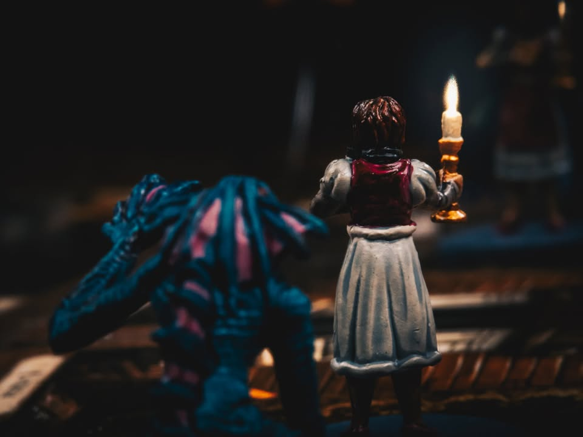
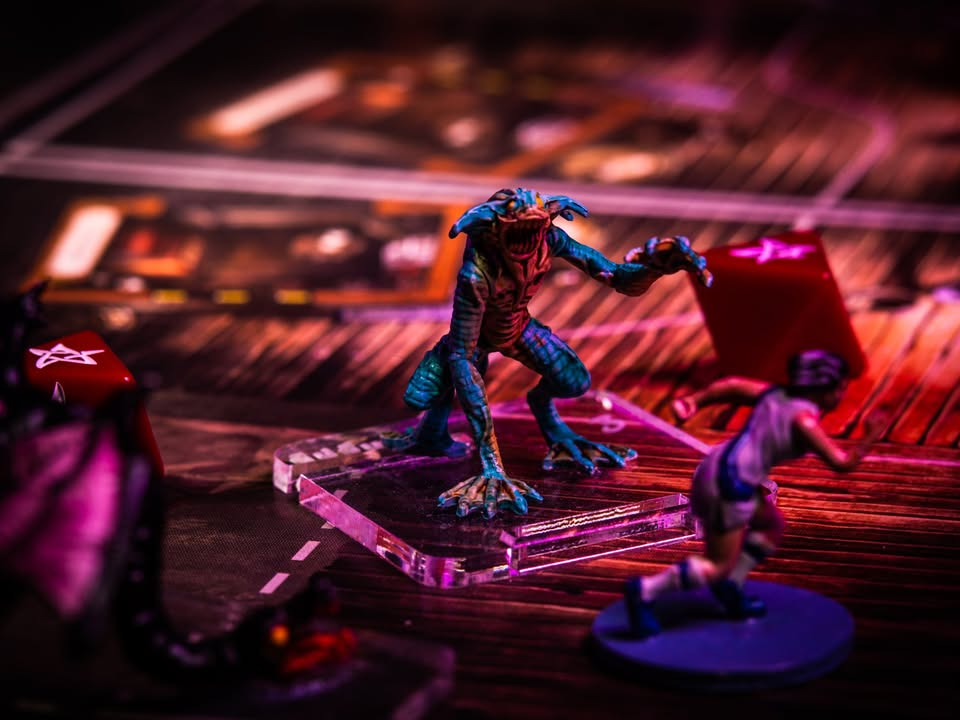
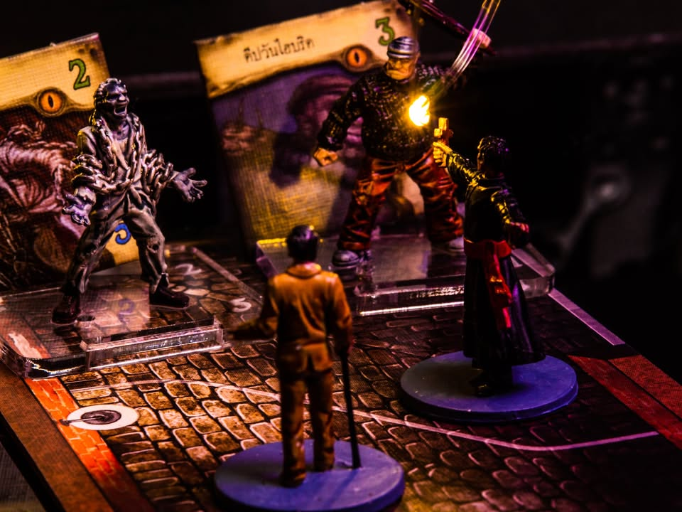
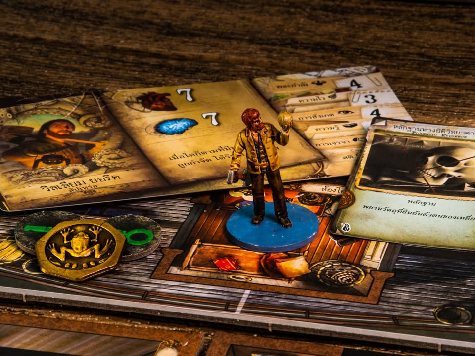
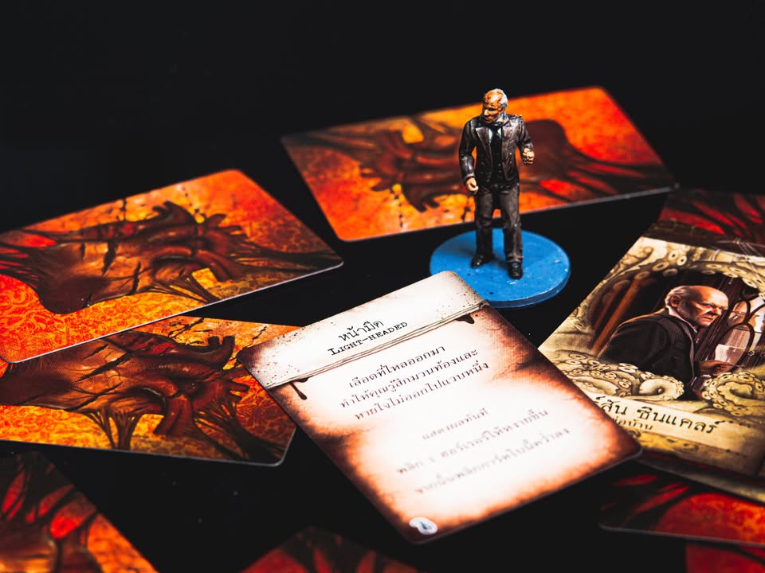
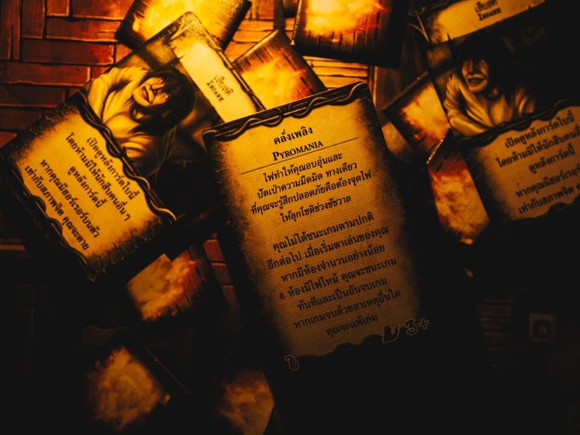

Mansions of Madness : คฤหาสน์วิปลาส #bite_size
blog: https://boardnbon.wordpress.com/2021/07/31/mansions-of-madness/

▪️ สายฝนตกกระหน่ำ พวกเราเดินทางมาตามคำเชิญของแมรี่ เจ้าของบ้านผู้หวาดผวาไปทุกครั้งที่เกิดเงามืดวูบไหว เธอพยายามข่มเสียงให้นิ่งเรียบเท่าที่จะสะกดเอาไว้ได้

▪️ "ได้โปรด ช่วยครอบครัวของฉัน พ... พวกมัน มักจะขึ้นมาจากทะเลสาบ พวกมันเหมือนกำลังหาอะไรบางอย่าง ฉ...ฉันกลัวเหลือเกิน"

▪️ และนั้นก็เป็นครั้งสุดท้ายที่เราได้พูดคุยกัน เพราะทันใดนั้นกระจกบานใหญ่ที่อยู่ด้านหลังเธอก็ถูกทำให้แตกกระจายจากแรงกระแทกอันรุนแรง กรงเล็บที่ใหญ่กว่ามือมนุษย์หรือสัตว์ไหนๆที่ผมเคยพบเจอกำรอบคอของแมรี่ที่ตาเบิกโพลง สิ่งที่นับเป็นโชคเพียงอย่างเดียวของเธอคือเสียงกระดูกต้นคอที่สั่นสะท้านอยู่ในอากาศ

▪️ พริบตาเดียวสิ่งที่เหลืออยู่คือรอยเมือกเหนียวที่ผสมปนเปไปกับเลือดสีดำมะเมื่อมใต้แสงจันทร์ลากเป็นทางยาวไปสู่ทะเลสาบ........

--------------------------------

▪️ คฤหาสน์วิปลาส เป็นเกมที่ให้เราเป็นนักสืบเรื่องราวเหลือธรรมชาติที่ต้องมาคอยต่อสู้กับสิ่งลี้ลับแห่งห่วงจักรวาลที่ยากจะหยั่งถึง และการล่วงรู้ถึงมันอาจจะทำให้เราสิ้นสติกลายเป็นคนบ้าไปเลยก็ได้ โดยอิงจากจักรวาลงานเขียนของ H.P. Lovecraft เป็นแกน

▪️ เกมเดินด้วยไอเดียหนัง horror ฝรั่งที่เหล่านักสืบจะได้รับเชิญเข้าไปในบ้านพร้อมกับพูดคุยกับเหล่า NPC และสำรวจพื้นที่เพื่อเก็บของที่จำเป็นรวมไปถีงต่อสู้กับปีศาจที่โผล่ออกมา 

▪️ รอบหนึ่งจะแบ่งเป็นสองช่วงใหญ่ๆคือตอนที่ผู้เล่นได้ทำแอคชั่นในบ้านกับช่วงดำเนินเรื่องที่ก็จะมีเหตุการณ์ว่ากันไปตามเนื้อเรื่อง เราก็จะสลับๆไประหว่างสองช่วงนี้จนจบเกม

▪️ จุดสำคัญคือเกมนี้ต้องมี app ไว้เล่นด้วย โดยตัว app จะเริ่มให้เราเลือกเนื้อเรื่องที่มีการเตรียมเอาไว้ก่อนแล้วก็จะค่อยๆบอกเราเองว่าต้องเริ่มที่ห้องไหน เปิดไปเจออะไร เราทอยเต๋าได้หน้าอะไรก็ใส่ให้ app มันแจ้งผลมา  โดยที่ตัว app มีภาษาไทยพร้อมเสียงพากษ์ด้วย

▪️ ระบบเกมที่น่าสนใจคือการบาดเจ็บ และสติ คือเวลาเราเจ็บปวดทางกายหรือจิตใจมาเนี่ยเราจะได้การ์ดสุ่มมาใส่ deck พอได้จังหวะมันก็จะให้เปิดมาที่เหลือก็ว่าไปตามการ์ด ที่แน่นอนว่าแต่ละอย่างไม่โสภานัก แต่ว่าก็จะมีคำบรรยายปลีกย่อยต่างกันไป และถ้าจิตใจกระทบกระเทือนมากๆเราจะกลายเป็นบ้า ทำให้ต้องจั่วการ์ดเงื่อนไขลับที่ทำให้การชนะของเรามันยุ่งยากไปอีก

▪️ ก็เล่นเคลียร์เงื่อนไขประจำเนื้อเรื่องได้ หรือไม่ก็บ้าตายไปกันหมด...

--------------------------------
▪️ writer's default mindset: นักเล่นเกมยูโรใช้ความคิด
▪️ game's mindset: เน้นอินไปกับการเดินเรื่อง 

• Ameritrash เต็มขั้น ธีมมาเต็ม
+ App ทำมาดีมาก ช่วยในส่วนที่ควร ปล่อย Analog ในส่วนที่ใช่
+ แปลไทยทำมาดี สละสลวย
= ดวงเยอะจากการทอยเต๋า เหมาะกับ mindset เน้นบรรยากาศ
= ผีฝรั่งมันไม่ใช่แนวสะดุ้งตุ้งแช่เย็นเยียบแบบเอเชีย เอาจริงๆก็ไม่ได้น่ากลัวหรอก
- เนื้อเรื่อง fixed เล่นฉากซ้ำได้แต่มันจะรู้แนว แต่ว่าซื้อเพิ่มได้เพียบ ตัวเสริมก็บาน เล่นครบวนกลับมาก็ลืมเรื่องเก่าล่ะ
- ถ้าดวงซวยเกินไปอาจจะโดน player eliminate ได้
--------------------------------

🔹 ต้องบอกก่อนว่าปกติผมเล่นยูโรเน้นใช้หัวเป็นหลัก แต่ก็แวะมาเล่นสายธีมเป็นบางที โดยส่วนตัวพบว่าพอเปลี่ยน mindset มาโรลเพลย์แล้วเกมค่อนข้างสนุกทีเดียว (แต่ต้องเล่นโดยไม่มีพวก Alpha Player ในวงนะ) คือโดยปกติเกมสายธีมกติกามักจะหยุบหยับที่ต้องแวะเปิดคู่มือตลอดเวลา แต่เวอร์ชั่นนี้มี app มารันให้นี้ทำให้ขั้นตอนพวกนี้สมูธมาก โดยที่ยังคงความเป็นอนาล๊อกที่เรายังต้องเล่นเกมขยับด้วยมือ และต้องพูดคุยกันอยู่อย่างครบถ้วน คือเราทรีตว่า app เนี่ยเป็น GM มานั่งกับกับเกมให้เราได้เลย ทำมาดีมาก

🔹 ด้วยความที่มันเป็นเกมธีม จุดที่ app ทำมาดีมากคือการสุ่มต่อสู้ที่ไม่ได้เล่าอะไรทื่อๆโง่ๆอย่างทอยได้ทอยพลาด แต่จะเป็นตอนแรกพลาดใช่ไหม พอแทงซ้ำมีพูดบอกด้วยว่ามันหลบพร้อมกับ บลาๆ คืออ่านแล้วเออดูมีเรื่องราวเกมไม่สะดุด  แล้วก็แก้ปัญหาพวกกติกาจุกจิกหลายๆอย่างที่เกมมีธีมมันจะมีกันไปได้เยอะ 

🔹 ลูกเล่นน่าสนใจอย่างเช่นถ้ามีตัวละครบางตัวมาโผล่ในฉากก็อาจจะมีเหตุการณ์เพิ่มก็ทำให้เกมมีสีสัน แอคชั่นมีจำกัดทำให้เราไม่สามารถทำทุกสิ่งอย่างได้หมด ก็ช่วยเสริมในส่วนอารมณ์และการตัดสินใจได้ดี

🔸 ถ้าจะมีอะไรขัดๆในเกมนี้ก็น่าจะเป็นคาเรกเตอร์ที่เราเล่นได้นี้มันไม่มีตัวไหนเท่ซักตัว เป็นคนธรรมดาๆบอบบางเหลือหลายที่ดูแล้วเหมือนพวกตัวที่จะพร้อมจะตายตัวแรกในหนังทุกตัวเลย ตัวศัตรูหลายตัวดูไม่ออกว่ามันน่ากลัวยังไง เหมือนนักเลงมากกว่าผีไรงี้ (โอเคก็นิยาม monster แบบฝรั่งนั้นแหละ แต่มันไม่น่ากลัวอ่ะ!)

💬 ถ้า mindset พร้อมมาสายธีมได้ผมแนะนำให้ลองเกมนี้มากๆครับ แต่ถ้ามาสายคิดเลขนี้เอาวางไว้หน้าประตูคฤหาสน์ ก่อนก้าวขาเข้ามาเลย เกมดวงจัดๆแบบต้องภาวนาทุกครั้งที่ทอยว่าขออย่าให้ชั้นเป็นบ้าไปก่อนเลย...

📢 งานเพ้นส์สีเป็นของ Bewitched ถ้าสนใจก็ติดต่อร้านเค้าได้โดยตรงครับ ไม่ได้ช่วยขายแต่เกมเน้นธีมแบบนี้ ทำสีแล้วเล่นได้อารมณ์เยอะกว่ามากๆ 

--------------------------------
📌 disclosure: 
* ข้อเขียนนี้แสดงความเห็นของผมที่มีต่อเกมโดยไม่ได้รับการจ้างวาน หรือเป็นการโฆษณา
* สยามบอร์ดเกม x meanbook  ผู้แปล/นำเข้า/จัดจำหน่าย ไม่ได้ส่งมาให้รีวิวโดยตรง แต่ผมใช้สินค้าที่ได้รับมาชั่วคราวเพื่อการอื่นจากทางผู้จัดจำหน่ายในการทำข้อเขียนนี้
* ผมได้ขอยืม miniature ที่ทำการเพ้นส์สีเสร็จแล้วของทางร้าน  Bewitched มาใช้ประกอบการถ่าย ( ผลประโยชน์ร่วมคือผมมีของสวยไว้ถ่ายรูป และทางร้านได้ showcase ผลิตภัณฑ์การทำสี ) 

💰 support: สามารถสนับสนุนผมทางอ้อมได้ด้วยการซื้อสินค้า Say Hi Board N Bon มูลค่า 1 บาทพ่วงกับเกมอื่นเมื่อซื้อของกับร้าน Bewitched ( เป็นโครงการสนับสนุน Creator ของทางร้าน เงินไม่เข้าผมโดยตรง แต่จะเป็นข้อมูลที่นำไปสู่การสนับสนุนกลับจากทางร้านในรูปแบบต่างๆ) https://shp.ee/vpzkpn8 

--------------------------------
หมวด Bite Size (พอดีคำ) นี้กะว่าจะเขียนอะไรสั้นๆประมาณนี้ล่ะกัน ใหม่บ้าง ซ้ำบ้าง เกมที่ขี้เกียจเขียนบ้าง เขียนๆไว้ก่อนเผื่อมีอารมณ์อาจจะขยายไปลง Thought บ้าง จริงๆอยากเขียนสั้นกว่านี้ แต่ยังอดไม่ได้ที่จะต้องอธิบายอะไรเพิ่มตามนิสัย เดี๋ยวค่อยๆปรับไปล่ะกัน

