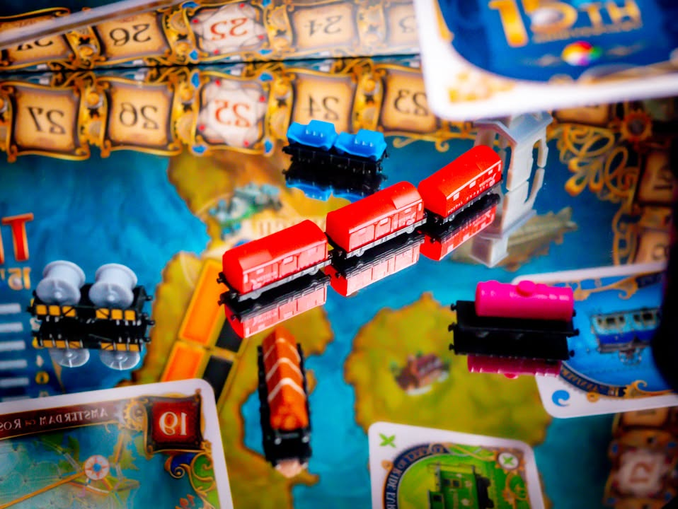
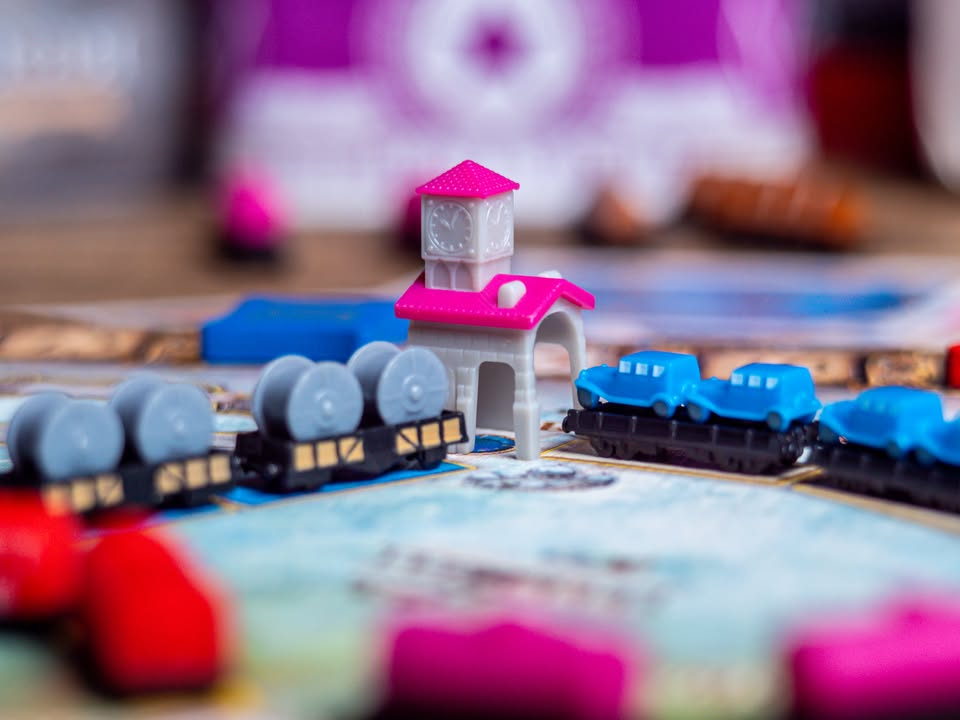
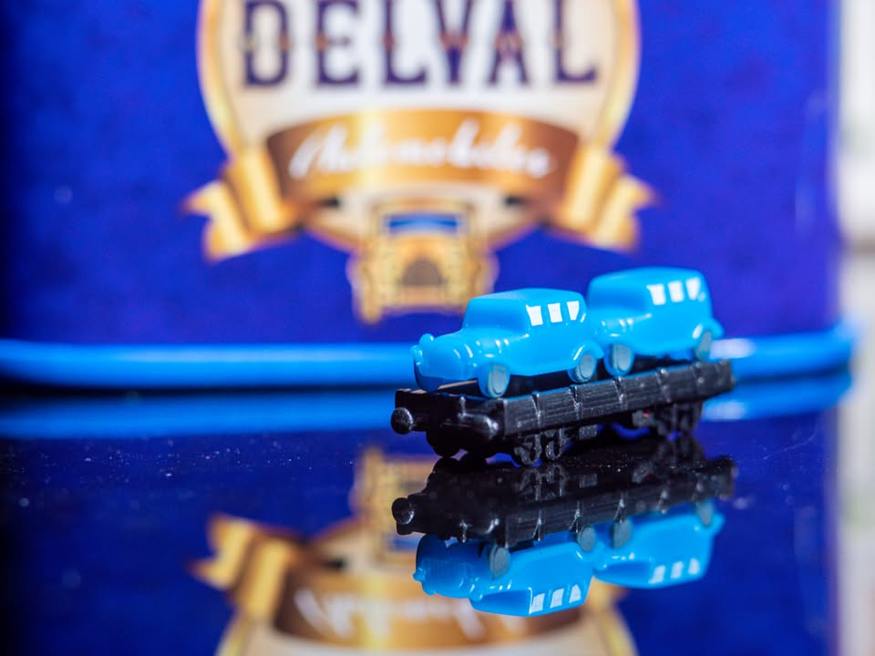
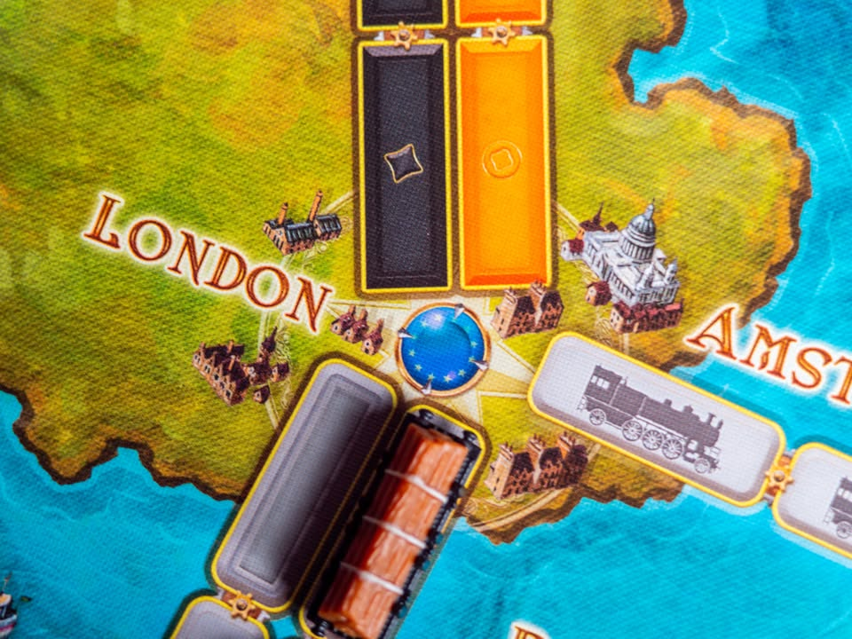
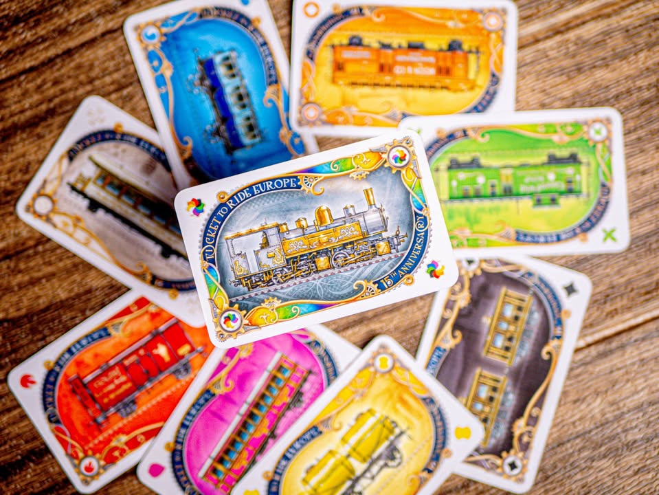
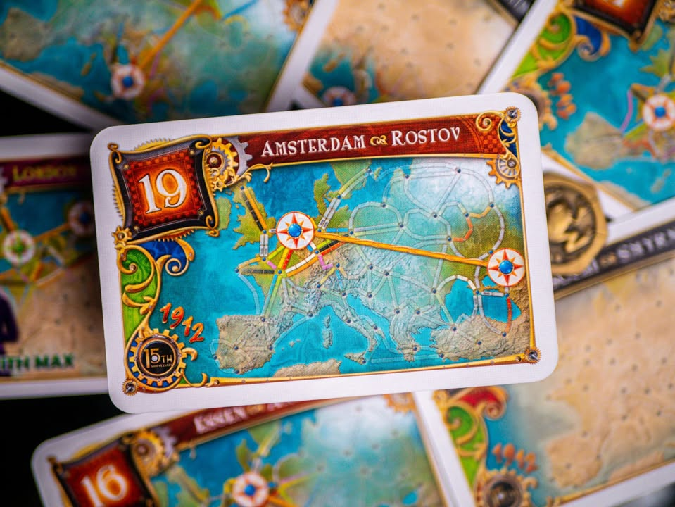

▪️ Ticket to Ride: Europe – 15th Anniversary #bite_size

▪️ ย้อนกลับไปสิบกว่าปีก่อนที่ผมเริ่มเล่นเกมกระดาน Ticket To Ride ตัวดั้งเดิมเป็นเกมกล่องแรกๆที่ผมได้เล่นและดึงให้ผมอยู่ในโลกของเกมบนโต๊ะนี้

▪️ ไอเดียของ Ticket To Ride ไม่ซับซ้อน แผนที่เชื่อมต่อระหว่างเมืองกางแผ่อยู่บนกระดานหลัก ผู้เล่นจะพยายามเคลมเส้นทางระหว่างเมืองในรูปแบบจุดต่อจุดให้เครือข่ายรถไฟของตัวเองเชื่อมโยงระหว่างเมืองตามภาระกิจลับหลายหลายรายการที่เลือกมา

▪️ การเคลมเส้นทางนั้นต้องใช้ตั๋วรถไฟหลากสีที่เราต้องเก็บสะสมให้พอดีกับเส้นทางที่จะวาง ที่การจั่วจะเลือกจากการ์ดที่หงายอยู่หรือจะเลือกแบบสุ่มก็ได้ และการเคลมเส้นทางแต่ละครั้งยิ่งลงเส้นทางที่ยาวก็จะได้แต้มเยอะขึ้นเรื่อยๆ

▪️ ภาระกิจลับสามารถจั่วได้เรื่อยๆ แต่ว่าถ้าตอนจบทำไม่ได้ก็จะเสียแต้มแทน และด้วยความที่เส้นทางมีจำกัดถ้าโดนขวางละก็ต้องมีงืมงำก่นด่ากันบ้างว่ามาขวางทางทำไมกัน! เพราะเราอาจจะต้องเสียเวลาวางแผนเดินทางอ้อมกันยาวๆ

▪️ ของเล่นใหม่ในภาคนี้ (และผมคิดว่าคือสิ่งทำให้ภาคนี้เหนือกว่าตัวหลักไปมาก) คือการสร้างสถานนีรถไฟที่จะช่วยให้เรา 'ยืม' เส้นทางคนอื่นเพื่อใช้เคลมแต้มได้ ตรงนี้ช่วยลดความกดดันในการเดินรางอ้อมได้ดี โดยที่ยังไม่ทิ้งอารมณ์ของการตัดกัน และอีกอย่างคือระบบอุโมง ที่การ์ดสร้างทางจะมีความไม่แน่นอนในการออกค่าใช้จ่าย

---------------------------------------------
▪️ สำหรับผมแล้ว Ticket To Ride: Europe คือตัวเลือกที่ 'perfect' ของการเป็นตัวแทนเกมกระดานสมัยใหม่ เป็นทั้งเกมแรกที่ยอดเยี่ยมสมนิยามเกมกระดาน หรือจะเป็นเกมกล่องเดียวในบ้านที่หยิบเอาไว้เล่นในช่วงเวลาครอบครัวที่จะเชื่อมต่อผู้เล่นทุกระดับเข้าด้วยกัน 

เพราะ...
.
▪️ มันเรียบง่ายมาก แอคชั่นมีเพียงสามอย่าง จั่วตั๋ว เคลมทาง จั่วเป้าหมายเพิ่ม
.
▪️ สมดุลย์ระหว่างดวงและการวางแผน การจะเล่นเกมนี้ให้ดีเราต้องดูก่อนว่าจะเลือกเส้นทางไหน ใครจั่วตั๋วสีไหนเก็บไว้ เราจะต้องรีบเคลมตรงนี้ก่อนหรือปล่าว คือมันเป็นเกมง่ายๆแต่มีการตัดสินใจที่มีความหมายอยู่ในทุกครั้งที่เราจะขยับ
.
▪️ ปฎิสัมพันธ์ระหว่างผู้เล่นที่ดี มันเป็นเกมที่ทรัพยากรมีจำกัดทั้งเส้นทางและตั๋วสี แต่ทุกคนอยากจะเดินทางไปทั่วแผนที่ การขัดขากันผ่านการวางรางรวมไปถึงการบังเอิญหยิบตั๋วที่เพื่อนเล็งไว้ก็สร้างบรรยากาศร่วมในวงได้ดี
.
▪️ มีแต้มลบเป็นรสขมเบาๆที่ช่วยผลักดันให้เกินอารมณ์การแข่งขัน ภาระกิจในเกมนี้มันคือการ 'ต้องทำให้ได้' ซึ่งมันจะไปล้อกับการตัดสินใจว่าเราจะทำอะไรก่อนดี (เกมสมัยใหม่กว่านี้จะใช้วิธีได้แต้มน้อยลงแทน ซึ่งผมคิดว่ามันปลอดภัยเกินไปจนจืดชืด)

▪️ ตัวใหม่ครบรอบสิบห้าปีทำออกมาสวยงาม ราคาตอนนี้ผมคิดว่าค่อนข้างคุ้มมากนะ เพราะเพิ่มจากตัวธรรมดา+ตัวเสริมไม่เท่าไรเอง ถ้าเลยตอนนี้ไปไม่รู้ราคาจะพุ่งทะยานเหมือนตอนรุ่นสิบปีไหม แต่ถ้าไม่ใช่นักสะสมผมคิดว่าเอาตัวยุโรปสิบห้าปีจะสมบูรณ์ในประสบการณ์การเล่นมากกว่า (แต่ถ้าเน้นประหยัดรอหาซื้อกล่องธรรมดามือสองจากคนที่อัพเกรดก็ดีเหมือนกันนะ)

▪️ ผ่านไปสิบปีผมแทบจะไม่เหลียวแลเกมเดิมๆ เบาๆ เพราะมันไม่ได้มอบความสนุกอะไรให้ผมได้ซักเท่าไร แต่สำหรับ ticket to ride แล้วผมยังมีพื้นที่ให้กับมันเสมอครับ

▪️ เกร็ดความรู้: ไอ้โทเคนที่เราวางๆกันน่ะมันไม่ใช่โบกี้นะ มันคือตู้รถไฟ ส่วนที่เป็นโบกี้จริงๆมันคือตรงที่เป็นฐานล้อ ...ที่มา "ทีมนั่งรถไฟกับนายแฮมมึน" เรื่อง "โบกี้ ไม่ใช่ตู้รถไฟ"
 
--------------------------------
📌 disclosure: 
* ซื้อเองเขียนเองไม่ได้ตัง กล่องบุบด้วยฮือ...

💰 support: สามารถสนับสนุนผมทางอ้อมได้ด้วยการซื้อสินค้า Say Hi Board N Bon มูลค่า 1 บาทพ่วงกับเกมอื่นเมื่อซื้อของกับร้าน Bewitched ( เป็นโครงการสนับสนุน Creator ของทางร้าน เงินไม่เข้าผมโดยตรง แต่จะเป็นข้อมูลที่นำไปสู่การสนับสนุนกลับจากทางร้านในรูปแบบต่างๆ) https_://shp.ee/vpzkpn8 

--------------------------------
หมวด Bite Size (พอดีคำ) นี้กะว่าจะเขียนอะไรสั้นๆประมาณนี้ล่ะกัน ใหม่บ้าง ซ้ำบ้าง เกมที่ขี้เกียจเขียนบ้าง เขียนๆไว้ก่อนเผื่อมีอารมณ์อาจจะขยายไปลง Thought บ้าง จริงๆอยากเขียนสั้นกว่านี้ แต่ยังอดไม่ได้ที่จะต้องอธิบายอะไรเพิ่มตามนิสัย เดี๋ยวค่อยๆปรับไปล่ะกัน

