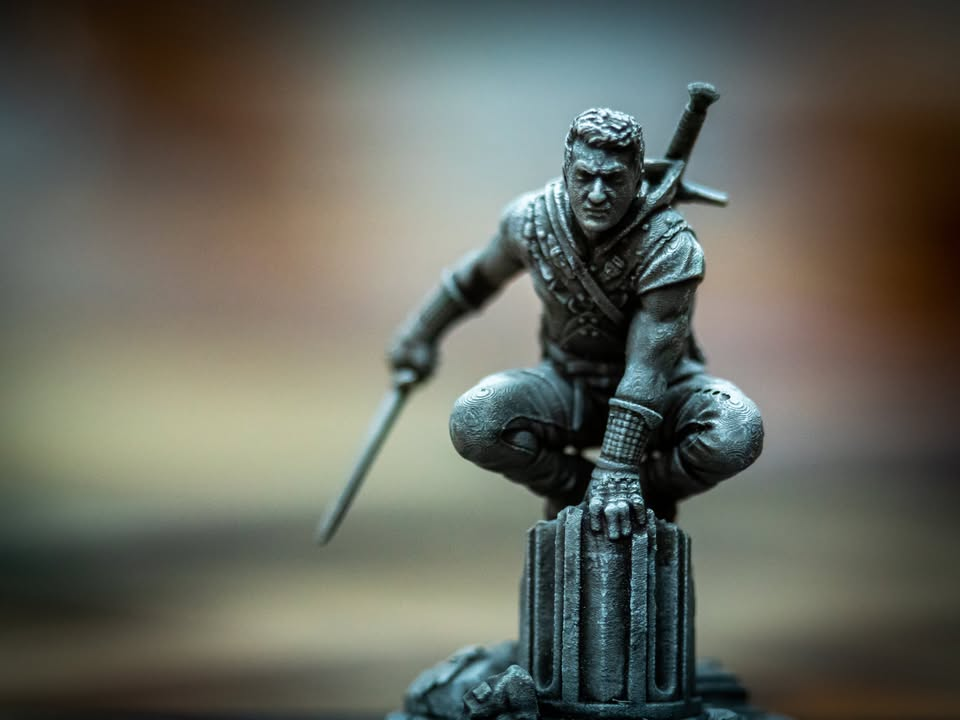
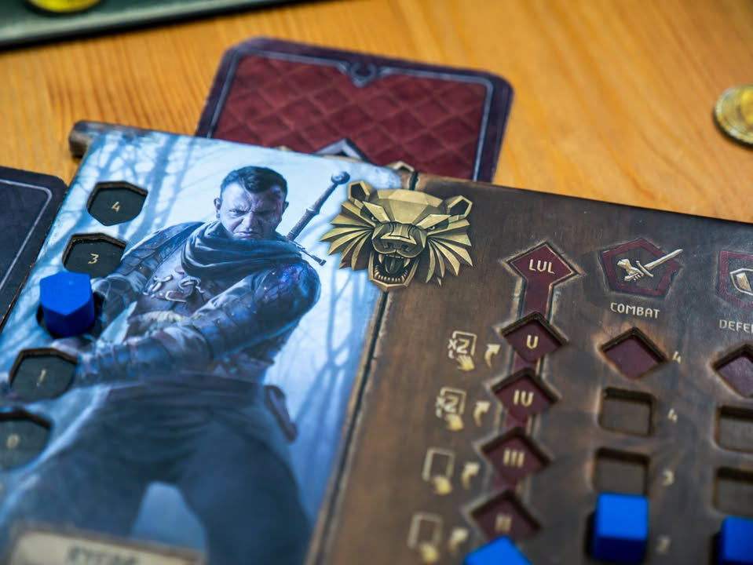
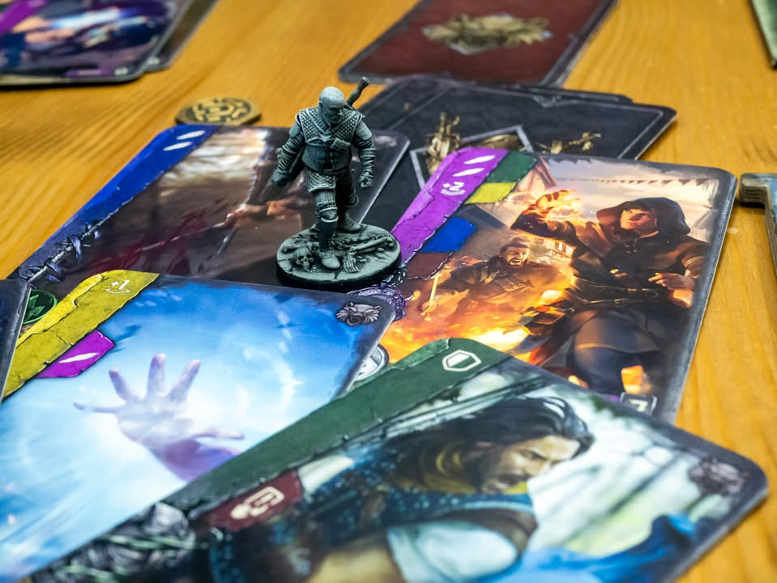

🔹 The Witcher: Old World 

▪️ เกมเล่าถึงโลกแฟนตาซีที่เหล่าปีศาจจะถูกกำราบด้วยนักล่านาม The Witcher ที่ยกธีมมาจากนิยายชื่อเดียวกัน (แต่หลายคนอาจจะรู้จักจากเกม และทีวีซีรี่ย์) 

▪️ ในนิยามการออกแบบ ผมมองว่ามันเป็นยูโรระดับกลาง ที่มีการสอดแทรกกลไกด้าน story telling เข้าไปมากกว่าจะเรียกว่าเกมแนวอเมริเทรช เรียกว่าวางตัวเองไว้อยู่ตรงประตูทางเข้าระหว่างสองโลกละกัน ไม่ลงลึกไปสุดตัว ตรงนี้ก็สร้างทั้งจุดแข็งและจุดอ่อนไปพร้อมกัน ซี่งเดี๋ยวจะเล่าต่อ

▪️ เราก็เล่นเป็นตัวนักล่านี้แหละ แข่งกันบรรลุชื่อเสียงให้ถึงจุดหนึ่งก่อนเพื่อนร่วมอาชีพ โดยวิธีการได้มามีสามทางคือปราบปึศาจ, ฝึกวิชาให้บรรลุระดับมาสเตอร์ หรือไม่ก็ไปประมือชนะ the Witcher คนอื่น เกมให้อารมณ์เล่นตามใจฉันเบาๆ อยากทำอะไรก็ทำวิ่งวนๆไปตามเมืองอยู่ในแผนที่นั้นแหละ

--------------------------------
📌ตัวเกมเป็น prototype สำหรับทดสอบ คุณภาพวัสดุและกติกาอาจมีการเปลี่ยนแปลง (miniature เข้าใจว่าเป็น 3D print resin ของจริงรายละเอียดน่าจะดรอปกว่านี้) และตัวเกมกำลังจะมีการเปิดสั่งพรีออเดอร์ฉบับภาษาไทยช่วงปลายเดือนแปดนี้

--------------------------------
เกมนี้กลไกกับสมดุลย์ทำมาฉลาดหลายอย่าง เดี๋ยวจะขอไล่แยกไปทีละข้อ

🔹 เนื่องจากเป็นเกมที่มี lore ส่วนที่เราจะได้เจอเกือบตลอดเกมคือ 'เนื้อเรื่อง' ที่เกือบทุกครั้งที่จบรอบเราจะต้องเลือกว่าจะจั่ว event จากกองในเมืองหรือนอกเมือง ที่ก็จะมีร่ายบรรยายบลาๆ (บริบทบรรยายโอเคนะ ไม่ฉาบฉวย) พร้อมกับตัวเลือกให้เราทำสองอย่าง ซึ่งบางทีก็ได้ของเลยบางอันก็เป็นเควสที่ต้องแวะไปเอาทำต่ออีกเมือง (บางทีไปถึงก็ต้องแวะไปอีกเมืองต่อ) ที่ทำมาดีคืออ่านจากตัวเลือกนี้เดาไม่ออกเลยว่าจะได้อะไรมา 

🔹 ระบบนี้ฟังดูง่ายๆก็จริง แต่วิธีการเล่าบวกกับ mindset โรลเพลย์ของเกมมันทำได้ค่อนข้างดีนะ แต่ตรงนี้มีเงื่อนไขว่าต้องให้คนข้างๆเป็นคนอ่านให้เราฟัง ป้องกันเราดูคำตอบล่วงหน้า การ์ดมีเยอะ เอาเป็นว่าเล่นซ้ำได้บ่อยกว่าจะคุ้น เพราะต่อให้เจออันเดิมก็ยังมีตัวเลือกซ้ายขวาอีก 

🔹 ในความเห็นจุดที่ดีที่สุดและเรียกได้ว่าเป็นแกนหลักของเกมนี้คือระบบจัดกองการ์ด (เรียก deck building ก็ได้ แต่ในเชิงการใช้งานมันไม่ได้ทำงานแบบนั้นซะทีเดียว) การ์ดในเกมจะใช้งานสองอย่าง คือใช้ตอน phase เดินกับ phase สู้

🔹 ตรง phase เดินเนี่ยแผนที่ในเกมจะมี icon อยู่สามแบบคือป่า ภูเขา ทะเล ตานึงเราจะได้จั่วการ์ดมาสามใบ อยากเดินไปเมืองไหนก็ทิ้งการ์ด icon ตรงกัน ถ้าไม่ตรงก็จ่ายเงินหรือจ่ายผสมกันสองใบก็ได้ เมืองมี function ไม่กี่อย่าง มีเข้าบ่อนหาเงิน ฝึกทักษะหนึ่งในห้าอย่าง (ทั้งฟรี และไม่ฟรี) เก็บน้ำยาไอเท็มไว้เสริมพลัง กับอะไรอีกนิดหน่อย จบตาเราก็จะได้ซื้อการ์ดในตลาดมาเพิ่ม

🔹 ตอนสู้เราก็ใช้การชุดเดิมนั้นแหละเอามาสับใหม่ และมันจะทำหน้าที่เป็นพลังชีวิตของเราไปพร้อมกัน ตาหนึ่งเราจะเล่นการ์ดได้แค่หนึ่งใบ ที่ผลก็วนๆกันอยู่ระหว่างโจมตี/เพิ่มเกราะ/เพิ่มลดจั่วจากกอง แต่การ์ดหลายใบจะสามารถทำ chain เล่นการ์ดต่อเนื่องพ่วงโบนัสเป็นคอมโบรัวๆได้ถ้าไล่สีตามเงื่อนไขการ์ดได้

🔹 ตรงนี้คือที่มาของการพูดว่ามันเป็น deck building ที่ตอนซื้อการ์ดเราต้องเลือกซักหน่อยว่าจะเอาสีอะไรที่มันไหลไปทางในเข้ามือบ้างเพื่อเพิ่มโอกาสในการทำคอมโบให้ไว เพราะ deck มันคือเลือดของเราและมันมีค่อนข้างบาง การฟันไว ฟันแรง จบก่อนจะสำคัญสุด

🔹 แต่เอาจริงๆ ความฉลาดทางการออกแบบคือ sub mechanic บางๆที่ส่งเสริมกันนั้นคือการ trash หรือ remove การ์ดออกจาก deck  ที่ปกติแล้วเป็นเรื่องดีมากของ deck building แต่ไม่เชิงนักสำหรับเกมนี้ เพราะว่ากองการ์ดคือเลือด และเป็นเลือดที่ทุกคนได้มาใน pacing เดียวกันทั้งวงคือ คนละ 1 ใบต่อรอบเท่านั้น

🔹 ทุกครั้งที่เราทำเงื่อนไขในการชนะได้ (หรือโดนปีศาจตีในบางท่า) เราจะโดนบังคับให้ trash การ์ดจำนวนหนึ่งออกจากกอง ซึ่งไม่ใช่เรื่องดี เพราะยิ่งเล่นแต่ละคนจะเริ่ม chain การ์ดได้ไวขึ้น การโดนฟันก่อนอย่างรุนแรงและเลือดบางลงเรื่อยๆนั้นทำให้คนที่เล่นตามหลังเรามีโอกาสไล่ตามได้มากขึ้นโดยที่ไม่ต้องเปลี่ยนสมดุลย์อื่น (ใคร level up นำๆนี้โดนเพื่อนรุมแทงแน่เพราะเลือดบางจากการกร่ำศึก)

🔹 กิมมิคอื่นจะอยู่ในรูปแบบทอยเต๋าหาเงินที่ให้ผู้เล่นเอาเต๋าห้าลูกมาทอยสองที่เพื่อจัดเป็น poker set รวมไปถีงเวลาผู้เล่นสู้กัน คนที่ไม่ได้สู้ด้วยสามารถลงเงินแทงหาคนชนะได้ด้วย และการโจมตีของปีศาจผู้เล่นอีกคนจะเป็นคนสุ่มว่าปีศาจจะใช้แอคชั่นด้านบนหรือล่างก็ถือเป็นระบบเล็กๆน้อยๆที่คราฟมาให้ผู้เล่นทุกคนอยู่ในวง

👁‍🗨 ตรงนี้จุดกลางๆ แต่มันเป็นเกมค่อนข้าง feel good นะ ( ถ้าไม่ซวยเจอปีศาจสุ่มตีแรงๆรัวๆ ) ต่อให้แพ้ก็ยังมีอะไรติดมือมาตลอด ได้เลือดเพิ่มไปบู๊ต่อไรงี้ ไม่ใช่ว่าโดนเพื่อนตบหัวป๊าบๆแล้วเราจะเสียแต้มอะไร

👁‍🗨 เกมนี้สนับสนุนให้เราไปทุบหัวเพื่อน! ถ้าชนะเราจะได้สกิลของสำนักคนที่เราไปทุบชนะมาใช้ได้ด้วยนะ

--------------------------------
👁‍🗨 ทั้งนี้ผมเล่นแค่ตัวหลัก (มีให้เทสแค่นี้) เท่าที่อ่านผ่านๆตัวเสริม Monster Trail จะมีการเพิ่มรายละเอียดการต่อสู้ของปีศาจเพิ่มนะ แล้วก็เหมือนจะมีขวดยากับการ์ดต่อสู้ที่มีลีลามากกว่าเดิม ใส่ตัวเสริมไปน่าจะแก้จุดที่กำลังจะติในตัวหลักไปได้เยอะเลย (แต่เกมก็จะซับซ้อนขึ้น)

🔸 จากนี้คือข้อเสียที่เกิดจากการยั้งตัวเกมไว้ไม่ให้ลึกเกินไปทำให้เกมใช้ธีมได้ตื้นเขินมาก ตัวปีศาจที่นอกจากความสามารถในตาแรกแล้วต่างกันแค่จำนวนเลือดซึ่งก็คือการ์ดแอคชั่นออกท่าไปพร้อมกัน คืออย่างน้อยๆผมคาดหวังว่ามันจะมีการ์ดท่าประจำตัวจำนวนหนึ่ง mix ไปใน deck ด้วยนะ กลายเป็นนอกจากตัวใหม่อึดกว่าตัวเก่ากับสุ่มจุดเกิดแล้วก็ไม่ได้มีรสชาติต่างกัน ท่ามันก็วนๆเดิมๆ ตัวมันจะอยู่บนฟ้าบนดินก็เหมือนกันหมด (ตรงนี้มีเพิ่มให้ในตัวเสริม)

🔸 ตรงนี้น่าเสียดายมาก เพราะมันน่าจะเพิ่มอรรถรสทาง story telling ได้เยอะอยู่ (จริงๆมีระบบเสริมบางๆว่าถ้าเราหาข้อมูลมาก่อนหรือสู้แพ้จะถือว่าเราได้เรียนรู้เพิ่ม ทำให้รอบหน้าเราได้ฟันก่อน) กับเวลาเราคิลตัวไหนไปเนี่ยเราจะได้สกิลเพิ่มด้วยแล้วแต่ว่าเก็บตัวไหนได้ 

🔸 ตรงธีม(พ่วงกลไก)อีกเช่นกัน แม้การ์ดท่าต่อสู้มันจะมีกองหนา แต่มันก็คล้ายๆกันไปหมดวนอยู่แต่สามสี่แบบต่างกันนิดหน่อย ไม่ได้มีอารมณ์ว่าเราได้ออกท่ากระบวนท่าอะไรทั้งนั้น คือในเชิงเกมก็ไม่มีปัญหาอะไร แต่ในแง่การพัฒนาฟิลลิ่งต่อสู้ก็จะแห้งไปซักหน่อย และไม่ได้มีรูปแบบกลยุทธ์ให้การจัดกองการ์ดอะไร แค่เน้นเลือกการสีให้เหมาะกับของที่มีไปเรื่อยๆมากกว่า

🔸 ตัวละครเกมมีน้อยเกินไปนิด อยากให้มีท่ามีพลังพิเศษมากกว่านี้อ่ะ ขวดโด๊ปยาที่เรียกได้ว่าเป็นเอกลัษณ์ของธีม ก็วนซ้ำอยู่ไม่กี่แบบ แต่ตอนเล่นจริงต้องโด๊ปจริงจังไม่งั้นแพ้เอาง่ายๆตาม lore อยู่ (ตัวเสริมมีน้ำยาเพิ่มอีก)

🔸 และเรื่องสุดท้ายคือ down time หรือระยะการรอที่ผมคิดว่าเกมนี้เหมาะสุดที่สามคน ถ้าสี่คนนี้นานจนหลับแน่ๆ แต่พอสามคนที่ต้องมาช่วยกันแบ่งบทอ่านการ์ดกับทอยเต๋าก็ช่วยให้เราไม่สงัดเกินไปนัก

--------------------------------
💬 โดยสรุป (เฉพาะตัวหลักที่ได้ลองเล่น แต่ตัวเสริมน่าจะดีขึ้น)

💬 ถ้าชอบ the witcher มากๆ อยากจะเสพโลกของนิยาย มาเล่นเกมนี้ก็อาจจะเฉยๆไปถึงผิดหวัง เพราะเกมไม่ได้เอา lore อะไรมาใช้แบบเด่นๆ ก็หยิบเอาสำนักมาหน่อยชื่อเมืองมานิด เนื้อเรื่องก็ไม่ได้ขยายจักรวาลอะไรขนาดนั้น รู้ก็อินเพิ่มหน่อย ไม่รู้ก็เล่นได้ ตัวปีศาจมาแต่รูป ส่วนกลิ่นไม่มาเลย ความสามารถไม่ได้ reflect ตัวตนอะไร ระบบของเกมที่เป็นอยู่แม้จะทำมาดี แต่จะใส่หรือไม่ใส่ธีม the witcher ก็ไม่น่าจะต่างอะไรนัก

💬 แต่ถ้าคุณคาดหวังยูโรระดับกลางที่ไม่ซับซ้อนเกินไป สามารถชวนเพื่อนเล่นได้ง่าย (ถ้าอ่าน EN ได้ หรือซื้อแปลไทย) มีเนื้อเรื่องและ story telling (แบบไม่ลึกซับซ้อน) เกมนี้ก็ค่อนข้างเหมาะครับ

--------------------------------
📌 disclosure: 
* ข้อเขียนนี้แสดงความเห็นของผมที่มีต่อเกมโดยไม่ได้รับการจ้างวาน หรือเป็นการโฆษณา

💰 support: สามารถสนับสนุนผมทางอ้อมได้ด้วยการซื้อสินค้า Say Hi Board N Bon มูลค่า 1 บาทพ่วงกับเกมอื่นเมื่อซื้อของกับร้าน Bewitched ( เป็นโครงการสนับสนุน Creator ของทางร้าน เงินไม่เข้าผมโดยตรง แต่จะเป็นข้อมูลที่นำไปสู่การสนับสนุนกลับจากทางร้านในรูปแบบต่างๆ) https://shp.ee/vpzkpn8 
--------------------------------

