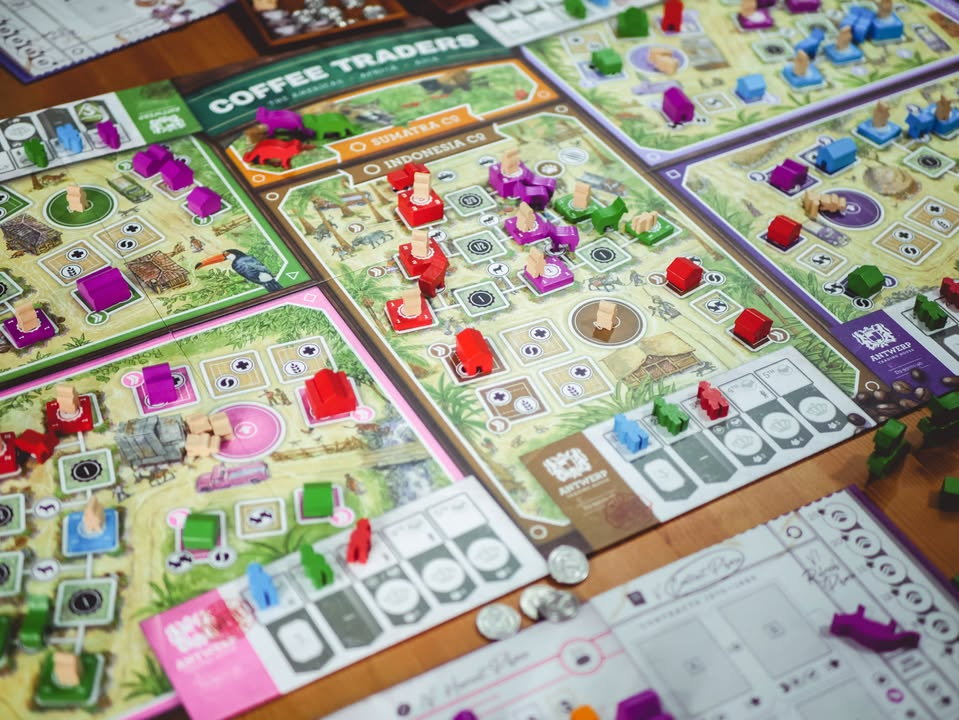
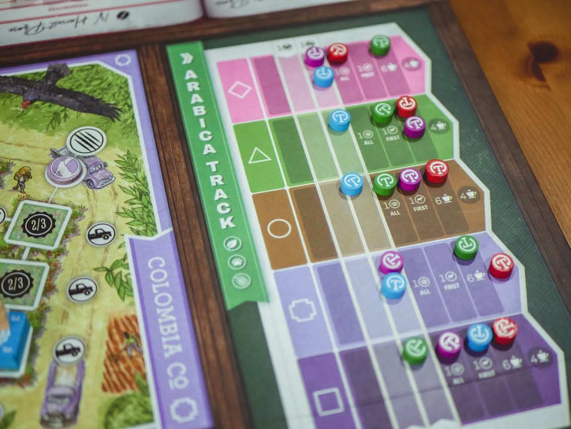
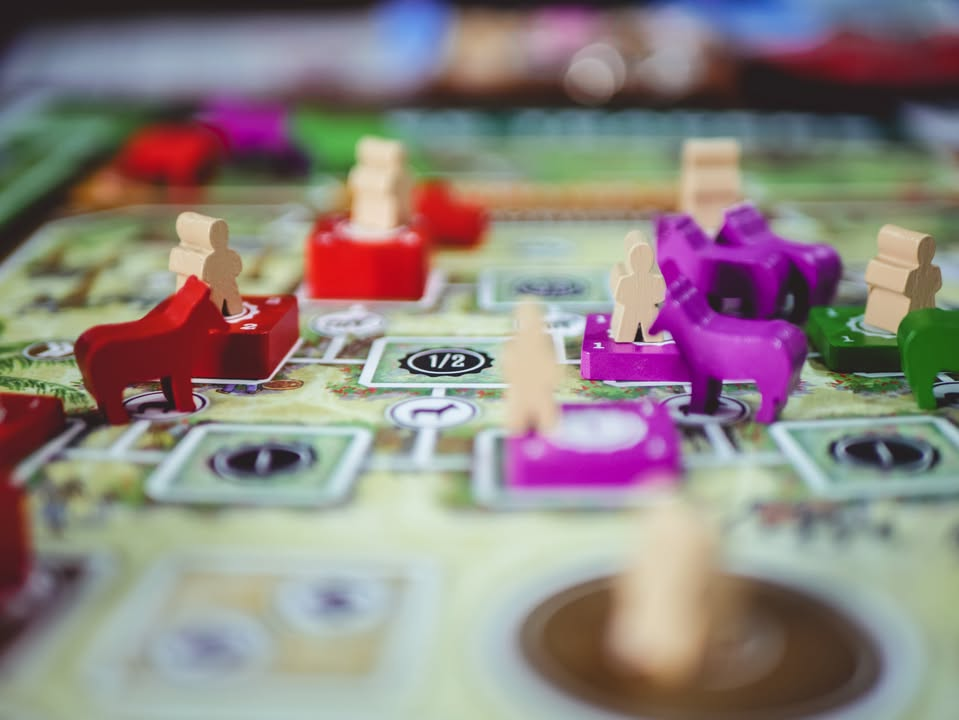
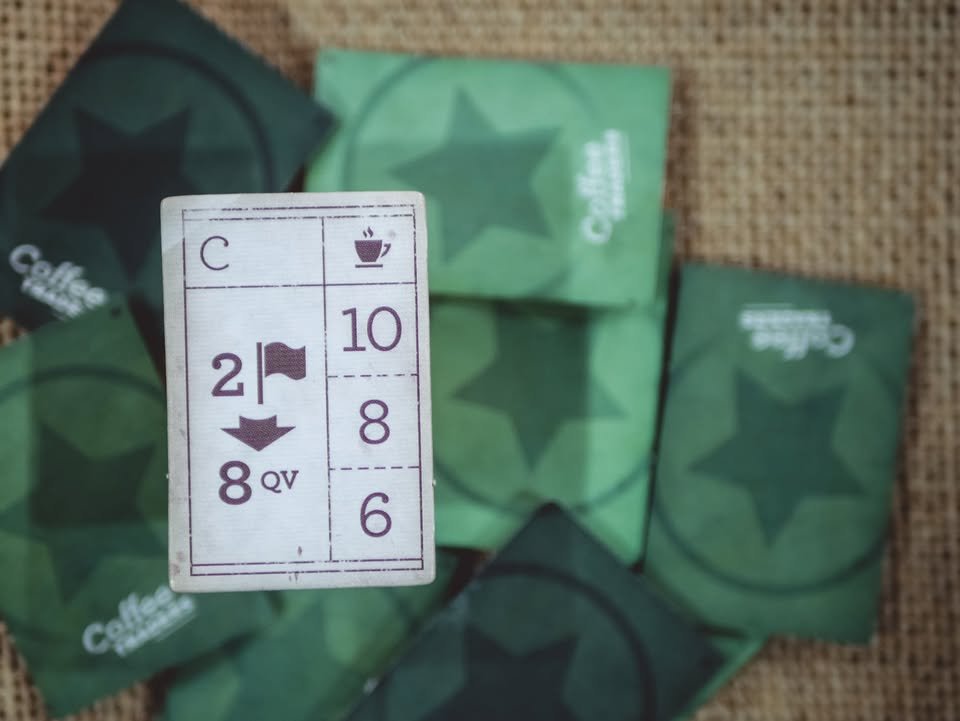
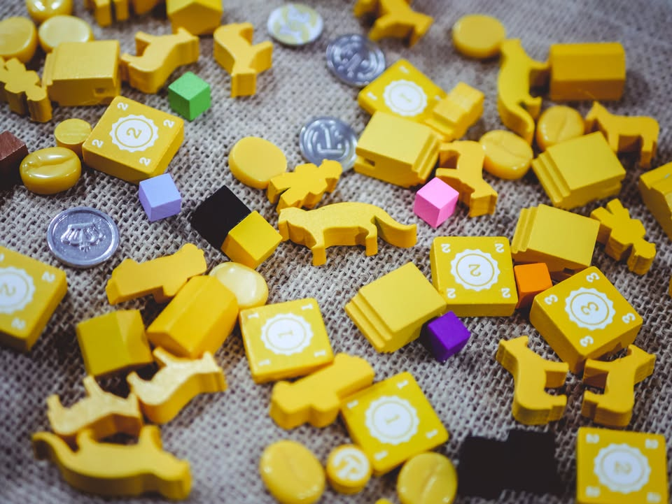

Coffee Trader #thought #first_impression
blog link: https_://boardnbon.wordpress.com/2021/09/07/coffee-trader/

▪️ เกมยูโรระดับหนักที่เล่าถึงการเป็นบริษัทกาแฟในยุโรปที่จะเข้าไปพัฒนาแหล่งเพาะปลูกกาแฟในแหล่งกาแฟชั้นดีในหลายพื้นที่เพื่อนำไปส่งขายยังร้านกาแฟทั่วโลก 

----------------------------
🖋 สิ่งที่ทำให้ผมสนใจเกมนี้

▪️ เพราะเป็นผลงานการออกแบบของ Rolf Sagel กับ André Spil ที่ผลงานของพวกเค้าคือ Wildcatters เกมที่ผสมผสานระบบเกมส่งของ และเกมชิงพื้นที่ เข้ากับการเล่นแบบไปคนเดียวไม่รอดต้องช่วยกัน ได้อย่างกลมกล่อม จนหนึ่งในเกม top 50 ของผมเอง

+ ระบบการเล่นทีผสมกลไกหลายอย่างเข้าด้วยกันได้น่าสนใจ
+ flow การเล่นโดยรวมเข้าใจไม่ยากเทียบกับ weight
= ไม่มีสายการเล่นจริงจัง เน้นหน้างาน ทำให้อารมณ์อยากกลับมาลองท่าไม่ค่อยมี
- กลิ่นกาแฟไม่มีเลย ทำเป็นเกมขายอะไรก็ได้ 
- คู่มือน่าจะทำได้ดีกว่านี้ รูปประกอบน้อย
----------------------------

▪️ รูปแบบเกมจะแบ่งออกเป็นสามส่วน โดยส่วนแรกคือการแย่งกันสร้างโรงผลิตเมล็ดกาแฟตามพื้นที่ ตรงพื้นที่การสร้างก็มีกติกากับทรัพยากรที่ต้องใช้มากำกับไปตามเกม พร้อมกับเราต้องหาจังหวะส่งคนงานพื้นเมืองเข้าไปทำไร่ในพื้นที่ของเราด้วย

▪️ ขยักถัดไปคือการที่เราต้องเลือกว่าจะแบ่งคนงานเราไปสร้างตึก หรือส่งไปติดต่อซื้อเมล็ดกาแฟ เพราะว่าเกมนี้โรงงานเราเนี่ยสร้างไว้ทำแต้มส่วน majority control ในพื้นที่ แต่เมล็ดกาแฟที่ผู้เล่นผลิตได้เนี่ยจะขายให้กับคนที่ไปติดต่อซื้อเท่านั้น โดยเมล็ดกาแฟที่ได้เราก็จะเอาไปเคลม contract ที่ได้รับมา หรือจะเอาไปส่งขายตามบาร์กาแฟก็แล้วแต่เรา

▪️ ตอนสร้างตึกในพื้นที่เนี่ยมันจะมีห้าส่วนที่หน้าตาเหมือนกันเป๊ะ ต่างกันแค่สีของเมล็ดกาแฟที่ผลิตได้ แต่ละที่จะแบ่งออกเป็นสามขั้นอยากจะสร้างขั้นถัดไปก็ต้องเอาตึกเบอร์ตรงกันไปวาง ตรงนี้ก็จะมี mini puzzle หน่อยๆเพราะมีตึกให้เลือกเปิดสามแถวได้ลำดับของกับโบนัสไม่เหมือนกัน 

▪️ ตอนวางตึกที่ต้องค่อยๆสร้างไล่ตามขั้นขึ้นไปพร้อมกับต้องจ่าย ลา (นัยว่าเอาไว้แบกของขึ้นเขา) เป็นทรัพยากรที่หายากเอาเรื่องอยู่ แต่ถ้าเราวางช้าก็อาจจะโดนเพื่อนบล็อกทางขี้นไม่ให้ไปต่อได้ เพราะพื้นที่ชั้นสูงๆที่ให้วางมันมีน้อย แต่ถ้าเราปลดล็อกบางสายไวเราจะได้รับรถบรรทุกเอาไว้วิ่งแซงลา ข้ามไปวางชั้นสามได้เลย อันนี้ก็แล้วแต่กลยุทธ์ เพราะเกมออกแบบไม่ให้เราสามารถไปอยู่ได้ทุกที่อยู่แล้ว

▪️ เอาจริงๆทั้งเกมมันก็มีแค่นี้แหละ สามารถสรุป flow ได้เร็วจนน่าตกใจ (แต่รูลเขียนให้งงจนนึกว่ายากกว่าที่ควรเป็นเยอะเหมือนกัน) เล่นวนแบบนี้แค่สามรอบเท่านั้นก็จบเกม...

-----------------------------------------

🐸 [กบชอบ] -- ร้านกาแฟสวยนั่งสบาย สุนทรีย์ดนตรีเพราะ ใช้สมาธิได้อย่างสงบ แต่ไม่กลิ่นกาแฟเลย เสริฟโค้กมาก็แยกไม่ออกหรอก

-----------------------------------------

🔹 เป็นเกมที่ตอนเล่นสนุกมากคิดตลอดการเล่น ชวนก็เล่นแน่ๆ เกมไม่มีสายจริงจังหนักไปทางแก้ปัญหาเพื่อทำ puzzle อันล๊อกของหน้างานมากกว่า คือชอบเล่นนะ แต่มันไม่มีอารมณ์นอนกลับไปคิดท่ามาแก้มืออ่ะ อารมณ์คนึงหาก็จะจางๆหน่อย

🔹 จุดที่ทำให้เกมนี้สนุกคือความอยากทำเยอะสิ่งในจำนวนแอคชั่นที่น้อยมาก (เอาจริงๆไม่น้อยหรอกมันลวงตาเพราะใช้วิธีแบ่งให้ทำเฟสล่ะสามสี่แอคชั่น) ต้องแบ่งสมองว่าอยากจะไปเอาแต้มตอนไหนเพราะมันมีแต้มคุมพื้นที่ แต้มส่งของ แต้มเดินแทรค แต่การจะได้แต้มพวกนี้ต้องมาคิดก่อนว่าวางไปจะได้ผลตอบแทนคุ้มไหม ได้โบนัสกลับมาแล้วเอาไปใช้ต่อได้ไหม ลงตรงนี้แล้วจะได้กาแฟพอไปเคลมไหมนะ ตรงนี้เลเยอร์ความคิดมันผสมๆกันแบบสนุกดี 

👁‍🗨 แต่ความรู้สึกหนึ่งที่ยังขจัดออกไปไม่ขาด คือรู้สึกแบบว่ามันเป็นเกมที่มีน้ำหนักการตัดสินใจที่ 'แปลก' ในเชิงว่ามันเหมือนเป็นเกม puzzle เล่นคนเดียวหาทางเก็บของไปส่งใบสั่งที่สุ่มแบบ fixed ไม่มีแจกเพิ่มแล้ว เราก็ปลดของเอาโบนัสหน้างานไปเรื่อย ฝั่งที่ไปยุ่งกับคนอื่นมันค่อนข้าง scripted แบบงงๆ

👁‍🗨 คือในช่วงการวางโรงงานเนี่ยมันจะมีแอคชั่นให้ทำหลักๆแค่สี่อย่าง เราทำได้แค่คนละ 3-5 ครั้ง ได้แก่ เพิ่มเงิน, วางโรงงาน, เพิ่มลา (เพื่อเอาไว้วางโรงงานต่อ) และเติมคนงาน 'ให้กับโรงงานทุกคนในพื้นที่' ซึ่งความสำคัญของขั้นตอนนี้คือเวลาเราเติมคนงานให้โรงงานคนอื่นเราจะได้เดินแทรคที่ชื่ออาราบิก้าแทรค ซึ่งมีอยู่หกสี จะเน้นเดินกระจายหรือเดินลึกก็ให้โบนัสต่างกันไป

👁‍🗨 ถ้าสะดุดคิดจะเห็นว่าวิธีที่ได้ผลประโยชน์ร่วมดีสุดคือต่างฝ่ายต่างเติมให้คนอื่น เพราะด้วยจำนวนแอคชั่นที่จำกัด เราเองก็ไม่อยากเสียเวลาไปเติมคนงานให้ตัวเองหรอกเสียเวลา แถมเกมยังใจดี 'เกินไป' ด้วยการมีรอบให้เก็บตกเติมคนงานใส่ตึกได้อีกรอบทำให้จริงๆแล้วทั้งวงอาจจะกั๊กไม่เติมคนงานให้คนอื่นก็ได้ (แต่ไม่ได้เดินแทรค) 

👁‍🗨 ด้วยความที่เกมมันเดินตาม turn order มันเลยแทบจะ scripted มาเลยว่าถ้าเพื่อนเลือกสร้างเราก็ต้องเลือกเติมอะไรแบบนั้น เพราะตัวเลือกในช่วงนี้มันมีให้ทำแค่นี้ ก็จะเหมือนชีวิตโดนคนข้างหน้ากำกับอยู่ตลอดเวลา การตัดสินใจคิดว่าจะทำอะไรดีก็สำคัญแหละ แต่ส่วนตัวแอบคิดว่ามันจำกัดไปหน่อย

👁‍🗨 พอพ้นช่วงนี้ไปจะเป็นเฟสที่เราจะได้เอาคนงานอีกชนิดไปเลือกว่าจะสร้างตึกหรือเอาไปซื้อกาแฟ ตรงนี้ไอเดียแบบ lead & follow คนนำจ่ายเงิน คนตามก็เสียน้อยหน่อย แต่ว่าคนนำจะได้ไทล์โบนัส แล้วความบัดซบคือมันตามไม่ได้ทุกคน คนสุดท้ายจะไม่มีสิทธิ์ตามด้วย กลายเป็นอารมณ์ว่าที่ตรงก็ตามไป ที่ไม่ตรงก็รอ เหมือนไม่ค่อยได้คิดเองเท่าไร

👁‍🗨 แต่ตรงนี้ก็มีมิติน่าสนใจเหมือนกันตรงที่กาแฟนี้มันผลิตรวดเดียวตามจำนวนโรงงานที่มีก่อนหน้า จากนั้นมันจะเอามาหารแบ่งกันตามจำนวนคนซื้อ ตรงนี้เราก็ต้องดูหน้างานสำหรับคนตามว่าจะไปจอยแบ่งเมล็ดกาแฟกับเค้าไหม เกมมีทั้งของที่ต้องส่งทั้งในบอร์ดตัวเองและบอร์ดกลาง

👁‍🗨 ลูกเล่นเชิงออกแบบที่เกมนี้เอามาใช้คือ "บทลงโทษรุนแรงที่จะไม่มีวันได้ถูกใช้จริง" คือมันก็เขียนไว้แหละ แต่เหมือนมันเอาไว้เตือนคนไม่ให้เล่นโง่ๆ กับเอาไว้กำกับทิศทางการตัดสินใจคนเล่นมากกว่าจะเอามีคนโดนจริงๆ ตรงนี้เลยรู้สึกว่ามันกดดันน้อยเกินไปมาก ใจดีหลายที่จัดๆ ซึ่งก็ไม่ใช่ข้อเสียอะไร แต่มันก็ทำให้ความเข้มข้นหายไปเยอะอยู่

🔸 จุดที่รู้สึกเสียดายคือธีมไม่มีเลย แน่นอนว่ามันปกติยูโร แต่เกมนี้ตอนนำเสนอปูธีมมาอย่างดีเลย แต่ตอนเล่นไม่มีกลิ่นกาแฟลอยมาซักกระพี้ เรียกได้ว่าผิดหวังเลยล่ะ แห้งจัดแปะชื่อไปให้มันมีธีมกาแฟเฉยๆ อารมณ์ขนส่งน้ำมันอย่างใน Wildcatters ไม่มีเลย 

👁‍🗨 ในแง่การออกแบบ UX/UI ทำมาค่อนข้างดี แบ่ง player board เป็นสัดส่วนดูง่าย กระดานมีข้อมูลที่จำเป็น แต่ข้อเสียคือบอร์ดมันยาวมากกกก ทำให้เรามองข้อมูลที่อยู่อีกฝั่งไม่ถนัด ตรงนี้ไม่ค่อยชอบเท่าไร กับราคารวมแอบคิดว่าสูงไปนิด ส่วนหนึ่งเพราะใช้ custom meeple กับเหรียญเหล็ก แต่เหรียญเหล็กที่บอกตรงๆว่ามันก็โอเคนะ แต่ไม่รู้สึกพรีเมี่ยมเลย เหมือนเหรียญหยอดตู้กาชาปองถูกๆ

💭 ผมคิดว่ามันเป็นเกมที่ดีนะ คนเล่นยูโรก็น่าจะชอบกัน แต่ด้วยธรรมชาติแล้วเกมจะเหมาะกับผู้เล่น 4-5 คนมากกว่า ส่วนตัวติดนิดๆก็ตรงความรู้สึกแบบตัวเองไม่ค่อยได้เลือกอะไรเท่าไร เพราะเกมมันซอยเป็นหลายเฟสแล้วแต่ละเฟสมันทำได้ไม่กี่อย่าง ถ้า turn order จังหวะไม่ดั่งใจนี้จะหงุดหงิดมาก เป็นความอึดอัดที่เหมือนตัวเองไม่ได้ทำอะไร meaningful นัก แอบคิดว่าถ้ามันยุบขยักพวกนี้ทิ้งแล้วให้คนเล่นไปเลือกอิสระเลยว่าตอนไหนจะสร้าง ตอนนี้จะส่ง มองหน้าชิงจังหวะไปเลยไรงี้แบบ Brass ผมน่าจะชอบมากกว่าเยอะเลย

-----------------------------------------

😍 กบโปรด - อวยไส้แตก ยากมากที่เล่นแล้วจะรู้สึกไม่สนุก
.
😁 กบชอบ - เกมตรงจริต พร้อมจะเล่น
.
🙂 กบโอเค - ชอบในบางแง่มุม แต่อาจจะเล่นไม่บ่อยหรือเล่นแค่บางอารมณ์
. 
😐 กบเฉย - ไม่ได้เกลียดอะไร ถ้าไม่มีตัวเลือกอื่นก็เล่นได้อยู่
.
🖕 กบไม่เล่น - ไม่ตรงจริต (ไม่ได้แปลว่าห่วยหรือไม่ดี) ขอเล่นเกมอื่นล่ะกัน
.
อนึ่ง : เป็นความรู้สึกในความ "อยากจะหยิบมาเล่นไหม?" ของผมเอง ไม่ได้เกี่ยวอะไรกับคุณภาพของเกม ดูให้เป็นแค่ "อีกความคิดเห็นหนึ่ง" เท่านั้นก็พอนะครับ :)
.
ข้อเขียนที่ยาวหน่อยถ้าใน fb อ่านยากสามารถไปอ่านใน boardnbon.wordpress.com ได้ครับจะจัดหน้าดีกว่านี้
-------------------------------------------

💰 support: สามารถสนับสนุนผมทางอ้อมได้ด้วยการซื้อสินค้า Say Hi Board N Bon มูลค่า 1 บาทพ่วงกับเกมอื่นเมื่อซื้อของกับร้าน Bewitched ( เป็นโครงการสนับสนุน Creator ของทางร้าน เงินไม่เข้าผมโดยตรง แต่จะเป็นข้อมูลที่นำไปสู่การสนับสนุนกลับจากทางร้านในรูปแบบต่างๆ) https_://shp.ee/vpzkpn8 
--------------------------------

