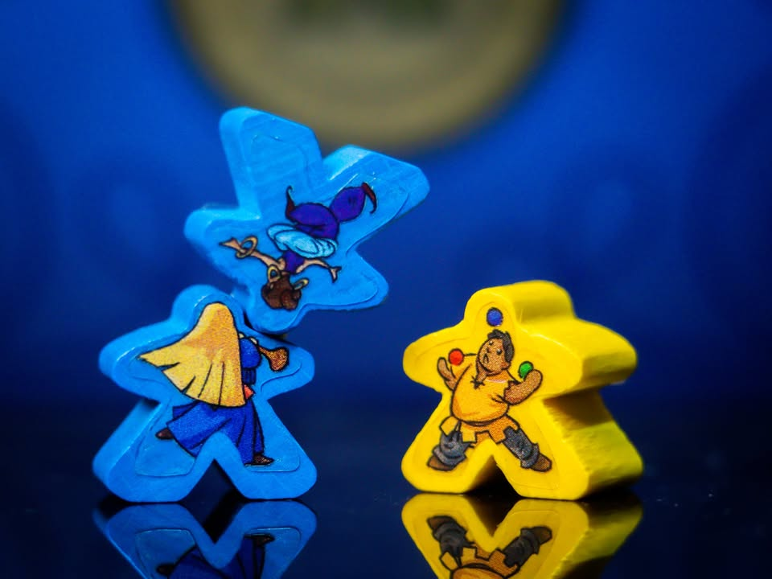
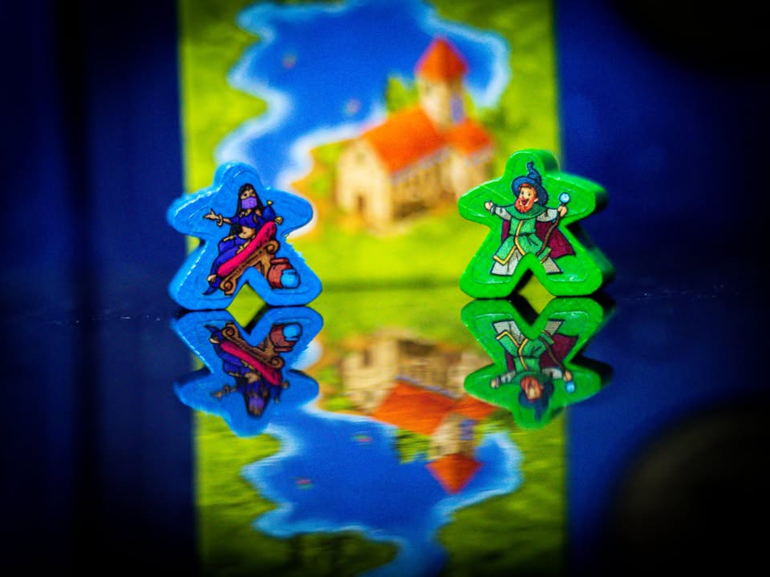
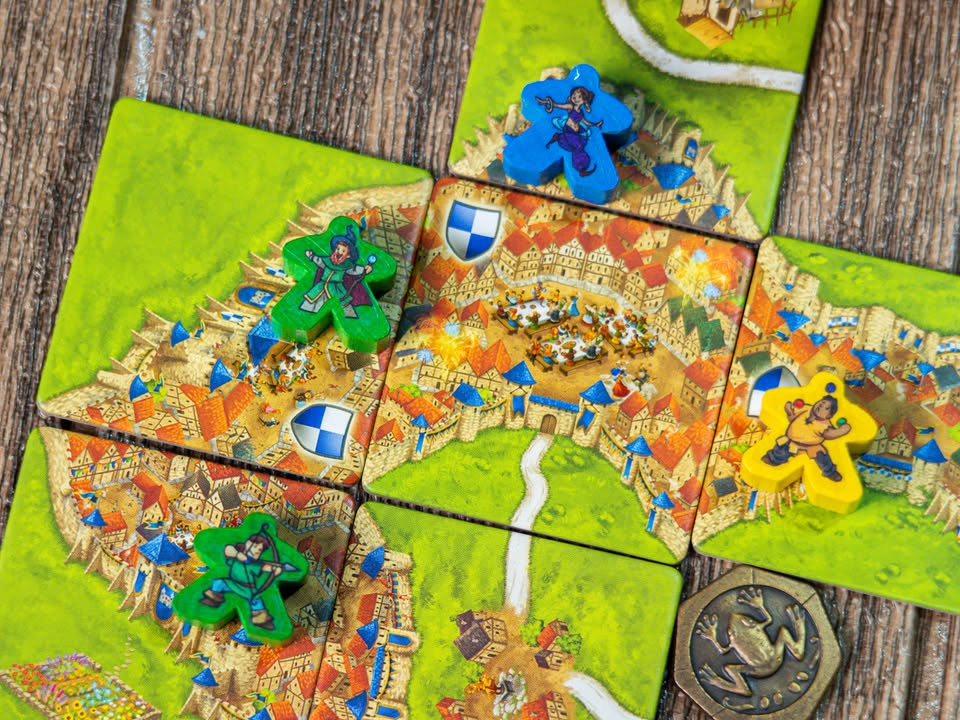
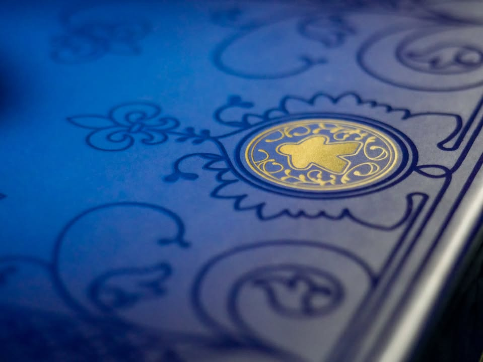

Carcassonne 20th Anniversary (กาการ์ซอน) #bite_size

🔹 ถ้าย้อนไปเมื่อซักสิบห้าปีก่อน เวลามีคนถามว่าเริ่มเล่นบอร์ดเกมซื้ออะไรดี ตัวเลือกยอดนิยมที่จะโดนยกมาบ่อยๆก็คือ Catan, Ticket To Ride และ Carcassonne 

🔹 ผ่านมาตอนนี้เจ้ากาการ์ซอนเนี่ย (เออพึ่งรู้ว่าต้องใช้เสียง กอไก่ ผมเรียกคาคาร์ซอนมาเป็นสิบปีเลย...) ก็ยังถือเป็นเกมต่อไทล์อันดับต้นๆที่ยังแนะนำให้เล่นกันอยู่ในระดับครอบครัว ออกลูกออกหลานมาเยอะมาก ไทล์เสริมมีเป็นร้อยชุด แล้วก็มีภาคแยกจบในตัวอีกหลายสิบ 

🔹 แถมไอ้เกมนี้แหละที่ทำให้คำว่า 'meeple' โด่งดังจนเป็นคำสามัญของวงการเกมกระดาน (แต่ไม่ใช่เกมแรกที่ใช้ meeple นะ)

🔹 ไอเดียเกมเนี่ยคือจะให้เรามาร่วมกันสร้างแผนที่ให้กับเมืองการ์กาซอนผ่านการผลัดกันวางไทล์ที่มีภาพเป็นส่วนของปราสาทกับถนนแล้วก็ท้องทุ่ง เราแค่วางไทล์แล้วก็เอาตัวมีเปิ้ลไปบอกว่านี้คือที่ของฉันนะ! พอเราล้อมกรอบเมืองจนปิดสมบูรณ์, สร้างถนนที่เราอยู่สร้างเสร็จ หรือทุ่งหญ้าผืนใหญ่ที่เรางีบหลับพร้อมปิดโฉนด เราที่เป็นเจ้าของก็จะได้แต้มมา โดยตัว meeple เวลาไปยืนจองตามที่ก็จะมีชื่ออาชีพเป็นของตัวเอง เป็นพระ เป็นอัศวิน เป็นโจร เป็นชาวนา ไรงี้

🔹แต่ช้าก่อน! ถ้าเกมมันง่ายขนาดนั้นมันคงไม่มีคนพูดถึงมายี่สิบปี ความสนุกเนี่ยคือผู้เล่นสามารถมา 'ร่วมเป็นเจ้าของ' ไทล์ที่ยังสร้างไม่เสร็จได้ด้วย แต่ว่าพอไทล์สำเร็จคนที่ได้แต้มก็คือผู้เล่นคนที่วาง meeple ไว้เยอะที่สุด...

🔹 โดยที่การมาจอยร่วมสร้าง (แย่ง) กันเนี่ยมันไม่ได้อยู่ๆทำได้เลย แต่มันต้องให้เราไปจองไทล์ใกล้ๆกันก่อนแล้วค่อยลุ้นจั่วไทล์มาเชื่อมกันอีกทีเท่านั้น โดยแต่ละไทล์ก็จะมีเงื่อนไขในการวางและทำให้สมบูรณ์แตกต่างกันไป

🔹 ไอเดียทางการตัดสินใจอีกอย่างคือการบริหารตัว meeple ที่เรามีอยู่อย่างจำกัด เพราะถ้ายังสร้างไม่เสร็จก็ต้องค้างไว้อย่างนั้นแหละ ทำให้เราต้องเลือกว่าจะรีบทำของเก่าให้เสร็จจะได้มีตัวมาหมุนใช้ต่อ หรือจะต้องรีบไปวางดักทางรอ 'ช่วย' คนอื่นวางไทล์จะได้มาแบ่งแต้มกัน

🔹 ตัวฉบับครบ 20 ปีก็จะมีการปรับอาร์ทใหม่ให้สดใสขึ้น มีไทล์พิเศษมาเพิ่มที่จะช่วยให้เราได้วาง meeple ได้เพิ่มนอกเหนือจากข้อกำหนดปกติ ช่วยให้เกมมีมิติมากขึ้น ไม่ใช่ว่ายึดมุมแบบนี้แล้วเราจะได้แต้มแน่ๆเหมือนแต่ก่อน กับมีตัวเสริมเล็กเป็น meeple เจ้าอาวาสที่ทำงานคล้ายโบสถ์ แต่ให้วางบนแปลงดอกไม้แทน (ส่วนเจ้าอาวาสทำไมไม่ทำแต้มจากโบสถ์เราก็จะพยายามไม่สงสัย...)

----------------------------------
+ กติกาเข้าใจง่าย มีลูกล่อลูกชนในการวาง

+ เกมคลาสสิกสำหรับครอบครัวที่ผ่านการทดสอบของเวลามาแล้วว่าสนุก

= เกมนี้ตัวเสริมเล็กๆเยอะมาก (เป็นร้อยจ้าkk) เล่นยังไงก็ไม่หมด แต่ว่าตัวเสริมมันก็มาพร้อมกติกาที่ซ้อนทับกันไปเรื่อย กับใครมีตัวเสริมเก่าอยู่แล้ว ด้านหน้ามันคนละลายประกบไม่สวย 

= โลกนี้มีคนสองแบบคือคนที่เข้าใจว่าวางชาวนาทำงานยังไงด้วยการพูดครั้งเดียว กับคนที่ผ่านไปสิบปีก็ยังไม่เข้าใจว่าตอนนี้วางชาวนาได้ยัง... จุดนี้ทำให้ภาคแยกเยอะตัวมากเปลี่ยนไปใช้ท่าอื่น

= สัดส่วนดวงอาจจะเยอะไปซักนิดเทียบกับเกมแนวเดียวกันในสมัยนี้

= น่าจะใส่ถุงผ้าสำหรับจั่วไทล์มาให้หน่อยนะ นี้เอาไปขายแยก แต่ลายก็สวยดี 
----------------------------------

🔹 ในแง่ความสวยงาม ด้วยความที่ราคาอยู่ในเรทบอร์ดเกมปกติ เน้นขายกลุ่มครอบครัว ตัวมีเปิ้ลเลยเป็นไม้แปะสติกเกอร์ที่หน้าตาน่ารักมีสีสันดี ลายไม่ซ้ำและมีเกินจำนวน meeple ทำให้เลือกได้ตามใจชอบ แต่ส่วนตัวก็แอบอยากได้มีเปิ้ลอะคริลิคใสๆมากกว่าแฮะ (แต่ไปสำรวจราคาแล้วซื้อครบทุกสีก็จะแพงกว่าค่าเกมไปไกล) แต่ตัวกล่องนี้ design กินขาดมาก สวยจัด กระดาษหนา ตัวไทล์ก็มีการพิมพ์นูนเกือบทุกอันสีสวยงาม

🔸 ถ้าจะมีติดจริงๆน่าจะเป็นที่ผมเองอ่านภาษาไทยไวยกรณ์อังกฤษที่ไรก็ยังไม่ชินซักที อ่านจบแล้วต้องไปหาโหลดภาษาอังกฤษมาอ่านอีกรอบว่าอันที่เพิ่มมาใหม่นี้มันเล่นยังไงนะ...กับส่วนตัวชอบวาเรี้ยนลดดวงอย่างจั่วเปิดในมือสามไทล์แล้วเลือกเล่นเพื่อลดดวงมากกว่า ไม่งั้นลุ้นเหนื่อยเกินจริตไปหน่อย อยากได้ปราสาทแต่จั่วเจอถนนไรงี้ปิดงานไม่ได้ซักที

🔹 กล่องนี้ก็ถือว่าเหมาะสำรับคนที่ยังไม่เคยซื้อกาการ์ซอนมาก่อน อยากลองเริ่มต้นหาเกมเล่นกับครอบครัวดู จะได้รู้ว่าทำไมมันถึงยังเป็นเกมวางไทล์สำหรับครอบครัวเบอร์ต้นๆที่อยู่มาถึงยี่สิบปี

🔹 ส่วนใครมีแล้วแค่กล่องหลักกล่องเดียวก็ซื้อกล่องใหม่แล้วเอาของเก่าไปให้คนอื่นก็ได้ เพราะตัวนี้มันออกแนว 1.1 เพิ่มโน้นนิดนี้หน่อยทำให้เล่นสนุกขึ้น โดยเฉพาะไทล์ effect พิเศษของตัวครบรอบที่ทำให้มีลูกเล่นในการวางตัวเพิ่มได้น่าสนใจกว่าเดิม และที่สำคัญคือกล่องสวยยยยยยยยยยย

--------------------------------
หมวด Bite Size (พอดีคำ) นี้กะว่าจะเขียนอะไรสั้นๆประมาณนี้ล่ะกัน ใหม่บ้าง ซ้ำบ้าง เกมที่ขี้เกียจเขียนบ้าง เขียนๆไว้ก่อนเผื่อมีอารมณ์อาจจะขยายไปลง Thought บ้าง จริงๆอยากเขียนสั้นกว่านี้ แต่ยังอดไม่ได้ที่จะต้องอธิบายอะไรเพิ่มตามนิสัย เดี๋ยวค่อยๆปรับไปล่ะกัน

--------------------------------
📌 disclosure: 
* ลานละเล่น ผู้แปล/นำเข้า/จัดจำหน่าย ส่งสินค้ามาให้ผมรีวิว แต่ข้อเขียนนี้เป็นการแสดงความเห็นของผมที่มีต่อเกมโดยไม่ได้เป็นการรับจ้าง หรือเป็นข้อเขียนเพื่อการโฆษณา

💰 support: สามารถสนับสนุนผมทางอ้อมได้ด้วยการซื้อสินค้า Say Hi Board N Bon มูลค่า 1 บาทพ่วงกับเกมอื่นเมื่อซื้อของกับร้าน Bewitched ( เป็นโครงการสนับสนุน Creator ของทางร้าน เงินไม่เข้าผมโดยตรง แต่จะเป็นข้อมูลที่นำไปสู่การสนับสนุนกลับจากทางร้านในรูปแบบต่างๆ) https://shp.ee/vpzkpn8 
--------------------------------

