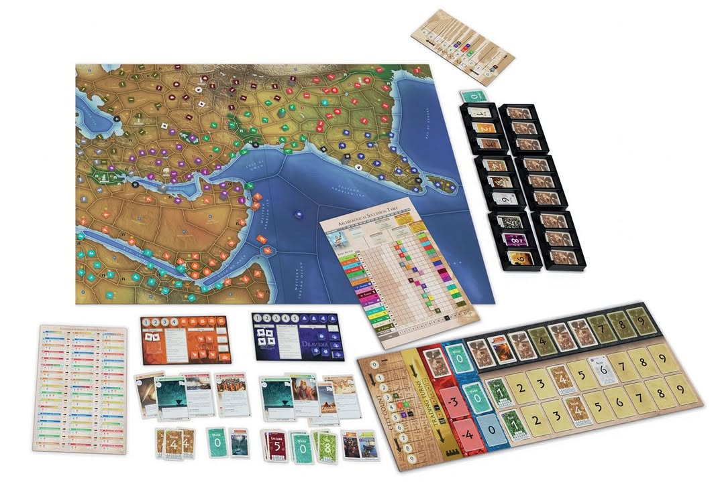
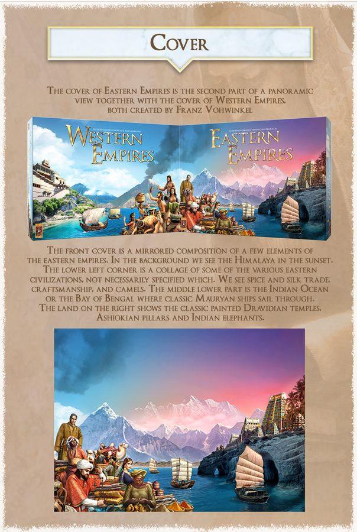

▪️ เกมใหม่ยังไม่มาแต่พรีวิวให้ฟังได้เลยเพราะผมเล่นตัวเดิมมาล่ะ วันนี้อยากแนะนำ KS เกมที่ผมตื่นเต้นเป็นพิเศษ (แต่ไม่แนะนำให้ใครซื้อกันเพราะมันเฉพาะทางหน่อย.... ) นั้นคือ Eastern Empires และมันคือหนึ่งในช่องทางที่คุณจะได้สัมผัสกับหนึ่งใน 'ตำนาน' ของเกมกระดาน

KS Link : https://www.kickstarter.com/projects/999games/eastern-empires

▪️ ถ้าพูดสั้นๆ คนที่รู้จักเกม Trade on the Tigris เกมนี้คือ 'ต้นฉบับ' ที่ใหญ่กว่ามาก การเจรจาเยอะกว่า เทคโนโลยีไม่ใช่การจั่วสุ่มแต่เป็น tech tree ยาวๆ ให้เรามาเลือกกัน

▪️ ถ้าเล่าย้อนไปคนที่เล่นเกมแห่งการลืมวันคืนอย่าง Sid Meier's Civilization บนคอมน่าจะเคยทราบมาว่ามันได้เอาไอเดียเรื่อง tech tree กับธีมพัฒนาชนชาติมาจากเกมชื่อ Civilization ที่เป็นเกมกระดานเมื่อ 40 ปีก่อนโน้น โดยที่นอกนั้นไม่มีอะไรเหมือนกันแล้ว แต่แม่งก็ฟ้องเรื่องชื่อกันฉิบหายตั้งแต่สมัยผมอยู่ประถมล่ะ

▪️ ผ่านไปหลายสิบปีมีแฟนๆเอาตัว Civilization มาทำใหม่ให้ชื่อว่า Mega Civilization เล่นได้ถึง 18 คน โดยที่ต่อมาติดเรื่องลิขสิทธิ์ชื่อ ก็เลยเอามาย่อเหลือครึ่งเดียวขายใหม่ในชื่อ Western Empires เล่นได้ 9 คน และตามด้วย Eastern Empires ตัวนี้ในรูปแบบ KS  โดยที่ถ้าซื้อมาสองอันก็สามารถเอามารวมร่างกันได้ซึ่งจะ epic มากๆ (ส่วน Civilization ต้นฉบับถูกเอามา reprint แบบงงๆ และไม่ได้รับความสนใจมากนัก)

▪️ แกนของเกมคือเราก็เล่นเป็นชาติหนี่งขยับประชากรไปมารวมตัวสร้างเมือง พอได้เมืองก็จะมีการ์ดสินค้าจากนั้นก็เอามาแลกคุยเพื่อจัดชุดการ์ดสินค้าไปแลกการ์ดเทคโนโลยีแล้วก็วนลูป ง่ายๆแค่นั้นเลย

▪️ ยิ่งเมืองเยอะเราจะได้การ์ดสินค้าเยอะมูลค่าก็จะมากกว่า แต่ว่ามันจะจั่วจากคนละกองกันแล้วจัดชุดด้วยกันไม่ได้ (นัยว่าบ้านเมืองเจริญสินค้าก็ยกเกรดตาม ต้องไปคุยกับเพื่อนบ้านที่ตลาดใหญ่ระดับเดียวกัน) 

▪️ แล้วก็ความเหี้ย (เอ๊ยสนุก) คือเวลาแลกสินค้ากันเนี่ยมีกฎว่าสองใบต้องพูดจริง..... หมายความว่าส่วนเกินเนี้ยยัดไส้อะไรก็ได้ เพราะว่าในบรรดาสินค้ามันมีการ์ด event เหี้ยๆเต็มไปหมด แบบบ้านเมืองพัง มีประท้วง พายุเข้าไรงี้ โดนยัดไส้ก็จะเหนื่อยๆหน่อย แต่เราไปคุยแลกเพื่อส่งต่อความเหี้ยได้.....  แต่เอาจริงๆมันเป็นของที่ใครๆก็ต้องโดน เกมนี้เลยออกมาในรูปการบริหารความเสี่ยงมากกว่า ประมาณว่าถ้าแลกแล้วโดนแต่แต้มของมันเยอะพอไปซื้อเทคโนโลยีก็รับๆมาแหละ 

▪️ ส่วนเทคโนโลยีเนี่ยมันเป็นการ์ด Tech Tree (ใช้พื้นที่เยอะมว๊ากกกกกกกกก) ที่มีหลายสายใบสูงๆก็เอาแต้มสายเดิมที่เคยวิจัยมาเป็นส่วนลดได้ ทำให้เราไม่ต้องวิจัยมันทุกอันก็ไปแบ่งๆเอาว่าจะเดินเป็นสายแล้วจะหาอะไรมาแซมทีหลังไหม

▪️ ถ้าว่ากันตามมาตราฐานคนเล่นเกมสมัยนี้เกมจะมีข้อระวังอยู่ที่
- เล่นกัน 8-12 ชั่วโมงขึ้น (อย่าลืมว่านี้มันเกมยุคเก่า แผนที่สี่คนจะสั้นกว่านี้)
- ชนชาติเหมือนกันหมด ไม่มีความสามารถประจำตัว (แต่ tech tree เยอะ)
- บอร์ด fiddly และ bland มาก เราต้องย้าย chit ประชากรเล็กๆโยกไปโยกมา (เกมยุคเก่าอ่ะนะ)
- มันไม่ใช่เกมให้อารมณ์ epic ขมวดปมพร้อมระเบิด ชีวิตก็ค้าขายวิจัยไปเรื่อย 
- chit เฉยๆ (อย่าลืมว่ามันคือผู้สืบทอดเกมดีไซน์เมื่อ 40 ปีก่อนนะ) แต่รูปการ์ดสวยนะ  

▪️ เกมแพงไหม? โคตรแพงจ้า สำหรับ 120 EUR (ส่งฟรี) สำหรับเกมหน้าตาและอุปกรณ์ประมาณนี้ แต่มันเกมบูติกหน่อยๆกับยุคค่าส่งแพงนะ

▪️ ส่วนเรื่องซื้อดีไหม ส่วนตัวผมคิดว่าเกมนี้มัน 'เฉพาะทาง' มาก (มากๆสำหรับผู้เล่นสมัยนี้) คือคุณต้องหาคนชอบเจรจาแลกของที่วางแผนการพัฒนาระยะยาวพร้อมกับยอมรับความสุ่มโหดร้ายหน้างาน แล้วยังต้องมีเวลาเล่นทั้งวัน  แต่ถ้ามีใครถามว่าผมชอบเกมนี้ขนาดไหน มันก็คือเกมกบโปรดที่ผมชอบมากๆเลย คือในแง่ประสบการณ์การเล่นมันสนุกมาก แม้จะอารมณ์กางแค่ปีล่ะครั้งก็เถอะ

ผมเคยเขียนถึงเกม Trade on the Tigris (เล่นแค่ครึ่งชั่วโมงจบ สำหรับคนอยากรู้อยากเห็นบรรยากาศตอนเทรด) ไว้ที่นี้: https://tinyurl.com/3rt9d6ka

ผมเคยเขียนถึงกลไกการแลกของของเกมนี้ไว้ที่ : https://wp.me/p7TSgy-MN

