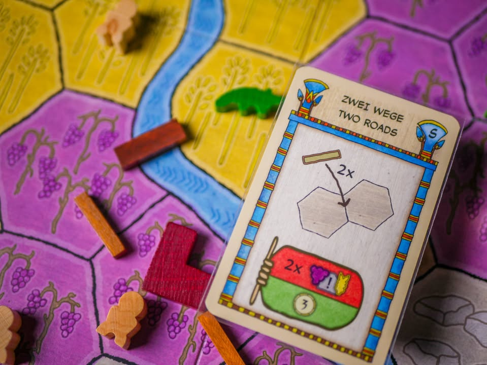
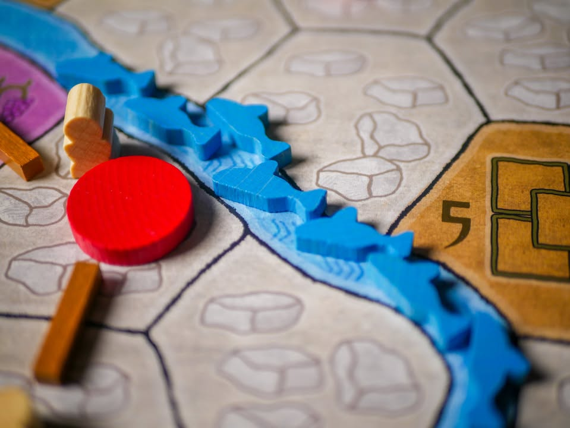

Faiyum #first_impression #bite_size

▪️ เกมยูโรระดับกลางจากนักออกแบบ Friedemann Friese ที่มีผลงานชื่อดังอย่าง Power Grid แต่ครานี้จะมาเล่าในธีมการพัฒนาเมืองบริเวณแม่น้ำไนล์ในสมัยโบราณกัน

▪️ โดยที่ยุคนั้นเนี่ยแม้ทะเลทรายจะกว้างใหญ่แต่บริเวณรอบๆแม่น้ำไนล์นั้นอุดมสมบูรณ์มาก แถมมีจรเข้อาศัยอยู่เต็มไปหมด ระหว่างเกมเราก็จะค่อยๆวิดน้ำออกปรับปรุงพื้นที่เอาคนไปทำงานสร้างตึกสร้างถนนไปตามเรื่อง

▪️ .....โอเคนั้นมันธีมของเกมอ่ะนะ แต่ตอนผมเล่นนี้ไม่ได้รู้สีกอะไรอย่างนั้นซักกะติด

▪️ ระบบของเกมนี้ถ้าพูดให้เห็นภาพง่ายๆก็น่าจะเป็น Century Spice Rode ฉบับมีแผนที่กลาง แต่ของตรงกลางไม่ได้เป็นของใคร เราก็สร้างๆวางๆหาของไปตามการ์ดนั้นเอง โดยตาหนึ่งเราเลือกทำหนี่งในสามอย่างคือ

▪️ เล่นการ์ด
▪️ ซื้อการ์ดจากตลาดมาเข้ามือ
▪️ ดึงการ์ดจากกองทิ้งบางส่วนกลับเข้ามือ

▪️ ซึ่งการเล่นการ์ดในเกมไอเดียจะเป็นการวางคนงานลงไปในพื้นที่สามแบบลงตรงนั้นก็ได้ไอ้ของชิ้นนั้นมา พอที่โล่งเราก็จะมีการสร้างเมืองสร้างถนนอะไรไปตามเรื่อง การ์ดมีทั้งเล่นฟรีกับต้องใช้ทรัพยากรในการสร้าง เราก็จะวนๆไปกับการเก็บทรัพยากรกับเอาของมาสร้างตึกทำแต้มทำเงิน

▪️ ตลาดในเกมนี้เอาแบบ power grid มาเลย คือการ์ดจะมีสองกลุ่มคือของที่ซื้อได้ตอนนี้มีสี่ใบ กับอนาคตอีกสี่ใบ โดยการ์ดจะเรียงลำดับเลขเสมอ เปิดมาใหม่ทีก็เรียงที เราก็จะได้ซื้อแค่สี่ใบเลขน้อย ณ ตอนนั้น

▪️ และอันสุดท้ายที่นับว่าเป็นทวิสในเชิงออกแบบที่สร้างสรรค์สุดของเกมคือปกติเกมจำพวกนี้เวลารวบกองคืนมันจะเอาทั้ง discard pile มาเข้ามือใช่มะ? แต่เกมนี้บอกเอาคืนมาได้แค่สามใบที่เล่นล่าสุดเท่านั้น อยากได้เพิ่มกว่านี้ก็ได้แต่ต้องจ่ายเงินเพิ่ม

▪️ แปลว่ายิ่งเราเล่นๆไปเนี่ย engine ที่เราเตรียมมามันจะค่อยๆหายไปอย่างช้าๆ แล้วเราก็จะไม่ต้องมาลีลา optimized  ใช้ให้คุ้มจัดๆก่อนเก็บเข้ามือแบบใน Century ด้วย ในแง่นี้ผมของข้างชอบนะ

▪️ จุดที่น่าสนใจคือการ์ดมันมีหลายท่าดี ตึกก็มีหลายแบบสร้างเอาของได้หลายเงื่อนไข ก็จะมีความงึมงำอยากได้โน้นอยากได้นี้ประมาณหนึ่ง อยากจะวางตรงนี้แต่โดนเพื่อนตัดหน้า แต่ด้วยความที่มันมีที่ให้ทำหลายอย่างเราก็หลบไปทำอย่างอื่นแทน แต่ในทางกลับกันเกมนี้ก็เป็นเกมเน้นหน้างานไม่ใช่เกมที่คิดสายคิดท่ามาจากบ้าน

▪️ ถ้าถามว่าผมชอบเกมนี้ไหม ก็คงพูดได้ว่ามันอยู่ในเกมประเภท 'กบไม่เล่น' ด้วยเหตุผลหลายๆอย่าง  ที่ถ้าให้พูดรวมๆน่าจะเป็น 'ความยึกยักแบบเดินหน้าสองก้าวถอยหลังหนี่งก้าววนลูปไปทั้งเกม' ซึ่งเป็นอารมณ์แบบเดียวกับใน Century ที่ผมไม่คลิกเท่าไร  แต่ทั้งนี้มันก็เป็นสไตล์ที่มีคนสนุกกับการวน engine การ์ดแบบนี้เยอะอยู่นะ (Century มันเลยดังไง) 

▪️ ตัวเกมตอนแรกครั้งแรกนี้จะ opaque (ทึบแสง) หน่อยๆคือ ไม่รู้จะทำอะไรดี ไม่มีแผนการอะไรทั้งนั้น ได้แค่เล่นการ์ดเก็บทรัพยากรที่มีในมือสองสามใบแล้วก็ซื้อการ์ดใหม่งงๆเข้ามือไปเรื่อยๆจนเริ่มเห็นจังหวะเดินเกมกับรวมคอมโบได้เราก็จะเริ่มวนๆทำท่านั้นไปซักพักล่ะ แต่ข้อดีของเกมคือทุกครั้งที่มีการเก็บการ์ดเข้ามือมันจะ discard การ์ดในตลาดไปจำนวนหนึ่ง ทำให้เกมมันไหลไปเรื่อยๆ ไม่ใช่นิ่งๆ

▪️ กับอารมณ์มันแบบ เล่นกับกลุ่มหนักหน่อยมันก็เบาไปนิด(ลีลาเยอะอีก) เล่นกับกลุ่มเบาก็ขี้เกียจอธิบายการ์ด (ไอคอนคลุมเคลืออิหยั่งว่ะเยอะอยู่ เล่นไปเปิดไปเกินครึ่ง) กติกาอ่านง่วงมาก (ทั้งๆที่แกนเกมแค่สี่หน้า เรียบเรียงงงๆอีก)  แถมข้อยกเว้นตรงนี้ตรงนี้จำยากเพราะไม่ได้บอกไว้ในกระดาน (เฮลโหล player aid งั้นๆมาก) พ่วงไม่ชอบอาร์ทอีก (อันนี้รสนิยมส่วนตัว แต่ถ้ามันเป็นเกมออกเมื่อสิบปีก่อนจะยกโทษให้ รูปยังนึกไม่ออกเลยถ่ายยังไงดี)

▪️ ส่วนตัวเวลาพูดถึงเกมที่มีบรรยากาศแบบนี้ผมอยากกาง Concordia มากกว่าแฮะ (ซึ่งผมก็ไม่ได้ชอบมากมาย) แต่ถ้าเป็นคนที่ชอบ engine วนๆแบบใน Century (หรือชอบในสไตล์นักออกแบบ) แล้วอยากขยับขยายไปเกมซับซ้อนขึ้นอีกนิดเกมนี้ก็เหมาะเลย

--------------------------------
หมวด Bite Size (พอดีคำ) นี้กะว่าจะเขียนอะไรสั้นๆประมาณนี้ล่ะกัน ใหม่บ้าง ซ้ำบ้าง เกมที่ขี้เกียจเขียนบ้าง เขียนๆไว้ก่อนเผื่อมีอารมณ์อาจจะขยายไปลง Thought บ้าง จริงๆอยากเขียนสั้นกว่านี้ แต่ยังอดไม่ได้ที่จะต้องอธิบายอะไรเพิ่มตามนิสัย เดี๋ยวค่อยๆปรับไปล่ะกัน
--------------------------------
📌 disclosure: 
* ลานละเล่น ส่งมาให้ยืมเล่น

💰 support: สามารถสนับสนุนผมทางอ้อมได้ด้วยการซื้อสินค้า Say Hi Board N Bon มูลค่า 1 บาทพ่วงกับเกมอื่นเมื่อซื้อของกับร้าน Bewitched ( เป็นโครงการสนับสนุน Creator ของทางร้าน เงินไม่เข้าผมโดยตรง แต่จะเป็นข้อมูลที่นำไปสู่การสนับสนุนกลับจากทางร้านในรูปแบบต่างๆ) https://shp.ee/vpzkpn8 
--------------------------------

